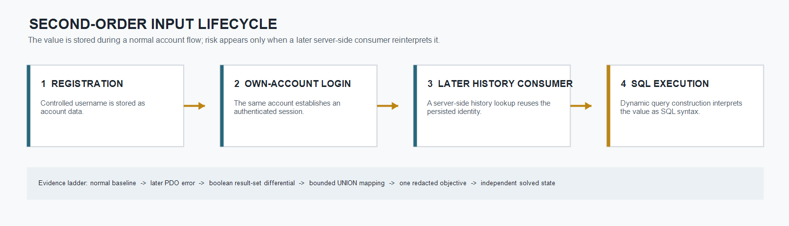
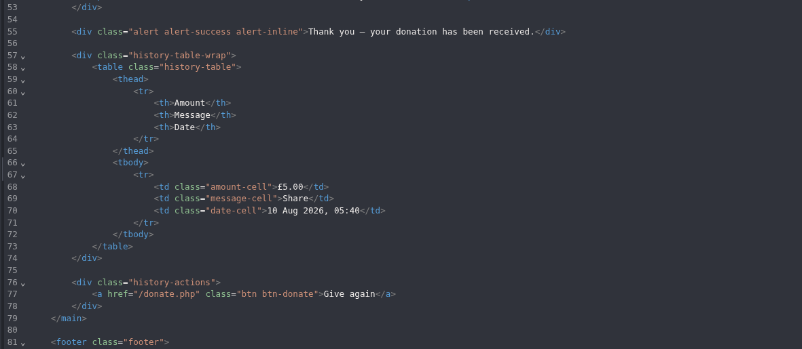
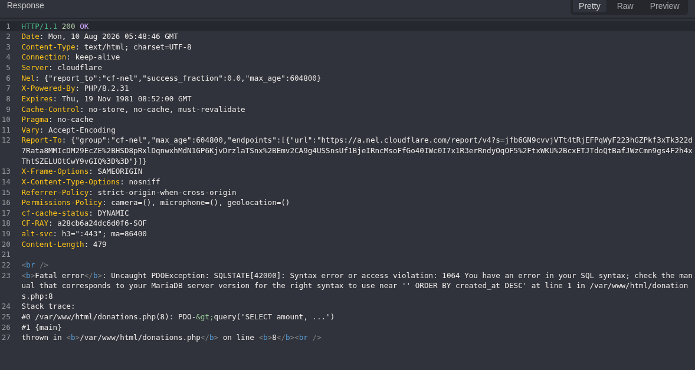
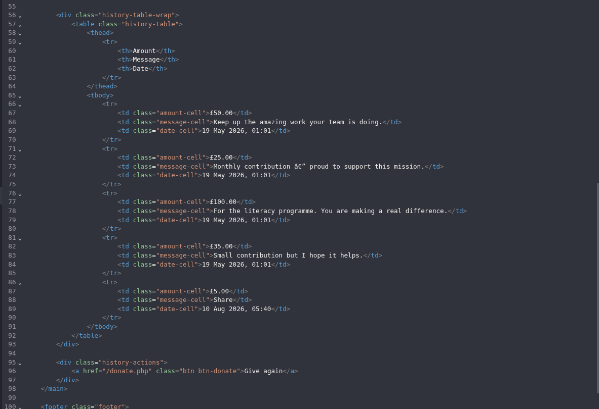
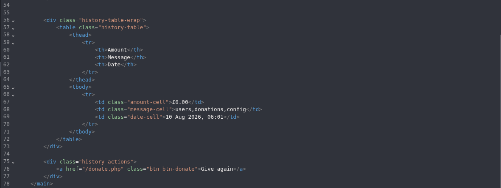
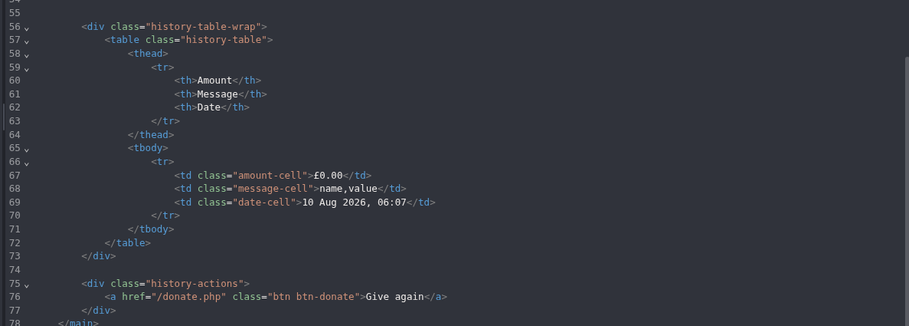
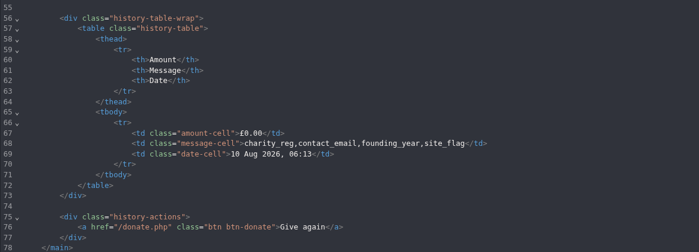
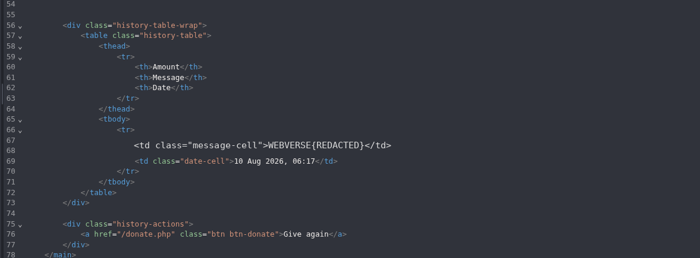

> **Publication note:** This article documents a fresh reproduction in an authorized WebVerse educational lab. Current-instance hostnames, credentials, session values, test-account identifiers, and the literal objective are excluded. The public objective representation is `WEBVERSE{REDACTED}`. The bounded SQL controls and metadata-projection payloads below were verified in this reproduction; the final secret-bearing selector remains private.

## Executive Summary

Bothered exposed a second-order SQL injection in an authenticated donation-history workflow. A user-controlled username was accepted during normal registration and remained usable for the same account's login. The risk appeared only later, when the server-side history consumer reused that persisted identity in SQL query construction.

A normal self-owned account established the expected registration, login, and history behavior. A separate self-owned stored-input control then produced a PDO/MariaDB syntax error only when the later history page was requested. A syntactically valid boolean control expanded the result set beyond that account's own donation history, including a known row created under a different controlled account. The investigation then used the existing three-field history view for a bounded UNION projection: table names, the relevant column layout, key names, and one redacted objective value only.

The current-instance objective was submitted immediately after the targeted read. WebVerse independently reported **Challenge Solved** and **Flag accepted**. No write, delete, password extraction, filesystem access, or unrelated data collection was tested.

> **CONFIRMED FINDING**
>
> A persisted username becomes executable SQL only when a later authenticated donation-history consumer reuses it in dynamic query construction. The demonstrated impact is cross-record visibility, bounded metadata disclosure, one targeted configuration-value read, and an independently accepted lab objective.

## 1. Report Profile

| Field | Verified value |
| --- | --- |
| Platform | WebVerse |
| Lab | Bothered |
| Difficulty | Easy |
| Status | Solved / Verified |
| Stored source | Registration username |
| Later consumer | Authenticated donation-history workflow |
| Observed stack | PHP 8.2.31, PDO, MariaDB |
| Primary weakness | [CWE-89](/cwes/cwe-89/) - SQL Injection |
| Supporting weakness | [CWE-209](/cwes/cwe-209/) - verbose PDO/MariaDB error disclosure |
| Evidence | Fresh-instance Caido evidence with Chromium solved-state confirmation |

## 2. Scope and Evidence Boundary

- Every test used a fresh, self-created account; no foreign credentials or historical sessions were reused.
- Each stored control used a separate account, keeping the observed effect attributable to one controlled input.
- One benign donation was created under the baseline account to establish the normal populated history contract and a known cross-account marker.
- P-01 through P-05 are exact bounded values used in this authorized lab. Dynamic host, session, credential, and flag values are not published.
- The evidence establishes a SELECT-oriented data effect only. It does not establish database write capability, filesystem reads, command execution, password extraction, or access outside the authorized lab.

## 3. Evidence-Led Chronological Reproduction

Each SQL control below was stored as the raw `username` of a separate self-owned account, then reused unchanged during that account's normal login. The decisive SQL interpretation occurred only when the authenticated `GET /donations.php` consumer later reused the persisted identity. The request, stored payload, expected result, screenshot, and narrow conclusion are therefore kept together for every phase.

### 3.1 Stored-Input Lifecycle and Consumer Model



**Figure 0 - Stored-input lifecycle.** This explanatory diagram connects registration, persistence, normal authentication, and the later SQL consumer. It is not a modified evidence artifact and contains no payload or instance-specific value.

Harmless HTML canaries in the observed public `display_name` and donation-message contexts were HTML-encoded. Those tested browser-side contexts did not establish stored XSS. The confirmed issue is server-side: the persisted username reaches a later history query and is interpreted as SQL syntax.

> **SECOND-ORDER BOUNDARY**
>
> Registration stores the controlled value and login authenticates the same account. Neither action is presented as SQL execution. The later history request contains no new injected query or body parameter; it activates the distinct vulnerable consumer.

### 3.2 Normal Account and Donation-History Baseline

A normal self-owned account established the expected lifecycle before SQL-specific input. One benign `5.00` **Share** donation created a known controlled row for the later cross-account differential.

**R-01 - Baseline registration.**

```http
POST /register.php HTTP/1.1
Host: <LAB_HOST>
Content-Type: application/x-www-form-urlencoded

display_name=<CONTROLLED_NAME>&email=<UNIQUE_LAB_EMAIL>&username=<CONTROLLED_USERNAME>&password=<REDACTED>&password_confirm=<REDACTED>
```

**Expected semantic result:** HTTP 302 with `Location: /login.php?welcome=1`. This proves only the normal write-path contract.

**R-02 - Baseline login.**

```http
POST /login.php HTTP/1.1
Host: <LAB_HOST>
Content-Type: application/x-www-form-urlencoded

username=<SAME_CONTROLLED_USERNAME>&password=<REDACTED>
```

**Expected semantic result:** HTTP 302 with `Location: /index.php`. This establishes authentication, not SQL execution.

**R-03 - Authenticated history consumer.**

```http
GET /donations.php HTTP/1.1
Host: <LAB_HOST>
Cookie: PHPSESSID=<SESSION_COOKIE>
```

**Expected semantic result:** HTTP 200 with the normal account's populated history and the legitimate three-field projection: **Amount**, **Message**, and **Date**.



**Figure 1 - Normal baseline.** The response establishes the legitimate projection and the known controlled donation row used as the semantic marker in P-02.

### 3.3 P-01 - Stored Input Reaches the Later SQL Sink

A separate account stored the exact encoded username control below, completed login normally, and then requested the same R-03 history consumer. After form decoding, the final character following `--` is a significant literal ASCII space.

```text
username=mmp%27+OR+%271%27%3D%271%27+--+
```

**Expected semantic result:** the later `GET /donations.php` returns `SQLSTATE[42000]` with a MariaDB syntax failure near the query's `ORDER BY created_at DESC` suffix.



**Figure 2 - Later SQL sink.** The response ties the earlier persisted value to a later SQL parser failure. P-01 proves source-to-sink continuity and parser involvement; an error alone is not reliable extraction proof.

### 3.4 P-02 - Boolean Result-Set Differential

A fresh account stored a syntactically valid boolean control. In form transport, `#` is encoded as `%23`.

```text
mmp' OR '1'='1' #
```

**Expected semantic result:** the new account's later history expands beyond its own records and includes the known `5.00` **Share** donation created under the separate baseline account.



**Figure 3 - Boolean validation.** The known cross-account marker proves valid SQL expression control and cross-record visibility in the demonstrated SELECT context. This is semantic result-set evidence, not a status-code, body-length, or timing inference.

### 3.5 P-03 - Current-Schema Table Mapping

The normal view had already established a three-field result shape, so the bounded UNION used compatible numeric, text, and date/time expressions without a broad column-count sweep. Text readback remained confined to the existing **Message** field.

```text
mmp' UNION SELECT 0,GROUP_CONCAT(table_name),NOW()
FROM information_schema.tables
WHERE table_schema=database() #
```

**Expected semantic result:** the Message field returns only the current-schema table names `users,donations,config`.



**Figure 4 - Table mapping.** The projection establishes the available table names; no table contents are read at this stage.

### 3.6 P-04 - Bounded `config` Column Mapping

The next payload constrained `information_schema` metadata to the already identified `config` table.

```text
mmp' UNION SELECT 0,GROUP_CONCAT(column_name),NOW()
FROM information_schema.columns
WHERE table_schema=database() AND table_name='config' #
```

**Expected semantic result:** the Message field returns `name,value`.



**Figure 5 - Column mapping.** The result establishes the bounded key/value layout required for an objective-oriented lookup.

### 3.7 P-05 - Objective-Key Mapping

Only `config` key names were read, deliberately avoiding their values.

```text
mmp' UNION SELECT 0,GROUP_CONCAT(name),NOW() FROM config #
```

**Expected semantic result:** the Message field returns `charity_reg,contact_email,founding_year,site_flag` and identifies the objective-oriented key before any secret-bearing value is read.



**Figure 6 - Key mapping.** The response establishes `site_flag` as the bounded target. No other configuration value is exposed by this step.

### 3.8 P-06 - Targeted Objective Read

The verified three-column projection was constrained to the confirmed `config` source and the already identified `site_flag` key. The exact selector and literal current-instance value remain private; no reusable secret-bearing query is published.

**Expected semantic result:** one value appears in the existing Message field and matches the WebVerse objective format. Its public representation is `WEBVERSE{REDACTED}`.



**Figure 7 - Targeted objective read.** The preceding projection ladder establishes alignment and bounded source selection. This response records the single redacted value; no additional schema enumeration or value reads followed.

### 3.9 Authoritative Solved State and Atomic Stop

The current-instance objective was submitted immediately after P-06. WebVerse reported **Challenge Solved** and **Flag accepted**, providing an authoritative outcome oracle independent from the application's history response.


**Figure 8 - Authoritative confirmation.** WebVerse independently accepted the reproduced Bothered objective.

> **STOP BOUNDARY**
>
> Testing stopped after the single approved value was read and accepted. No curl, shell, destructive SQL, bulk extraction, write or delete action, password extraction, filesystem access, persistence, command execution, or unrelated data collection was performed or added retrospectively.

## 4. Root Cause and CWE Mapping

The root cause is [CWE-89](https://cwe.mitre.org/data/definitions/89.html): externally influenced data changes SQL structure instead of remaining bound data. Here, the relevant failure occurs in the later read path, not necessarily where the username is first stored.

The verbose PDO/MariaDB error is a separately demonstrated [CWE-209](/cwes/cwe-209/) condition. It exposed SQLSTATE details, the database engine, a filesystem path, source line, and a query suffix. It is a supporting weakness, not a substitute for the confirmed SQL injection root cause. Likewise, accepting a username at registration does not prove that the registration INSERT was parameterized; the verified issue is unsafe construction of the later history query.

## 5. Impact

Within the authorized lab, the demonstrated impact progressed from SQL parser disclosure to cross-record donation visibility, schema metadata disclosure, targeted configuration metadata disclosure, and one targeted configuration-value read.

The reproduction intentionally did **not** test writes, deletes, filesystem reads, operating-system command execution, password extraction, persistence, or access beyond the current lab instance. Those capabilities must not be inferred from the confirmed evidence.

## 6. Remediation

1. **Parameterize every later query.** Persisted user-controlled values remain untrusted whenever they enter a new SQL context.
2. **Bind history to an immutable server-derived user ID.** Do not construct authorization or history selection from a mutable username.
3. **Suppress user-facing database errors.** Log exceptions internally and return a generic error response without SQLSTATE values, engine details, filesystem paths, source lines, or query fragments.
4. **Apply database least privilege.** The donation-history role should not be able to read secret-bearing configuration values.
5. **Regression-test the lifecycle.** Store a quote/comment-bearing test value, log in normally, and exercise every later consumer. The consumer must return only that account's authorized records and never expose a database exception.

## Conclusion

Bothered demonstrates why persisted input must be treated as untrusted at every later interpreter boundary. The evidence establishes a complete second-order SQL injection chain: normal account lifecycle, later SQL parser error, valid boolean result-set differential, compatible UNION projection, minimal metadata mapping, one targeted objective read, and an independently accepted submission.

The public result is recorded as `WEBVERSE{REDACTED}`. Testing stopped at the confirmed, read-only objective.
