> **Publication note:** This article documents a fresh reproduction in an authorised WebVerse educational lab. The live hostname, reusable session material, and literal objective are excluded. Public evidence uses `<LAB_HOST>`, `<LAB_ORIGIN>`, and `WEBVERSE{REDACTED}`. The solved-state interface retains the account's earlier solve date and is not presented as the timestamp of this reproduction.

## Executive Summary

Flap Copy was reproduced through metadata-first reconnaissance rather than broad discovery. The current landing page explicitly referenced a PWA manifest. The application's canonical Apple App Site Association (AASA) file then exposed Universal Links patterns. Correlating the two public artefacts validated a shared route namespace and elevated one unadvertised candidate — `/staff-only/dispatch*` — above ordinary public routes.

One bounded request to the bare-prefix route `/staff-only/dispatch` returned a staff-dispatch page, internal environment/build metadata, and the current redacted objective. The evidence supports public application metadata disclosing an operationally relevant internal route. It does **not** establish authentication bypass, privilege escalation, administrative access, or real-user data exposure.

> **CONFIRMED FINDING**
>
> An externally accessible AASA file contained a staff-only route pattern and an explicit internal-use annotation. One evidence-supported GET request confirmed that the exact route was live in the observed browser session and returned internal handoff information.

## 1. Report Profile

| Field | Verified value |
| --- | --- |
| Platform | WebVerse |
| Lab | Flap Copy |
| Difficulty | Medium |
| Reproduction date | 13 August 2026 |
| Evidence | Caido request/response evidence and Chromium full-body views |
| Primary weakness | [CWE-538](/cwes/cwe-538/) — Insertion of Sensitive Information into Externally-Accessible File or Directory |
| Final evidence route | `GET /staff-only/dispatch` |
| Authentication boundary | Existing browser session preserved; no anonymous/authenticated differential performed |
| Independent curl verification | Not performed |
| Platform state | Previously solved; UI retains 7 August 2026 |

### Verified Attack Chain

```text
Fresh challenge landing page
  > HTML links /manifest.webmanifest
Public PWA manifest
  > /today, /upcoming, /console/quick-actions
Public AASA file
  > matching public route families
  > /staff-only/dispatch* marked internal and "do not advertise"
Cross-artifact consistency control
  > shared route semantics justify one bounded candidate
GET /staff-only/dispatch
  > internal handoff content + build/environment metadata
  > WEBVERSE{REDACTED}
Stop
```

## 2. Scope, Authorisation, and Evidence Boundary

This manuscript covers a previously solved, authorised WebVerse educational challenge reproduced against a fresh challenge instance. Only the known static chain was re-run. No wordlist fuzzing, suffix guessing, authentication manipulation, scanner, destructive action, or post-objective target request was introduced.

- Current-instance requests and responses are the runtime authority.
- The existing browser cookie was preserved; no claim of anonymous access or authentication bypass is made.
- No terminal or independent curl reproduction was performed.
- AASA disclosure identifies a candidate; it is not proof that the candidate is live.
- HTTP 200 alone is not the security oracle; the decisive proof is the response semantics.
- The historical solved-state UI is separate from the fresh target evidence.

## 3. Evidence-Led Chronological Reproduction

### 3.1 Fresh-instance baseline and application-provided discovery

The normal landing request bound the evidence to the active instance and established the next recon step from application-owned HTML. No route was guessed.

```http
GET / HTTP/1.1
Host: <LAB_HOST>
```

**Expected semantic result:** a normal landing response containing a concrete application metadata reference.

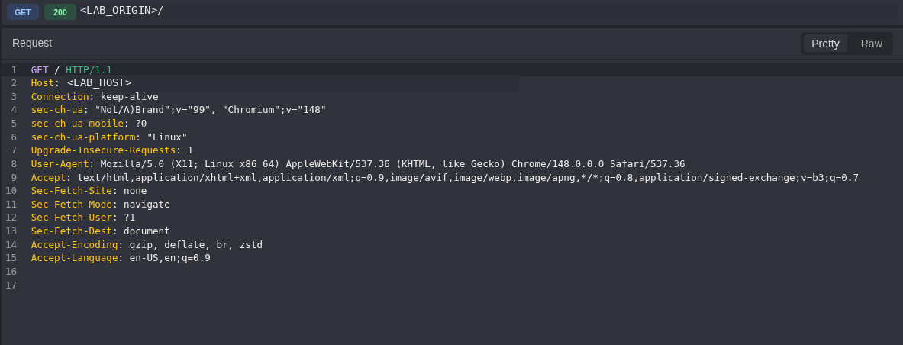

**Figure 1 — Fresh-instance baseline.** Caido records the public `GET /` request while the live origin is replaced with a stable publication placeholder.

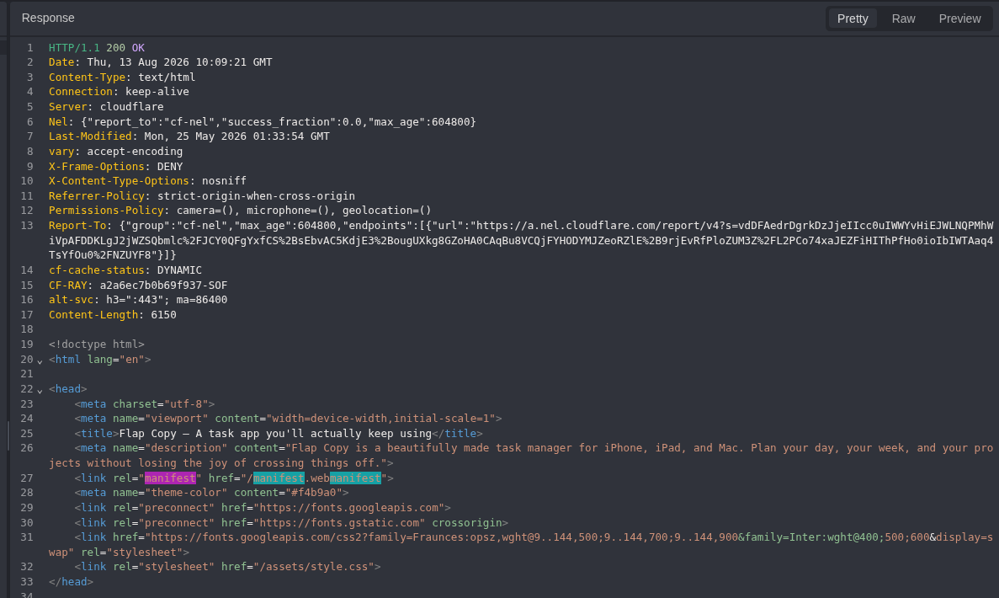

**Figure 2 — Application-provided manifest discovery.** The landing HTML explicitly declares `/manifest.webmanifest`, proving that the next path came from the application rather than enumeration.

### 3.2 PWA manifest route mapping

Following the HTML-declared manifest path exposed the application's shortcut routes. These are navigation metadata, not vulnerabilities by themselves; their purpose here is to establish route families for later correlation.

```http
GET /manifest.webmanifest HTTP/1.1
Host: <LAB_HOST>
```

**Expected semantic result:** parseable PWA metadata with application-owned shortcut URLs.

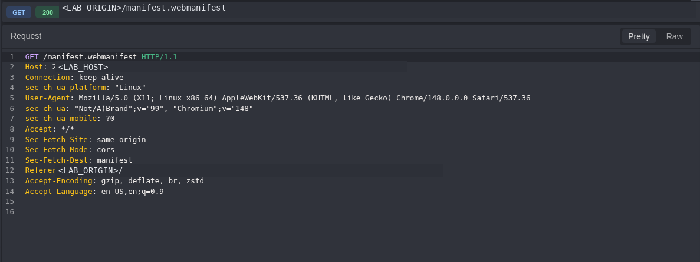

**Figure 3 — Manifest request.** Caido preserves the exact request for `/manifest.webmanifest`; the origin and referrer are publication-sanitised.

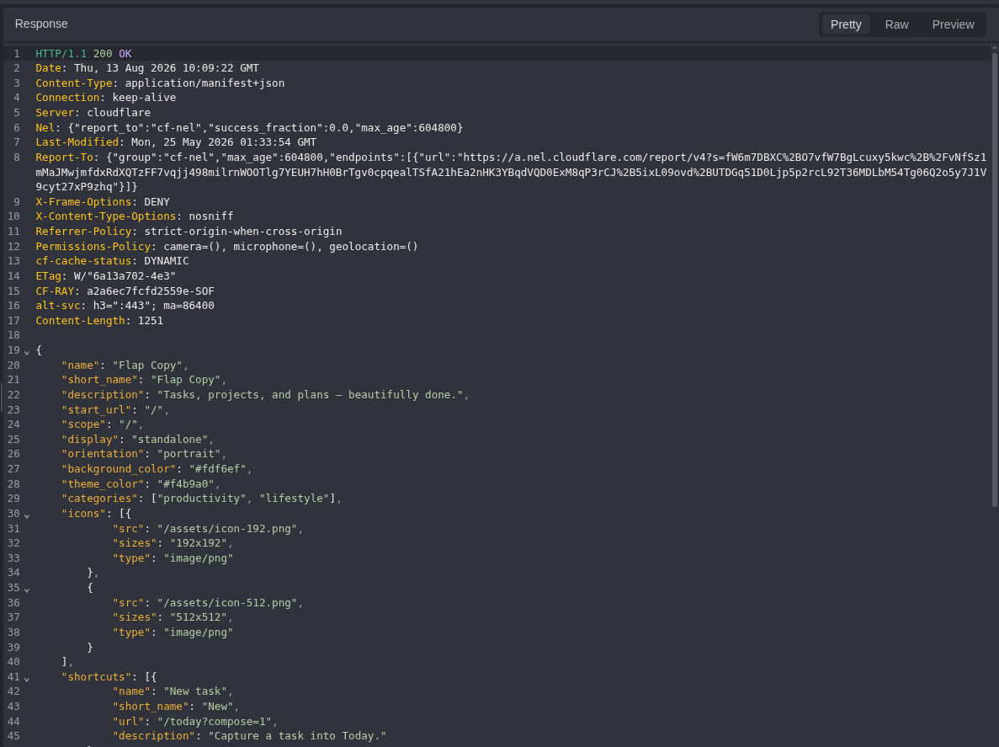

**Figure 4 — Manifest provenance.** The server returns `application/manifest+json`, binding the shortcut data to the current runtime response.

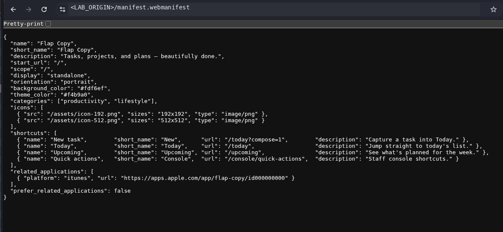

**Figure 5 — PWA route set.** The complete manifest view exposes `/today?compose=1`, `/today`, `/upcoming`, and `/console/quick-actions`.

### 3.3 AASA route-pattern mapping

The canonical Universal Links artefact was then retrieved from its well-known path. AASA files are externally retrievable association metadata; the issue is not their existence, but the sensitive internal routing detail placed inside this one.

```http
GET /.well-known/apple-app-site-association HTTP/1.1
Host: <LAB_HOST>
```

**Expected semantic result:** parseable Universal Links metadata whose path patterns can be compared with the PWA manifest.

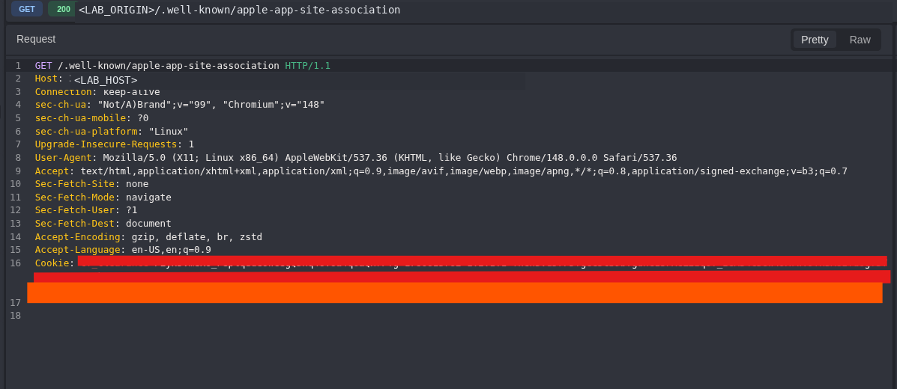

**Figure 6 — AASA request.** Caido records the canonical well-known request. The live origin and multi-line reusable cookie are redacted without hiding the requested path.

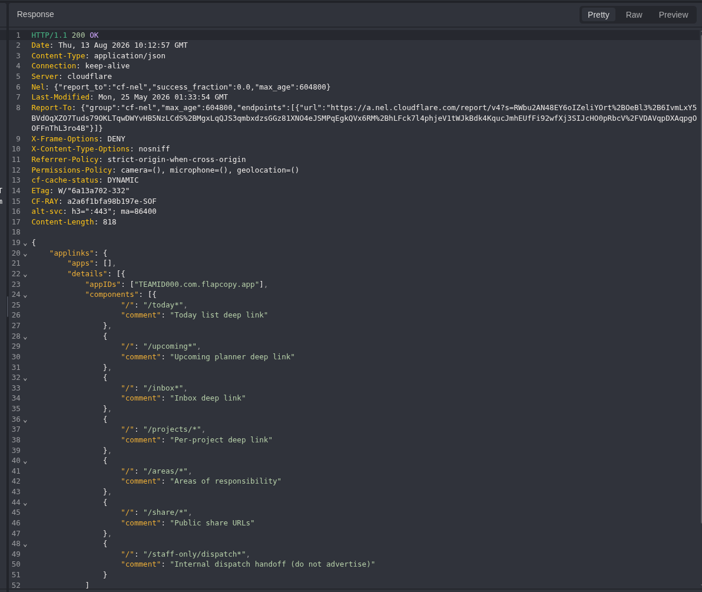

**Figure 7 — Sensitive route metadata.** The AASA response lists `/staff-only/dispatch*` and labels it `Internal dispatch handoff (do not advertise)` alongside ordinary Universal Links patterns.

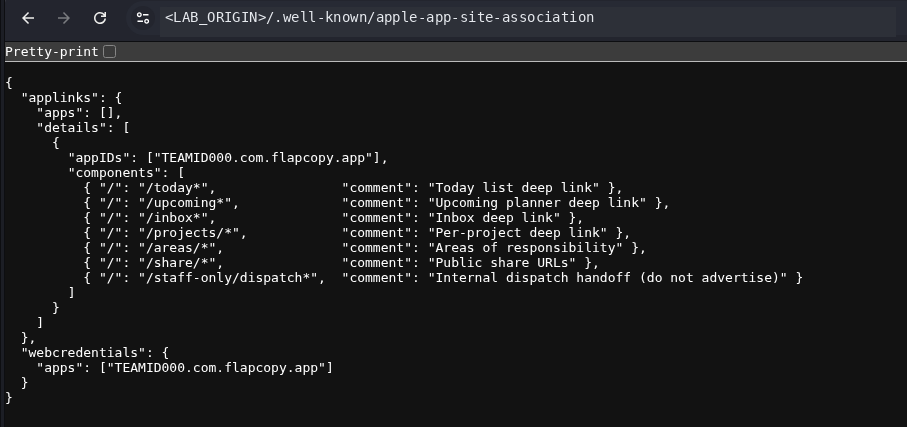

**Figure 8 — Full AASA context.** The complete body preserves the relationship between public route families, the staff-only candidate, and the operational annotation.

### 3.4 Cross-artifact consistency control

Before touching the candidate, the two captured route sets were compared offline. The shared `/today` ↔ `/today*` and `/upcoming` ↔ `/upcoming*` families demonstrate consistent route semantics. This does not prove that `/staff-only/dispatch*` is live; it only makes the candidate evidence-supported rather than guessed.

| Source | Observed route semantics |
| --- | --- |
| Landing page | Links the manifest but does not advertise `/staff-only/dispatch` |
| PWA manifest | `/today?compose=1`, `/today`, `/upcoming`, `/console/quick-actions` |
| AASA | `/today*`, `/upcoming*`, `/inbox*`, `/projects/*`, `/areas/*`, `/share/*`, `/staff-only/dispatch*` |
| Correlation anchors | `/today` ↔ `/today*`; `/upcoming` ↔ `/upcoming*` |
| Highest-signal candidate | `/staff-only/dispatch*` — AASA-only and explicitly marked internal |

> **CORRELATION CONTROL**
>
> The AASA entry remained an inference until one runtime request produced a meaningful staff-dispatch response. No suffixes or adjacent internal-looking paths were tested.

### 3.5 Bounded route verification and semantic oracle

The wildcard pattern was reduced to its bare prefix and requested once in Caido Replay. No parameter, identity, role, or cookie value was changed.

```http
GET /staff-only/dispatch HTTP/1.1
Host: <LAB_HOST>
```

**Expected semantic result:** a live internal route must return meaningful staff-handoff content; a status code alone is insufficient.

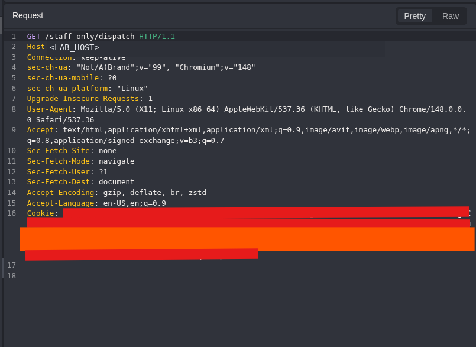

**Figure 9 — Bounded route request.** Caido sends the single evidence-supported request. The live host and multi-line reusable cookie are redacted; the path and remaining request contract stay visible.

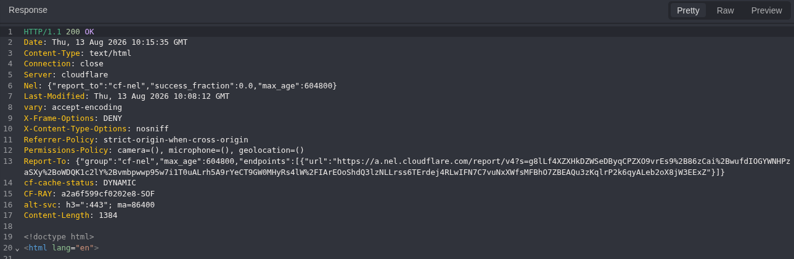

**Figure 10 — Live route response.** The candidate resolves to an HTML document in the observed session. This response provenance is necessary but is not the decisive finding by itself.

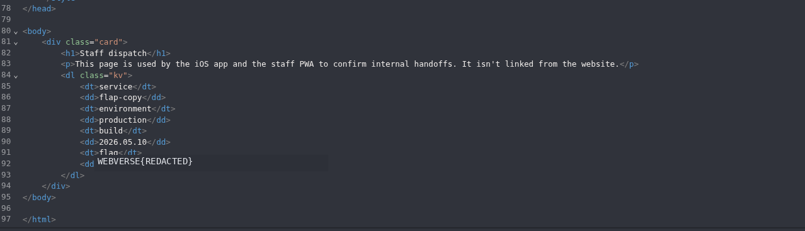

**Figure 11 — Semantic proof.** The body identifies an iOS/staff-PWA handoff, shows `environment: production` and build metadata, and contains `WEBVERSE{REDACTED}`. This is the decisive evidence that the publicly disclosed route had operational value in the lab.

### 3.6 Platform state and stop boundary

The challenge UI was inspected separately after the target evidence was complete. It confirms account-level completion but retains the earlier solve date, so it is not used as a timestamp oracle for this reproduction.

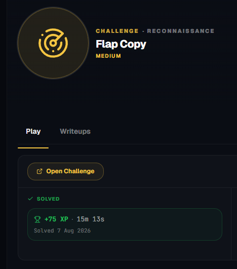

**Figure 12 — Historical solved state.** WebVerse marks Flap Copy as solved and retains 7 August 2026. The fresh objective itself was recovered in Figure 11.

> **STOP BOUNDARY**
>
> No additional challenge-target action was introduced after the objective-bearing response. The platform-state check is recorded separately from target interaction.

## 4. Controls and False-Positive Boundaries

| Control or boundary | Why it matters |
| --- | --- |
| Application-provided discovery | The landing source supplied `/manifest.webmanifest`; no wordlist or guessed manifest path was used. |
| Cross-artifact anchors | Known `/today` and `/upcoming` families align across the manifest and AASA. |
| AASA pattern ≠ live route | The staff entry remained a candidate until a runtime request returned meaningful content. |
| HTTP 200 ≠ finding | The conclusion depends on the staff-dispatch semantics and redacted objective. |
| Wildcard ≠ brute-force licence | Only the exact bare prefix was requested; no suffix guessing occurred. |
| Hidden ≠ authentication bypass | Authentication state, identity, role, and cookie presence were not varied. |
| Solved UI ≠ fresh timestamp | The interface preserves the account's earlier solve date. |

## 5. Root Cause and Classification

The root cause is insertion of sensitive routing information into an externally accessible association file. The AASA file must be retrievable for Universal Links, yet this instance advertises `/staff-only/dispatch*` and labels it as an internal handoff that should not be advertised. This maps directly to [CWE-538](/cwes/cwe-538/), a Base-level CWE that MITRE permits for vulnerability mapping.

The route response establishes the operational relevance of the metadata disclosure in the observed browser session. Because the reproduction preserved an existing cookie and did not perform an authentication differential, it does not support an access-control or authentication-bypass classification.

## 6. Impact

In this lab, public mobile/PWA metadata materially reduced the search space for internal functionality. A reader could identify a staff-only route that was absent from normal navigation, then reach internal handoff, environment, and build information with one bounded request.

The transferable risk is reconnaissance amplification: public association and application metadata can expose internal route names, operational semantics, or hidden application surfaces. The impact becomes security-relevant when the disclosed route returns information or functionality that should not be available in the requesting context. No broader user-data, privilege, or state-changing impact is claimed here.

## 7. Remediation

- Review AASA, PWA manifests, Android App Links metadata, and similar public routing artefacts before deployment.
- Remove `/staff-only/dispatch*` and its operational comment from public association metadata unless the route is genuinely required for a public deep-link flow.
- If the route must remain addressable, enforce the intended server-side authentication and authorization independently of route secrecy.
- Do not place environment, build, diagnostic, secret, or challenge-equivalent data in an internal handoff page merely because it is unlinked.
- Add deployment checks that flag newly introduced `internal`, `staff`, `admin`, `debug`, `dispatch`, or operational route patterns in externally accessible metadata.

## 8. Validation Guidance

1. Fetch the deployed PWA and AASA metadata and confirm that internal-only route patterns and operational comments are absent unless intentionally required.
2. Verify that legitimate public deep links such as `/today` and `/upcoming` still resolve after metadata cleanup.
3. Request the former internal route from the intended low-privilege context and confirm that sensitive handoff content is no longer returned.
4. If the route remains required, validate its intended authentication and authorization boundary with explicit identity/role controls rather than relying on obscurity.
5. Repeat cross-artifact route correlation to ensure no alternate public metadata artefact reintroduces the same disclosure.

## 9. Conclusion

Flap Copy demonstrates why mobile and PWA integration files belong in a disciplined web reconnaissance workflow. The landing page disclosed the manifest; the manifest and AASA established complementary route semantics; their correlation isolated one high-signal internal candidate; and a single bare-prefix request produced the decisive staff-dispatch response.

The evidence supports a narrow, defensible conclusion: externally accessible application metadata exposed a non-advertised internal route that returned internal information in the observed session. It intentionally stops short of claiming untested authentication or privilege impact.
