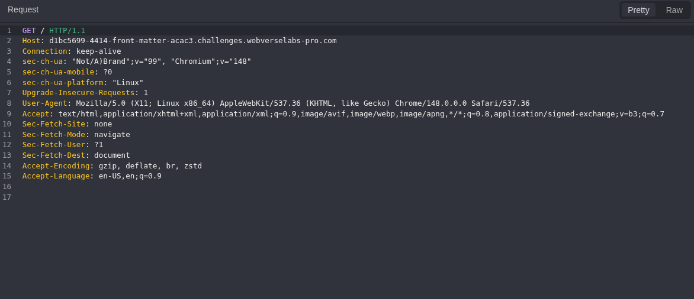
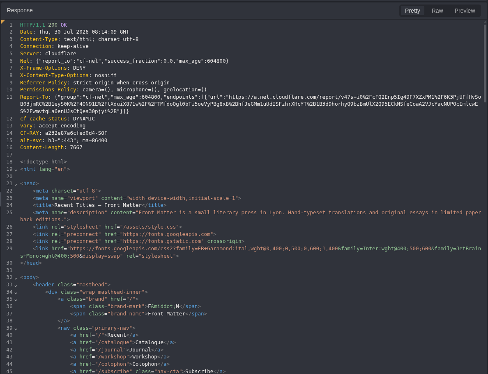
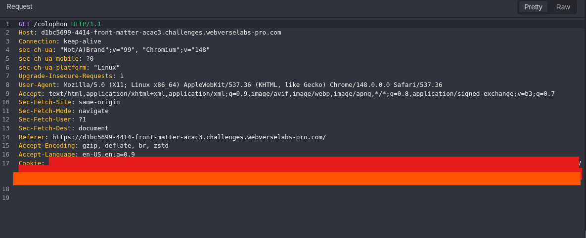
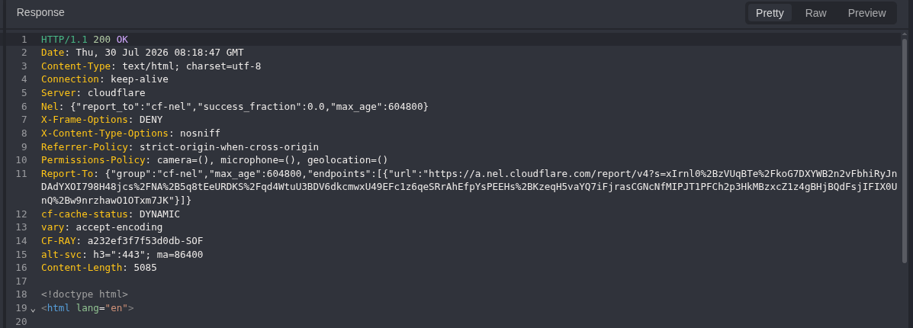
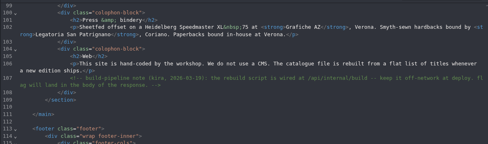
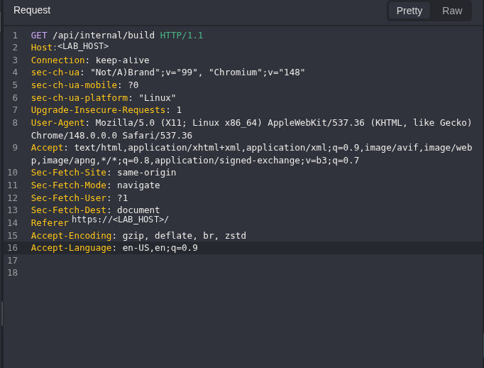
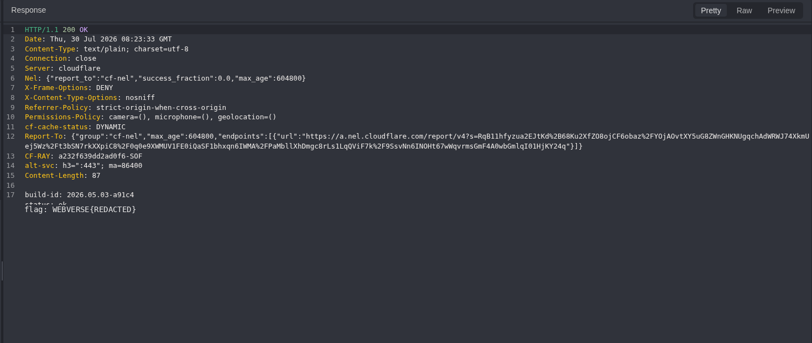
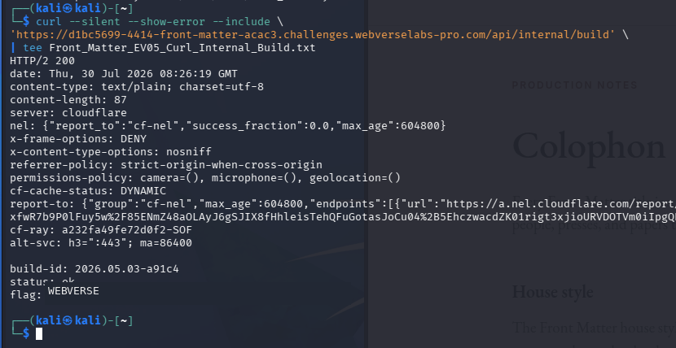
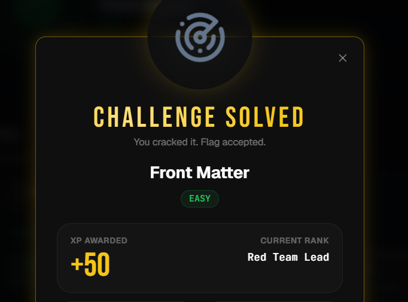

> **Publication note:** This article documents an authorized educational lab reproduction. The current-instance flag is redacted everywhere so that only the `WEBVERSE` prefix remains visible. The complete flag and raw private evidence are excluded from the public manuscript and image bundle.

## Executive Summary

The **Front Matter** challenge was solved through a narrowly scoped reconnaissance process that followed the application's own public navigation. The storefront linked to a Colophon page whose production HTML contained a build-pipeline comment. That comment disclosed the internal route `/api/internal/build`, stated that the endpoint should remain off-network, and identified the response body as the location of the challenge flag.

A controlled Caido Replay request removed session credentials and requested the disclosed route directly. The server returned HTTP `200` with `text/plain` content containing a build identifier, a status value of `ok`, and the current-instance WebVerse flag. An independent `curl` request reproduced the same result without cookies or authorization, and WebVerse subsequently accepted the flag and marked the challenge as solved.

> **Confirmed finding:** The vulnerability was not the HTML comment alone. The complete issue was the combination of a production comment that disclosed an internal route and an access-control/deployment-boundary failure that left the internal endpoint publicly reachable by an anonymous client.

## 1. Report Profile

| Field | Value |
| --- | --- |
| Platform | WebVerse |
| Lab | Front Matter |
| Category | Reconnaissance |
| Difficulty | Easy |
| Status | Solved |
| Date | 30 July 2026 |
| Target | `https://d1bc5699-4414-front-matter-acac3.challenges.webverselabs-pro.com/` |
| Primary issue | Exposed internal endpoint |
| Secondary issue | Sensitive information in production HTML comments |

### Verified Attack Chain

```text
GET /
  -> public storefront exposes /colophon
GET /colophon
  -> production HTML comment discloses /api/internal/build
GET /api/internal/build
  -> anonymous HTTP 200
  -> build metadata and current-instance flag
curl verification
  -> matching response reproduced in a second client
WebVerse submission
  -> CHALLENGE SOLVED
```

## 2. Vulnerability Classification

| Attribute | Verified value |
| --- | --- |
| Primary class | Unauthorized sensitive-data exposure from an internal endpoint |
| Secondary class | Sensitive route disclosure in production HTML comments |
| Affected endpoint | `/api/internal/build` |
| HTTP method | `GET` |
| Input / parameter | None |
| Authentication | No application session or credential required |
| Response type | `text/plain; charset=utf-8` |
| Security effect | Build metadata and the challenge secret disclosed to an anonymous external client |

### Best-Fit Standards Mapping

| Reference | Evidence-based relevance |
| --- | --- |
| `CWE-201` | Primary runtime weakness: the response sent build metadata and the challenge secret to an anonymous actor outside the intended trust boundary. |
| `CWE-615` | Discovery enabler: a production source-code comment disclosed the internal route, its operational purpose, and the intended off-network boundary. |
| `CWE-862` | Supporting access-control weakness: the external request was not rejected even though the route was described as off-network. Backend authorization design was not inspected. |
| `OWASP A01:2025` | Primary OWASP category: an intended non-public resource was accessible to an anonymous external client. |
| `OWASP A02:2025` | Contributing category: an internal route and deployment note remained exposed in the production application. |

> **Classification limit:** Runtime evidence proves anonymous external read access and sensitive disclosure. It does not prove the server framework, backend authorization design, internal network topology, or whether `GET` initiated build activity or another server-side state change.

## 3. Preconditions and Test Boundaries

- No user account or privileged role was required.
- No non-`GET` request or explicit mutation payload was sent; every test used `GET`.
- The evidence does not establish whether `GET` only returned metadata or also initiated server-side build activity or another state change.
- No crawler, directory brute-force, method fuzzing, or unrelated route enumeration was used.
- All dynamic values, responses, and the flag were collected from the fresh current instance.
- The reproduction stopped immediately after the authoritative flag and solved-state were confirmed.

### Evidence Basis

The final conclusion is grounded in three independent evidence layers: Caido HTTP History for the legitimate application flow, Caido Replay for anonymous endpoint validation, and `curl` for a portable raw response. The platform solved-state provides a final external confirmation that the disclosed flag was valid for the current instance.

## 4. Normal Baseline

The investigation began with the public storefront rather than with a route copied directly from historical solution material. This established the active hostname, the normal request contract, and the application-visible path to the Colophon page.

```http
GET / HTTP/1.1
Host: d1bc5699-4414-front-matter-acac3.challenges.webverselabs-pro.com
Accept: text/html,application/xhtml+xml,application/xml;q=0.9,*/*;q=0.8
```



*Figure 1 — Current-instance storefront request. Caido records a normal `GET` request to the root path on the fresh Front Matter host.*

The request belongs to the fresh instance and contains no exploit mutation. It is therefore a valid baseline for the subsequent source-inspection chain.

## 5. Storefront Response and Route Discovery

The storefront returned HTTP `200` and identified itself as Front Matter. Its same-origin navigation included a direct link to `/colophon`, establishing that the next request followed the intended public application flow rather than blind enumeration.

```html
HTTP/1.1 200 OK
Content-Type: text/html; charset=utf-8

<title>Recent Titles - Front Matter</title>
...
<a href="/colophon">Colophon</a>
```



*Figure 2 — Storefront HTML response. The response confirms the Front Matter application and exposes `/colophon` through public navigation.*

No relevant HTML comment or flag was identified in the root response during inspection. The Colophon route was prioritized because the challenge briefing emphasized production notes, markup, and content left by the producer.

## 6. Discovery Through the Colophon Source

The Colophon page was opened through the storefront link and captured in Caido. The request retained normal browser navigation semantics and was bound to the same current-instance host.



*Figure 3 — Colophon navigation request. The request shows a same-origin `GET /colophon` from the current Front Matter storefront. The browser cookie is redacted because it is not needed for the public-page claim.*

The response returned a normal HTML document titled `Colophon - Front Matter` and presented production notes about typography, paper, binding, and the catalogue build process.



*Figure 4 — Colophon response headers and document identity. Caido shows HTTP `200`, an HTML content type, and the Colophon page title on the active instance.*

## 7. Critical Source Disclosure

Inspection of the raw HTML revealed a production build-pipeline comment embedded directly in the page source. The rendered page did not display this note, but any unauthenticated client could retrieve it through View Source, an intercepting proxy, or a standard HTTP client.



*Figure 5 — Build-pipeline comment in production HTML. The source comment discloses the internal build route, the intended off-network boundary, and the response body as the flag oracle.*

```html
<!-- build-pipeline note (kira, 2026-03-19):
the rebuild script is wired at /api/internal/build
-- keep it off-network at deploy.
flag will land in the body of the response. -->
```

### Why This Observation Was Decisive

| Disclosed fact | Security meaning |
| --- | --- |
| `/api/internal/build` | Exact route to validate; no further route discovery was necessary. |
| `rebuild script` | The route was associated with an internal build or catalogue pipeline. |
| `keep it off-network` | The intended deployment boundary was explicitly stated and could be tested. |
| `flag ... in the body` | The response body was defined as the authoritative objective oracle. |

At this point, continuing with broad reconnaissance would have reduced evidence quality and added noise. The correct next action was one bounded `GET` request to the exact disclosed endpoint.

> **Methodology transfer:** Treat source comments as discovery signals, not final findings. Convert the signal into one precise hypothesis, remove session material before anonymous-access testing, avoid inferring server-side effects from the HTTP method alone, and close the chain with a second client plus the platform oracle.

## 8. Controlled Validation in Caido Replay

The captured Colophon request was sent to Replay and only the path was changed to `/api/internal/build`. The `Cookie` header was removed, and no `Authorization` header, API token, query parameter, or request body was supplied. This provided an anonymous-access control rather than a payload-based differential, which was not applicable to this vulnerability class.

```http
GET /api/internal/build HTTP/1.1
Host: d1bc5699-4414-front-matter-acac3.challenges.webverselabs-pro.com
Accept: */*

# No Cookie
# No Authorization
# No request body
```



*Figure 6 — Anonymous Replay request to the disclosed endpoint. The decisive request targets `/api/internal/build` without `Cookie` or `Authorization` headers.*

The server returned a successful response to the anonymous request. The plain-text body contained a build identifier, a status value of `ok`, and a flag value.



*Figure 7 — Internal build endpoint response. Caido shows HTTP `200`, `text/plain`, the build ID, status `ok`, and a redacted WebVerse flag; only the `WEBVERSE` prefix remains visible.*

## 9. Independent curl Verification

A second client independently requested the same endpoint without session material. This ruled out a Caido display artifact and produced a portable matching response during the same session. The public manuscript retains only the `WEBVERSE` prefix.

```bash
curl --silent --show-error --include \
  'https://d1bc5699-4414-front-matter-acac3.challenges.webverselabs-pro.com/api/internal/build' \
  | tee Front_Matter_EV05_Curl_Internal_Build.txt
```

```text
HTTP/2 200
content-type: text/plain; charset=utf-8
content-length: 87

build-id: 2026.05.03-a91c4
status: ok
flag: WEBVERSE
```



*Figure 8 — Raw curl reproduction. The terminal independently reproduces the HTTP `200` response. The public screenshot retains only the `WEBVERSE` prefix.*

> **Protocol note:** Caido Replay displayed the transaction as HTTP/1.1, while `curl` negotiated HTTP/2. This is not a conflicting result: both clients reached the same endpoint and received the same status, content type, build metadata, and flag. For publication, the complete flag is withheld and only `WEBVERSE` remains visible.

## 10. Final Platform Oracle

The full flag recovered from the raw response was submitted to WebVerse. The platform accepted it and marked Front Matter as solved, providing an external confirmation that the disclosed value belonged to the current active instance.



*Figure 9 — WebVerse challenge solved state. The platform confirms “Challenge Solved” and “Flag accepted” for Front Matter.*

```text
CURRENT-INSTANCE FLAG
WEBVERSE
```

### Tool-Specific Evidence Interpretation

| Tool | What it proved |
| --- | --- |
| Caido History | The legitimate storefront-to-Colophon application flow and the exact production HTML disclosure. |
| Caido Replay | The internal endpoint remained reachable after session credentials were removed. |
| `curl` | A second client reproduced the matching response during the same session and confirmed the current-instance flag; the public manuscript retains only the `WEBVERSE` prefix. |
| WebVerse UI | The recovered flag was accepted and the challenge was marked solved. |

## 11. Root Cause

The confirmed issue resulted from three connected failures rather than from a single isolated mistake.

### Production Comment Disclosure

A development note containing an internal route, its operational purpose, its intended deployment boundary, and the location of a sensitive result remained embedded in public production HTML. HTML comments are hidden from normal rendering, not from clients.

### Deployment Boundary Failure

The comment explicitly stated that the build route should be kept off-network. Runtime evidence demonstrated the opposite: an external anonymous client received HTTP `200` from the route.

### Sensitive Data in an Unauthenticated Response

The endpoint returned a build identifier, operational status, and the challenge secret to an anonymous external client without an application session, credential, or observable access-control challenge. Even if the route had not been disclosed in the HTML, publicly routing an internal build endpoint with sensitive output would remain a security defect.

## 12. False-Positive Controls

| Potential false conclusion | Control applied |
| --- | --- |
| A route in a comment proves exposure | The route was requested and returned HTTP `200`; the comment alone was not treated as final proof. |
| HTTP `200` proves sensitive disclosure | The response body was inspected and shown to contain build metadata and the challenge secret. |
| A browser session enabled access | `Cookie` and `Authorization` headers were absent from the Replay request, and `curl` reproduced the result anonymously. |
| The result was a proxy or UI artifact | A second client returned the same status, content type, body semantics, and full flag. |
| The flag was stale or from another instance | It was obtained from the active hostname and accepted by WebVerse during the same session. |

## 13. Impact

Within the lab, the issue resulted in complete compromise of the challenge objective: any unauthenticated user who inspected the relevant source could retrieve the flag directly from the internal endpoint.

In an equivalent production environment, the impact would depend on the actual data and capabilities exposed by the internal endpoint. Plausible consequences could include disclosure of build identifiers, deployment metadata, environment details, operational status, tokens, or other secrets. The evidence in this lab does not establish those additional data types; they are production-risk examples rather than claims about this target.

> **Severity note:** No CVSS score is assigned because this educational instance does not provide the asset value, trust boundaries, confidentiality requirements, or production business context required for a defensible score.

## 14. Remediation

| Priority | Control | Required action |
| --- | --- | --- |
| `P0` | Remove sensitive response data | Never return flags, tokens, credentials, environment secrets, or deployment secrets from diagnostic or build endpoints. |
| `P0` | Remove public routing | Exclude the internal build handler from the production application or restrict it at the reverse proxy and network layers. |
| `P1` | Enforce authentication and authorization | If operational access is required, apply strong identity checks and explicit role-based authorization in addition to network controls. |
| `P1` | Strip development comments | Remove HTML comments, TODO notes, internal routes, debug instructions, and operational annotations during the production build. |
| `P1` | Add deployment security tests | Fail CI/CD when public builds contain sensitive values, unintended internal route references, debug endpoints, sensitive or unintended source maps, or unauthenticated administrative functions. |
| `P2` | Apply least exposure | Publish only routes and metadata required by end users; keep operational functions in separate, monitored management planes. |

### Recommended Validation After Fix

1. Confirm that the production Colophon HTML no longer contains internal build notes or route names.
2. Verify that external requests to `/api/internal/build` receive `404` or an equivalent non-routable result.
3. From an authorized management context, confirm that any retained build endpoint requires authentication and explicit authorization.
4. Search the complete production artifact for secrets, unintended internal endpoints, TODO comments, debug routes, and sensitive or unintended source maps before deployment.

## 15. Minimal Reproduction

> **Authorization requirement:** Perform these steps only against the deliberately vulnerable WebVerse lab instance or another system for which explicit authorization exists.

1. Request the public storefront and identify the legitimate `/colophon` link.
2. Request `/colophon` and inspect the raw HTML rather than only the rendered page.
3. Locate the build-pipeline comment that discloses `/api/internal/build` and the response-body oracle.
4. Send one anonymous `GET` request to `/api/internal/build` without `Cookie` or `Authorization` headers.
5. Verify the HTTP `200` plain-text response and record the build identifier, status, and flag.
6. Reproduce the request with `curl` and submit the current-instance flag to WebVerse.

```bash
curl --silent --show-error --include \
  'https://d1bc5699-4414-front-matter-acac3.challenges.webverselabs-pro.com/api/internal/build'
```

## 16. Final Proof

| Field | Verified result |
| --- | --- |
| Endpoint | `/api/internal/build` |
| Method | `GET` |
| Authentication | None |
| Status | HTTP `200` |
| Content-Type | `text/plain; charset=utf-8` |
| Build ID | `2026.05.03-a91c4` |
| Build status | `ok` |
| Flag | `WEBVERSE` |
| Platform result | Challenge Solved - Flag accepted |

## 17. Conclusion

Front Matter demonstrates why source inspection remains a high-value reconnaissance technique. The decisive step was not broad automation but disciplined prioritization: follow the challenge briefing, inspect the most relevant public page, convert the disclosed route into a precise hypothesis, and validate it with the smallest possible request.

The final evidence chain is complete and independently reproducible. A production HTML comment disclosed an internal build route and stated that it should remain off-network. The route was nevertheless accessible to an anonymous external client and returned sensitive build data together with the current-instance flag. Caido established the application flow and anonymous access, `curl` reproduced the matching raw response during the same session, and WebVerse accepted the recovered flag.

```text
FINAL VERDICT
CONFIRMED - A production HTML comment disclosed an internal route that was externally reachable by an anonymous client and returned sensitive build information together with the challenge secret.
```

### Evidence Artifacts

| Artifact | Purpose |
| --- | --- |
| Caido storefront request/response | Current-host baseline and public `/colophon` route. |
| Caido Colophon request/response | Production HTML comment and exact internal route disclosure. |
| Caido Replay request/response | Anonymous access to `/api/internal/build` and sensitive response. |
| `Front_Matter_EV05_Curl_Internal_Build.txt` | Private raw HTTP response confirming the current-instance flag; only `WEBVERSE` is shown publicly. |
| `Front_Matter.png` | WebVerse solved-state confirmation. |
