> **Publication note:** This article documents an authorized educational lab reproduction. The current-instance flag is redacted everywhere as `WEBVERSE{REDACTED}`. Session cookies, clearance values, and raw secret-bearing evidence are excluded from the public manuscript and image bundle.

## Executive Summary

The WebVerse **Lobby Board** challenge exposed a public Next.js build manifest that mapped application routes to client-side chunks. The visible interface did not advertise an administrative area, yet the manifest disclosed a hidden `/_admin` route and its dedicated JavaScript chunk. The parent route itself returned an application-level `404`, but the disclosed chunk enumerated four administrative child routes and identified `/_admin/board` with `guard: null`.

A controlled request to `/_admin/board` was then sent without `Cookie` or `Authorization` headers. The server returned HTTP `200` and rendered the genuine submissions board, including moderation queue statistics, build and runtime metadata, and the current-instance lab flag. Chromium and an independent `curl` request reproduced the result.

> **Confirmed finding:** An anonymous request to `GET /_admin/board` receives the real administrative submissions board. The root cause is missing server-side authentication. Public route and guard metadata are discovery enablers; unauthorized information exposure is the confirmed consequence.

## Finding Snapshot

| Field | Value |
|---|---|
| Vulnerability | Missing authentication on a privileged administrative route |
| Affected endpoint | `GET /_admin/board` |
| Authentication state | Anonymous; `Cookie` and `Authorization` headers absent |
| Primary proof | Caido Replay request/response differential |
| Independent proof | Chromium rendering and `curl` reproduction |
| Primary classification | CWE-306 — Missing Authentication for Critical Function |
| Secondary consequence | CWE-200 — Exposure of Sensitive Information to an Unauthorized Actor |
| OWASP category | A01:2021 — Broken Access Control |
| Result | Solved / verified; flag redacted as `WEBVERSE{REDACTED}` |

## 1. Scope and Prerequisites

Testing was limited to the active WebVerse Lobby Board challenge instance. The environment was deliberately vulnerable and authorized for educational testing. All runtime claims in this write-up were recollected from the current instance; historical notes were used only to guide the expected route grammar and evidence plan.

### Scope Boundaries

- Read-only testing against the active WebVerse challenge host
- No production organization, third-party user, or real bug-bounty asset was tested
- Testing stopped after the intended challenge objective was confirmed
- Session-guarded sibling routes were not accessed and are not claimed to be vulnerable

### Prerequisites

- An active, authorized WebVerse Lobby Board instance
- Chromium configured through Caido for request capture and Replay validation
- A terminal with `curl` for independent HTTP reproduction
- A fresh evidence set from the current instance; expired hostnames and previous flags must not be reused
- A public-safe redaction workflow for flags, cookies, tokens, and raw evidence files

## 2. Application and Request-Flow Baseline

Lobby Board presented a public directory of one-click starter templates. The visible interface appeared to expose ordinary routes such as templates, integrations, blog, documentation, login, signup, submit, and collections. Its HTML nevertheless loaded the standard Next.js build-manifest asset.

```text
Public landing page
  -> /_next/static/chunks/_buildManifest.js
  -> hidden /_admin route
  -> /_next/static/chunks/pages/_admin/admin-chunk.js
  -> /_admin/board with guard: null
  -> anonymous GET /_admin/board
  -> administrative submissions board and WEBVERSE{REDACTED}
```

The decisive security question was not whether a route name appeared in a public asset. It was whether the server enforced authentication when the privileged route was requested directly.

## 3. Landing-Page Baseline

A normal navigation to the root path was captured in Caido before any route mutation. This baseline established the current host, HTTP method, root path, and normal HTML response contract.

```http
GET / HTTP/1.1
Host: 69f81455-4414-lobby-board-94e2a.challenges.webverselabs-pro.com
```

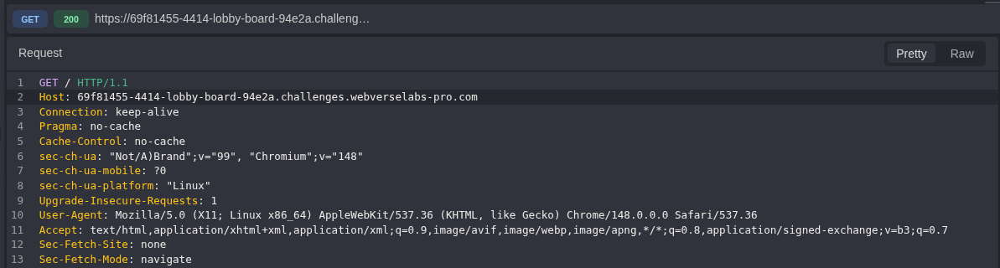

*Figure 1 — Caido baseline request confirming the active Lobby Board host and the initial `GET /` request.*

The server returned HTTP `200` with `text/html` content, identified the application as Lobby Board, and disclosed Express through the `X-Powered-By` header. The end of the HTML document loaded `main.js` and `_buildManifest.js`.

```html
<script src="/_next/static/chunks/main.js" defer></script>
<script src="/_next/static/chunks/_buildManifest.js" defer></script>
```

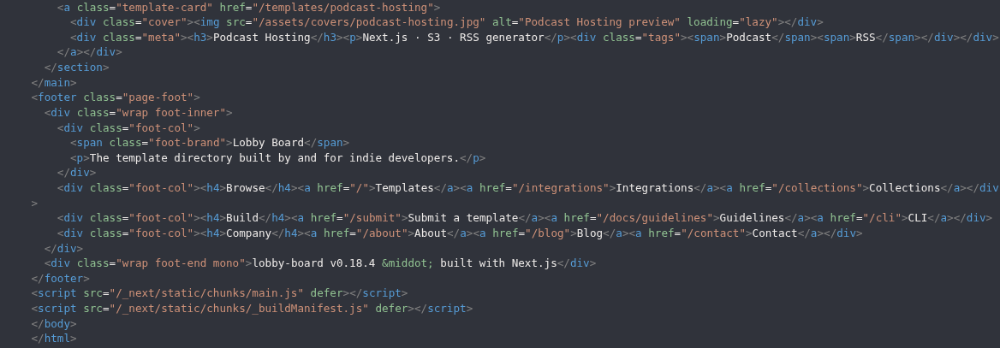

*Figure 2 — Landing-page HTML exposing the Next.js build-manifest path and the `lobby-board v0.18.4` footer.*

> **Baseline conclusion:** The build-manifest path was confirmed directly from the current-instance HTML. It was not guessed through broad enumeration or copied from an expired instance.

## 4. Build Manifest Route Disclosure

The manifest request observed in browser traffic was selected and reproduced in Caido Replay without modification.

```http
GET /_next/static/chunks/_buildManifest.js HTTP/1.1
Host: 69f81455-4414-lobby-board-94e2a.challenges.webverselabs-pro.com
```

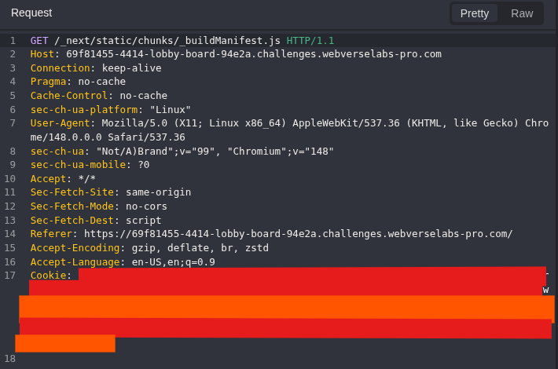

*Figure 3 — Caido request for the public Next.js build manifest. The cookie value is permanently raster-redacted.*

The server returned HTTP `200` and `application/javascript` content. The manifest listed ordinary public routes and also mapped a hidden `/_admin` entry to a dedicated admin page chunk. The same route appeared in `sortedPages`.

```javascript
"/_admin": [
  s, a, b,
  "static/chunks/pages/_admin/admin-chunk.js"
]

sortedPages: ["/", "/_admin", "/blog", "/blog/[slug]", ...]
```

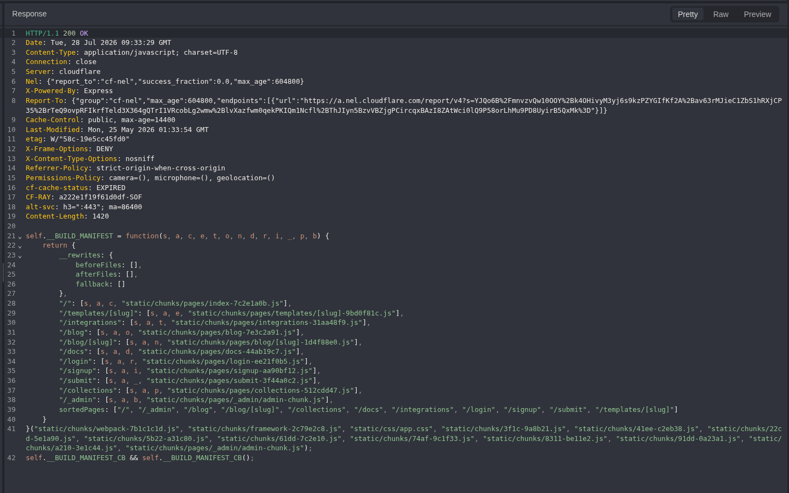

*Figure 4 — Build-manifest response exposing `/_admin`, the admin chunk, and the `sortedPages` inventory.*

> **Discovery result:** The manifest proved that the current public build contained an administrative route. It did not, by itself, prove an authentication failure.

## 5. Parent Route Negative Control

Before following the chunk to child routes, the exact parent route was tested as a negative control. A clean root request was copied into Replay and only the path was changed to `/_admin`.

```http
GET /_admin HTTP/1.1
Host: 69f81455-4414-lobby-board-94e2a.challenges.webverselabs-pro.com
```

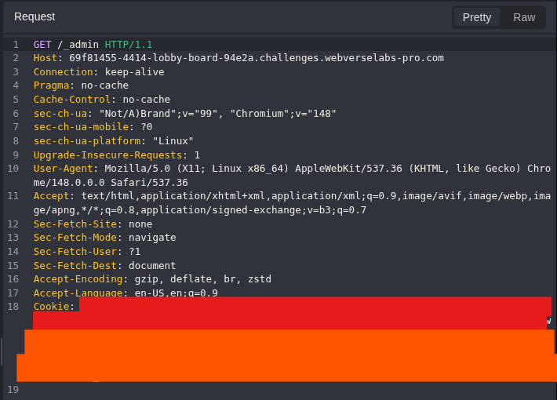

*Figure 5 — Controlled Replay request to the exact `/_admin` parent route; the cookie value is raster-redacted.*

The application returned HTTP `404` with its own Lobby Board not-found page. The response contained the expected application branding and the heading `Page not found`, confirming an application-level result rather than a network or proxy error.

```http
HTTP/1.1 404 Not Found
Content-Type: text/html; charset=utf-8
```

```html
<title>Not found - Lobby Board</title>
<h1>Page not found</h1>
```

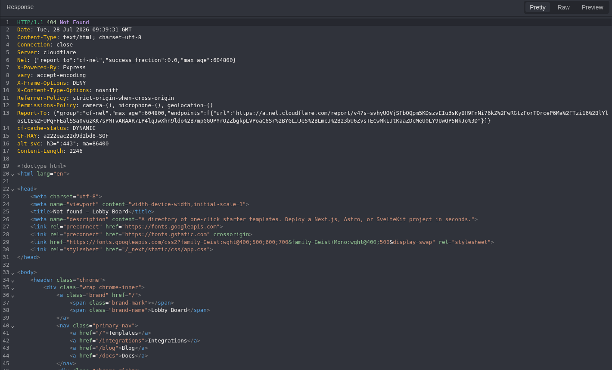

*Figure 6 — Application-level `404` response for `/_admin`, used as an exact-route negative control.*

> **Negative-control interpretation:** `GET /_admin` returning `404` closes only that parent index route. It does not prove that `/_admin/*` children are absent, especially when the current build exposes a dedicated admin chunk.

## 6. Admin Chunk Analysis

The chunk path disclosed by the manifest was requested directly. This high-information, low-noise step tested the exact artefact selected by the active build rather than enumerating unrelated administrative paths.

```http
GET /_next/static/chunks/pages/_admin/admin-chunk.js HTTP/1.1
Host: 69f81455-4414-lobby-board-94e2a.challenges.webverselabs-pro.com
```

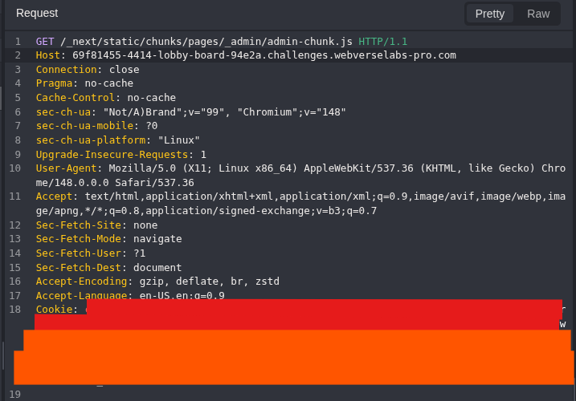

*Figure 7 — Caido request for the admin page chunk identified by the current build manifest.*

The JavaScript response disclosed four administrative child routes, their labels, and their client-side guard values.

```javascript
"/_admin/board": {
  file: "/_admin/board",
  label: "Submissions board",
  guard: null
},
"/_admin/board/review": { guard: "session" },
"/_admin/users": { guard: "session" },
"/_admin/audit": { guard: "session" }
```

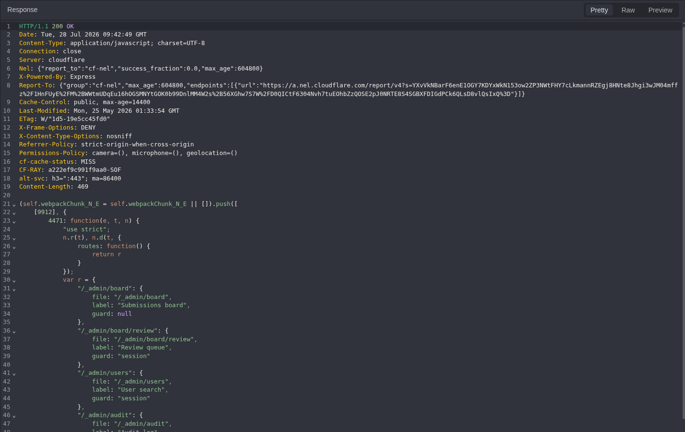

*Figure 8 — Admin chunk exposing child routes and `guard: null` for `/_admin/board` while sibling routes use session guards.*

> **Decisive source-level signal:** `guard: null` made `/_admin/board` the highest-priority candidate. Client-side metadata is not an authorization control, so the value was treated as prioritization evidence — not proof.

## 7. Anonymous Access Validation

A clean request was copied into Caido Replay and the path was changed to `/_admin/board`. The `Cookie` header was removed and no `Authorization` header was present. This isolated the request from both application session state and the previously observed clearance cookie.

```http
GET /_admin/board HTTP/1.1
Host: 69f81455-4414-lobby-board-94e2a.challenges.webverselabs-pro.com

[No Cookie header]
[No Authorization header]
```

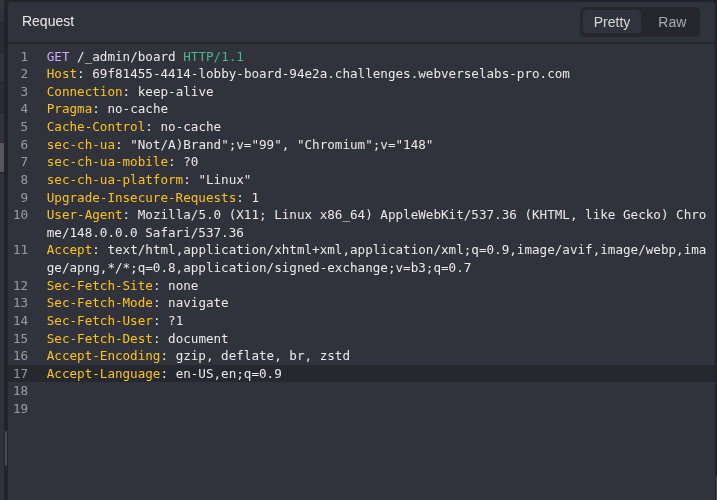

*Figure 9 — Anonymous Caido Replay request to `/_admin/board` with no `Cookie` or `Authorization` header.*

The server returned HTTP `200` and an HTML document titled `Lobby Board - admin / board`. The response was not a redirect, login page, generic shell, or not-found page; it identified the administrative submissions board directly.

```http
HTTP/1.1 200 OK
Content-Type: text/html; charset=utf-8
```

```html
<title>Lobby Board - admin / board</title>
```

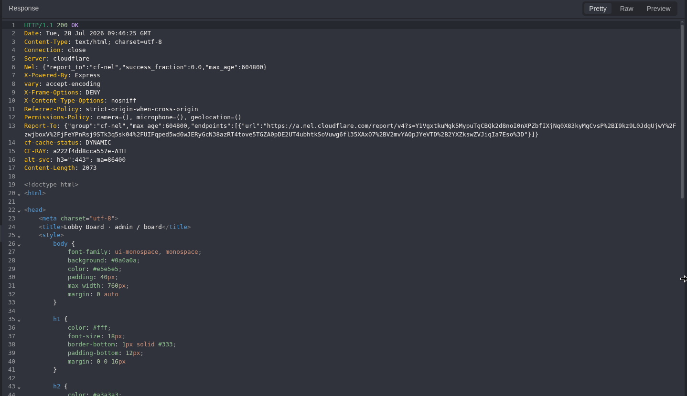

*Figure 10 — HTTP `200` response for the anonymous request, including the administrative page title.*

The body contained operational queue data and current runtime information. The same page returned the challenge flag, which is redacted in this public document.

```text
admin - submissions board
build 0.18.4 - node v20.20.2 - uptime 1297s

Pending review: 14
Auto-approved (24h): 62
Rejected (24h): 9

flag: WEBVERSE{REDACTED}
```

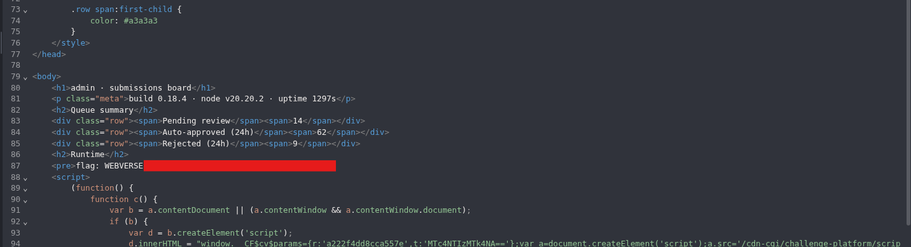

*Figure 11 — Privileged board content returned anonymously, including queue statistics, runtime metadata, and the redacted flag.*

> **Confirmed missing authentication:** An unauthenticated request with no `Cookie` or `Authorization` header received the real administrative board. The request state and privileged response semantics jointly confirm the finding.

## 8. Independent Browser and curl Verification

### Chromium Rendering

The same route was opened directly in Chromium. The address bar showed the active `/_admin/board` URL, and the page rendered the same queue values and runtime metadata seen in Caido.

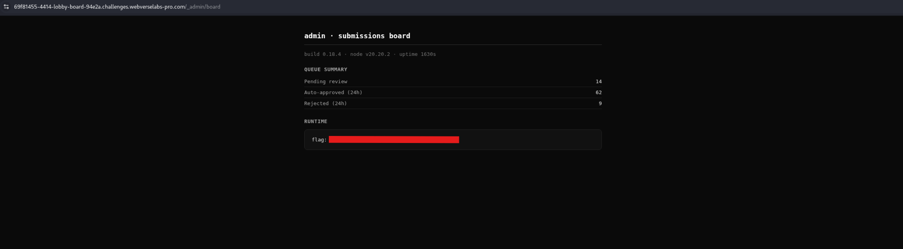

*Figure 12 — Chromium rendering of the anonymously accessible admin submissions board with the flag redacted.*

The browser uptime was higher because process uptime increased between requests. The stable route, build version, Node.js version, queue values, and page identity link both observations to the same resource. Caido remains the authoritative proof of the unauthenticated HTTP request state; Chromium confirms that the response is a functional application page.

### Independent curl Reproduction

A separate terminal request reproduced the result outside both Caido and the browser interface. In `curl`, `-H 'Cookie:'` and `-H 'Authorization:'` suppress those headers from the outgoing request; they do not force zero-length header fields. The public reproduction below avoids `-k` and redacts the flag before displaying selected evidence.

```bash
curl -sS -i \
  -H 'Cookie:' \
  -H 'Authorization:' \
  'https://69f81455-4414-lobby-board-94e2a.challenges.webverselabs-pro.com/_admin/board' \
| sed -E 's/WEBVERSE\{[^}]+\}/WEBVERSE{REDACTED}/g' \
| grep -E 'HTTP/|<title>|admin - submissions board|build 0\.18\.4|Pending review|Auto-approved|Rejected|flag:'
```

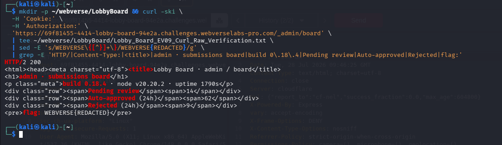

*Figure 13 — Terminal verification reproducing HTTP `200` and privileged content after `Cookie` and `Authorization` headers were suppressed; the flag is redacted.*

> **Public evidence handling:** The screenshot records the original local evidence workflow, where `tee` captured raw output before display redaction. That private raw file is intentionally excluded from the public document and must not be copied into blog assets.

## 9. WebVerse Solved-State Context

The WebVerse challenge page displayed Lobby Board as **SOLVED** and identified the challenge as Medium difficulty in the Reconnaissance category.

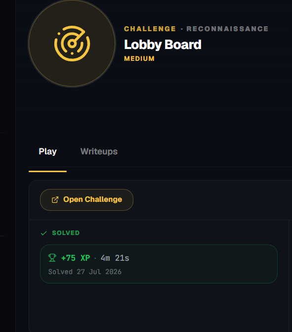

*Figure 14 — WebVerse challenge page showing Lobby Board in the solved state.*

The page records a solved date of 27 July 2026, while this fresh reproduction was performed on 28 July 2026. The screenshot therefore supports account-level solved status, not timestamped proof of a new submission during the reproduction. The current-instance result was independently recollected through Caido, Chromium, and `curl`.

## 10. Technical Root Cause and Classification

The public manifest and admin chunk made the route discoverable, but disclosure alone was not the vulnerability. The confirmed root cause was that the server rendered a privileged administrative resource before requiring an authenticated and authorized identity.

| Layer | Observed Role | Security Meaning |
|---|---|---|
| Discovery enabler | Public `_buildManifest.js` exposed `/_admin`. | Identified a hidden route; not proof of access. |
| Prioritization signal | Admin chunk exposed child routes and guard values. | `guard: null` selected the strongest candidate; client metadata is not enforcement. |
| Root cause | `GET /_admin/board` returned privileged content anonymously. | Missing server-side authentication on a critical function (CWE-306). |
| Consequence | Queue statistics, runtime metadata, and the flag were exposed. | Sensitive information reached an unauthorized actor (CWE-200 consequence). |

Observed vulnerable flow:

```text
request -> /_admin/board -> render administrative board
```

Required control flow:

```text
request -> authenticate session -> authorize admin role -> render board
```

> **Security boundary:** Client-side route metadata such as `guard: "session"` or `guard: null` may influence presentation, but it cannot enforce access. Every privileged route must validate authentication and authorization on the server.

Classification references: **CWE-306** · **CWE-200** · **OWASP A01:2021**

## 11. Evidence Interpretation and False-Positive Controls

| Control | What It Proved | What It Did Not Prove |
|---|---|---|
| Manifest route disclosure | The active public build contained `/_admin`. | It did not prove authentication was missing. |
| Client guard metadata | `guard: null` prioritized `/_admin/board`. | It was not runtime or server-side proof. |
| Parent 404 | `GET /_admin` had no parent index page. | It did not close the `/_admin/*` subtree. |
| HTTP 200 | The request completed successfully. | Status alone was insufficient without privileged response semantics. |
| Caido request state | `Cookie` was removed and `Authorization` was absent. | It did not alone prove the body was administrative. |
| Browser rendering | The document was a functional application page. | The browser view alone was not authoritative for header absence. |
| `curl` verification | A separate client reproduced the endpoint and content with auth headers suppressed. | It did not expand the finding to untested sibling routes. |
| Sibling routes | They were disclosed as session-guarded. | They were not accessed and are not claimed vulnerable. |

## 12. Impact

In the reproduced lab, an anonymous user could read a privileged submissions board containing moderation queue counts, the application build identifier, the Node.js runtime version, process uptime, and the challenge flag.

In a real application, severity would depend on the board's data and capabilities. A comparable failure could expose pending submissions, internal moderation decisions, user or tenant information, operational metrics, or privileged actions. This report does not assume broader administrative access and does not claim that the untested sibling routes were accessible.

> **Impact qualification:** The confirmed impact is limited to data returned by `/_admin/board`. Broader administrative access is a separate hypothesis that would require its own authorized testing.

## 13. Remediation

### 13.1 Enforce Server-Side Authentication

Require a valid authenticated session before any `/_admin/*` handler or rendering logic runs. Anonymous requests should receive a consistent `401`, `403`, or controlled login redirect according to the application architecture.

### 13.2 Enforce Role and Permission Authorization

Authentication alone is insufficient. The server must verify that the authenticated identity has the administrative role or explicit permission required by each route.

### 13.3 Minimize Public Administrative Metadata

Where architecture permits, keep administrative routes and guard metadata out of the public client bundle. This reduces unnecessary disclosure but must not be treated as a substitute for server-side access control.

### 13.4 Minimize Administrative Responses

Do not expose runtime versions, process uptime, internal queue statistics, tokens, or secrets unless they are required for an authorized administrative function.

### 13.5 Add Authorization Regression Tests

CI/CD should maintain an approved public-route inventory and execute an identity/permission matrix for every administrative endpoint.

```text
Anonymous user               -> 401/403 or controlled login redirect
Authenticated non-admin user -> 403
Authorized administrator     -> 200
```

## 14. Reproduction Reference

> **Reproduction contract:** Run the sequence against the current authorized instance and preserve the evidence order. The finding is reproduced only when an anonymous request reaches the genuine administrative board. Route disclosure, guard metadata, a parent `404`, or HTTP `200` alone is insufficient.

1. **Establish the current-instance baseline.** Capture `GET /` and record the active host, normal application identity, and `/_next/static/chunks/_buildManifest.js` reference.
2. **Resolve the deployed route map.** Request the build manifest and confirm that the same active build maps `/_admin` to its dedicated admin chunk.
3. **Preserve the exact negative control.** Request `GET /_admin` and record the application-level `404`. Treat the result as specific to the parent route, not as proof that `/_admin/*` children are absent.
4. **Convert source disclosure into a test candidate.** Retrieve the disclosed admin chunk and identify `/_admin/board` with `guard: null`. Use this metadata to prioritize validation, never as proof of access.
5. **Prove the anonymous request state.** Request `GET /_admin/board` with no `Cookie` or `Authorization` header and retain the request and response together.
6. **Apply the privileged-content threshold.** Require HTTP `200` plus the administrative title, queue data, runtime metadata, and the redacted current-instance flag before confirming the finding.
7. **Triangulate and publish safely.** Reproduce the resource in Chromium and sanitized `curl`, keep Caido as the primary proof of header absence, and exclude raw secret-bearing output from public assets.

## 15. Lessons Learned

The evidence chain produces five transferable lessons for future web application testing:

- **Treat route hierarchy precisely.** A parent `404` closes only `GET /_admin`; it does not close the full `/_admin/*` subtree.
- **Use client assets for prioritization, not proof.** Manifest and guard metadata narrow the search, while the server response determines whether a security boundary failed.
- **Require both anonymous state and privileged semantics.** Header absence establishes the requester state; the administrative title, queue data, runtime details, and flag establish the protected meaning of the response.
- **Triangulate without diluting the primary evidence.** Caido proves the HTTP request state, Chromium confirms functional rendering, and `curl` independently reproduces the resource.
- **Make publication hygiene part of the workflow.** Redact flags and credentials, exclude raw captures, and remove unused embedded assets before release.

## 16. Final Result and Conclusion

**Discovery.** The active landing HTML exposed the Next.js build-manifest path. The manifest mapped `/_admin` to a dedicated page chunk; although `GET /_admin` returned `404`, the chunk disclosed deployed child routes and marked `/_admin/board` with `guard: null`. These signals selected the candidate but did not prove the vulnerability.

**Validation and verdict.** Caido proved that `GET /_admin/board` was requested without `Cookie` or `Authorization` and returned HTTP `200` with the genuine submissions board and current-instance flag. Chromium and `curl` independently reproduced the resource. The complete chain confirms CWE-306: missing server-side authentication on a privileged administrative route.

```text
CURRENT-INSTANCE RESULT
Endpoint: GET /_admin/board
Request state: Anonymous — Cookie and Authorization absent
Primary weakness: CWE-306 — Missing Authentication for Critical Function
Flag: WEBVERSE{REDACTED}
Status: SOLVED / VERIFIED
```
