> **Publication note:** This article documents an authorised WebVerse educational lab reproduced on 15 August 2026. The live hostname is represented as `<LAB_HOST>`, and the current objective is represented as `WEBVERSE{REDACTED}`. No credential, reusable session material, private path, or post-objective target request is published.

## Executive Summary

Margin Notes exposed a public first-party JavaScript bundle whose footer identified a source map. The corresponding `.map` file was publicly retrievable and contained `sourcesContent`, including the original `src/api.js` module. That source named `/console/v2/diag`, described its engineering-only intent, and showed that the client consumed its response as text.

The source map was discovery evidence, not the final vulnerability proof. A single single Caido Replay request to the disclosed route contained no `Cookie`, `Authorization`, bearer token, or API key. The server returned diagnostic-specific `text/plain` content containing the console name, application build, Node.js runtime version, and the current WebVerse objective. WebVerse then accepted the objective and marked the challenge solved.

> **CONFIRMED FINDING**
>
> A public source map revealed how to call the diagnostic endpoint, and the backend returned sensitive data without authentication. The missing runtime access control is the security issue. The source map only provided the route and request details.

## 1. Report Profile

| Field | Verified value |
| --- | --- |
| Platform | WebVerse |
| Lab | Margin Notes |
| Difficulty | Medium |
| Reproduction date | 15 August 2026 |
| Evidence | Browser baseline, Caido request/response evidence, WebVerse solved-state UI |
| Primary weakness | [CWE-306](/cwes/cwe-306/): Missing Authentication for Critical Function |
| Enabling weakness | [CWE-540](/cwes/cwe-540/): Inclusion of Sensitive Information in Source Code |
| Observed consequence | [CWE-200](/cwes/cwe-200/): Exposure of Sensitive Information to an Unauthorized Actor |
| Authentication in final request | None |
| curl reproduction | Not performed |

### Verified Attack Chain

```text
Public SPA root
  > /assets/app.min.js
First-party bundle
  > //# sourceMappingURL=app.min.js.map
Public source map
  > version 3, sources, and embedded sourcesContent
  > src/api.js names /console/v2/diag and a text-response contract
Anonymous GET /console/v2/diag
  > diagnostic/build/runtime data + WEBVERSE{REDACTED}
WebVerse submission
  > CHALLENGE SOLVED
Stop
```

## 2. Scope, Authorisation, and Evidence Boundary

The reproduction was limited to one fresh authorised Margin Notes instance and the application-provided artefact chain shown below.

- The public root supplied the first-party bundle path.
- The bundle supplied its own source-map locator.
- The source map supplied the diagnostic route; no route wordlist or broad `/console` enumeration was used.
- The diagnostic route was requested once without authentication and only with `GET`.
- Normal `/api/v1/sites` and `/api/v1/sites/{id}/series` routes visible in the source were not tested for access-control or data issues.
- No state-changing request, scanner, credential test, privilege escalation, or unrelated endpoint test was performed.
- No curl command is shown because it was not used during the reproduction.

The evidence confirms missing authentication and sensitive data exposure on one diagnostic endpoint. I did not test the wider `/console` namespace, normal JSON APIs, writes, account takeover, command execution, repository access, or CI systems.

## 3. Step-by-Step Reproduction

Each step keeps the request or source excerpt beside its screenshot, expected result, actual result, and conclusion. The evidence stays in the same order as the original reproduction.

### 3.1 Fresh-Instance Baseline

The browser opened the authorised root URL with no manually added credentials or parameters.

```text
https://<LAB_HOST>/
```

**Expected result:** the normal Margin Notes SPA loads on the active instance.

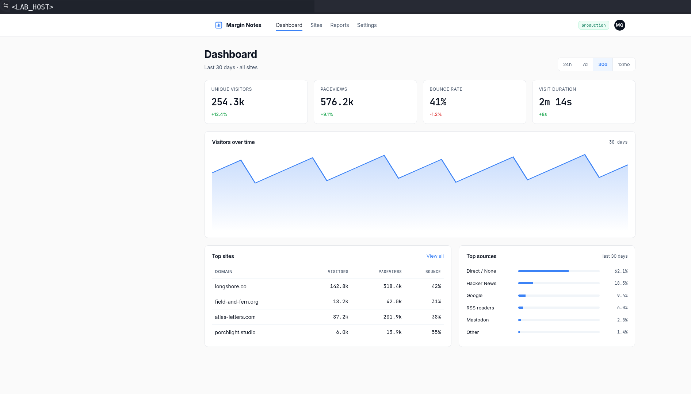

**Figure 1: Public baseline.** The dashboard identifies the active application and its public entry point. It does not yet show a source map or missing authentication.

### 3.2 Root Response Identifies the First-Party Bundle

The browser-generated root request was inspected in Caido rather than replaced with a guessed path.

```http
GET / HTTP/1.1
Host: <LAB_HOST>
```

**Expected result:** HTTP `200` with the normal HTML document and an application-owned script reference.

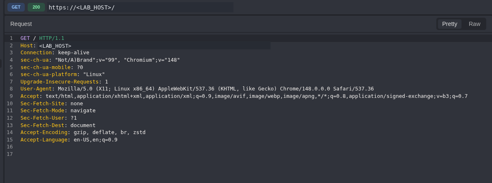

**Figure 2: Root request.** The captured request binds the HTTP evidence to the same anonymous public entry point.

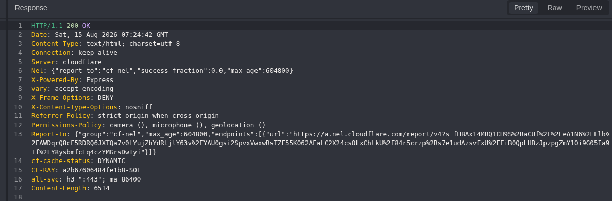

**Figure 3: Root response.** HTTP `200` and `text/html` show a normal page. The status code alone is not a finding.

The returned HTML explicitly loaded the first-party bundle:

```html
<script src="/assets/app.min.js"></script>
```

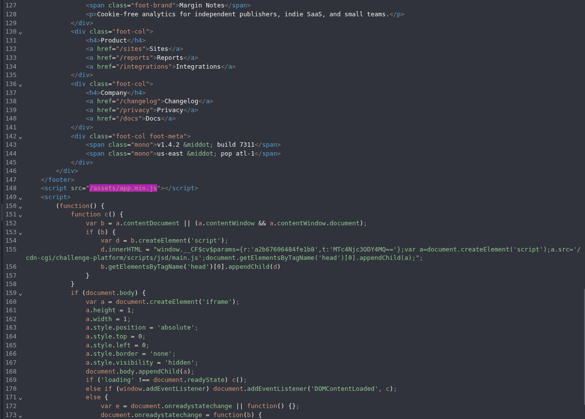

**Figure 4: Bundle discovery.** `/assets/app.min.js` comes directly from the application's HTML, so the next request does not depend on path guessing.

### 3.3 Bundle Inspection Reveals the Source-Map Locator

Caido History already contained the browser's request for the discovered script.

```http
GET /assets/app.min.js HTTP/1.1
Host: <LAB_HOST>
Referer: https://<LAB_HOST>/
```

**Expected result:** a JavaScript response whose footer can be inspected for an application-provided source-map directive.

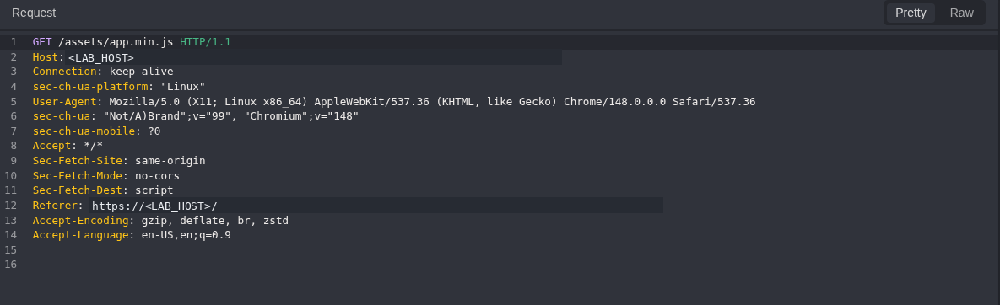

**Figure 5: Bundle request.** The browser retrieves the application script identified in Figure 4.

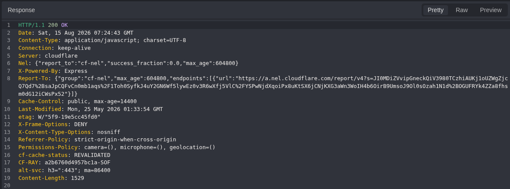

**Figure 6: Bundle response context.** The server returns JavaScript content for the discovered asset.

The final bundle line supplied the next artefact name:

```text
//# sourceMappingURL=app.min.js.map
```

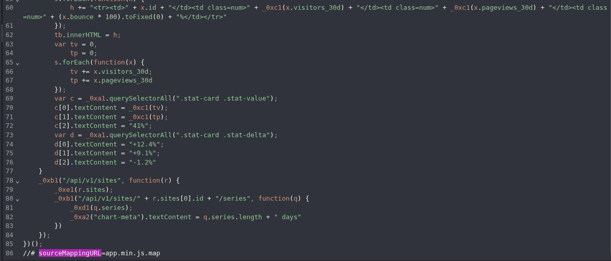

**Figure 7: Source-map locator.** The `.map` filename is published by the bundle itself. This proves the locator, not yet the existence or contents of a valid source map.

### 3.4 Source-Map Validation and Original Source Disclosure

Only the filename supplied by Figure 7 was requested.

```http
GET /assets/app.min.js.map HTTP/1.1
Host: <LAB_HOST>
Referer: https://<LAB_HOST>/
```

**Expected result:** JSON with genuine source-map structure, including `version`, `sources`, and `sourcesContent`, rather than an HTML fallback or status-only success.

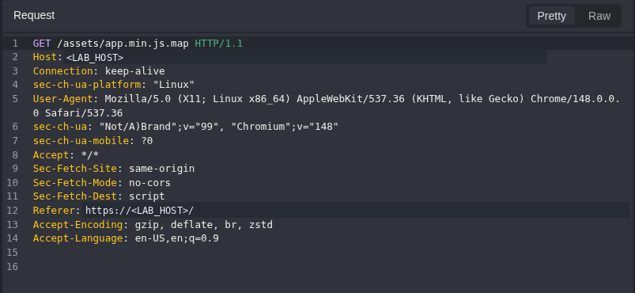

**Figure 8: Source-map request.** The request follows the published locator without route fuzzing or unrelated artefact enumeration.

The response returned HTTP `200`, `application/json`, source-map version `3`, five original source names, and embedded `sourcesContent`. The recovered `src/api.js` contained the diagnostic request:

```js
export const DIAG_ROUTE = "/console/v2/diag";

export function fetchDiag() {
  return fetch(DIAG_ROUTE).then(function (response) {
    return response.text();
  });
}
```

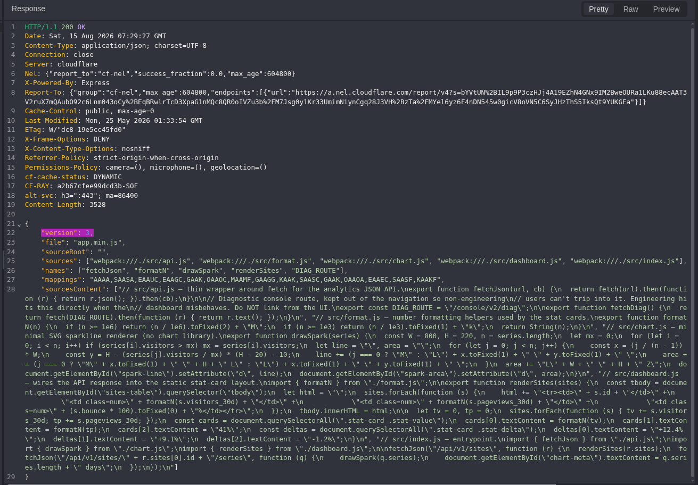

**Figure 9: Source-level discovery.** The source map exposes original file names, embedded source, `/console/v2/diag`, and a text-response consumer. This justifies one live request but does not prove reachability or missing authentication by itself.

### 3.5 Anonymous Runtime Verification

In Caido Replay, I changed only the path to the route found in the fresh source map. The request has no `Cookie`, `Authorization`, bearer token, API key, or body.

```http
GET /console/v2/diag HTTP/1.1
Host: <LAB_HOST>
Referer: https://<LAB_HOST>/
```

**Expected result:** diagnostic-specific content from the intended function. A generic HTTP `200` or unrelated page would not prove the finding.

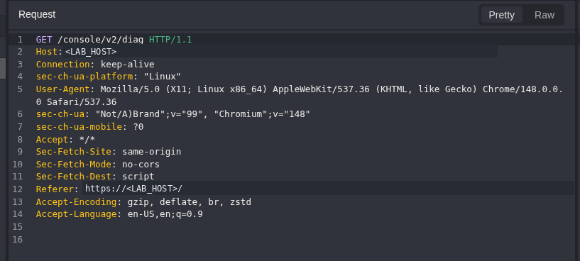

**Figure 10: Anonymous diagnostic request.** The disclosed route is requested without authentication material.

The server returned HTTP `200` with `text/plain` content:

```text
HTTP/1.1 200 OK
Content-Type: text/plain; charset=utf-8

margin-notes diagnostic console v2
build: 1.4.2
node: v20.20.2
flag: WEBVERSE{REDACTED}
```

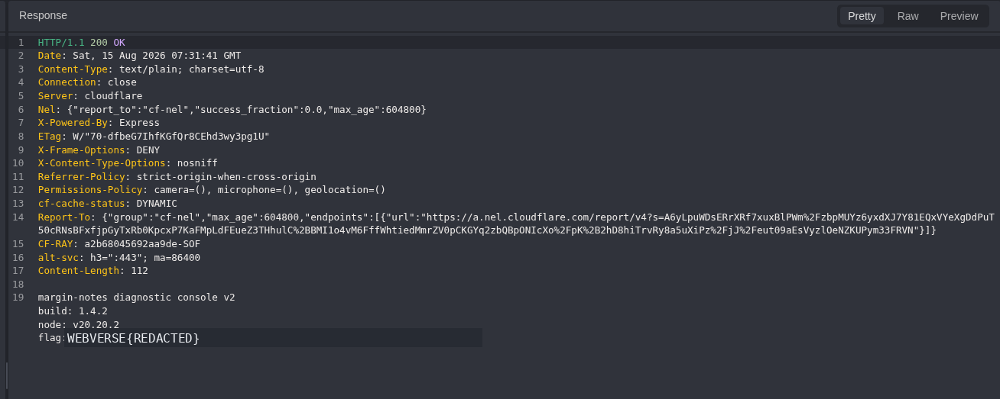

**Figure 11: Anonymous diagnostic response.** The body identifies the diagnostic function and exposes build, runtime, and flag data. This confirms the issue on this endpoint only; it does not show wider console access or any state-changing ability.

### 3.6 WebVerse Solved State and Stop Point

The current objective recovered from Figure 11 was submitted through WebVerse. The platform displayed **CHALLENGE SOLVED** and **Flag accepted**.


**Figure 12: WebVerse solved state.** The platform accepted the redacted value returned by the diagnostic endpoint.

> **WHERE TESTING STOPPED**
>
> Target interaction ended after the flag response. WebVerse acceptance confirms the value but does not add any new technical impact.

## 4. Runtime Check and False-Positive Controls

| Signal | Control | Conclusion |
| --- | --- | --- |
| Root HTTP `200` | Inspected the HTML for the exact first-party script reference. | Normal public SPA baseline only. |
| Minified bundle | Used its own `sourceMappingURL` directive. | Exact map locator; no filename guessing. |
| Source-map HTTP `200` | Verified `application/json`, version `3`, `sources`, and `sourcesContent`. | Genuine public source map, not an HTML fallback. |
| Hidden route in source | Required one live request before an access-control classification. | Only a lead until Figure 11. |
| Diagnostic HTTP `200` | Required a diagnostic-specific body and verified absence of authentication material. | Endpoint-specific missing authentication and sensitive disclosure. |
| Platform solved UI | Confirms that WebVerse accepted the flag. | Adds no further impact. |

No claim is made that all JSON API routes are unauthenticated, that the entire `/console` namespace is exposed, or that the finding enables write access, account takeover, privilege escalation, remote code execution, or broader infrastructure access.

## 5. Root Cause and Classification

### Primary: missing authentication on the diagnostic function

The server exposed a diagnostic function without requiring an authenticated engineering or operations user. This maps directly to [CWE-306](/cwes/cwe-306/).

### Enabling weakness: original source embedded in a public map

The production bundle published a source-map locator, and the public map included original source in `sourcesContent`. That source disclosed an engineering-only request contract and is appropriately recorded as the enabling [CWE-540](/cwes/cwe-540/) weakness.

### Observed consequence: sensitive information exposure

Build information, a precise Node.js runtime version, and the current lab objective reached an anonymous client. [CWE-200](/cwes/cwe-200/) describes this observed confidentiality consequence; it is not used as the primary root-cause mapping.

## 6. Impact

The confirmed impact is limited to the active authorised lab instance:

- discovery of a hidden engineering diagnostic route from public browser-delivered source;
- anonymous access to the diagnostic response;
- disclosure of application build `1.4.2`;
- disclosure of Node.js runtime `v20.20.2`;
- disclosure of the current lab objective;
- disclosure of embedded original client source and normal API request contracts through `sourcesContent`.

In production, the same combination can make reconnaissance easier and expose operational data, maintenance routes, internal request formats, or secrets. I did not test those broader possibilities here.

## 7. Remediation

### Protect or remove production source maps

- Do not publish source maps in the public web root unless there is a justified requirement.
- Upload maps privately to the monitoring platform when they are needed for observability.
- If public maps are unavoidable, omit `sourcesContent` and verify that source files, comments, request contracts, and secrets are not embedded.
- Add a CI/CD release gate for unexpected `sourceMappingURL` directives and public `.map` artefacts.
- Maintain an allow-listed production artefact manifest.

### Enforce the diagnostic access boundary

- Remove `/console/v2/diag` from production when it is not required.
- Otherwise require server-side authentication and explicit engineering or operations authorization.
- Do not treat omission from navigation as a security control.
- Prefer an internal management network or separate management service for operational diagnostics.
- Minimise the response and remove secrets, tokens, objectives, and unnecessarily precise runtime fingerprinting.

## 8. Validation After the Fix

```text
GET /assets/app.min.js.map
Expected: 404/403, or an intentionally public map without sensitive sourcesContent.

GET /console/v2/diag  [anonymous]
Expected: 401/403, or route absent.

GET /console/v2/diag  [ordinary authenticated user]
Expected: 403.

GET /console/v2/diag  [authorised engineering principal]
Expected: minimal, sanitised diagnostic output only.
```

Validation should also inspect the final browser-delivered artefact set for reusable secrets and privileged request contracts. A successful authorization regression is based on principal-specific behavior, not route obscurity.

## Conclusion

Margin Notes follows a clear path from public source to a live endpoint. The root page loaded a first-party bundle, the bundle named its source map, and the map exposed the original source plus a hidden diagnostic request. One anonymous request returned sensitive diagnostic data, and WebVerse accepted the flag.

Minification and omission from navigation are not security controls. The public source map increased discoverability, but the missing server-side authentication boundary determined whether the hidden diagnostic function became an exploitable disclosure.
