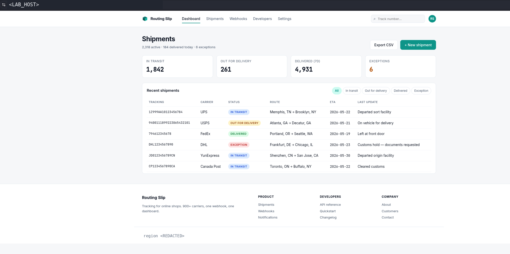
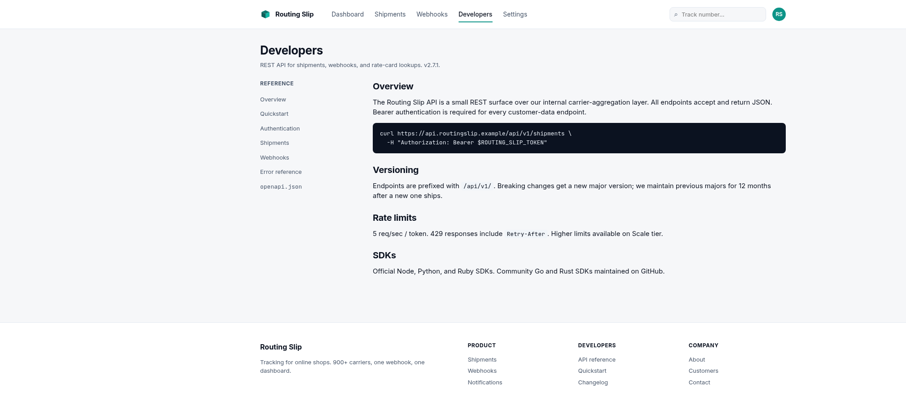
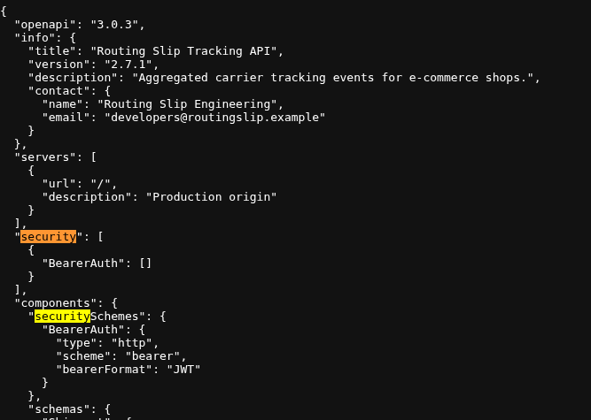
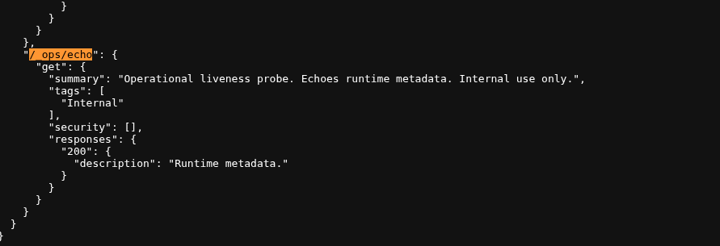
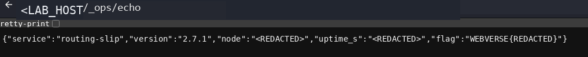
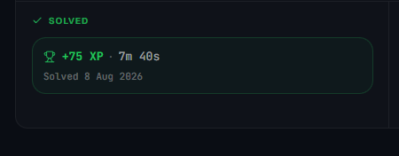

> **Publication note:** This article documents a fresh reproduction in an authorised WebVerse educational lab. The instance hostname, dynamic runtime values, and objective value are excluded. The documented lab route `/_ops/echo` is retained because it is required to preserve the public evidence chain. The public objective representation is `WEBVERSE{REDACTED}`.

## Executive Summary

Routing Slip exposed public developer documentation that linked the current OpenAPI contract. The contract established HTTP Bearer authentication as the global API baseline, but one documented internal liveness operation explicitly used `security: []`. That operation-level declaration is a local exception to the global model, not merely a descriptive label.

One unauthenticated, read-only browser request to the documented operation returned JSON runtime metadata and the current WebVerse objective. No route guessing, fuzzing, credentials, scanner, payload mutation, or write action was required.

> **CONFIRMED FINDING**
>
> A public OpenAPI contract disclosed an internal operational GET function with an explicit authentication override. The deployed operation was reachable without credentials and returned sensitive runtime metadata.

## 1. Report Profile

| Field | Verified value |
| --- | --- |
| Platform | WebVerse |
| Lab | Routing Slip |
| Status | Fresh runtime reproduction verified; challenge had previously been solved |
| Evidence | Fresh browser evidence and the linked OpenAPI contract |
| Primary weakness | [CWE-306](/cwes/cwe-306/) — Missing Authentication for Critical Function |
| Supporting weakness | [CWE-200](/cwes/cwe-200/) — Exposure of Sensitive Information to an Unauthorized Actor |
| Independent curl verification | Not performed |
| Write actions / state mutation | None |
| Requests after objective hit | 0 target requests |

### Verified Attack Chain

```text
Normal dashboard visit
  > Visible Developers and API-reference entry points
Public developer documentation
  > Linked current OpenAPI contract
OpenAPI contract
  > Global BearerAuth baseline
Documented internal GET operation
  > Local security: [] override and runtime-metadata response contract
One unauthenticated browser GET
  > JSON runtime metadata plus WEBVERSE{REDACTED}
Stop
  > No further target requests
```

## 2. Scope and Evidence Boundary

The reproduction was intentionally limited to the known, documentation-led solution path on a fresh authorised lab instance.

- The dashboard, developer documentation, contract semantics, and runtime effect were observed in that order.
- The internal operation was requested once, without an `Authorization` header, Cookie, body, query parameter, credential, or payload mutation.
- No route fuzzing, scanner, credential guessing, customer-data probing, webhook registration, or other write endpoint was used.
- The first response containing the objective ended target interaction.
- The available solved-state image is historical platform state. It is not used to claim a fresh submission or fresh platform acceptance.

The proof establishes the documented operation's current unauthenticated runtime behavior. It does not establish access to customer shipments, cross-tenant data, write capability, account takeover, SSRF, SQL injection, RCE, or a general failure across the wider API.

## 3. Evidence-Led Chronological Reproduction

### 3.1 Legitimate Baseline and Developer Entry Point

The fresh instance loaded normally without authentication. Its navigation visibly exposed **Developers**, while the footer included an API-reference entry point. This establishes a legitimate discovery path and removes any need to guess documentation routes.



**Figure 1 — Legitimate baseline.** The visible application UI exposes the developer and API-reference entry points. This is discovery context, not vulnerability evidence; the hostname and region are redacted.

### 3.2 Public Developer Documentation

Following the visible Developers navigation opened public documentation. It described Bearer authentication for customer-data endpoints and linked the exact `openapi.json` contract. This page does not establish a vulnerability by itself: it establishes provenance for the contract examined in the next steps. Its example curl command was not executed.



**Figure 2 — Public developer portal.** The application itself provides the documentation route, shows the intended Bearer-authentication model, and directly links the live `openapi.json` contract. The live browser origin and region are excluded; the documentation's static `.example` API reference and token variable are retained because they explain the public contract without disclosing a credential.

**R-01 — developer documentation URL model.**

```text
<LAB_ORIGIN>/api/docs
```

Expected semantic result: public developer documentation containing a direct link to the current API contract.

### 3.3 Global Bearer Authentication Baseline

The linked OpenAPI 3.0.3 contract defined `BearerAuth` globally. The scheme is HTTP Bearer with JWT-format tokens, so this is the default authentication policy inherited by operations unless an operation defines its own security requirement.

**R-02 — public contract URL model.**

```text
<LAB_ORIGIN>/api/docs/openapi.json
```

```json
"security": [
  { "BearerAuth": [] }
],
"securitySchemes": {
  "BearerAuth": {
    "type": "http",
    "scheme": "bearer",
    "bearerFormat": "JWT"
  }
}
```



**Figure 3 — Global baseline.** The public contract establishes Bearer authentication as the default API model. The next figure is meaningful specifically because it differs from this baseline.

### 3.4 Local Authentication Override on an Internal Operation

The same contract documented an internal liveness GET operation with `security: []` and a `200` response described as runtime metadata. In OpenAPI, this empty operation-level requirement is the meaningful delta: it overrides the global Bearer baseline for that operation. The **Internal** label alone would not prove a security issue; the authentication exception and later runtime result do.

```json
"/_ops/echo": {
  "get": {
    "summary": "Operational liveness probe. Echoes runtime metadata. Internal use only.",
    "tags": ["Internal"],
    "security": [],
    "responses": {
      "200": { "description": "Runtime metadata." }
    }
  }
}
```



**Figure 4 — Local override.** The empty operation-level `security` array creates the narrow unauthenticated candidate discovered from the authoritative contract. The documented `/_ops/echo` path is retained so the next runtime request can be independently understood; the live origin remains withheld.

### 3.5 One Bounded Unauthenticated Runtime Verification

The exact documented operation was then opened once in the browser without credentials or input mutation. This is a normalised public representation of the browser request: the documented route is retained, while the live origin is withheld.

**R-03 — normalised browser request.**

```http
GET /_ops/echo HTTP/1.1
Host: <LAB_HOST>
```

Expected semantic result: JSON runtime metadata without Bearer authentication. No payload is required.

```json
{
  "service": "routing-slip",
  "version": "2.7.1",
  "node": "<REDACTED>",
  "uptime_s": "<REDACTED>",
  "flag": "WEBVERSE{REDACTED}"
}
```



**Figure 5 — Runtime proof.** The documented `/_ops/echo` operation returned operational metadata and the current objective without credentials. The hostname, node value, uptime, and literal objective are redacted.

## 4. Controlled Validation and False-Positive Controls

| Claim | Authoritative proof | Insufficient on its own |
| --- | --- | --- |
| Developer route was legitimate | Visible application navigation and public developer portal | A guessed documentation path |
| OpenAPI was the public contract | The portal directly linked the JSON contract | Assuming a conventional `/openapi.json` route |
| Bearer authentication was global | Fresh contract `security` and `BearerAuth` scheme | Documentation prose alone |
| The internal operation had an auth exception | Operation-level `security: []` | The **Internal** tag alone |
| The operation was unauthenticated at runtime | One fresh browser GET returned JSON without credentials | Source-only inference or an HTTP status alone |
| Sensitive effect was present | Runtime metadata and `WEBVERSE{REDACTED}` | A generic health banner |

The public OpenAPI document is a discovery amplifier, not the vulnerability by itself. The finding requires both a documented authentication exception and the current unauthenticated runtime effect.

## 5. Final Result and Historical Completion State

Fresh-instance evidence verifies a public contract, a global Bearer baseline, a local empty-security override on an internal GET operation, and an unauthenticated runtime response containing sensitive metadata. The first objective-containing response ended the reproduction.

The WebVerse challenge had already been marked solved before this fresh evidence session. The available platform image is therefore retained as historical context only, not as proof of fresh objective submission.



**Figure 6 — Historical solved state only.** This confirms previous platform completion but makes no fresh-submission claim.

## 6. Root Cause and Classification

The root cause is public exposure of an internal operational function without authentication, combined with a response contract that returns more information than a minimal public health check needs. Publishing the operation and its `security: []` exception in the public contract makes the exposure directly discoverable.

| Classification | Assessment | Evidence basis |
| --- | --- | --- |
| Primary | [CWE-306](/cwes/cwe-306/) — Missing Authentication for Critical Function | An internal operational function is reachable without first establishing an identity. |
| Secondary | [CWE-200](/cwes/cwe-200/) — Exposure of Sensitive Information to an Unauthorized Actor | The unauthenticated response includes runtime metadata and objective material. |
| Severity | Not assigned | The supplied evidence proves the weakness and disclosure, but provides no external severity rubric. |

## 7. Impact and Evidence Limits

Confirmed impact is unauthenticated disclosure from an internal operational endpoint. In a real deployment, analogous metadata can reveal build versions, deployment identifiers, topology hints, dependency state, or debug material; severity depends on the actual response and trust boundary.

No evidence supports claims of customer shipment exposure, cross-tenant access, privileged writes, account takeover, remote code execution, SQL injection, SSRF, or a broader break in the API's authentication model.

## 8. Remediation and Validation Guidance

- Remove internal operational functions from the public origin. Use a private management plane, restricted network boundary, mTLS/service identity, or an authenticated administrative interface.
- If a public health endpoint is necessary, return only an allowlisted minimal response such as `{"status":"ok"}`; exclude runtime, build, configuration, and debug values.
- Publish a customer/partner OpenAPI contract containing only intended public operations. Keep internal management operations in a separate protected contract.
- Treat public-contract `security: []` declarations as policy exceptions requiring explicit review and approval in CI.
- Add deployment regression tests that compare public routing to an approved allowlist and ensure internal operations return `401`/`403` or remain network-inaccessible.

A remediation is effective when internal operations are absent from public API documentation, unauthenticated public requests cannot reach them, intentional public health responses match a minimal allowlisted schema, and release review explicitly approves every authentication exception.

## Conclusion

Routing Slip demonstrates a concise documentation-led API security failure: public documentation exposed the authoritative contract, the contract revealed a local authentication exception on an internal operation, and one bounded unauthenticated GET confirmed sensitive runtime disclosure. The report remains deliberately narrow: it proves the observed public read path and no broader capability.
