> **Quick note:** I reproduced ThePoint on 17 September 2026. Caido and Terminal used the same fresh lab instance. The hostname stays visible so the screenshots can be matched, but a new run needs its own host. The challenge flag and database password are redacted; the request paths and response structure remain visible.

## Executive Summary

ThePoint opened as a small public tailoring site. After checking the homepage, I sent one unauthenticated request for `/.env`. It returned `200` with dotenv-style configuration, not a generic error page. The body included application, mail, and database settings. Its `APP_KEY` field contained the WebVerse objective, and the platform accepted it.

Caido captured the request and full response. Running `curl` against the same instance returned the same configuration. A few earlier checks helped put the result in context, but none of them is needed to reach the finding. The issue is the public configuration file.

> **Confirmed finding:** `GET /.env` exposed configuration to an unauthenticated client. The screenshots show an application key and database password in that file. The record does not show that either value was used for session forgery, database login, or further access.

## 1. Report Profile

| Field | Verified value |
| --- | --- |
| Platform | WebVerse |
| Lab | ThePoint, Daily Challenge, Easy |
| Reproduction date | 17 September 2026 |
| Entry point | `GET /.env` |
| Authentication | No cookie or `Authorization` header in the recorded Caido request |
| Response | `200 OK`, 419-byte dotenv-style configuration |
| Objective | WebVerse flag in `APP_KEY`; platform showed **Challenge Solved** |
| Primary weakness | [CWE-552](/cwes/cwe-552/), a private file reachable from the public service |
| Related content risk | [CWE-538](/cwes/cwe-538/), secrets stored in that reachable file |
| Evidence | Browser, Caido request/response, `curl`, and WebVerse solved screen |

### Verified Attack Chain

```text
Public ThePoint instance
  > anonymous GET /.env
HTTP 200 with dotenv configuration
  > APP_KEY contains the WebVerse objective
Objective submitted to WebVerse
  > Challenge Solved
```

## 2. Scope and Evidence Limits

The Caido and Terminal captures belong to one fresh instance. The original temporary host may expire; replace `<LAB_HOST>` with the hostname of your own ThePoint instance. Keep the route `/.env` unchanged. No request body, script, login, or special header is needed for the recorded request.

The screenshots support public read access to this particular file. They do not prove access to other files or directories. The `/.git/HEAD` check below returned `404`, which says only that this exact path was not available. The disclosed values were not tested against a database, mail server, or session mechanism. The comment beside `APP_KEY` describes its intended purpose; that purpose was not tested here.

## 3. Evidence-Led Chronological Reproduction

The short version is: open the site, request `/.env`, inspect the returned body, and submit the objective. The extra checks happened before the positive result and are included so the record stays in order. They are context, not a requirement for solving the lab.

| Order | Check | What came back | Role in this case |
| --- | --- | --- | --- |
| 1 | `GET /` | Public tailoring homepage | Confirms the live instance |
| 2 | Unique absent path | `404` | Shows the normal missing-path response |
| 3 | `GET /.git/HEAD` | `404` | Rules out only that exact candidate |
| 4 | First-party stylesheet | `200` with CSS | Follows a link from the homepage; no objective signal |
| 5 | `GET /.env` | `200` with configuration | The finding and objective source |
| 6 | WebVerse submission | Challenge Solved | Confirms the lab accepted the recovered value |

Terminal repeated the homepage, absent-path, Git-path, and `/.env` checks against that same host. It also fetched `/robots.txt`, whose response was generic Cloudflare content rather than an application-specific lead. The solved screen was captured once; there was no need to submit the same objective twice.

## 4. Caido/Burp Reproduction

Put your fresh ThePoint hostname in the `Host` header. The screenshots retain my temporary host so the request and response can be followed without guessing which instance was used.

### Step 1: Start from the Public Site

The browser loaded the tailoring homepage. Caido recorded `GET /` and a `200` HTML response, with links to `/index.php`, `/services.php`, `/about.php`, `/contact.php`, and `/static/css/site.css`.

```http
GET / HTTP/1.1
Host: <LAB_HOST>
```

```bash
curl -i 'https://<LAB_HOST>/'
```

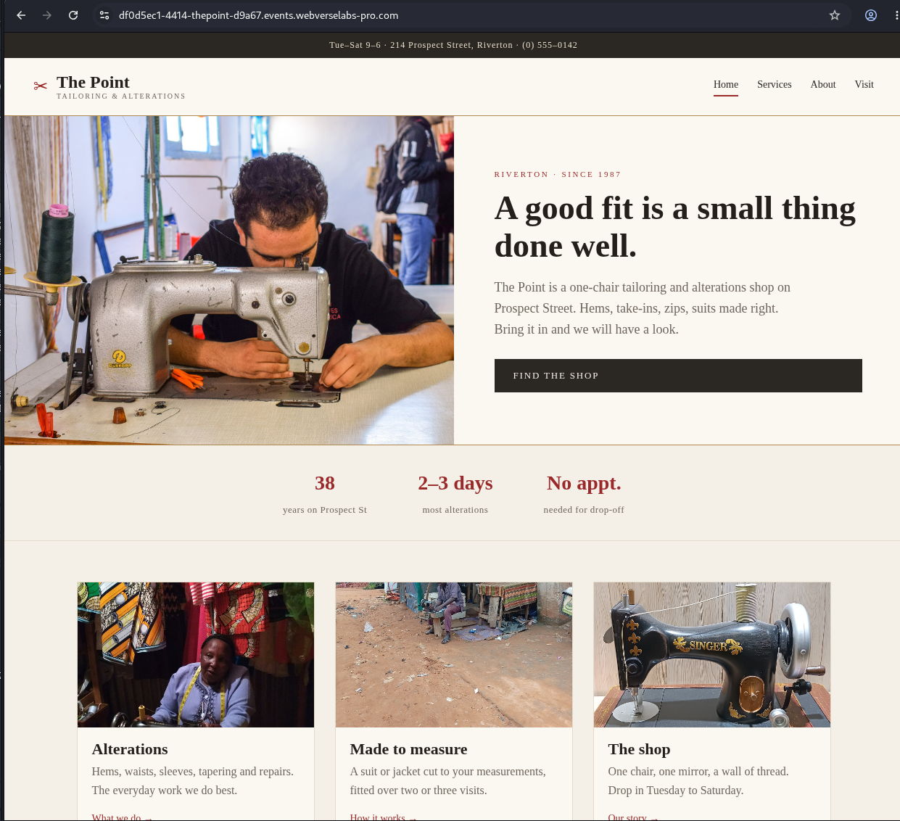

**Figure 1:** The fresh public site before any file checks.

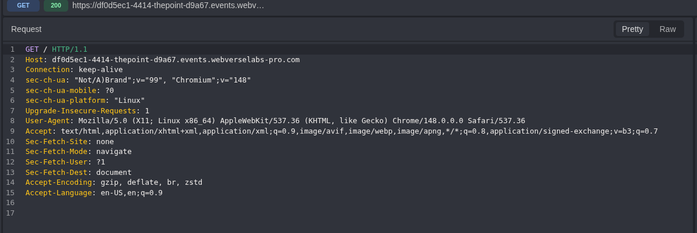

**Figure 2:** `GET /` binds the Caido record to the temporary instance.

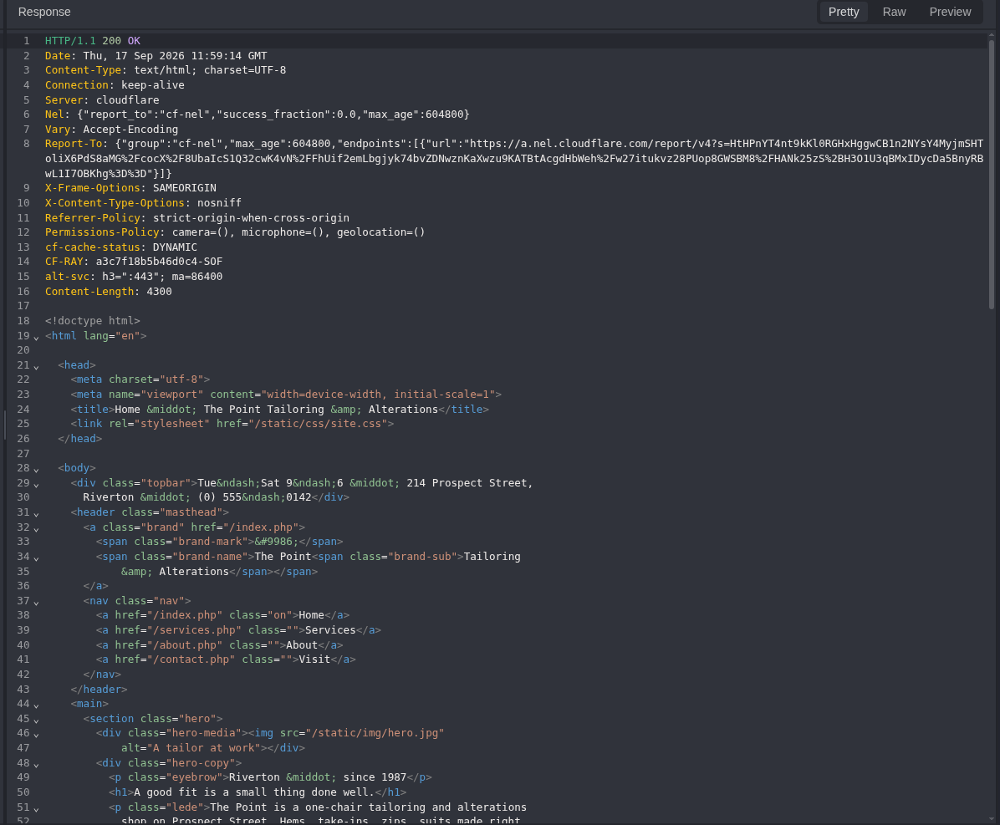

**Figure 3:** The normal `200` response shows the public routes and stylesheet link.

### Step 2: Check a Missing Path and One Deployment Candidate

Before the positive request, I sent a unique path that should not exist. It returned the site's ordinary Apache `404`. The exact `/.git/HEAD` path returned the same status. That second result does not say anything about every possible Git location; it only closes the one path that was tried.

```http
GET /mmp-absent-20260917-125510-a7f3 HTTP/1.1
Host: <LAB_HOST>
```

```bash
curl -i 'https://<LAB_HOST>/mmp-absent-20260917-125510-a7f3'
```

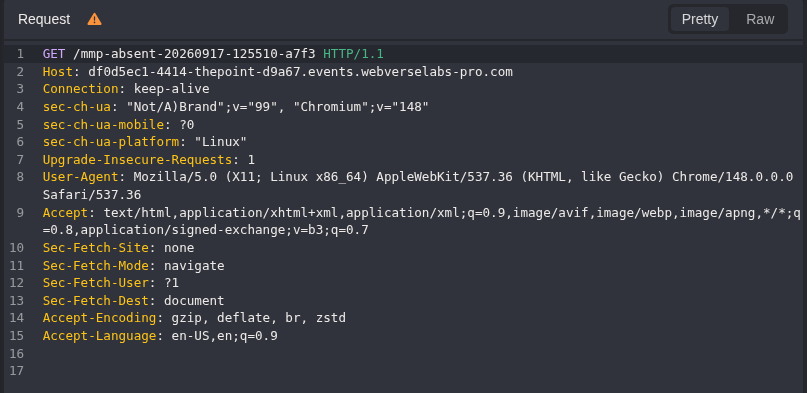

**Figure 4:** Only the path changed from the homepage request.

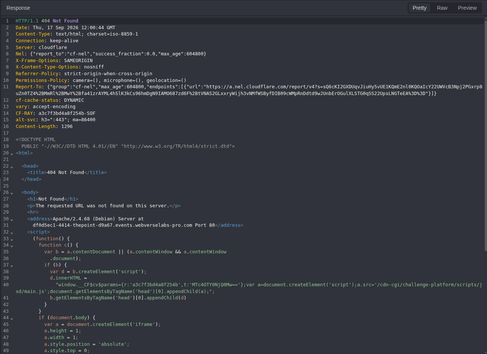

**Figure 5:** The instance returns `404` for that missing route.

```http
GET /.git/HEAD HTTP/1.1
Host: <LAB_HOST>
```

```bash
curl -i 'https://<LAB_HOST>/.git/HEAD'
```

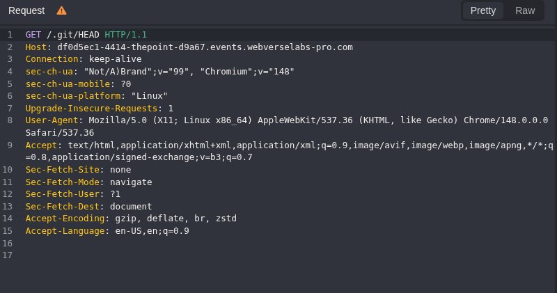

**Figure 6:** The specific Git metadata path tested.

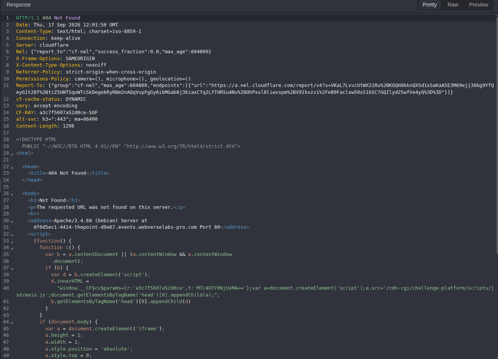

**Figure 7:** `/.git/HEAD` returned `404` on this instance.

### Step 3: Follow the Stylesheet Linked from the Homepage

The homepage itself pointed to `/static/css/site.css`, so I checked it before trying `/.env`. The response was ordinary first-party CSS. This is background mapping, not a second finding.

```http
GET /static/css/site.css HTTP/1.1
Host: <LAB_HOST>
```

```bash
curl -i 'https://<LAB_HOST>/static/css/site.css'
```

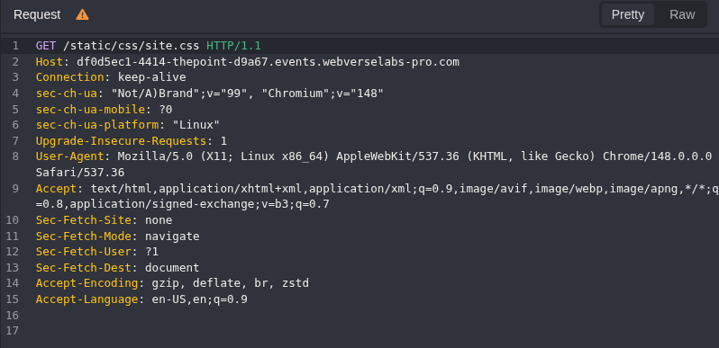

**Figure 8:** The stylesheet path came from the homepage HTML.

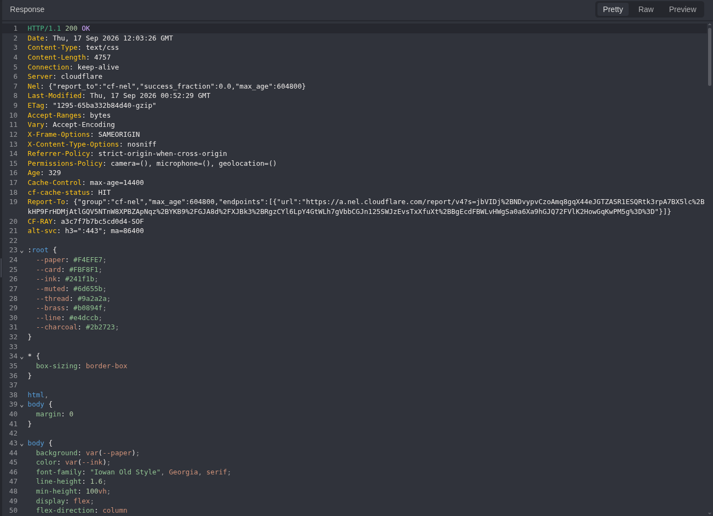

**Figure 9:** A `200` CSS response, without the objective shown in the captured content.

### Step 4: Request the Configuration File

This is the step that matters. The Caido request has no `Cookie` or `Authorization` header. `/.env` returned `200` and a configuration body with real field names and values. A status code alone would not be enough; the body is what shows the file was exposed.

```http
GET /.env HTTP/1.1
Host: <LAB_HOST>
```

```bash
curl -i 'https://<LAB_HOST>/.env'
```

The relevant part of the returned file, with the two secret values replaced, was:

```dotenv
APP_NAME="The Point Tailoring"
APP_ENV=production
APP_DEBUG=false
APP_URL=https://thepoint.test

# Application key (used to sign sessions). Keep this secret.
APP_KEY=WEBVERSE{REDACTED}

MAIL_MAILER=smtp
MAIL_HOST=smtp.thepoint.test
MAIL_PORT=587
MAIL_USERNAME=studio@thepoint.test

DB_CONNECTION=mysql
DB_HOST=127.0.0.1
DB_DATABASE=thepoint
DB_USERNAME=thepoint
DB_PASSWORD=<REDACTED>
```

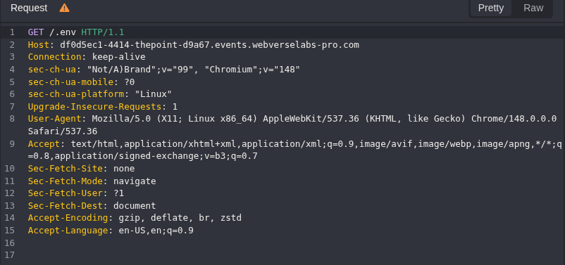

**Figure 10:** Direct `GET /.env` without login material.

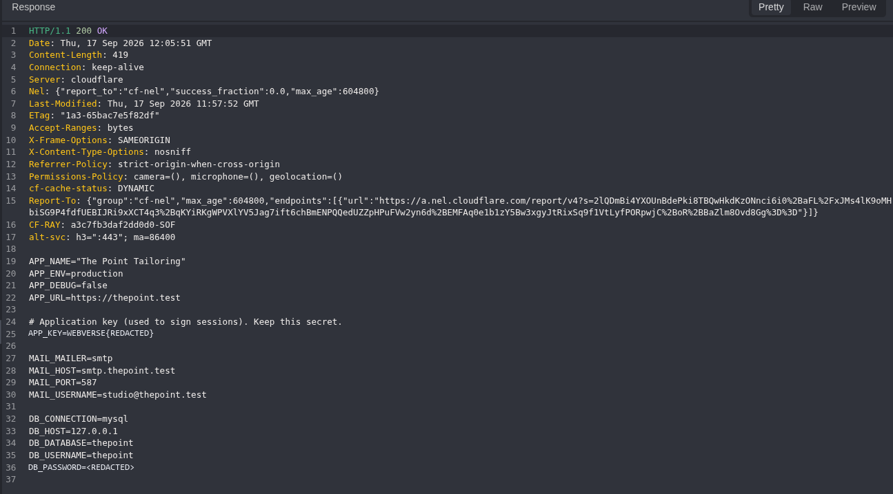

**Figure 11:** `200`, 419 bytes, and the dotenv fields. Only the `APP_KEY` and `DB_PASSWORD` values have been replaced in the image.

### Step 5: Confirm the Lab Objective

The `APP_KEY` value in the original response contained the WebVerse flag. I submitted that value to the platform and got the solved state shown below. The literal flag is not published here.


**Figure 12:** WebVerse accepted the objective for ThePoint.

## 5. Terminal/CLI Reproduction

Terminal used the same instance, not a second deployment. Replace the hostname below with the one in your current WebVerse address bar. These are plain `curl -i` requests; there was no script or POST payload in this case. Depending on the client connection, the screenshots show HTTP/2 while Caido shows HTTP/1.1. The path and returned content are the comparison that matters.

```bash
LAB_HOST='<YOUR_FRESH_THEPOINT_HOST>'
```

### Step 1: Confirm the Host

```bash
curl -i "https://${LAB_HOST}/"
```

The recorded response was `200` and contained the same tailoring homepage and public navigation seen in Caido.

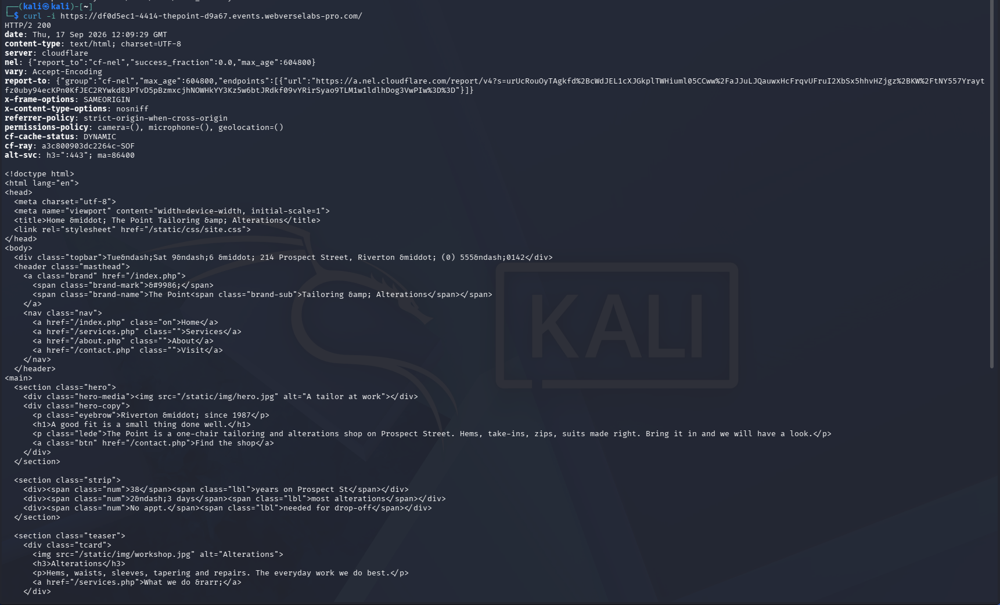

**Figure 13:** `curl` reaches the same public site.

### Step 2: Repeat the Short Context Checks

The nonexistent path and `/.git/HEAD` both returned `404`. `/robots.txt` returned `200` with generic Cloudflare content. None of these responses contains the objective or changes the core claim.

```bash
curl -i "https://${LAB_HOST}/mmp-absent-20260917-125510-a7f3"
curl -i "https://${LAB_HOST}/.git/HEAD"
curl -i "https://${LAB_HOST}/robots.txt"
```

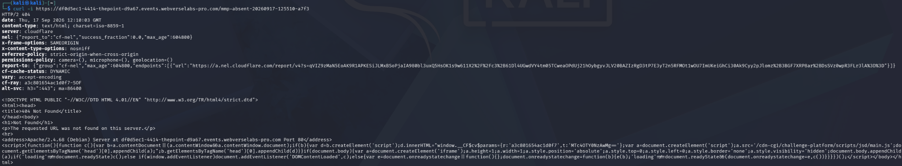

**Figure 14:** The missing path returns the expected Apache `404`.

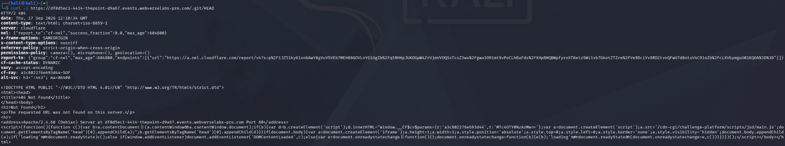

**Figure 15:** `/.git/HEAD` also returns `404`; this is one exact-path result.

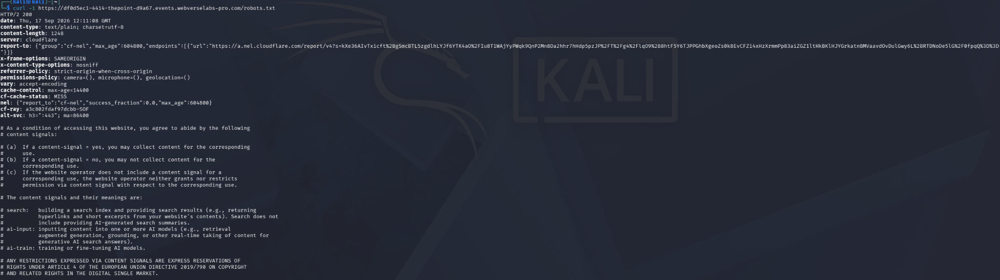

**Figure 16:** `/robots.txt` returns generic Cloudflare content rather than a useful application route.

### Step 3: Repeat the Positive Request

```bash
curl -i "https://${LAB_HOST}/.env"
```

The Terminal response again returned `200`, `content-length: 419`, and the dotenv fields shown in the Caido response. In particular, `APP_KEY` carried the same objective marker. The platform had already accepted that value, so this track stops at the matching response.

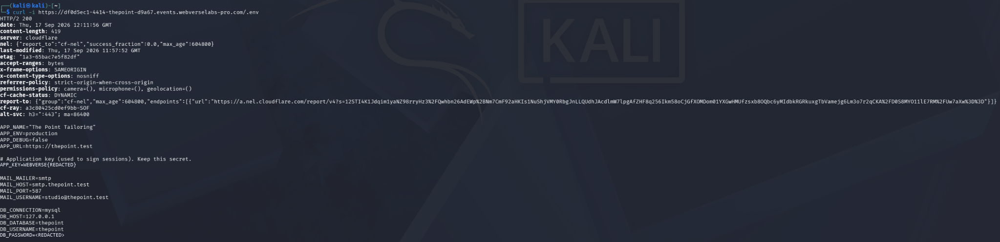

**Figure 17:** A second client reads the same exposed file from the same instance. The two secret values are masked in the screenshot.

## 6. Controls and Results

| Request | Result | What it means here |
| --- | --- | --- |
| `GET /` | `200`, public HTML | The fresh instance was available. |
| Unique absent path | `404`, ordinary Apache page | A missing route did not look like the positive result. |
| `GET /.git/HEAD` | `404` | Only this Git metadata path was unavailable. |
| `GET /static/css/site.css` | `200`, CSS | Public stylesheet from the homepage; not the objective source. |
| `GET /robots.txt` | `200`, generic Cloudflare content | No useful application path was shown there. |
| `GET /.env` | `200`, dotenv configuration | Anonymous disclosure of configuration and secret-bearing fields. |
| WebVerse submission | Challenge Solved | The recovered objective was accepted. |

## 7. Root Cause and Classification

The public web service served `/.env` as readable text. A configuration file containing an application key and database password should not cross that public boundary. The screenshots show the exposure, but not how the deployment placed the file there or which server rule allowed it. Those implementation details would need server-side access to confirm.

The primary mapping is [CWE-552, Files or Directories Accessible to External Parties](/cwes/cwe-552/), because the file itself was publicly reachable. [CWE-538, Insertion of Sensitive Information into Externally-Accessible File or Directory](/cwes/cwe-538/) describes the added risk of storing secrets in that reachable file. Both mappings follow the [MITRE definition for CWE-552](https://cwe.mitre.org/data/definitions/552.html) and [MITRE definition for CWE-538](https://cwe.mitre.org/data/definitions/538.html). The matching archive pattern is [Sensitive Configuration Disclosure](/patterns/sensitive-configuration-disclosure/).

## 8. Confirmed Impact

Anyone able to send the recorded request could read this instance's configuration without logging in. The response contained the application key, mail settings, and database connection details, including a password. In this lab, the key also held the WebVerse objective. That is enough to confirm sensitive configuration disclosure and the solved challenge.

No database connection, email login, session forgery, file write, or access to other private paths was tested. Those possibilities should not be written up as results of this test.

## 9. Remediation

Keep `.env` and similar runtime configuration outside the public document root. If the file must sit nearby, add an explicit server rule denying direct HTTP access to it and other private configuration files. Check the deployed site rather than relying only on repository layout. Secrets already exposed should be rotated, including the application key and database password, after reviewing where each value is used.

## 10. How to Verify the Fix

From a fresh, unauthenticated client, request `/.env` again. It should no longer return the file or any of its fields. Compare that result with `GET /`, which should still load normally. Then check the deployment for other private configuration files and confirm the rotated values are no longer present in public responses. A `403` or `404` is useful only if the response body also avoids echoing secrets.

## Conclusion

The finding came from a single direct path. The other requests made the timeline clearer, but `GET /.env` supplied the actual proof: a public response containing private configuration. Caido captured the request and body, `curl` repeated it on the same host, and WebVerse accepted the objective found in `APP_KEY`. That is the full chain shown for ThePoint.
